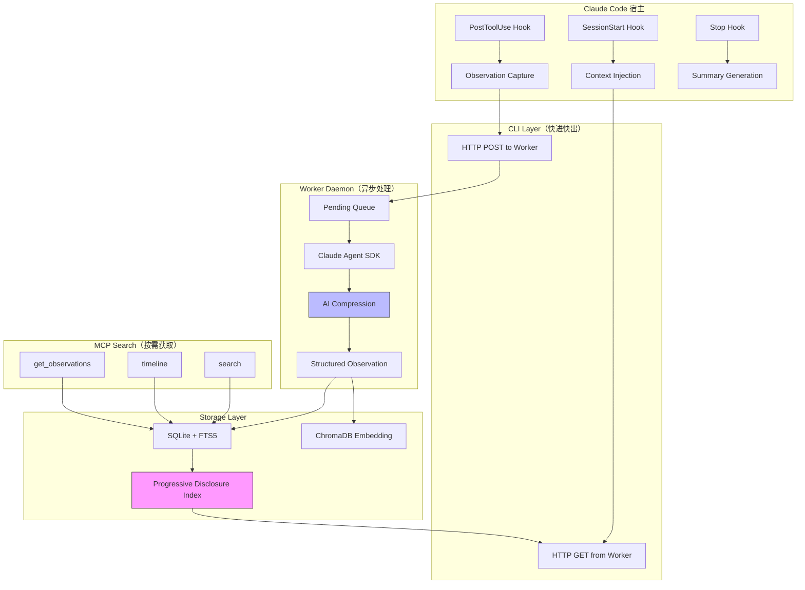

# 前言

## 为什么写这本书

2025 年下半年，Agent 开发从"能跑通 Demo"进入了"能上生产"的阶段。越来越多的工程师开始构建真正有用的 AI Agent，但很快就撞上同一堵墙：Agent 没有记忆。

每次新会话开始，Agent 对项目一无所知。上一轮花 20 分钟定位的 Bug 根因、做出的架构决策、踩过的坑——全部丢失。工程师不得不反复交代背景，Agent 不得不反复探索已知的代码。这不是一个小问题，它直接决定了 Agent 的实际生产力上限。

我第一次注意到 claude-mem 这个项目时，它已经在 GitHub 上积累了超过 10,000 stars。一个 Claude Code 的记忆插件，能做到这个量级，说明痛点确实普遍。但真正让我产生写书冲动的，不是 star 数，而是读完它源码后的感受：这不只是一个"把东西存起来再找出来"的 CRUD 应用。它在解决一个更深层的问题——如何在有限的上下文窗口里，以最高效率向 Agent 提供它真正需要的信息。

claude-mem 的 Progressive Disclosure（渐进式信息披露）设计、基于 Hook 的非侵入式架构、3 层搜索工作流，这些设计背后是对 LLM 注意力机制的深刻理解。这些知识对任何做 Agent 开发的工程师都有直接价值，不管你用不用 claude-mem 本身。

## 什么是 Claude Code

如果你还不了解 Claude Code：它是 Anthropic 官方推出的命令行 AI 编程工具。你在终端里运行 `claude`，它就能读写文件、执行命令、搜索代码——像一个全能的结对编程伙伴。和 Cursor/Copilot 不同的是，Claude Code 不依赖 VS Code，它直接运行在你的 shell 中，拥有完整的系统访问权限。

claude-mem 就是为 Claude Code 量身设计的记忆插件。通过 Claude Code 的 Plugin 系统（Hook + MCP 协议），它在后台默默工作，不影响你的正常使用体验。

## 这本书给谁看

- **前端/全栈工程师**，熟悉 TypeScript + Node.js，想进入 Agent 开发领域
- **已经在做 Agent 开发的人**，想系统理解 Memory 这一层该怎么设计
- **技术负责人**，在评估或规划企业级 Agent Memory 平台

不需要机器学习背景。需要的是：能看懂 TypeScript 代码、理解 HTTP API 设计、用过 SQLite 或类似数据库。

## 这本书怎么读

全书分五个部分：

**第一部分（认知篇）** 建立心智模型。如果你对 Agent Memory 的问题域还不清晰，或者还没用过 claude-mem，从这里开始。

**第二部分（架构篇）** 深入源码。逐层拆解 claude-mem 的系统设计，从 Hook 到 Worker 到 Storage。如果你想理解"生产级 Memory 系统长什么样"，这四章是核心。

**第三部分（机制篇）** 聚焦创新点。Progressive Disclosure、MCP 搜索、Observation 压缩——这些是 claude-mem 区别于简单 RAG 的关键设计。

**第四部分（实战篇）** 动手构建。跟着做完 mini-mem，你会拥有一个可以在 Claude Code 里实际使用的 Memory Plugin。

**第五部分（进阶篇）** 面向产品化。业界方案调研 + 架构升级路径，适合想把 Memory 做成平台级产品的人。

每章都有配套的可执行代码（`examples/` 目录），TypeScript 实现，可以独立运行。不想从头看的人，可以直接跳到感兴趣的章节，配合代码上手。

**推荐阅读路线**：

- **"我想快速上手"**：第 2 章 → 第 12 章 → 第 13 章
- **"我想理解设计思想"**：第 1-3 章 → 第 8 章（Progressive Disclosure）
- **"我想深入源码"**：第 4-7 章 → 第 9-11 章
- **"我想做产品/平台"**：前面基础上 + 第 15-17 章
- **第 15-18 章是可选阅读**，适合想做产品或了解前沿的读者

## 全书知识图谱

一张图看清全书核心概念之间的关系：

核心链路：**Observe（Hook 捕获）→ Compress（AI 压缩）→ Store（SQLite+向量）→ Inject（Progressive Disclosure 索引注入）→ Search（MCP 按需获取）**

## 关于源码版本

本书基于 claude-mem v12.6.2 进行分析。开源项目迭代快，具体的 API 和实现细节可能随版本变化，但核心的架构设计和设计哲学是稳定的——这也是本书聚焦"设计思想 + 工程实践"而非"API 文档翻译"的原因。

## 社区与勘误

本书在 [inferloop.dev](https://inferloop.dev) 开源发布。

- **读者交流**：[inferloop.dev](https://inferloop.dev) 社区讨论区
- **勘误反馈**：发现错误或有改进建议，请在社区提交
- **mini-mem 扩展分享**：欢迎在社区分享你基于 mini-mem 做的扩展实现

本书内容以 CC BY-NC-SA 4.0 协议发布，代码示例以 MIT 协议发布。商业转载请联系作者，个人学习转载请注明出处并链接回 [inferloop.dev](https://inferloop.dev)。

## 致谢

感谢 Alex Newman 和 claude-mem 社区创建并维护了这个优秀的开源项目（AGPL-3.0），为 Agent Memory 领域提供了一个生产级的参考实现。
