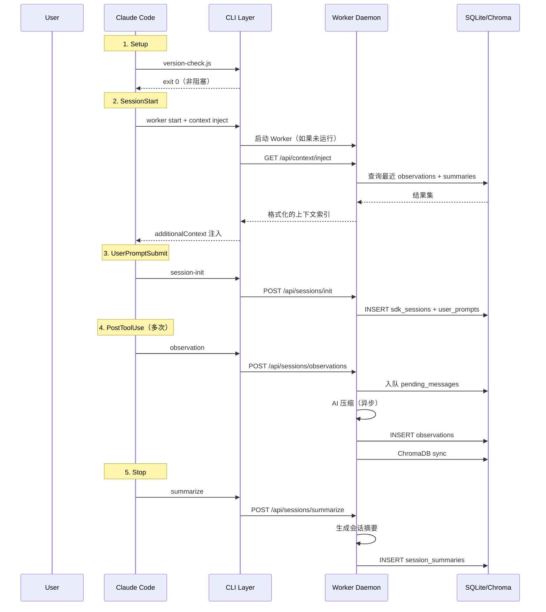

## 源码探索路线图：从哪里开始读

如果你想自己阅读 claude-mem 源码，推荐这条路径（30 分钟可以走完）：

```
1. plugin/hooks/hooks.json       ← 入口：看系统注册了哪些 Hook
   ↓ 追踪 command 字段中的脚本路径
2. src/cli/hook-command.ts       ← 所有 Hook 的统一入口
   ↓ 看 getEventHandler(event) 的分发逻辑
3. src/cli/handlers/index.ts     ← 7 个 Handler 的注册表
   ↓ 选一个感兴趣的（推荐 observation.ts）
4. src/cli/handlers/observation.ts ← 追踪到 Worker API 调用
   ↓ 看 executeWithWorkerFallback 的目标 URL
5. src/services/worker-service.ts  ← Worker 的 Express API 和路由注册
   ↓ 找 SessionRoutes / SearchRoutes
6. src/services/sqlite/Database.ts ← 数据库层
```

每一步都在追问"这个数据接下来去了哪里"。理解了这条链路，整个系统的 80% 就清楚了。

## 四层架构

claude-mem 的系统设计分为四个清晰的层次，每层有明确的职责边界：

```
┌─────────────────────────────────────────────────────────────┐
│  Layer 1: Claude Code (Host)                                 │
│  宿主层 — 提供 Hook 触发点和 MCP Client                      │
├─────────────────────────────────────────────────────────────┤
│  Layer 2: CLI Layer (Bun/Node)                               │
│  命令层 — Hook 编排、输入标准化、输出格式化                    │
├─────────────────────────────────────────────────────────────┤
│  Layer 3: Worker Daemon (Express)                            │
│  处理层 — AI 压缩、会话管理、搜索编排、SSE 广播              │
├─────────────────────────────────────────────────────────────┤
│  Layer 4: Storage Layer                                      │
│  存储层 — SQLite + ChromaDB + MCP Server                     │
└─────────────────────────────────────────────────────────────┘
```

### Layer 1：宿主层（Claude Code）

Claude Code 是一个闭源二进制程序，claude-mem 无法修改它的内部行为。但 Claude Code 暴露了两个扩展接口：

**Hook 系统**：生命周期事件触发外部命令。claude-mem 通过 `plugin/hooks/hooks.json` 注册了 6 个事件的监听（Setup、SessionStart、UserPromptSubmit、PreToolUse、PostToolUse、Stop），其中 Setup 仅做版本检查，核心业务逻辑围绕其余 5 个阶段展开。

**MCP Client**：Claude Code 内置 MCP 协议支持。claude-mem 注册了一个 MCP Server，暴露 4 个搜索工具给 Claude 使用。

这一层的关键约束：claude-mem 只能"观察"和"注入"，不能"拦截"或"修改"Claude Code 的行为。

### Layer 2：命令层（CLI Layer）

Hook 被触发后，实际执行的是 CLI 层的逻辑。核心入口文件是 `src/cli/hook-command.ts`：

```typescript
// src/cli/hook-command.ts（简化）
export async function hookCommand(platform: string, event: string): Promise<number> {
  // 1. 静默 stderr（防止污染 JSON 输出）
  process.stderr.write = (() => true) as typeof process.stderr.write;

  // 2. 获取平台适配器（claude-code / cursor / gemini-cli）
  const adapter = getPlatformAdapter(platform);

  // 3. 获取事件处理器
  const handler = getEventHandler(event);

  try {
    // 4. 执行管道：读 stdin → 标准化输入 → 处理 → 格式化输出
    const rawInput = await readJsonFromStdin();
    const input = adapter.normalizeInput(rawInput);
    const result = await handler.execute(input);
    const output = adapter.formatOutput(result);
    console.log(JSON.stringify(output));
    return HOOK_EXIT_CODES.SUCCESS;
  } catch (error) {
    // 5. 错误分级：传输错误 → exit 0（不阻塞）
    //             代码错误 → exit 2（需要修复）
    if (isWorkerUnavailableError(error)) {
      process.exit(0); // 永不阻塞 Claude Code
    }
    process.exit(2);
  }
}
```

CLI 层的设计原则：**快进快出**。它不做任何耗时操作，只负责：
1. 从 stdin 读取 Hook 输入（JSON）
2. 标准化不同平台的输入格式
3. 调用对应的 Handler（Handler 内部只做 HTTP 请求到 Worker）
4. 将结果格式化为 Claude Code 期望的 JSON 输出

七个 Event Handler 对应不同的 Hook 事件：

| Handler | 对应 Hook | 做什么 |
|---------|----------|--------|
| `context` | SessionStart | 从 Worker 获取上下文，注入到会话 |
| `session-init` | UserPromptSubmit | 向 Worker 注册新会话 + prompt |
| `observation` | PostToolUse | 向 Worker 发送工具使用记录 |
| `summarize` | Stop | 请求 Worker 生成会话摘要 |
| `file-context` | PreToolUse(Read) | 为文件读取注入相关上下文 |
| `file-edit` | PostToolUse(Edit) | 记录文件编辑操作 |
| `user-message` | UserPromptSubmit | 存储用户 prompt 文本 |

### Layer 3：处理层（Worker Daemon）

Worker 是一个常驻的 Express HTTP 服务，由 Bun 管理生命周期。它运行在后台，处理所有耗时操作：

- **AI 压缩**：使用 Claude Agent SDK 将原始 Tool Usage 压缩为结构化 Observation
- **会话管理**：维护 Session 状态机（init → active → summarizing → complete）
- **搜索编排**：FTS5 + ChromaDB 的混合搜索
- **SSE 广播**：向 Viewer UI 推送实时更新
- **进程管理**：PID 文件（守护进程标记自己存活的标准方式——进程启动时将自己的进程 ID 写入文件，其他程序通过读此文件判断服务是否在运行）、健康检查、孤儿进程清理

Worker 的端口分配策略：`37700 + (uid % 100)`，确保同一台机器上不同用户的 Worker 不冲突。

### Layer 4：存储层

**SQLite**（`~/.claude-mem/claude-mem.db`）：
- 6 张核心表：sdk_sessions / observations / session_summaries / user_prompts / pending_messages / observation_feedback
- FTS5 虚拟表：observations_fts（全文搜索）
- WAL 模式：支持并发读写

**ChromaDB**（`~/.claude-mem/chroma/`）：
- 向量 Embedding 存储
- 语义相似度搜索
- 通过 MCP 进程通信（stdio）

**MCP Server**（`plugin/scripts/mcp-server.cjs`）：
- 协议翻译层：MCP JSON-RPC → Worker HTTP API
- 暴露 4 个工具给 Claude Code

## 五个生命周期 Hook 的职责划分

从 `hooks.json` 可以看到，claude-mem 注册了 6 个 Hook 事件的监听（Setup、SessionStart、UserPromptSubmit、PreToolUse、PostToolUse、Stop），但核心业务逻辑围绕 5 个阶段展开：



每个阶段的超时设置反映了其性质：
- Setup（300s）：首次可能需要安装依赖
- SessionStart（60s）：启动 Worker + 查询上下文
- UserPromptSubmit（60s）：会话初始化
- PostToolUse（120s）：观察入队（需要更长超时因为可能排队）
- Stop（120s）：摘要生成涉及 AI 调用

## 数据流全链路

追踪一条数据从产生到被使用的完整路径：

**产生阶段**（当前会话）：

```
用户让 Claude 编辑一个文件
  → Claude 调用 Edit 工具
  → Claude Code 触发 PostToolUse Hook
  → Hook 通过 stdin 传入 { tool_name: "Edit", tool_input: {...}, tool_response: {...} }
  → CLI Layer 读取 stdin，标准化输入
  → observationHandler 发 POST /api/sessions/observations 到 Worker
  → Worker 将原始数据入队 pending_messages 表
  → Hook 返回 { continue: true, suppressOutput: true }
  → Claude Code 继续工作（整个过程 < 30ms）
```

**压缩阶段**（Worker 后台）：

```
Worker 的 SessionManager 检测到新的 pending message
  → 将 tool 输入/输出序列化为 prompt
  → 发送给 Claude Agent SDK 进行 AI 压缩
  → SDK 返回结构化的 Observation（type / title / narrative / facts）
  → 计算 content_hash = SHA256(session_id + title + narrative)[:16]
  → 检查 30 秒窗口内是否有相同 hash（去重）
  → INSERT INTO observations
  → ChromaSync 生成 Embedding 并同步到 ChromaDB
  → SSE 广播新 Observation 到 Viewer UI
  → 清除 pending_messages 中已处理的记录
```

**使用阶段**（未来会话）：

```
用户开始新的 Claude Code 会话
  → SessionStart Hook 触发
  → contextHandler 发 GET /api/context/inject 到 Worker
  → Worker 查询最近 50 条 observations + 10 个 session summaries
  → 格式化为 Progressive Disclosure 索引
  → 通过 hookSpecificOutput.additionalContext 注入到会话

  → 用户开始工作，Claude 发现索引中某条记录可能相关
  → Claude 调用 MCP search 工具
  → MCP Server 转发到 Worker HTTP API
  → Worker 执行 FTS5 查询并返回结果
  → Claude 使用 get_observations 获取完整内容
  → Claude 基于历史上下文做出更准确的判断
```

## 关键设计决策：为什么是 Hook 而不是 Middleware

claude-mem 选择了 Hook（外部命令触发）而非 Middleware（嵌入式拦截）模式。这不是随意的选择：

### 约束条件

1. **Claude Code 是闭源的**：无法向其中注入 Middleware
2. **不能影响用户体验**：Memory 系统故障不应阻塞正常使用
3. **需要跨平台**：同一套逻辑要支持 Claude Code、Cursor、Gemini CLI
4. **安装必须简单**：不能要求用户修改 Claude Code 配置之外的东西

### Hook 模式的优势

**解耦**：claude-mem 和 Claude Code 通过 JSON stdin/stdout 通信，没有代码级依赖。Claude Code 升级不会破坏 claude-mem，反之亦然。

**容错**：Hook 执行失败只影响记忆功能，Claude Code 继续正常工作。这是通过 exit code 策略实现的——传输错误一律返回 exit 0（不阻塞）。

**可测试**：每个 Hook 可以独立测试。用 `echo '{}' | node hook.js` 就能模拟调用。

**可扩展**：支持多平台只需要添加新的 Adapter（`src/cli/adapters/`），不需要修改核心逻辑。

### 代价

Hook 模式也有代价：
- 无法"拦截"操作（只能观察已发生的事件）
- 通信开销（每次 Hook 都是一次进程启动 + HTTP 请求）
- 状态同步复杂（Hook 进程无状态，状态全在 Worker）

这些代价在 claude-mem 的场景中是可接受的——Memory 系统本质上只需要"观察"和"注入"，不需要"拦截"或"修改"。

## 优雅降级：Memory 挂了不能影响 IDE

这是 claude-mem 架构中最重要的设计原则之一。从 `hook-command.ts` 的错误处理可以清楚看到：

```typescript
// src/cli/hook-command.ts
export function isWorkerUnavailableError(error: unknown): boolean {
  // 传输层错误：连不上 Worker
  const transportPatterns = [
    'econnrefused', 'econnreset', 'epipe',
    'etimedout', 'fetch failed', 'socket hang up'
  ];
  if (transportPatterns.some(p => lower.includes(p))) return true;

  // 超时
  if (lower.includes('timed out') || lower.includes('timeout')) return true;

  // 5xx 服务端错误
  if (/failed:\s*5\d{2}/.test(message)) return true;

  // 4xx 客户端错误：NOT transport issue，是代码 bug
  if (/failed:\s*4\d{2}/.test(message)) return false;

  // TypeError/ReferenceError：代码 bug
  if (error instanceof TypeError || error instanceof ReferenceError) return false;

  return false;
}
```

错误处理策略分两级：

| 错误类型 | Exit Code | 含义 |
|----------|-----------|------|
| Worker 不可用（网络/超时/5xx） | 0 | 不阻塞，静默跳过 |
| 代码 Bug（4xx/TypeError） | 2 | 阻塞，需要修复 |

为什么这样设计？

- **Worker 不可用是正常情况**：Worker 可能正在重启、首次启动还未就绪、或用户主动停止。这种情况下用户不应感知到任何异常。
- **代码 Bug 需要暴露**：如果是 claude-mem 自身的逻辑错误（比如传了错误的参数给 API），这是需要修复的问题，应该让用户/开发者知道。

这个原则贯穿整个系统：

```
Hook 层：Worker 挂了 → exit 0（不阻塞）
Worker 层：AI 调用失败 → 重试 3 次后放弃（不影响其他会话）
存储层：数据库锁 → 跳过这次写入，下次补上
```

**记忆是锦上添花，不是生命线。** 系统的可靠性设计围绕这个认知展开。

---

---

**思考题**

1. claude-mem 的优雅降级策略是"Worker 不可用时 exit 0"。如果你要为一个金融交易 Agent 设计 Memory 系统，这个策略还合适吗？什么场景下 Memory 失败应该阻塞主流程？
2. 四层架构中，CLI Layer 可以被替换为直接在 Worker 内处理 stdin 吗？为什么 claude-mem 选择了分离？
3. 如果要支持 VS Code Copilot（它没有 Hook 系统），你会在哪一层做适配？

---

下一章将深入 Hook 系统的每一个环节，解析每个 Handler 的具体实现和性能优化策略。

> 本书开源发布于 [inferloop.dev](https://inferloop.dev)，转载请注明出处。
