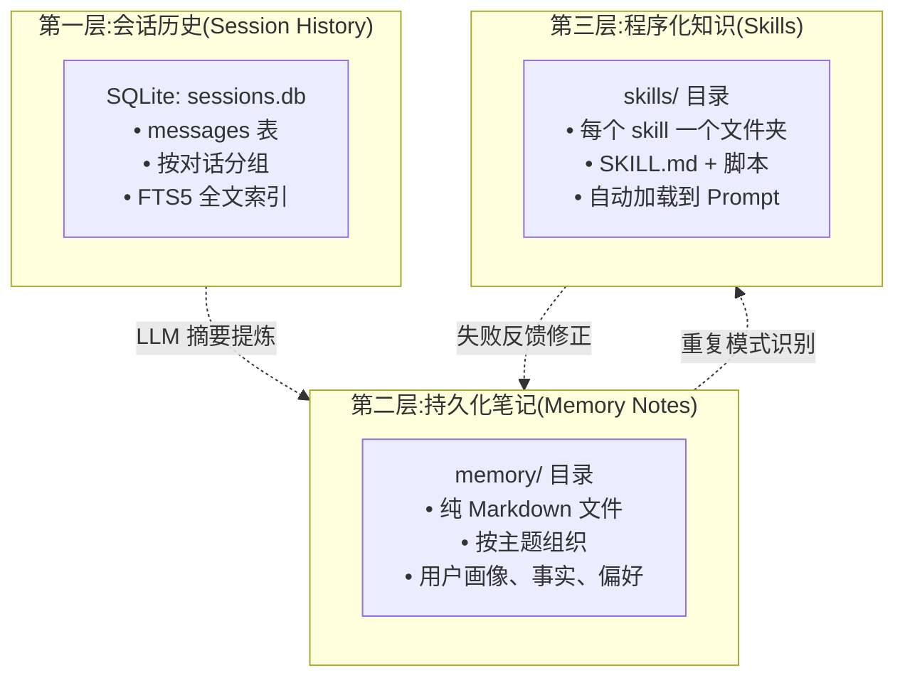

# 第 3 章 记忆系统:从 Chat History 到分层知识

记忆是 Agent 系统里**被讨论最多、被做对最少**的部分。几乎每个 Agent 框架都会宣称自己支持"长期记忆",但真正把记忆做成一个可工程化的子系统的项目屈指可数。原因很简单:记忆不是一个算法问题,而是一个"何时写、何时读、何时忘"的**策略问题**,而策略的好坏只能在真实使用中验证。

这一章用 Hermes 的记忆系统作为标本,讲清楚六件事:为什么 context window 不等于记忆、怎么分层、怎么决定写入、怎么检索、怎么淘汰、以及这些决策出错时会发生什么。读完这一章,即使你将来去用 Letta、Claude Code、LangGraph 或从零写一个 Agent,你对"记忆系统应该是什么样"都会有一个成型的判断。

## 3.1 为什么 Context Window ≠ Memory

这是最容易混淆、但也是最关键的一个区分。

**Context window(上下文窗口)** 是 LLM 在一次 forward pass 里能"看到"的 token 数。GPT-4 是 128K,Claude 3.5 Sonnet 是 200K,Gemini 1.5 Pro 是 2M。听起来很多,足够塞进一本书。所以一个很自然的想法是:**把所有对话历史都塞进 context,不就有记忆了吗**?

这个想法会在三个地方碰壁。

**第一个碰壁点:成本。** 输入 token 虽然比输出 token 便宜,但长 context 的成本仍然线性增长。假设你用 Claude 3.5 Sonnet(当前价格:输入 $3/M、输出 $15/M),一次对话 200K token 的 context 意味着每次调用成本 $0.6,一天十次对话就是 $6。一个月就是 $180。这是**一个**用户的成本。如果你要做一个服务,把所有历史塞进 context 的方案一个月可以把你的预算烧光。

**第二个碰壁点:延迟。** 长 context 的首 token 延迟(TTFT,Time To First Token)会显著增加。200K 的 context 通常要 3–5 秒才有第一个 token 输出,而 10K 的 context 通常在 500ms 以内。对于交互式 Agent,用户会感觉到明显的卡顿。

**第三个碰壁点,最重要:长 context 的"注意力稀释"。** 2023 年 Stanford 的一篇论文 *Lost in the Middle* 证明了一个直观但常被忽略的现象:**LLM 在长 context 中对"中间位置"的信息注意力明显低于首尾**。也就是说,你把所有对话都塞进去,模型其实"看不清"中间那些内容。实际表现就是:你三周前告诉它的一个重要偏好,现在它完全记不住,即使这句话还在 context 里。

这三个碰壁点合起来决定了一件事:**记忆不能靠"把所有东西都塞进 context",必须有一个"选择性地把该记的写进持久化存储、该用的时候再检索出来"的机制**。这个机制就是记忆系统。

Context window 是"工作记忆"(working memory),它应该装的是**当前任务直接相关**的信息;持久化记忆是"长期记忆"(long-term memory),它装的是**现在不用但将来可能有用**的信息。两者的关系类似于 CPU 的寄存器和主内存,或者人脑的前额叶工作记忆和海马体长期记忆。

## 3.2 Hermes 的三层记忆模型

Hermes 的记忆系统分成三层。这三层的划分不是凭空设计的,而是对应了**三种不同的写入频率、三种不同的检索策略、三种不同的淘汰机制**。



**第一层:会话历史(Session History)。**

会话历史记录的是**"你和 Agent 说过的每一句话的逐字版本"**。Hermes 把它存在一个 SQLite 数据库里(`sessions.db`),核心表是 `messages` 和 `sessions`。每一条消息包括 role(user / assistant / tool)、content、timestamp、session_id、token_count 等字段。

会话历史是**高保真、低抽象**的。它不做任何总结,也不丢弃任何细节。当你问"我上次是怎么让你帮我生成报表的?",Hermes 可以通过对这张表做检索,找到原始的对话内容。

存储选择是 SQLite 而不是向量数据库,原因有三个:(1)**SQLite 的 FTS5 全文索引在"精确回忆"上比向量检索更准**,你说"上次那个 Python 脚本"时你想找的是字面意义上的 Python 脚本,向量检索可能给你一堆"语义相似"的无关结果;(2)**SQLite 可以轻松备份和迁移**,一个 `.db` 文件拷贝到另一台机器就能用;(3)**调试时可以直接用 sqlite3 命令行打开看**,不用依赖特殊工具。

代价是:对于超大规模(千万级消息)的记忆,SQLite 的性能会成为瓶颈。但对"个人 Agent"场景,千万级消息意味着用 20 年 —— 这不是需要优先解决的问题。

**第二层:持久化笔记(Memory Notes)。**

笔记层是**"从会话历史里提炼出的、值得长期保留的结构化信息"**。它存成一组 Markdown 文件,放在 `memory/` 目录下。典型的文件可能是:

```
memory/
├── user_profile.md        # 用户是谁、做什么、偏好
├── projects/
│   ├── startup-idea.md    # 用户最近在思考的创业方向
│   └── book-writing.md    # 用户正在写的书
├── facts/
│   ├── contacts.md        # 用户重要的联系人
│   └── preferences.md     # 操作偏好(喜欢用 bun 不用 npm 之类的)
└── open-questions.md      # 用户提过但还没解决的问题
```

这一层的写入是**低频**的:Hermes 不会每句对话都往这里写东西。触发写入的机制是 `memory_manager.py` 里的一个函数,它会周期性地(比如每 N 条消息、或会话结束时)让 LLM 做一次"反思":

> 刚才这段对话里,有没有值得长期记住的信息?如果有,把它以结构化的形式写入 memory/ 下的合适文件。如果没有,什么也不做。

这个机制的关键在**谁决定什么值得记**。Hermes 的选择是"让 LLM 自己决定,但给它一个 Prompt 模板约束"。Prompt 模板会明确要求:

- 不要写"我们今天聊了什么"的流水账(会话历史已经有了)
- 要写事实(用户是硕士毕业、在北京、做后端)、偏好(喜欢简洁的代码、不喜欢过度工程)、长期项目(正在写一本书、计划三个月内完成)
- 要避免冗余(如果 `memory/` 里已经有这条信息,不要重复写)
- 要覆盖更新(如果用户说"我搬到上海了",要覆盖"在北京"的旧信息)

这里的设计权衡是:**让 LLM 决定写什么会带来"不稳定性"(不同时间、不同模型的判断可能不同),但比让开发者预定义"哪些字段要记"更灵活**。Hermes 选了前者,LangGraph 的一些记忆模板选了后者,Letta 有自己一套"主动编辑核心记忆"的机制 —— 这些都是有效的选择,各有代价。

**第三层:程序化知识(Skills)。**

技能层是**"从重复行为里提炼出的、可复用的操作流程"**。它存成 Markdown 文件加一些辅助脚本,放在 `skills/` 目录下。

技能层和笔记层的区别是:**笔记是"关于世界的陈述知识"(你是谁、你喜欢什么),技能是"关于如何做事的过程知识"(怎么生成周报、怎么整理 Markdown 清单)**。认知心理学上这对应 declarative memory 和 procedural memory 的区分。

技能层的写入触发条件比笔记层更严格。第 4 章会详细讲 skill 生命周期,这里只需要知道:技能的写入通常需要"检测到重复"+"用户确认"两个条件同时满足(除非用户开启了激进模式,允许 Hermes 自动写技能)。

三层之间有**信息流**。最底层的会话历史是"原材料",经过摘要提炼进入笔记层,笔记层的某些重复模式又被提炼为技能层。反过来,技能在执行失败时会反馈给笔记层(记录"这个 skill 在 XX 情况下不适用"),失败案例最终可能导致技能被废弃或重写。这个双向流动就是第 6 章要讲的"学习闭环"。

---

> **定义框:什么是 trajectory(本书反复出现的核心概念)**
>
> **Trajectory**(轨迹)= **一次 Agent 运行从开始到结束的完整事件序列**。它既不属于三层记忆的任何一层,又和三层都有交集 —— 它是记录这次运行里"谁做了什么、什么时候做的、结果是什么"的账本。
>
> **存在哪里**:`~/.hermes/trajectories/<YYYY-MM-DD>-<task-id>.json`(一个任务一个文件)。
>
> **里面有什么**:
>
> ```json
> {
>   "id": "2026-04-11-abc123",
>   "started_at": "2026-04-11T09:12:03Z",
>   "mode": "react",
>   "user_input": "帮我把本目录下所有 md 文件列出来...",
>   "context_snapshot": {
>     "memory_refs": ["user_profile.md", "preferences.md"],
>     "skills_available": ["markdown-inventory", "..."]
>   },
>   "steps": [
>     { "step": 1, "llm_call": { "model": "sonnet", "in": 2341, "out": 187 },
>       "action": { "type": "tool_use", "name": "run_shell_command", "input": {...} },
>       "result": "..." },
>     { "step": 2, "llm_call": {...}, "action": { "type": "final_answer" } }
>   ],
>   "completion": { "status": "success", "total_tokens": { "in": 4123, "out": 512 },
>                    "cost_usd": 0.014, "duration_ms": 1423 }
> }
> ```
>
> **为什么它这么重要**:trajectory 是后续所有"能回放、能评估、能学习"的基础。没有它,**第 6 章**的学习闭环就没有数据可学,**第 10 章**的可回放就无从实现,**第 12 章**的评估框架也没有对照基准。你后面会看到这三章各从一个侧面使用同一份 trajectory 文件。
>
> **源码锚点**:`agent/trajectory.py`(见第 3.7 节源码导读)。

现在把第一层的内容再展开一点 —— trajectory 和第一层的会话历史是**两套不同的存储**。会话历史是"你和 Agent 说过的话",逐条持久化到 SQLite;trajectory 是"Agent 执行一次任务的完整过程",按次持久化成 JSON。一次对话里你说的一句话对应会话历史里的一行记录,但它触发的 trajectory 可能有 5 步、20 步,每一步都有 LLM 调用和工具调用的详情。两者按需交叉引用,不冗余。

---

## 3.3 写入时机:什么该记、什么不该记

这是记忆系统最难的问题。"什么该记"没有通用答案,但"什么不该记"有一份可以共享的负面清单。

**不该记的**(至少不该进笔记层):

- **今天的天气、当前时间、临时性的事实。** 这些下次需要时可以重新查,写进记忆会导致它快速过时。
- **一次性的闲聊。** 用户说"帮我查一下 1+1 等于几",这种纯工具性交互没有长期价值,留在会话历史里就行。
- **重复已经记过的信息。** 如果 memory/ 里已经写了"用户叫张三",今天用户又提到自己叫张三,不需要重新写。
- **不稳定的判断。** 第一次对话用户说"我可能想学 Rust",这是一个假设性陈述,不该被记成"用户在学 Rust"。必须等到多次确认或看到具体行动(比如用户问了 Rust 问题)再记。
- **敏感信息。** 密码、API key、金融账户、医疗记录等,绝对不能写进任何持久化存储,哪怕用户随口说出来。Hermes 的 `agent/redact.py` 专门负责在写入前做一次脱敏检查。

**该记的**:

- **身份事实**(用户是谁、职业、所在城市、家庭情况)
- **稳定偏好**(编程语言、写作风格、工具习惯)
- **长期项目**(正在写的书、在做的产品、在学的领域)
- **重要联系人和关系**(同事、家人的名字和特点)
- **历史决策及其理由**(为什么选了 A 而不是 B —— 这对未来做类似决策特别有用)
- **用户明确要求"请记住"的任何内容**

上面是原则,落到实现层面,Hermes 的 `memory_manager.py` 大致是这样做的:

```python
# 伪代码,不是 Hermes 真实源码,但反映了它的大致逻辑
class MemoryManager:
    def reflect_on_session(self, session: Session) -> list[MemoryUpdate]:
        # 1. 取最近 N 条消息作为输入
        recent = session.messages[-N:]

        # 2. 构造反思 Prompt
        prompt = REFLECTION_PROMPT_TEMPLATE.format(
            messages=recent,
            existing_memory=self.load_current_memory_summary(),
            user_profile=self.load_user_profile(),
        )

        # 3. 调 LLM 产出"应该写入的内容"
        response = self.llm.complete(prompt)
        updates = parse_memory_updates(response)

        # 4. 对每一条更新做脱敏检查
        safe_updates = [u for u in updates if self.redactor.is_safe(u)]

        # 5. 写入文件
        for update in safe_updates:
            self.apply_update(update)

        return safe_updates
```

这里有几个关键决策点:

**决策点 A:反思的触发时机。** Hermes 不是每条消息都做反思(太贵),而是基于几个触发条件的组合:会话结束、消息数达到阈值(比如 30 条)、或用户显式要求("请记住这个")。你可以把这叫做"懒惰反思"(lazy reflection),相对于"积极反思"(eager reflection,每条消息都反思)来说更便宜但时效性弱。

**决策点 B:反思的输入窗口。** 反思时要看多少条消息?看太少可能错过跨消息的上下文(比如用户在第 1 条提到"我要写书",在第 15 条说"第三章太难写了"),看太多又会浪费 token。Hermes 的默认是"最近 30 条 + 当前会话的 summary"。

**决策点 C:反思模型的选择。** 反思任务其实不需要用最强的模型(它不是创作性任务,而是提炼性任务)。Hermes 支持为反思任务单独配置一个"便宜但够用"的模型(比如 Claude Haiku 或 GPT-4o-mini),这样可以显著降低成本。第 7 章会讲"智能路由"的完整机制。

**决策点 D:写入的粒度。** 是更新整个文件还是只改一行?Hermes 的选择是"按段落粒度 diff",它会让 LLM 生成"新段落 + 要删除的旧段落"两部分,然后做一个类似 git 的小范围合并。这样的好处是避免"一次反思把整个文件重写",减少错误的影响范围。

## 3.4 检索策略:关键词 + 向量 + 时间衰减

写入解决了"记什么",检索解决的是"什么时候拿出来用"。Agent 系统的检索比 RAG 的检索更复杂,原因是**它不是每次对话都需要检索**,也**不是所有检索都用同一个策略**。

Hermes 的检索分三种模式,每种模式有不同的触发条件和不同的后端。

**模式一:精确匹配(Exact Match)。** 当用户的话里包含明确的关键词("上次那个关于 Kafka 的对话"),Hermes 会用 SQLite 的 FTS5 索引做关键词检索。FTS5 支持 BM25 排序、短语查询、前缀查询,对"我想找到字面意义上包含 XX 词的对话"这种需求极其高效。

FTS5 的优势是**精确**,劣势是**语义盲**。用户说"上次那个消息队列的讨论",如果他之前说的是"Kafka",FTS5 不会自动扩展到"消息队列"这个近义词。

**模式二:语义检索(Semantic Search)。** 对于"我之前有没有聊过跟可观测性相关的话题"这种问题,精确匹配不够用,需要向量检索。Hermes 会把每一条消息(或每一个会话摘要)转成 embedding 存起来,检索时用余弦相似度找 top-k。

语义检索的优势是**能捕捉近义和概念关联**,劣势是**假阳性多**(表面相似但内容无关的条目会被拉出来)。Hermes 对语义检索的结果会再做一次 LLM rerank,用一个轻量模型判断"这些候选条目里哪些真的和当前问题相关"。

**模式三:时间加权召回(Time-Weighted Recall)。** 有些场景下"最近发生的事"比"语义最相似的事"更重要。比如用户说"帮我继续上次的工作",他指的大概率是最近一次的 session,不是三个月前做的类似事情。Hermes 对这类检索会引入一个**时间衰减权重**:

```
final_score = semantic_similarity * exp(-decay_rate * age_in_days)
```

`decay_rate` 的值是一个可调参数。默认值大致让"一周前的内容权重减半",这和人类记忆的遗忘曲线大致吻合。

**三种模式的组合使用。** 真实的检索很少只用一种模式。Hermes 的一个典型检索流程是:

1. **先尝试精确匹配**。如果 FTS5 命中了高质量的结果(比如 BM25 分数超过阈值),直接用。
2. **再做语义检索**。用向量找 top-20 候选。
3. **应用时间权重**,把 20 个候选重新排序。
4. **LLM rerank**,从 20 个里选出最相关的 5–10 个。
5. **把选出来的内容拼进 context**,继续 LLM 的正常调用。

这个流程听起来很复杂,但每一步都有明确的目的。取消任何一步都会在某些场景下出错。

## 3.5 淘汰与漂移:记忆系统的熵增问题

如果只写不删,记忆系统最终会变得不可用。原因有两个:**容量膨胀**(SQLite 变大、memory/ 目录文件过多)和**信息漂移**(旧信息过时后和新信息冲突)。

**容量膨胀**的处理相对简单。Hermes 有三个机制:

1. **会话归档**。超过一定时间(比如 3 个月)的完整会话会被压缩成摘要,原始消息可以被归档到冷存储或删除。摘要本身保留,保证"长远记忆"的连续性。
2. **向量索引的瘦身**。对于被归档的会话,只保留摘要级别的 embedding,逐消息的 embedding 可以删掉。
3. **memory/ 文件的合并**。当一个主题下的文件过多时,Hermes 会提议把几个相关文件合并成一个,保持目录结构的清洁。

**信息漂移**更难。典型的漂移案例:

- 用户三个月前说"我在北京",现在搬到上海了,但没有主动告诉 Agent。如果 memory/user_profile.md 里还写着"在北京",Agent 的推荐(比如餐厅、天气)就会出错。
- 用户一年前说"我在学 Rust",现在已经不学了。Agent 如果还在往 Rust 方向推荐学习资源,就是在浪费用户时间。
- 一个 skill 在早期版本的外部 API 下工作正常,API 升级后它就失效了。如果不及时修或删,下次用户触发这个 skill 就会报错。

处理漂移的基本思路是**定期重新验证**。Hermes 的机制是:

1. **低置信度标记**。对于一段时间(比如 1 个月)没有被确认过的 memory 条目,标记为"low confidence"。下次对话时 Agent 会更倾向于重新问用户确认,而不是直接使用。
2. **矛盾检测**。当新对话里出现的事实与 memory 里的事实矛盾时,Agent 会主动向用户确认"你之前说 X,现在又说 Y,哪个是对的?"
3. **技能的调用失败统计**。如果一个 skill 连续失败 N 次,它会被自动标记为"degraded",下次召回时 Agent 会更谨慎,或者直接跳过它。

这些机制不是完美的。真实用例里仍然会出现"记忆和现实脱节"的情况 —— 这不是 Hermes 的缺陷,而是记忆系统的根本性难题。第 11 章会给一个典型的漂移事故拆解。

## 3.6 对比:MemGPT 的虚拟内存分页 vs Claude Code 的 MEMORY.md 索引

Hermes 不是唯一一种做记忆系统的方式。把它放到参照系里看更清楚。

**MemGPT / Letta 的做法:虚拟内存分页。** Letta(MemGPT 的继任者)把 LLM 的 context window 比喻成 CPU 的 RAM,把持久化记忆比喻成磁盘,在两者之间做"分页"(paging)。具体实现是:

- 有一段"核心记忆"(core memory),一直驻留在 context 里
- 有一个"归档记忆"(archival memory),存在向量数据库里
- 当模型发现核心记忆不够用时,它主动调工具 `archival_memory_search` 把相关内容"换页"进来
- 当核心记忆过大时,LLM 主动把不重要的内容"换页"出去

这种方式的优点是**让 LLM 自己决定换页**,灵活性高;缺点是**每次换页都是一次 LLM 调用**,开销不低,而且如果 LLM 的判断有偏差就会导致"换错页"(把重要内容换出去,把不重要的换进来)。

**Claude Code 的做法:MEMORY.md 文件索引。** Claude Code(Anthropic 出品的编码 Agent)走了更简单的一条路。它在工作目录里放一个 `CLAUDE.md`(或 `MEMORY.md`)文件,这个文件会**始终**作为 Prompt 的一部分注入 context。文件里可以有任意 Markdown 内容 —— 项目规范、用户偏好、常用命令等等。

优点是**极其简单和透明**,你打开文件就知道 Agent 记得什么。缺点是**不可扩展** —— 文件太大会挤占 context,文件太小会漏掉信息。Claude Code 的补救方式是让 MEMORY.md 里可以包含"索引"(指向其他文件的引用),Agent 按需读取被引用的文件。这相当于手动版的分层记忆。

**Hermes 的选择:SQLite + 文件 + FTS5 + 向量的组合拳。** Hermes 没有发明新东西,它把三种已有方案揉在一起:

- 像 Claude Code 一样把部分记忆(user_profile.md、recent insights)直接注入 context
- 像 Letta 一样把可搜索的旧会话放在独立存储里,按需检索
- 用 FTS5 和 embedding 两套索引互补,覆盖精确和语义两种检索需求

三种方案各有优劣,没有绝对答案。我的判断是:

- **需要超长对话的"虚拟伴侣"应用** → Letta 的分页模型最合适,它的强项是在单一对话里维持超长记忆
- **需要高度项目化的编码场景** → Claude Code 的 MEMORY.md 最合适,它的透明性让开发者能手动控制 Agent 的"记忆边界"
- **需要跨会话、跨设备、跨任务的通用个人助手** → Hermes 的三层模型最合适

你的项目是什么场景,就该选哪一类。不要因为"Hermes 是本书的主角"就认定它在所有场景下都是最好的。

## 3.7 源码导读:Hermes 的 memory 相关文件

Hermes 的 `agent/` 目录下和记忆直接相关的文件是:

- **`memory_manager.py`** — 记忆的主控类,协调写入、检索、反思、淘汰。核心方法包括 `reflect_on_session`、`retrieve`、`update`。读它之前先读下一个文件。
- **`memory_provider.py`** — 抽象了记忆存储的后端接口。你可以把 SQLite 替换成 Postgres,或者把本地文件替换成 S3,只要实现这个接口就行。这是典型的"策略模式",值得学习。
- **`trajectory.py`** — 管理"action 序列"。每一次 Agent 的思考-行动-观察循环都会被记录成一条 trajectory,这是后续学习闭环和可观测性的数据基础。第 6、10 章会回到这个文件。
- **`context_compressor.py`** — 负责把长对话压缩成摘要。核心是一个 chunking + summarization 的流水线,用 LLM 调用来做"有损压缩"。
- **`context_references.py`** — 管理 context 里的"引用"(references)。当 LLM 需要访问一个长文件时,不会直接把文件塞进 context,而是注入一个引用,真正的内容通过 tool 按需拉取。这是降低 context 占用的关键技巧。

如果你想完整地读懂 Hermes 的记忆系统,建议的阅读顺序是:

1. `memory_provider.py`(理解抽象)
2. `memory_manager.py`(理解主流程)
3. `trajectory.py`(理解 action 记录)
4. `context_compressor.py`(理解压缩)
5. `context_references.py`(理解按需加载)

预计总代码量 2000 行左右,两三个小时能读完。读的时候建议对照着第 3.2 节的三层模型,看每一个文件对应三层里的哪一层(有些文件跨层)。

## 3.8 实践:手动注入一段"用户偏好"并观察召回

光读不练没用。做一个小实验:

**步骤 1**:打开你的 Hermes `memory/` 目录,创建一个新文件 `memory/preferences.md`,写入:

```markdown
# 我的编程偏好

- TypeScript 优先,其次 Go,Python 只用来写脚本
- 包管理器: bun > pnpm > npm,从不用 yarn
- 编辑器: neovim
- 代码风格: 函数式优先,避免 class 继承
- 不喜欢的: LangChain、任何带重度 DSL 的框架
```

**步骤 2**:回到 Hermes 对话窗口,问它:"帮我推荐一个做 CLI 工具的技术栈。"

观察 Hermes 的回答。如果记忆系统正常工作,它应该**主动引用你刚才写的偏好**(推荐 Bun + TypeScript,而不是 Python + click,因为它知道你更喜欢前者)。

**步骤 3**:再问一个看似无关的问题:"我想写一个定时同步文件的脚本。"

观察 Hermes 是否主动用 Bun 脚本的形式给你,而不是 Python。如果是,说明偏好被正确召回。

**步骤 4**(进阶):故意制造一个矛盾。对 Hermes 说:"算了,这次用 Python 吧。" 然后看它的反应 —— 它会直接照做,还是会确认"你之前说不喜欢 Python,这次为什么改了?"

这个进阶实验测试的是**记忆系统的对话一致性**。理想情况下 Hermes 应该能识别到冲突并询问原因(而不是默默照做,也不是强行拒绝)。如果你看到的是"默默照做",说明 Hermes 当前版本的矛盾检测还比较弱,这也是你可以贡献的方向之一。

## 3.9 记忆系统的六个陷阱

写记忆系统时最容易掉进去的六个坑,按严重程度排序:

**陷阱一:把"历史"和"事实"混为一谈。** "用户说过 X" 和 "X 是事实" 是两件事。一个糟糕的记忆系统会直接把用户说过的话当成事实记下来;一个成熟的记忆系统会区分"这是用户的主观陈述"和"这是被验证过的客观事实"。Hermes 对这一点的处理是在 memory 文件里保留原话的引用,而不是只写结论。

**陷阱二:记忆的"过度压缩"。** 为了节省 token,有些系统会把长对话压缩得过分激进,结果压缩出来的摘要和原文含义不同。这在技术讨论中特别危险 —— 一个技术细节被压缩成一句抽象话后,后续引用就会出错。对策是**分级压缩**:重要的技术讨论只做轻度压缩,闲聊可以重压缩。

**陷阱三:检索只用一种策略。** 只用向量检索会漏掉精确匹配场景,只用关键词会漏掉语义场景。必须有组合策略。

**陷阱四:写入时机过于激进。** 每条消息都写一次 memory 会导致记忆文件变成流水账,也会浪费 LLM 调用。懒惰反思是对的。

**陷阱五:忘记脱敏。** 用户随口说的 API key 被 Agent 记进了一个可被 git push 的文件,然后被推到公开仓库 —— 这种事故已经在社区里发生过不止一次。**脱敏必须在写入前做,而且要靠规则和 LLM 判断双重把关**。第 11 章会展开讲。

**陷阱六:不做信息溯源。** 当 Agent 引用了一条 memory 做决策时,它应该能说清楚"这条 memory 是什么时候写的、基于什么对话写的"。没有溯源的记忆系统在出问题时无法追查根因。Hermes 的 memory 文件里会带上写入时间和原始会话的 ID,这是基本要求。

这六个陷阱大多数都不是算法问题,而是**流程和规则问题**。记忆系统的质量,80% 取决于你在这些细节上是否足够认真。
