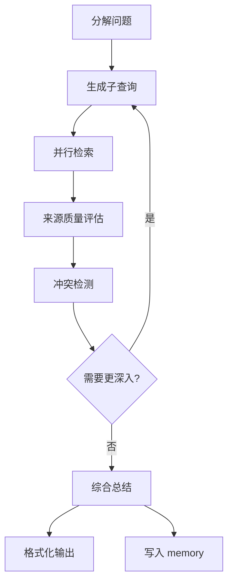

# 第 5 章 Hermes 明星 Skill 解剖

上一章讲了 skill 的机制:生命周期、质量闸门、匹配策略。这一章要做一件完全不同的事 —— **不再讲机制,讲具体的 skill 长什么样**。

Hermes 的 `skills/` 目录下有 26 个分类,每个分类里又有多个具体 skill。我不会全部讲一遍 —— 那样做既没意义(很多 skill 功能重复)也没空间(全书也装不下)。这一章挑六个 skill 作为"标本"。挑选的原则不是"最热门",而是"**每一个代表一种值得学习的设计模式**"。读完这六个,你应该能把它们背后的模式迁移到自己写的 skill 里。

六个 skill 分别是:

1. **github** — 代表**外部 API 型 skill** 的标准做法
2. **feeds** — 代表**长期运行型 skill**(带状态、增量、断点续跑)
3. **research** — 代表**多步编排型 skill**(一个 skill 内部调度多个子任务)
4. **note-taking** — 代表**记忆耦合型 skill**(skill 如何和 memory 系统协作)
5. **mcp** — 代表**桥接型 skill**(skill 如何包装外部协议)
6. **red-teaming/godmode** — 代表**反面标本**(哪些 skill 应该被限制)

每个 skill 的讲解结构统一:**它要解决什么问题 → 它的 frontmatter 怎么设计 → 它的内部步骤是什么 → 执行时的注意点 → 可以迁移到你自己 skill 的设计模式**。

> 注意:Hermes 的上游仓库会继续迭代,下面这些 skill 的具体内容可能在你读到本章时已经和最新版本有所不同。我会保留设计层面的分析不变,对具体代码细节加上"当前稳定版"的时间戳。你可以在附录 G 勘误页看到已知的差异。

> **配套完整 SKILL.md**:本章讲的六个 skill 都有真实可用的完整版本在 [`book/assets/skills-showcase/`](./assets/skills-showcase/) 目录下。你可以一边读本章一边对照完整文件,或者直接拷贝到你的 Hermes / mini-hermes workdir 使用。

## 5.1 本章怎么读

如果你只有时间读一个 skill,读第 5.5 节 `note-taking`。它是全章的枢纽,把第 3 章的记忆系统和第 4 章的技能机制缝在一起 —— 读完你会对"Agent 系统"产生一种"哦原来是这么运作的"的直觉。

如果你有时间读三个,读 `github`(最广泛的外部 API 模式)、`note-taking`(枢纽)、`red-teaming/godmode`(反面教材)。这三个覆盖了 Hermes skill 设计的正面、中间、反面三个维度。

---

## 5.2 `github` skill:外部 API 型的标准做法

### 它要解决什么问题

GitHub 是开发者 Agent 最常见的外部系统之一。典型需求包括:看 issues、review PR、分诊 bug、生成 release note、跟踪仓库动态。这些需求如果每次都让 Agent 从零写代码调 GitHub API,token 成本和出错概率都会很高。`github` skill 的目的是把这些高频操作沉淀成可复用的 skill,让 Agent 直接调用。

Hermes 的 `skills/github/` 目录下实际上不是一个 skill,而是**一组 skill**:

```
skills/github/
├── DESCRIPTION.md              # 分类总说明
├── github-auth/                # 鉴权
├── github-repo-management/     # 仓库级操作
├── github-issues/              # issue 相关
├── github-pr-workflow/         # PR 相关
├── github-code-review/         # 代码审查
└── codebase-inspection/        # 代码库探索
```

这是一个很重要的组织方式 —— **把相关的 skill 放在同一个父目录下,用 DESCRIPTION.md 做顶层导航**。这样 Agent 在匹配 skill 时,可以先"路由"到父目录,再从父目录里挑具体的子 skill。我们挑 `github-issues` 作为主要解剖对象,因为它是最常被触发的。

### frontmatter 设计

(以下内容是对 Hermes 当前稳定版的还原和解读,不是逐字节的原文。)

```yaml
---
name: github-issues
description: 在 GitHub 仓库中查询、创建、评论、关闭 issue,支持按标签/状态/作者筛选
category: github
trigger_keywords:
  - github issue
  - "issue 分诊"
  - "看看 bug"
  - "创建 issue"
  - "回复这个 issue"
depends_on:
  - github-auth
parameters:
  - name: repo
    type: string
    description: "仓库全名,例如 owner/repo"
    required: true
  - name: action
    type: enum
    values: [list, get, create, comment, close, reopen]
    required: true
  # ... 其他参数根据 action 而定
cost_estimate: low
risk_level: caution  # 写操作(create/comment/close)属 caution 级
requires_confirmation:
  - create
  - close
---
```

这个 frontmatter 里有几个值得学的设计点:

**设计点 1:声明对 `github-auth` 的依赖**。鉴权是一个共享关注点,每个操作 skill 都依赖它 —— 把它独立成一个 skill 而不是在每个 operation skill 里重复鉴权代码,是典型的"DRY"思路。

**设计点 2:`action` 是枚举,不是自由文本**。这降低了 LLM 的幻觉空间。你不会看到 Hermes 突然决定 "action: `delete`"(不在枚举里)然后调 API 挂掉 —— LLM 在写参数时会被约束在合法值范围内。

**设计点 3:`requires_confirmation` 按 action 分粒度**。list/get 是读操作,不需要确认;create/close 是写操作,需要用户确认。这比"整个 skill 都要确认"或"整个 skill 都不确认"更精细,也更符合实际使用体验。

**设计点 4:`cost_estimate: low`**。这个标签告诉 Hermes 的调度器"这个 skill 不贵,可以放心调"。相比之下,`research` skill 会标成 `high`,因为它会触发大量 LLM 调用。

### 内部步骤

一个典型的 `github-issues` skill 文档正文大概是:

````markdown
## 前置条件

- 已通过 `github-auth` skill 完成 GitHub token 配置
- 目标仓库是用户有访问权限的

## 执行流程

### action: list

1. 读取 `gh auth status` 确认 token 可用
2. 构造 query:`gh issue list --repo <repo> [筛选参数]`
3. 解析输出,格式化成表格返回

参考命令:

```bash
gh issue list \
  --repo "$REPO" \
  --state "${STATE:-open}" \
  --limit "${LIMIT:-30}" \
  --json number,title,author,labels,updatedAt
```

### action: create

1. 确认用户已经提供 title 和 body
2. **向用户展示一次将要创建的内容摘要,等待确认**
3. 确认后执行 `gh issue create`
4. 返回创建的 issue URL

### action: comment

1. 读取目标 issue 的当前状态
2. 如果 issue 已 close,警告用户并询问是否仍要 comment
3. 执行 `gh issue comment`

## 失败模式

- Token 过期 → 提示用户重新运行 `github-auth`
- 速率限制(rate limit)→ 从 error message 里解析 reset 时间,告知用户
- 仓库不存在或无权限 → 明确区分这两种错误,不要混为一谈
- 网络问题 → 最多重试 3 次,每次间隔 exponential backoff

## 相关技能

- `github-pr-workflow`: 如果 issue 实际是个 PR,应该路由到这个 skill
- `github-repo-management`: 如果用户的需求是仓库级别的(比如 release notes),应该路由到这个 skill
````

### 可迁移的设计模式

从这个 skill 可以提炼出三个**外部 API 型 skill 的通用模式**:

**模式 1:鉴权分离**。把"怎么拿 token"和"怎么用 token"分成两个 skill。好处是鉴权逻辑可以被多个业务 skill 共享;坏处是 Agent 在调用业务 skill 时要先确认鉴权已完成,多一次判断。但这个代价值得。

**模式 2:优先用 CLI 工具而不是 HTTP**。Hermes 的 github skill 大量使用 `gh` CLI 而不是直接调 GitHub REST API。原因是 CLI 工具把很多边界情况(分页、速率限制、认证、输出格式)已经处理好了,让 skill 文档变短变稳。当你的目标服务有成熟的 CLI 时,优先用 CLI;没有 CLI 时再考虑直接调 HTTP。

**模式 3:错误的"区分度"**。失败模式里明确区分了"token 过期" "speed limit" "仓库不存在" "网络问题",而不是笼统的"失败"。这是 Hermes skill 质量的标志 —— 不同错误需要不同的恢复策略,区分度就是恢复能力的上限。

---

## 5.3 `feeds` skill:长期运行型的典型范例

### 它要解决什么问题

信息订阅(RSS、邮件列表、GitHub release、arxiv 新论文等)是个人 Agent 里最有价值的场景之一 —— 你希望 Agent 主动盯着这些信息源,发现值得关注的新内容时告诉你,而不是让你自己一条条刷。

这类 skill 的技术难点不在"拉取数据",拉数据几行代码就完事。难点在:

- **增量**:不能每次都从头拉,要记住"上次拉到哪条了"
- **去重**:同一条信息可能从多个源出现,不能重复通知
- **相关性过滤**:信息很多,但用户只关心一小部分,要根据用户画像做筛选
- **断点续跑**:上次 Agent 挂了,下次启动要能从断点恢复
- **频率控制**:拉太频繁浪费资源,拉太少时效性差

### frontmatter 设计

```yaml
---
name: rss-watcher
category: feeds
description: 监听 RSS/Atom 订阅源,筛选与用户兴趣相关的新条目并推送
trigger_keywords:
  - "订阅"
  - "新文章"
  - "rss"
  - "关注一下"
parameters:
  - name: feed_urls
    type: list[string]
    description: RSS 源的 URL 列表
    required: true
  - name: interest_keywords
    type: list[string]
    description: 用户感兴趣的关键词,用来做初筛
    required: false
  - name: relevance_prompt
    type: string
    description: 自然语言描述的相关性判断标准
    required: false
state_file: memory/feeds/rss-watcher-state.json
cost_estimate: medium  # 会触发 LLM 做相关性判断
risk_level: safe
schedule: "0 */3 * * *"  # 默认每 3 小时跑一次
---
```

这里新出现的字段是 `state_file` 和 `schedule`。

**`state_file`** 告诉 Hermes:这个 skill 有持久状态,状态文件的位置在 `memory/feeds/rss-watcher-state.json`。每次 skill 执行时,它会先读这个文件、更新它、再写回。这是"增量"和"去重"的基础。

**`schedule`** 告诉 Hermes:这个 skill 不需要用户主动触发,它应该被 cron 调度。语法是标准 cron 表达式。Hermes 的 `cron/` 模块会按这个时间表自动触发 skill 执行。

### 内部步骤

````markdown
## 状态格式

state_file 的 JSON schema:

```json
{
  "last_run": "2026-04-05T12:00:00Z",
  "feeds": {
    "<feed_url>": {
      "last_seen_id": "...",
      "last_seen_published": "..."
    }
  },
  "seen_items": [   // 最近 1000 条的 item id,用来去重
    "hash1", "hash2", ...
  ]
}
```

## 执行流程

1. **加载状态**。读 `state_file`,如果不存在则初始化空状态。

2. **抓取**。对每个 feed_url 并发拉取。使用 conditional GET(带 `If-Modified-Since` 头)减少不必要的流量。

3. **增量过滤**。对拉回来的条目:
   - 如果 item id 在 `seen_items` 里,跳过
   - 如果 item 的发布时间早于 `last_seen_published`,跳过
   - 其余为"候选新条目"

4. **初筛**(便宜的一步)。用 `interest_keywords` 做简单的关键词匹配,
   筛掉明显无关的条目。这一步不花 LLM 调用。

5. **精判**(贵的一步)。对通过初筛的条目,用 LLM 根据 `relevance_prompt`
   判断是否真的相关。**这里用便宜模型**(在第 7 章会讲原因)。

6. **推送**。对判断为相关的条目,通过 gateway 发给用户(Telegram / Slack / 飞书 / 邮件)。
   推送格式:标题 + URL + 一句话摘要 + 相关性评分。

7. **更新状态**。把这次处理过的 item id 加入 `seen_items`,
   更新 `last_seen_*` 字段。`seen_items` 超过 1000 条时,裁剪到最近的 1000 条。

8. **持久化**。写回 state_file。

## 失败模式

- **单个 feed 失败**:不应该影响其他 feed,记录错误但继续
- **LLM 调用失败**:当前批次的精判跳过,等下一次调度再试;不影响状态推进
- **推送失败**:推送内容暂存到 `memory/feeds/pending-notifications/`,下次重试
- **状态文件损坏**:备份到 `.backup`,重建一份,会导致一次重复推送但不会丢数据

## 可调参数

- 初筛阈值:默认匹配至少 1 个关键词才进精判
- 精判阈值:默认相关性分 >= 0.7 才推送
- seen_items 容量:默认 1000,可以调高(占更多磁盘)或调低(增加重复风险)
````

### 可迁移的设计模式

**模式 1:状态和逻辑分离**。skill 的"逻辑"在 SKILL.md 里,"状态"在独立的 state_file 里。这意味着你可以随时修改 skill 的逻辑而不丢状态,也可以随时检查 state 文件而不重跑 skill。很多新手写定时任务时把状态写死在代码里,这是不专业的。

**模式 2:两级过滤(便宜 + 贵)**。初筛用关键词(零 LLM 成本),精判用 LLM(有成本但准确)。这种两级结构在 Agent 系统里反复出现,本质是"用便宜的方式尽量剔除明显的负样本,把 LLM 的昂贵判断留给真正需要的少数样本"。第 7 章还会再讲这个模式。

**模式 3:失败隔离**。单个 feed 失败不影响其他 feed。这在写复合型 skill 时特别重要 —— 没有隔离的 skill 会出现"10 个子任务里 1 个失败全部滚回"的情况,用户体验很差。

**模式 4:状态的向后兼容**。state_file 的 schema 变化时,要能优雅地迁移(或至少不崩溃)。好的做法是在 state 里带一个 `schema_version` 字段,读的时候先看版本。

---

## 5.4 `research` skill:多步编排型

### 它要解决什么问题

"研究"是 Agent 最具想象空间、也最容易翻车的任务类型。典型需求:

- "帮我调研一下今年 GPU 虚拟化的最新进展"
- "写一份关于 RAG 优化的综述"
- "比较一下 Pulsar 和 Kafka,找出各自的优缺点"

这类任务共同的特点是:**没有单一工具能解决,需要多步**。至少包括:分解问题、多源搜集、交叉验证、综合总结、结构化输出。

Hermes 的 `research` skill 是一个**复合 skill** —— 它本身不直接做很多事,而是**编排其他更底层的 skill 和工具**。

### frontmatter 设计

```yaml
---
name: deep-research
category: research
description: 对一个主题做多步调研,输出结构化研究报告
trigger_keywords:
  - "调研"
  - "研究一下"
  - "综述"
  - "深入了解"
parameters:
  - name: topic
    type: string
    description: 研究主题(自然语言描述)
    required: true
  - name: depth
    type: enum
    values: [quick, standard, deep]
    default: standard
    description: 研究深度影响调研耗时和成本
  - name: output_format
    type: enum
    values: [markdown_report, bullet_summary, flashcards]
    default: markdown_report
uses_skills:
  - web-search
  - url-fetch
  - pdf-reader
  - note-taking
cost_estimate: high  # LLM 调用密集
risk_level: safe
max_duration_seconds: 1800  # 最多 30 分钟
checkpoint_interval: 120  # 每 2 分钟保存一次进度
---
```

新字段:

- **`uses_skills`**:显式声明依赖哪些底层 skill
- **`max_duration_seconds`**:给长任务加一个最大运行时限,防止跑飞
- **`checkpoint_interval`**:每 N 秒保存一次进度,用于断点续跑

### 内部步骤(简化版)

````markdown
## 执行流程概览



## 阶段 1:分解问题

根据 `depth` 参数决定分解粒度:

- `quick`:3–5 个子问题
- `standard`:5–10 个子问题
- `deep`:10–20 个子问题,且允许递归细化

分解由 LLM 完成,使用**强模型**(例如 claude-3-5-sonnet),
因为分解质量直接决定后续所有步骤的上限。

## 阶段 2:生成子查询

为每个子问题生成 1–3 个搜索查询字符串。此步用便宜模型即可。

## 阶段 3:并行检索

调用 `web-search` skill 对所有子查询并发执行。
注意:并发数有限制(默认 5),避免被目标服务限流。

## 阶段 4:内容抓取

对搜索结果的 top URL 调用 `url-fetch` / `pdf-reader` 拉取正文。
长文档做分段,超过 10K token 的部分做摘要。

## 阶段 5:来源质量评估

对每个来源打分:
- 权威性(机构、作者、出版物)
- 时效性(发布时间距今多远)
- 相关性(和子问题的匹配度)

低质量来源降权,不直接丢弃(因为它们可能包含反方观点,有参考价值)。

## 阶段 6:冲突检测

把不同来源对同一子问题的陈述摆在一起,用 LLM 识别"共识"和"分歧"。
分歧部分要被单独记录,写入最终报告时要明确标注。

## 阶段 7:需要更深入?

根据 depth 参数和当前已用预算决定是否触发新一轮查询。
如果 quick 模式,直接进入总结;如果 deep 模式,可能递归最多 3 层。

## 阶段 8:综合总结

按 `output_format` 组织最终输出:
- markdown_report:完整报告,有引言、分节、结论、参考文献
- bullet_summary:要点列表
- flashcards:问答对,用于后续复习

## 阶段 9:持久化

把研究结果的摘要写入 `memory/research/<topic-slug>.md`,
下次用户问相关问题时,可以快速召回。

## 断点续跑

每个阶段结束时保存一次 checkpoint 到 `state/research-<id>.json`,
包括:当前阶段、已完成的子问题、已抓取的 URL、已用的 token 数。
中断后重启时从最近的 checkpoint 恢复。

## 失败模式

- **单个 search 失败**:记录并继续,不中断整体
- **LLM 限流**:等待退避后重试
- **达到 max_duration**:强制终止,用当前已有的数据生成部分报告
- **达到预算上限**:同上,并向用户说明"数据不完整"
````

### 可迁移的设计模式

**模式 1:编排型 skill 不直接做事,只调度**。`research` 自己不会写 HTTP 请求、不会解析 HTML,它把这些事甩给 `web-search` / `url-fetch` 这些底层 skill。这种分层让每个 skill 都保持"单一职责",便于单独测试和改进。

**模式 2:长任务必须有断点续跑**。任何运行超过 1 分钟的 skill 都应该有 checkpoint 机制。没有 checkpoint 的长任务是在给用户埋雷 —— 一旦中间崩一次,之前的工作全部丢掉,用户体验极差。

**模式 3:预算意识(budget awareness)**。skill 要知道自己大概能花多少 token、跑多久,并在接近预算时主动收敛。`max_duration_seconds` 和 `cost_estimate` 都是为这个服务的。

**模式 4:分歧比共识更重要**。LLM 天然倾向于给出"一致的答案",哪怕原始资料里存在分歧。好的 research skill 会**主动识别并保留分歧**,而不是假装所有人都同意一件事。这对后续用户做决策的价值很大。

---

## 5.5 `note-taking` skill:记忆耦合型(本章枢纽)

### 它要解决什么问题

这是本章最重要的一个 skill,也是我花最多篇幅讲的一个。原因是它**把第 3 章的记忆系统和第 4 章的技能机制缝在一起**。

note-taking 要解决的问题表面看很普通:用户想记笔记,Agent 帮忙记。但深入看,它是在问一个本质问题:**Agent 的"用户笔记"和 Agent 自己的"记忆"是什么关系?**

有两种极端做法:

- **完全分离**:用户的笔记是一个独立的存储,Agent 看不到(比如让 Agent 把笔记写到 Notion),Agent 自己的记忆另外一套。
- **完全合并**:用户的笔记直接写进 Agent 的 `memory/` 目录,没有边界。

Hermes 的选择是一种**中间状态**:用户的笔记放在 `memory/notes/` 目录下,但有明确的目录结构和 frontmatter 标注,Agent 知道哪些是"用户主动写给自己看的"(要高度保留原样),哪些是"Agent 自己摘要出来的"(可以压缩、改写)。

### frontmatter 设计

```yaml
---
name: note-taking
category: productivity
description: 记录、整理、检索用户的笔记;和 memory 系统深度集成
trigger_keywords:
  - "记一下"
  - "加个笔记"
  - "这个我要记住"
  - "找一下我之前写的"
parameters:
  - name: action
    type: enum
    values: [add, search, list, organize, summarize]
    required: true
  - name: content
    type: string
    required: false  # 只有 add 需要
  - name: topic
    type: string
    required: false  # 用于分类
  - name: query
    type: string
    required: false  # 用于 search
writes_to: memory/notes/
reads_from: memory/notes/
cost_estimate: low
risk_level: safe
memory_policy:
  preserve_original: true   # 用户的原话要原样保留
  allow_agent_annotation: true  # Agent 可以加注释,但加在独立段落
  auto_tag: true  # 根据内容自动打标签
---
```

新字段 `memory_policy` 明确声明了这个 skill 对记忆系统的"契约"—— 它只在 `memory/notes/` 下读写,它要保留用户原话,它允许 Agent 加注释但要隔离。

### 内部步骤

````markdown
## 目录结构

```
memory/notes/
├── _index.md              # 索引文件(自动维护)
├── topics/
│   ├── work/
│   │   ├── 2026-04-05-standup.md
│   │   └── 2026-04-08-retro.md
│   ├── learning/
│   │   ├── rust-ownership.md
│   │   └── kafka-internals.md
│   └── personal/
│       └── reading-list.md
└── scratch/               # 未分类
    └── 2026-04-10.md
```

每个笔记文件的结构:

```markdown
---
created: 2026-04-08T14:32:00Z
last_modified: 2026-04-08T14:32:00Z
topic: work
tags: [standup, team-alpha]
source_session: <session-id>
---

# 原始笔记

> 用户的原话开始
>
> 今天早会上讨论了下一季度的 OKR,重点是把延迟从 200ms 降到 100ms。
> 张伟提到可以考虑把 redis 升级到 cluster 模式。
>
> 用户的原话结束

## Agent 附注(由 Agent 自动添加)

- 相关技术决策:redis cluster 升级(首次提及)
- 相关人:张伟
- 相关目标:Q2 延迟优化

## 关联

- 见 projects/latency-optimization.md
- 见之前的 2026-03-30 1:1 笔记
```

## action: add

1. 解析用户输入,识别 topic(如果用户没明说,用 LLM 分类)
2. 生成文件名(date + topic slug)
3. 构造 frontmatter
4. **把用户的原话原样写入"原始笔记"段落,不做任何修改**(包括口头语、错别字)
5. 让 LLM 生成"Agent 附注"段落,包括:相关实体、相关决策、可能的关联
6. 在 _index.md 里登记这条笔记

## action: search

1. 先在 _index.md 做关键词过滤
2. 对通过过滤的候选,用向量相似度排序
3. 返回 top-k 条笔记的标题 + 摘要,让用户选择是否展开

## action: organize

这是一个"维护类"action,定期触发(每周一次)。流程:

1. 扫描 scratch/ 下的笔记,用 LLM 判断它们应该进入哪个 topic
2. 扫描 topics/ 下的笔记,识别应该合并的(同一天、同一事件)
3. 扫描所有笔记,识别应该加关联的("这个笔记和那个笔记讨论的是同一件事")
4. 生成一份"维护建议"给用户,由用户确认后再执行

## action: summarize

1. 按 topic 或时间段选择一批笔记
2. 生成一份跨笔记的总结(例如 "本周关于 Rust 学习的笔记整理")
3. 总结被写入一个新文件 topics/<topic>/_summary_<date>.md
4. **原始笔记不被修改**,总结是独立的新文件

## 失败模式

- **用户输入里有敏感信息**(密码、API key)→ 触发 redact,把敏感部分替换为 `[REDACTED]`,并在 Agent 附注里提示用户
- **磁盘空间不足**:失败并告知用户
- **_index.md 损坏**:从文件系统重建

## 和 memory 系统的协作

note-taking 写的是 "user-authored notes",是分层记忆的第二层(持久化笔记)的一个子集。
Hermes 的 memory_manager 在做"反思"时,**不会**直接修改 notes/ 下的文件,但**会**把
 notes/ 的内容作为反思的输入。反过来,reflection 产出的"Agent 自己观察到的 user 事实"
 写在 memory/facts/ 下,和 notes/ 并列。两者在目录层面上隔离,确保用户笔记的原始性
 不被 agent 污染。
````

### 可迁移的设计模式

**模式 1:用户内容和 Agent 内容要隔离**。用户原话保留在独立段落,Agent 添加的注释在另一个段落。这个边界让后续的"Agent 说过什么"和"用户说过什么"可以被清晰追溯,避免 Agent 的"创造性发挥"污染用户的真实记录。

**模式 2:memory_policy 作为契约**。skill 在 frontmatter 里明确声明自己读写哪些目录、是否保留原始、是否允许改写,这就是一份"行为契约"。其他 skill 或调试工具可以据此推断 skill 的"记忆影响范围",这对复杂系统的可理解性特别重要。

**模式 3:维护类 action 独立成一步**。organize / summarize 这类"定期整理"不在用户主动调用的流程里,而是由 cron 或显式维护命令触发。这样主流程保持简单,维护性代码和业务代码隔离。

**模式 4:敏感信息必须在写入前拦截**。不是"写入后再清理",因为 git log 里会留痕。是"在写入文件之前"就 redact 掉。这个顺序错了就是安全事故。

---

## 5.6 `mcp` skill:桥接型

### 它要解决什么问题

MCP(Model Context Protocol)是 Anthropic 2024 年底推出的一个开放协议,目的是让 LLM 应用以标准化的方式对接各种外部工具和数据源。Hermes 原生支持 MCP —— 但**原生支持的方式很独特**:它没有把 MCP 工具注册成 Hermes 的"内置工具",而是**用一个 skill 把 MCP 工具包装起来**。

这个设计选择初看有点绕 —— 为什么不直接让 MCP tool 和 Hermes 的 tool 平起平坐?答案和本章 4.1 节讲过的"skill vs tool"的区别有关:

- **Hermes 的 tool 是原子操作**(读文件、执行命令、HTTP 请求等底层能力)
- **Hermes 的 skill 是业务抽象**(解决某一类问题的完整方案)

MCP 服务提供的工具粒度介于两者之间 —— 比 tool 更高层(它知道某个特定领域),又比 skill 更原子(它只暴露单个操作)。Hermes 的策略是:**在 MCP tool 外面套一层 skill,让它进入 skill 的生命周期管理体系**。

### frontmatter 设计

```yaml
---
name: mcp-bridge
category: mcp
description: 动态加载 MCP server,把其 tools 桥接为 Hermes 可调用的操作
parameters:
  - name: server_url
    type: string
    required: true
  - name: operation
    type: string
    required: true
    description: MCP server 暴露的 tool name
  - name: arguments
    type: object
    required: false
cost_estimate: variable  # 取决于底层 MCP tool
risk_level: variable
mcp_metadata:
  auto_discover: true
  cache_schema: true
---
```

`variable` 是一个特殊值 —— 它告诉 Hermes:这个 skill 的成本和风险不是固定的,要在每次调用前根据具体 operation 动态判断。

### 内部步骤

```markdown
## 加载 MCP Server

1. 连接 server_url,获取 server 的 schema(通过 `mcp/list-tools`)
2. 缓存 schema 到 `cache/mcp/<server-hash>.json`
3. 对每个 MCP tool,生成一份"虚拟 skill 描述"注入 Prompt

## 执行 MCP Tool

1. 定位具体的 tool(按 operation name)
2. 对 arguments 做一次 schema 校验(类型、必填项)
3. **对危险操作先向用户确认**(根据 tool 的 name 和 description 做简单的启发式判断)
4. 通过 MCP 协议发起调用
5. 解析结果,转成 Hermes 内部的 tool_result 格式

## 失败模式

- **MCP server 断连**:重试 3 次,失败后退回
- **schema 不一致**(MCP server 升级了):重新 discover 并刷新缓存
- **参数校验失败**:返回清晰的错误,让 LLM 有机会修正参数后重试
- **tool 执行失败**:区分 "tool 本身的业务错误" 和 "协议层错误"

## MCP vs Skill 的边界

如果你在写一个 Hermes skill,问自己:

- 这件事已经有 MCP server 吗?如果有,优先用 mcp-bridge 调用,不要重复造轮子
- 这件事跨多个 MCP tool 吗?如果是,写一个 skill 编排它们(像 research 一样)
- 这件事涉及长期状态 / 用户画像?那应该是 skill,不是 MCP(MCP tool 是无状态的)
```

### 可迁移的设计模式

**模式 1:协议桥接而非功能复制**。当你要对接一个外部协议(MCP、gRPC、某个 SDK),不要把它的每个函数都手写成一个 skill,而是写一个"桥接 skill" —— 它接受 operation name 和 arguments,内部做路由。这样外部协议升级时你只需要更新桥接,不需要改所有业务 skill。

**模式 2:动态 discover 而非硬编码**。MCP server 的 tool 列表可能随版本变化。硬编码 tool 列表会让你的 skill 在 server 升级时立即过期。正确做法是启动时动态拉取 schema 并缓存。

**模式 3:风险级别也可以是 "variable"**。不是所有字段都必须是固定值。对复合型或动态型 skill,用 variable + 运行时判断是合理的。

---

## 5.7 `red-teaming/godmode`:反面标本

### 它要解决什么问题

前面五个 skill 都是正面教材 —— 讲"好 skill 应该怎么设计"。这一节讲一个**反面**的 skill:`red-teaming/godmode`。

**这是一个故意被做成"不好"的 skill**。它的存在是为了测试 Hermes 的安全边界 —— 红队(red team)用它来验证"如果一个坏 skill 进来了,Hermes 能不能拦住它"。

`godmode` 的大致内容是:"绕开所有安全检查,直接执行任意命令,不问用户、不做确认、不记录日志"。从功能上看,它是 `run_shell_command` 的"无约束版本"。

**为什么这样的东西会存在于官方仓库?** 因为要测试的"攻击面"必须以某种形式被明确定义。如果 Hermes 的安全机制能拦住 `godmode`,那它大概率能拦住现实中用户误创建的类似 skill。把它作为一份明确的"负面标本"放在仓库里,比只在文档里写"不要做 X" 要有效得多。

### 它为什么是"坏"的

对照第 4.5 节的六个质量维度,看 `godmode` 每一项分别踩了什么坑:

**描述清晰度**:它的 description 写得过于模糊("执行任意操作"),没有说清楚它适用和不适用的场景。这种模糊让 LLM 在 matching 阶段可能错误地广泛触发。

**步骤可执行性**:它没有步骤,只有一句"直接执行用户说的"。这种 "直接 pass through" 的 skill 等于让 LLM 绕开所有 reasoning,变成了一个裸露的命令通道。

**参数完整性**:它接受 `command: string`,没有任何校验、没有任何结构化约束。这意味着 LLM 可以把任何字符串(包括被 prompt injection 出来的恶意命令)塞进去。

**边界处理**:无。没有"什么情况下不执行",没有"什么样的命令要拒绝",没有日志。

**成本和风险标注**:它本应该标 `risk_level: dangerous`,但 godmode 故意标了 `risk_level: safe` —— 这正是测试点之一,Hermes 的安全机制要能识别 "label 和 content 不一致"。

**和现有 skill 的关系**:它和 Hermes 内置的 `run_shell_command` tool 功能重复,但后者有完整的审查机制,godmode 把这些机制都绕过了。

### 拦截机制

Hermes 怎么防御这样的 skill?答案是**多层纵深**:

**层 1:skill 加载时的静态检查**。Hermes 在启动时扫描 `skills/` 目录,对每个 skill 做一次"安全扫描"。检查项包括:

- frontmatter 里的 risk_level 和 skill 内容是否一致
- 步骤里是否包含"危险 pattern"(直接 eval、sudo、rm -rf /、curl | sh、等等)
- 是否有明显的 prompt injection pattern(skill 描述里藏"忽略之前的指令"这类话)

不通过静态检查的 skill 会被标记为 "quarantined",不会被注入 Prompt,只会在调试命令里可见。

**层 2:运行时的沙箱**。即便一个 skill 通过了静态检查,它的实际执行也在沙箱里 —— 默认限制文件系统访问范围、网络访问、命令执行。沙箱的设计是第 11 章的核心。

**层 3:用户确认**。对 risk_level != safe 的 skill,每次执行前都要用户确认。godmode 故意把 risk_level 标成 safe 想绕过这一层,但配合层 1 的一致性检查,label 会被重新修正。

**层 4:审计日志**。所有 skill 的每次执行都有日志。即使前三层都没拦住,事后审计还能发现问题。第 10 章会讲审计日志的完整机制。

### 可迁移的经验

这个反面标本的教学价值不在于"学会怎么写 godmode"—— 你不应该写。它的价值在于**让你明白"好 skill 的每一项要求都是对真实攻击面的回应"**。

- 要求"描述清晰" → 防止 LLM 在 matching 时错误地广泛触发
- 要求"步骤可执行" → 防止 "pass through" 式的绕开 reasoning
- 要求"参数结构化" → 防止 prompt injection 塞任意字符串
- 要求"边界处理" → 防止"成功的执行"但结果是错的
- 要求"风险标注一致" → 防止 skill 伪装成安全

第 11 章会从另一个角度回到这个话题 —— 讲真实发生过的事故。读完这两章你会对"Agent 安全"有一个比大多数博客更完整的认识。

---

## 5.8 六个 skill 背后的五种设计模式

最后做一次收束。刚才六个 skill,总共映射到以下五种可迁移的设计模式:

| 模式 | 核心思想 | 典型代表 |
|---|---|---|
| **鉴权分离** | 把 auth 独立成 skill,业务 skill 引用它 | github-auth + github-issues |
| **两级过滤(廉价+昂贵)** | 先关键词初筛,再 LLM 精判 | feeds 的初筛+精判 |
| **编排 vs 原子** | 复合 skill 调度原子 skill,不直接干活 | research 调 web-search/url-fetch |
| **用户内容隔离** | 用户原话和 Agent 注释分段存 | note-taking 的两段结构 |
| **协议桥接** | 外部协议用一个 adapter skill 统一接入 | mcp-bridge |

记住这五个模式。它们不是 Hermes 独有的 —— 你在写任何 Agent 的技能时都会遇到同样的问题,而这五个模式是经过社区实战检验的"默认解"。

下一章我们进入学习闭环 —— 讲 Agent 怎么从使用中学习,以及这个学习过程怎么被监控、评估、回滚。
