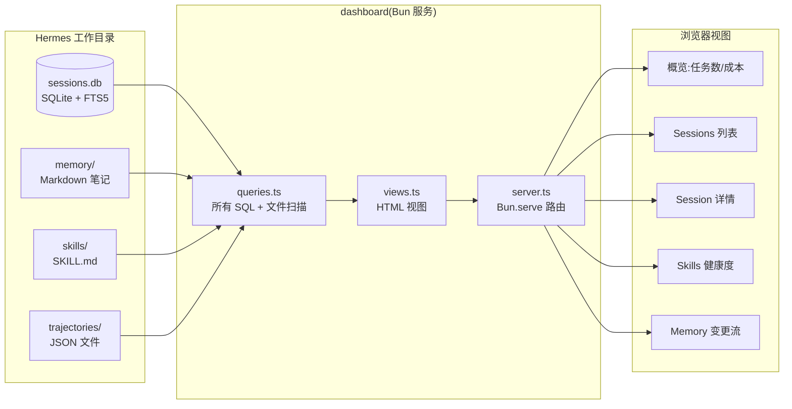

# 第 10 章 可观测性:让自学习可回放

第四部分的三章(可观测性、安全、评估)是全书在市面上最罕见的部分。大多数 Agent 书讲完"怎么用"就结束了。但从"玩具"到"生产"之间隔着的正是这三件事 —— 你能不能知道 Agent 在做什么、能不能防住它做错事、能不能证明它真的在变好。

这一章讲第一件:可观测性。

## 10.1 Agent 可观测性要看什么

传统服务(Web 后端、数据库)的可观测性有一套成熟的三件套:**日志、指标、Trace**。Agent 系统需要这三件套,但还需要多两件东西 —— 因为 Agent 有传统服务没有的两个特点:**它的行为是随机的**(LLM 输出有随机性),以及**它会自己改自己**(skill 和 memory 会变)。

Agent 可观测性的五件套:

**件一:日志(Logs)**。和传统服务一样 —— 每次请求处理过程中的事件记录。对 Agent 来说,日志要包括:每一次 LLM 调用的输入输出、每一次工具调用的参数和结果、错误堆栈、关键决策的原因。

**件二:指标(Metrics)**。聚合数据。Agent 特有的指标包括:按小时/天的任务成功率、按 skill 的调用次数、每日 token 消耗和成本、每日 memory 写入数、skill 创建/修订/废弃的频率。

**件三:Trace(追踪)**。一个请求从进入到完成的完整调用链。对 Agent 来说,Trace 要能回答:"这个回复是怎么来的?经过了哪些思考步骤、调了哪些工具、引用了哪些记忆?"这是 Agent 可观测性的核心。

**件四:技能版本历史(Skill Version History)**。每个 skill 的演化过程 —— 什么时候创建的、被改过几次、每次改了什么、为什么改。这在传统服务里不需要,因为代码不会自己改自己。

**件五:记忆变更审计(Memory Change Audit)**。memory/ 目录下每个文件的修改记录,包括什么时候被改、谁改的(Agent 反思? 用户手动?)、改之前是什么、改之后是什么。

前三件是传统可观测性的延伸,后两件是 Agent 特有的。我们分别展开。

## 10.2 用 OpenTelemetry 给 Hermes 打点

OpenTelemetry(OTel)是业界标准的可观测性数据协议,支持日志、指标、trace 三种数据格式,可以对接 Jaeger、Prometheus、Grafana、DataDog 等各种后端。Hermes 原生支持 OTel,只需要配置一下就能导出数据。

**配置 OTel 导出**:

```toml
# ~/.hermes/config.toml
[observability]
otel_enabled = true
otel_endpoint = "http://localhost:4318"  # OTLP HTTP 端点
otel_service_name = "hermes-agent"
trace_sampling_rate = 1.0  # 开发阶段全采样,生产可以调低
```

**在本地跑一个极简的可观测性栈**:

```yaml
# docker-compose.yml
services:
  jaeger:
    image: jaegertracing/all-in-one:latest
    ports:
      - "16686:16686"  # UI
      - "4318:4318"    # OTLP HTTP

  prometheus:
    image: prom/prometheus:latest
    ports:
      - "9090:9090"
    volumes:
      - ./prometheus.yml:/etc/prometheus/prometheus.yml

  grafana:
    image: grafana/grafana:latest
    ports:
      - "3000:3000"
```

起来之后:

- Jaeger UI 在 http://localhost:16686,可以看 Trace
- Prometheus 在 http://localhost:9090,可以查 Metrics
- Grafana 在 http://localhost:3000,可以做仪表盘

第一次打开 Jaeger,选 `hermes-agent` 服务,搜最近的 trace。你会看到一棵树状的调用链:

```
POST /feishu/webhook  [2.3s]
  ├── Trigger.parse  [12ms]
  ├── Agent.run  [2.1s]
  │   ├── context_builder.build  [230ms]
  │   │   ├── memory.retrieve  [180ms]
  │   │   └── skill.match  [45ms]
  │   ├── model_router.choose  [3ms]
  │   ├── llm.call (claude-sonnet)  [1.2s] [tokens: 3421→512]
  │   ├── tool_executor.run (bash)  [380ms]
  │   └── llm.call (claude-sonnet)  [290ms] [tokens: 4123→145]
  └── feishu.send_reply  [170ms]
```

这种可视化比读日志强一个数量级 —— 你一眼就能看出:哪一步慢、哪一步重(token 多)、哪一步失败。

### Hermes 里打的几类 span

Hermes 源码里(在 `agent/` 和 `gateway/` 目录的各个文件里)通过 OTel SDK 打了几类典型 span:

- **`agent.run`**:一次完整的 Agent 运行,从 trigger 进来到回复返回
- **`llm.call`**:单次 LLM 调用,attributes 包含模型名、input token、output token、延迟、是否走缓存
- **`tool.execute`**:单次工具调用,attributes 包含工具名、参数摘要、结果摘要、是否成功
- **`skill.run`**:单次 skill 执行
- **`memory.retrieve`** 和 **`memory.update`**:记忆系统的读写
- **`trigger.process`**:gateway 层面的触发处理

每类 span 都有对应的 attributes(key-value),方便后续聚合和过滤。

### trace 的"脱敏"

打 trace 有一个很容易犯的错:把 LLM 的 prompt 和 response 原样放进 span attribute。这带来两个问题:

- **span 太大**,可观测性后端存储成本爆炸
- **敏感信息泄露**,用户的私密对话被 export 到外部系统

Hermes 的做法是:**默认 trace 里只记摘要**(prompt 的前 200 字符 + 长度 + hash),完整的 prompt 和 response 存在本地的 trajectory 文件里。如果调试需要看完整内容,用 trajectory id 去本地查,而不是在 trace 里找。

这是一个重要的隐私和成本优化。不做这个处理,你的可观测性账单会比 LLM 账单还贵。

## 10.3 技能版本历史

每次 Hermes 对一个 skill 做修改,都应该有一条审计记录。最简单的做法就是 git —— 第 9.3 节已经讲了定期把整个工作目录 commit 到 git。但 git log 本身不够用,因为:

- git log 只知道"谁什么时候改了什么",不知道"为什么改"
- git log 不方便按 skill 做聚合视图

Hermes 的补充是一张 `skill_history` 表,结构大致:

```sql
CREATE TABLE skill_history (
    id INTEGER PRIMARY KEY,
    skill_name TEXT NOT NULL,
    version INTEGER NOT NULL,
    change_type TEXT,  -- 'create' | 'refine' | 'deprecate' | 'restore'
    reason TEXT,       -- 改动的自然语言原因
    trigger_session_id TEXT,  -- 什么会话触发了这次改动
    before_hash TEXT,  -- 改动前的文件 hash
    after_hash TEXT,   -- 改动后的文件 hash
    changed_at TIMESTAMP
);
```

每次 skill 被改,写一条记录。查询一个 skill 的历史只需要:

```sql
SELECT version, change_type, reason, changed_at
FROM skill_history
WHERE skill_name = 'markdown-inventory'
ORDER BY version DESC;
```

这张表是 Hermes 特有的可观测性维度 —— 它让"skill 从哪来 / 为什么变 / 去向哪里"变得可查。

### 有用的查询

**"最近一周哪些 skill 被修改过?"**

```sql
SELECT skill_name, COUNT(*) as changes, MAX(changed_at) as latest
FROM skill_history
WHERE changed_at >= datetime('now', '-7 days')
GROUP BY skill_name
ORDER BY changes DESC;
```

**"哪些 skill 修改最频繁?"** —— 这可能是 skill drift 的信号

```sql
SELECT skill_name, COUNT(*) as changes
FROM skill_history
WHERE change_type = 'refine'
  AND changed_at >= datetime('now', '-30 days')
GROUP BY skill_name
HAVING COUNT(*) > 5
ORDER BY changes DESC;
```

**"有没有 skill 被反复创建又废弃?"** —— 可能是质量闸门不严

```sql
SELECT skill_name, COUNT(*) as cycles
FROM skill_history
WHERE change_type IN ('create', 'deprecate')
GROUP BY skill_name
HAVING COUNT(*) >= 3;
```

这些查询不需要复杂的 BI 工具,sqlite3 命令行就能跑。

## 10.4 记忆变更审计

和 skill_history 类似,memory 也需要一份变更审计。Hermes 维护一个 `memory_changes` 表:

```sql
CREATE TABLE memory_changes (
    id INTEGER PRIMARY KEY,
    file_path TEXT,
    change_type TEXT,  -- 'add' | 'modify' | 'delete'
    actor TEXT,        -- 'agent-reflection' | 'user-direct' | 'skill-execution'
    trigger_session_id TEXT,
    before_excerpt TEXT,  -- 改动前的相关段落(限长)
    after_excerpt TEXT,   -- 改动后的相关段落(限长)
    reason TEXT,
    changed_at TIMESTAMP
);
```

同样配合 git 使用。git 记录完整的 diff,这张表提供结构化的查询能力。

**重要的查询模式**:

**"找出最近被改得最多的 memory 文件"**:

```sql
SELECT file_path, COUNT(*) as edits
FROM memory_changes
WHERE changed_at >= datetime('now', '-7 days')
GROUP BY file_path
ORDER BY edits DESC;
```

高频被改的文件可能是"事实不稳定"或"Agent 在反复改写同一件事",都值得检查。

**"谁在改 memory?"**:

```sql
SELECT actor, COUNT(*) as count
FROM memory_changes
WHERE changed_at >= datetime('now', '-30 days')
GROUP BY actor;
```

如果 `agent-reflection` 的比例远高于 `user-direct`,说明 Agent 在自主改 memory 远多于用户手动改 —— 这不一定是坏事,但值得确认你信任这个比例。

**"最近有没有跨会话的记忆冲突?"**:

这个稍复杂,需要对比 before_excerpt 和 after_excerpt 找出"同一个事实在不同时间被改成了不同的值"的模式。可以写一个小脚本定期扫描。

## 10.5 一个本地可回放仪表盘

把上面所有东西拼起来,做一个极简的"本地仪表盘"。不用任何 SaaS,不花一分钱额外成本。

**组件关系**:



**三个文件的分工**(让想自己实现的读者抄):

- **`queries.ts`(~200 行)**:所有 SQL 和文件系统查询集中在这里,视图层完全不写查询
- **`views.ts`(~150 行)**:HTML 视图,用 tagged template literal 直接写,不引入模板引擎
- **`server.ts`(~150 行)**:Bun.serve 做路由,每个 URL 一个 handler,调 queries 拿数据、调 views 渲染

**路由设计**(5 个视图对应 5 条路由):

| 路径 | 视图 | 核心查询 |
|---|---|---|
| `/` | 今日概览 | 按 date 聚合 messages / trajectories |
| `/sessions` | 最近 50 个 session | `SELECT ... FROM sessions ORDER BY id DESC LIMIT 50` |
| `/sessions/:id` | 单个 session 完整消息流 | `SELECT ... FROM messages WHERE session_id = ?` |
| `/skills` | skills 目录扫描 + 成功率 | 读 `skills/*/SKILL.md` + trajectory 聚合 |
| `/memory` | memory 文件列表按 mtime | 递归读 `memory/*.md` + `stat` |

**需要的数据源**:

- SQLite 数据库(Hermes 已经有了 —— sessions + messages + FTS5)
- `skills/` 目录(文件系统)
- `memory/` 目录(文件系统)
- `trajectories/` 目录(JSON 文件,见[第 3 章 trajectory 定义框](./03-memory-system.md#32-hermes-的三层记忆模型))
- Jaeger(可选)—— 用于看更细的 OTel trace

**仪表盘要显示的东西**:

1. **今日概览**:今天的任务数、成功率、总成本、token 消耗
2. **最近的 trajectory 列表**:可以点进去看一次运行的完整过程
3. **skill 的健康状态**:按成功率排序的 skill 列表,标红失败率高的
4. **memory 变更流**:最近的 memory 写入,每条显示摘要
5. **异常事件**:失败次数异常的 skill、连续失败的任务、成本突增的日子

本书配套仓库的 `integrations/dashboard/` 里有一份基于 Bun 原生 + 原生 HTML 的参考实现(约 550 行代码,零运行时依赖)。跑起来:

```bash
cd integrations/dashboard
bun install
bun run start
# 打开 http://localhost:3001
```

这个仪表盘有意做得很简单 —— 不用学习新的查询语言,打开就能看到你的 Agent 今天在做什么。它不会替代专业的可观测性平台,但对个人 Agent 来说够用了。

## 10.6 让自学习"可回放"

这一节是第 10 章的核心。

"可回放"是一个具体的能力:**给定一个历史上的 Agent 任务,我能把它原封不动地复现一遍**。这在调试、评估、回归测试里都是必需的。

要做到可回放,必须记录足够多的信息:

- **完整的 trigger 内容**(输入)
- **完整的 context**(当时的记忆状态、可用的 skill 列表、配置)
- **完整的 LLM 调用序列**(每次调用的 prompt 和 response)
- **完整的工具调用结果**(每次工具返回的内容)
- **任务的最终输出**

Hermes 的 **trajectory 文件**就是为这个目的设计的 —— 它的定义和存储格式在[第 3 章的定义框](./03-memory-system.md#32-hermes-的三层记忆模型)里已经给过,这里用到的就是同一份文件。每次运行结束,Hermes 把完整的执行过程序列化成一个 JSON 存到 `~/.hermes/trajectories/<YYYY-MM-DD>-<task-id>.json`,这份文件同时服务于第 6 章的学习闭环、第 10 章的回放调试、第 12 章的评估基准三个用途。

**一次回放的流程**:

1. 找到你要回放的 trajectory 文件
2. 用 `hermes replay <trajectory-id>` 命令(如果上游提供了,或者自己写一个)
3. Hermes 会"假装"这个任务正在发生 —— 它重建当时的 context,但**不真正调 LLM 和工具**,而是从 trajectory 里读出当时的响应
4. 如果你在过程中修改了某个环节(比如改了 prompt、换了模型、改了 skill),你可以从某一步开始让它"真的跑",观察新行为和旧行为的差异

这个能力的价值:

- **调试**:Agent 上次做错了一件事,你可以一步一步回放看哪里出的问题
- **修复验证**:你改了 prompt 或 skill,可以用历史任务做回归,确认"以前能做对的现在还做对"
- **A/B 对比**:把同一个任务用老 prompt 和新 prompt 各跑一遍,对比结果

没有 trajectory 和回放,这些事都得靠"再跑一次看看",而 LLM 的不确定性会让"再跑一次"的结果和原来不一样,你没法可靠对比。

### trajectory 的隐私处理

trajectory 里有非常详细的用户数据 —— 原始 prompt、LLM 响应、工具结果 —— 这些可能包含敏感信息。处理原则:

- **不要把 trajectory 推到公开 git 仓库**。`.gitignore` 里加 `trajectories/`
- **备份 trajectory 时要加密**(如果备份到云)
- **分享 trajectory 给别人调试前,先做脱敏**(Hermes 有 `hermes trajectory redact` 命令或类似工具)
- **定期清理旧 trajectory**(超过 90 天的不需要保留)

## 10.7 告警:什么情况要通知你

观测数据再多,没人看等于没有。告警是"让你被动得到通知"的机制。

Agent 系统值得告警的事件:

**严重等级:立即通知**(短信、电话、飞书高优先级推送)

- API 成本在 1 小时内超过历史日均的 3 倍
- Agent 本身崩溃(systemd 多次重启失败)
- 连续 10 次 LLM 调用失败(可能是 API 宕机或 key 失效)

**中等级:5–15 分钟延迟通知**(飞书普通消息、邮件)

- 某个 skill 连续 5 次失败
- 某类任务的成功率过去 1 小时低于 50%
- memory 或 skill 文件有异常写入(例如 10 分钟内写了 100 次)

**低等级:每日摘要**(每天早上一封总结邮件或飞书消息)

- 前一天总任务数、成功率、成本
- 前一天新增/修订/废弃的 skill
- 前一天的 top 错误模式

告警的关键是**精准而不嘈杂**。太多告警 = 没有告警。宁可漏掉一两个小问题,也不要让你每天收到 50 条"异常"通知。

Hermes 没有内置告警系统(这属于运维层的事),但它提供的 metrics 和日志完全能对接 Grafana 的 alerting 或你自己写的小脚本。本书配套仓库的 `integrations/alerts/` 里有一份基于 Python 定时脚本的最小告警实现,用飞书机器人发通知。

## 10.8 陷阱清单

**陷阱一:什么都打 trace,成本失控**。生产环境的采样率要降(比如 10%),开发环境才全采样。

**陷阱二:trace 里存完整 prompt**。见 10.2 节。必须脱敏或存摘要。

**陷阱三:告警太多**。见 10.7 节。

**陷阱四:日志没有结构化**。`print("error occurred")` 没法聚合分析。用结构化日志(JSON lines),每条日志带字段。

**陷阱五:时钟不一致**。不同机器的时钟偏差导致 trace 的时间线错乱。保证所有机器 NTP 同步。

**陷阱六:可观测性数据本身没有保留策略**。trajectory、trace、metrics 无限增长,最后把磁盘撑满。必须有清理 cron。

**陷阱七:自学习的可观测性被跳过**。你装了 Grafana 看 API 延迟,却没人看 skill_history 和 memory_changes。可观测性的覆盖要完整,不要只看"传统指标"。

**陷阱八:依赖单一观测来源**。只相信日志不看 metrics,或者只看仪表盘不看 trace。三件套(或五件套)要互相印证。

下一章讲比可观测性更重要的事 —— 安全。因为可观测性告诉你"发生了什么",安全防止"不该发生的事发生"。
