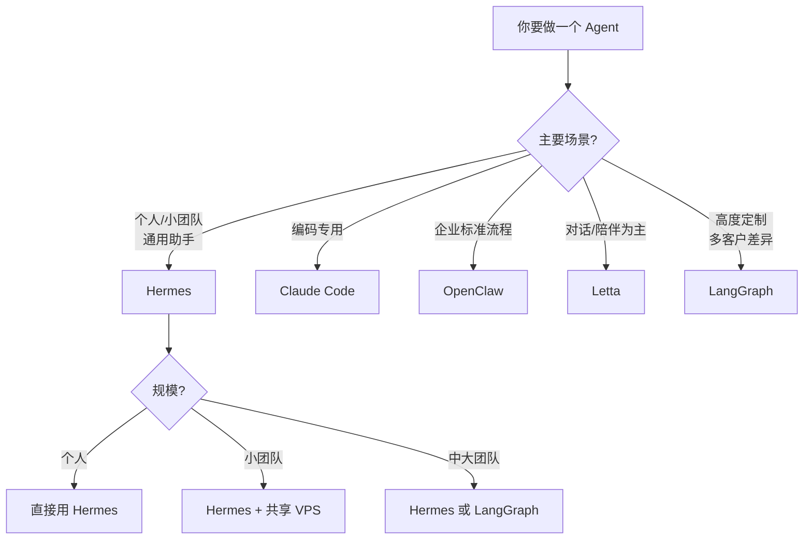

# 第 13 章 与其他 Agent 范式的深度对比

第 1.5 节给过一张范式对比速览表,但那只是"心理地图"。这一章要深入对比 Hermes 和其他四个代表性 Agent 项目:Letta、Claude Code、OpenClaw、LangGraph。每一个对比都围绕同一个问题展开:**如果我今天从零做一个 Agent,我应该选谁?**

对比的维度包括:定位、记忆模型、技能机制、扩展性、可观测性、生产就绪度、学习曲线。读完这一章,你不会得到"谁最好"的答案(因为没有这个答案),你会得到**如何根据自己的场景做选择**的能力。

## 13.1 Hermes vs Letta(原 MemGPT):技能 vs 纯记忆

Letta 是 MemGPT 论文作者在 2024 年推出的商业化产品(也开源),核心定位是**以记忆为中心的 Agent 平台**。它的设计哲学和 Hermes 有一个关键分歧:

**Letta 认为"技能是不必要的"**。它的理论是:只要记忆足够丰富,LLM 能够从记忆里"提炼"出任何需要的操作流程。你不需要显式地把"怎么生成周报"存成一个 skill —— 你只需要把过去生成周报的对话都存进记忆,下次用户说"生成周报"时,LLM 检索到这些历史对话,自然就"知道怎么做"。

**Hermes 认为"技能是必要的"**。它的理论是:纯记忆的方案在高频操作上会产生巨大的 token 成本(每次都要检索一堆历史对话、每次都要让 LLM 重新"推理出流程"),而显式技能是一次性投资(生成一次,之后每次便宜地调用)。

这个分歧在工程指标上有具体表现:

| 维度 | Letta | Hermes |
|---|---|---|
| 高频操作的平均 token 消耗 | 高(每次都要检索 + 重推理) | 低(直接调 skill) |
| 低频操作的灵活性 | 高(完全由 LLM 动态生成) | 中(还是需要 skill 生成) |
| 新用户的冷启动 | 慢(没有记忆,没有任何历史) | 中(至少有内置 skill 可以直接用) |
| 记忆系统的复杂度 | 高(核心能力,做得深) | 中(一层能力,做得够用) |

**Letta 的强项**:

- **虚拟内存分页**是它的招牌技术。LLM 可以主动把"不重要的"记忆"换出"到归档存储,把"相关的"换入 context。这个机制在超长对话场景(多天甚至多周的持续对话)里效果显著
- **人类般的记忆体验**。因为完全以记忆驱动,Letta 对"你很久之前说过的话"的召回特别好,对话连续性强
- **商业化产品**。有官方托管服务、企业级 SLA、支持合同

**Hermes 的强项**:

- **成本显著更低**(因为 skill 替代了大量"动态生成")
- **审计和可控**(每个 skill 都是文件,可以 git 管理和人工编辑)
- **完全开源**,没有商业化锁定

**什么时候选 Letta**:

- 你在做一个**对话为中心**的产品(例如 AI 伴侣、心理咨询、个性化教练)
- 对话的"连续性"和"记忆深度"是核心卖点
- 你不介意更高的 token 成本(因为用户付费 > 模型成本)
- 你需要商业级的支持

**什么时候选 Hermes**:

- 你在做一个**任务为中心**的产品(助理、工作流、运维)
- 用户在意的是"Agent 做完了我的事",而不是"Agent 记住了我说过什么"
- 你在意成本和可控
- 你愿意在代码层做一些自定义

一句话总结:**Letta 的气质是"陪伴",Hermes 的气质是"做事"**。

## 13.2 Hermes vs Claude Code:通用助理 vs 编码专精

Claude Code 是 Anthropic 官方出品的编码 Agent,2024 年发布。它和 Hermes 有一个很有趣的关系:**两者的设计哲学高度相似,但目标场景完全不同**。

相似点:

- 都把"skill"作为核心概念(Claude Code 后来也加入了 skill 系统,用 Markdown 格式)
- 都用文件化的 memory(Claude Code 的 `CLAUDE.md` 对应 Hermes 的 `memory/`)
- 都支持 MCP
- 都强调"解剖式透明"(开发者可以看到 Agent 的每一步)

差异点:

- **Claude Code 专注于代码仓库内的任务**,它假设你总是在某个项目目录下工作
- **Claude Code 绑定 Claude 模型**(虽然技术上支持其他,但优化是针对 Claude 的)
- **Claude Code 的 memory 只在当前仓库内有效**,跨仓库的记忆要靠显式同步
- **Claude Code 的界面是 CLI 为主**,不是多入口(没有 gateway 抽象)

### 编码场景下 Claude Code 的优势

如果你的唯一需求是"让 Agent 帮我写代码",Claude Code 在几个地方明显优于通用 Agent:

1. **对代码仓库的感知**。它对 git 历史、分支、diff、test 结果有天然的理解
2. **Claude 模型的代码能力**。Claude 3.5 Sonnet 在 SWE-bench 上长期排名靠前,对代码的理解比大多数模型深
3. **CLAUDE.md 的项目规范机制**。你可以在项目根目录放一份项目规范,Claude Code 总是会读它
4. **和 IDE 的集成**。VSCode、JetBrains 的插件直接把 Claude Code 接入编辑环境

### 个人助手场景下 Hermes 的优势

Hermes 的设计从一开始就不是"编码工具",它是"跨领域的个人助手"。相对 Claude Code:

1. **多入口**。你可以从飞书、Telegram、CLI 同时访问同一个 Agent,不只是 IDE
2. **跨项目的记忆**。memory/ 不绑定到某个 git 仓库,你的偏好和事实跨所有任务共享
3. **非编码任务的 skill 生态**。feeds、research、note-taking 这些 skill 在 Claude Code 里基本没有(因为不是它的场景)
4. **模型无关**。你可以用开源模型、本地模型、多个模型路由

### 实际选择建议

- 你是一个**专职开发者**,Agent 主要用于写代码、review PR、修 bug、做代码分析:**Claude Code**,别犹豫
- 你是一个**开发者 + 其他角色**(同时也要写文章、管待办、读论文、发邮件):**Hermes**
- 你是一个**非开发者**(PM、研究者、作者、企业管理者):**Hermes**
- **最好的做法可能是两者都用**:编码任务走 Claude Code,其他任务走 Hermes。两者可以共享同一个 MCP server 生态,不冲突

## 13.3 Hermes vs OpenClaw:自演化 vs 预定义工作流

OpenClaw(微软开源)是另一种 Agent 范式的代表。它的核心思想是:**不要让 Agent 自由发挥,让它严格按预定义的工作流执行**。

OpenClaw 的设计:

- 每个"能力"是一个 YAML 定义的工作流(类似 BPMN)
- 工作流的每一步是一个明确的 action(调 API、跑代码、等等)
- LLM 的作用是"在工作流的决策点上做判断",不是"自主规划整个流程"
- 没有自学习,没有自动 skill 生成,所有流程都是人工编写

这个设计的假设是:**在企业场景下,"可预测性"比"灵活性"更重要**。你的老板不会接受一个"我也不知道它下一步会做什么"的 Agent,但会接受一个"流程清晰、偶尔在判断点用 LLM"的 Agent。

### 两者的哲学对比

| 维度 | OpenClaw | Hermes |
|---|---|---|
| Agent 的"自主度" | 低(工作流外壳严格) | 高(LLM 自主规划) |
| 可预测性 | 高 | 中 |
| 灵活性 | 低(新需求要写新工作流) | 高(LLM 可以动态组合) |
| 学习曲线 | 高(要学 YAML DSL) | 中(主要是概念) |
| 运维难度 | 低(流程固定,易监控) | 中(自主行为难监控) |
| 出错成本 | 低(出错在可预期范围内) | 高(出错可能意想不到) |
| 开发成本 | 高(每个能力都要写工作流) | 低(LLM + skill 自生成) |

这不是"谁对谁错",这是**不同场景的不同选择**。

### 什么时候选 OpenClaw

- 你在做**企业内部的标准化流程自动化**(合规检查、审批流程、报销处理)
- 用户和业务部门无法接受"不确定的行为"
- 你有开发团队专门维护工作流定义
- 审计和合规是硬要求

### 什么时候选 Hermes

- 你做的是**个人或小团队的灵活助手**
- 用户理解并能接受"Agent 可能偶尔出错"
- 你没有资源为每个需求写工作流
- 学习和演化是加分项

### 混合做法

有一种折中做法:**用 Hermes 做外壳,在关键流程上调用 OpenClaw 风格的固定工作流**。Hermes 的 skill 机制允许你写一个 "rigid workflow" skill —— 不让 LLM 自由发挥,严格按步骤执行。这种 skill 适合那些"必须精确"的场景(发工资、合规检查)。

这个混合模式说明:**Agent 范式之间不是非此即彼,你可以在同一个系统里混用不同的哲学**。

## 13.4 Hermes vs LangGraph:成品 vs 框架

LangGraph 是 LangChain 团队 2024 年推出的产品,核心思想是**把 Agent 的执行流程建模成一个有状态的图(graph)**,每个节点是一个函数或工具调用,边是状态转移。

LangGraph 和 Hermes 的根本区别:

- **LangGraph 是一个框架,不是一个成品**。它给你工具造 Agent,但你要自己造
- **Hermes 是一个成品**。它装上就能用,虽然你也能改

这个区别决定了几乎所有其他差异。

### LangGraph 的优点

- **极度灵活**。你可以精确控制 Agent 的每一个决策点,实现任何你能想到的流程
- **和 LangChain 生态无缝**。几百个工具、几十个向量数据库适配器、各种 LLM 客户端,拿来就用
- **适合做"定制化 Agent 产品"**。你给一个客户做一个特定的 Agent,LangGraph 让你高度定制
- **学术社区友好**。最新的 Agent 论文经常第一个有 LangGraph 实现

### LangGraph 的代价

- **从零开始的工作量大**。记忆系统、技能沉淀、多入口、可观测性、安全 —— 这些 Hermes 内置的东西,LangGraph 你都要自己写
- **没有"自学习"的开箱即用能力**。你可以用 LangGraph 构造一个会学习的 Agent,但你要自己设计整套机制
- **复杂度高**。一个复杂的 Agent 图可能有 20+ 个节点、10+ 个状态变量,维护成本不小
- **快速迭代中**,API 有时破坏性变更

### 选择建议

- 你在做一个**标准的个人或通用助手**,需要立即可用:**Hermes**
- 你在做一个**高度定制的企业 Agent**,每个客户流程不同:**LangGraph**
- 你在**研究 Agent 范式**,需要完全控制实验细节:**LangGraph**
- 你**已经深度使用 LangChain**,团队熟悉它的生态:**LangGraph**(降低迁移成本)
- 你想**学习 Agent 设计**但不想陷入工程细节:**先读 Hermes 源码,再考虑 LangGraph**

### 一个务实的视角

如果把 LangChain 比作"开源汽车零件店",LangGraph 就是"高级零件商店" —— 它给你好工具,但你要自己攒车。Hermes 是"已经装好的一辆车" —— 可能不是最适合你的型号,但开起来就能上路。

对大多数中小团队和个人,不建议直接上 LangGraph。你应该先用 Hermes(或类似成品)跑通,遇到具体的瓶颈或独特需求时,再决定是改 Hermes 还是迁到 LangGraph。

## 13.5 技术选型决策树

把前面 4 组对比浓缩成一张决策树:

这张图不是圣经。真实决策还要看:团队技术栈、预算、合规要求、上游迭代风险等等。但它能帮你避免一些明显错的选择。

## 13.6 三个不应该做的选型错误

我见过的错误选型,归纳起来就这三种:

**错误一:选最热门的,而不是最合适的**。LangGraph 社区很热闹,但对一个"只想要个人助手"的用户是过度工程。热门 ≠ 适合你。

**错误二:选功能最多的,而不是最稳的**。有些 Agent 项目有 50+ 功能,但每个功能都半成品。不如选一个功能少但做到位的。

**错误三:选最新的,而不是最成熟的**。Agent 领域每周都有新项目发布,追新潮流会让你永远在换工具。一个项目至少要运行 6 个月有稳定社区,才值得投入。

## 13.7 Hermes 的最佳区间与局限

先讲**最适合 Hermes 的区间**,这比"什么时候不该用"更有操作意义:

> **Hermes 最适合**:
>
> - **复杂度**:中等 —— 任务需要跨多步工具调用,但不需要复杂的状态机或并发编排
> - **规模**:**个人 · 或 <10 人团队共享一个实例**
> - **连续性**:需要**跨会话连续性**(今天聊过的事,明天还记得)
> - **使用频率**:日均 **5–20 次**交互(再少浪费,再多要考虑 Hermes 之外的架构)
> - **运行环境**:$5 VPS 到家用服务器到 Modal 按需计算都可以
>
> **判断方法**:如果上面五条中**有三条以上不满足**,应该考虑其他方案。

下面是 Hermes 明确**不合适**的六个场景:

**场景一:超大规模多用户**。Hermes 的设计假设是"每个用户一个实例"或"少量用户共享实例"。要支持 10 万用户同时在线,Hermes 的 SQLite 架构会成瓶颈,你需要专业的多租户架构。

**场景二:硬实时响应**。Hermes 的典型响应时间是 3–15 秒(主要被 LLM 调用时间主导)。如果你需要亚秒级响应(例如语音对话、游戏 NPC),Hermes 不是最佳选择。

**场景三:严格合规场景**。金融、医疗、政府等行业的合规要求很高(数据主权、审计细节、责任链条)。Hermes 的设计是为"个人/小团队"的,不是为"过合规审查"的。这类场景要么选专门的企业产品(可能包括 OpenClaw),要么自己基于 LangGraph 深度定制。

**场景四:纯编码任务**。已经说过了 —— 用 Claude Code。

**场景五:纯对话伴侣**。用 Letta 或类似的对话中心产品。

**场景六:非常简单的一次性任务**。如果你只是偶尔让 LLM 做一件事,不需要记忆、不需要技能、不需要主动触发,直接用 ChatGPT / Claude 对话框就行了,上 Agent 是大炮打蚊子。

落在本节开头那个区间里,你会觉得 Hermes 设计得刚刚好;不落在这个区间,不管它多优秀,都不是对的工具。

技术选型的核心是"诚实面对自己的需求",而不是"选最酷的那个"。做到这一点,你就不会在 Agent 选型上踩大坑。

下一章进入三个端到端案例,看 Hermes 在真实场景下怎么被组合起来解决问题。
