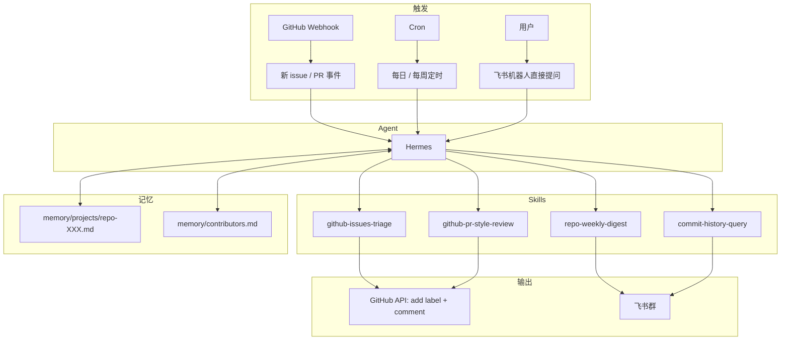
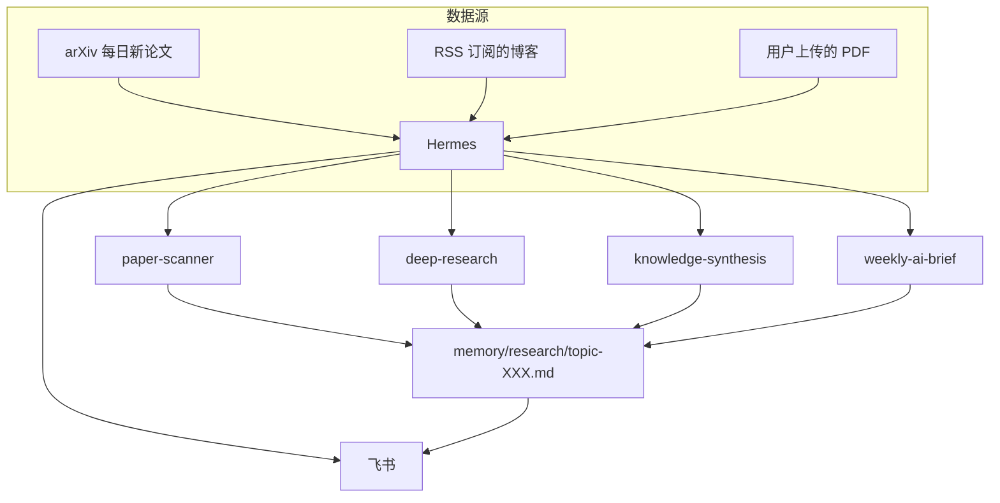
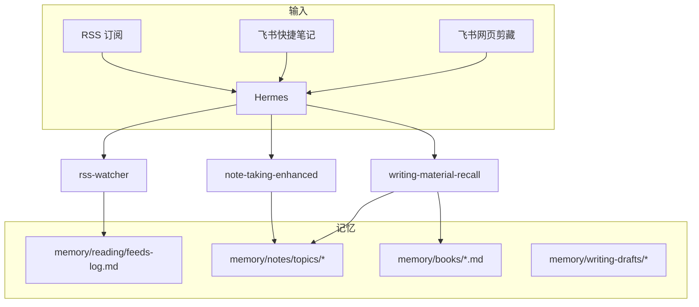

# 第 14 章 三个端到端案例精讲

前面的章节讲的是"零件"—— 记忆、技能、学习、执行、部署、观测、安全、评估。这一章把所有零件组装起来,看三个端到端的真实案例怎么跑。

三个案例覆盖三类典型需求:

1. **代码仓库守护者**:开发者场景,用到 github skill、执行引擎、长程任务、断点续跑
2. **研究助手**:知识工作者场景,用到 research skill、学习闭环、复合任务编排
3. **个人知识库助手**:重度记忆 + 内容管理,用到 feeds、note-taking、记忆系统耦合

每个案例的讲解结构:**需求 → 架构 → 用到的 skill 和记忆 → 配置和代码 → 运行一周的真实观察 → 教训**。

所有案例的完整代码在本书配套仓库的 `cases/` 目录:`cases/01-repo-guardian/`、`cases/02-research-assistant/`、`cases/03-knowledge-base/`。

## 14.1 案例一:代码仓库守护者

### 需求

用户是一个开源项目的 maintainer,他的仓库有 50 多个 contributor、每周 20+ 个新 issue、10+ 个 PR。他希望 Agent 帮他:

1. **每天早上**自动扫描昨天的新 issue,做初步分诊(bug / feature / question / invalid),打好 label
2. **每次有新 PR** 时,自动做第一轮代码风格检查,在 PR 下留评论
3. **每周五**生成一份"本周仓库动态"发到飞书群
4. 用户可以随时问 Agent "最近这个模块有哪些变化""某个 contributor 最近做了什么"

### 架构



关键设计:

- **三种触发源汇合到同一个 Agent**:GitHub webhook(事件驱动)、Cron(时间驱动)、飞书(用户驱动)
- **四个自定义 skill**:其中两个是主动任务(triage、style-review),两个是查询型(digest、history-query)
- **两份 memory 文件**:一份关于仓库本身(项目目标、技术栈、分支策略),一份关于 contributors(谁擅长什么、谁最近活跃)

### 用到的 skill

**skill 1: github-issues-triage**

```yaml
---
name: github-issues-triage
category: github
description: 扫描 GitHub 仓库的新 issue,做自动分类和 label
parameters:
  - name: repo
    required: true
  - name: since
    type: timestamp
    default: 24 hours ago
depends_on: [github-auth]
risk_level: caution
requires_confirmation: false  # 因为用户已经授予了这个 skill 的信任
---

## 步骤

1. 用 `gh issue list --repo $repo --search "created:>$since"` 拉取新 issue
2. 对每个 issue,读 title + body
3. 用 LLM 判断类型(bug / feature / question / invalid)
4. 如果是 bug,进一步判断严重性(critical / high / medium / low)
5. 通过 `gh issue edit --add-label` 打标签
6. 对于 critical bug,额外在 issue 下评论 "@maintainer 这个可能需要立即关注"
7. 汇总一份处理报告(XX 个 bug、XX 个 feature 等),返回给调用者
```

**skill 2: github-pr-style-review**

```yaml
---
name: github-pr-style-review
category: github
description: 对新 PR 做自动代码风格检查
trigger: webhook (PR opened)
parameters:
  - name: repo
  - name: pr_number
---

## 步骤

1. 拉取 PR 的 diff
2. 运行项目的 linter (eslint / ruff / golangci-lint,按项目类型判断)
3. 如果 linter 报错,在 PR 下以结构化格式评论
4. 如果 linter 通过但 diff 里有 "TODO" / "FIXME" / "console.log",也提醒一下
5. 如果 PR 缺少 test 改动(新增代码但没有新增 test),留一条评论建议

## 注意事项

- **只做风格检查,不做功能检查**。功能检查是人的事
- **评论要友好**,不要让 contributor 觉得被机器人挑刺
- **幂等**:如果同一 PR 再次触发(比如 contributor 推了新 commit),要识别并更新已有评论而不是重复评论
```

**skill 3: repo-weekly-digest**

这个 skill 是复合型,内部调用多个底层操作:

```yaml
---
name: repo-weekly-digest
description: 生成本周仓库动态报告
cost_estimate: high
max_duration_seconds: 600
---

## 步骤

1. 拉取本周的 commits、merged PR、new issues、new contributors
2. 按模块/目录分组 commits
3. 识别"重要变化"(涉及核心文件的 commit、修复 critical bug 的 PR)
4. 读 `memory/projects/repo-XXX.md` 了解项目当前状态
5. 用 LLM 综合生成一份 Markdown 报告,结构:
   - 本周重要变化(3-5 条)
   - 详细的 PR 列表
   - Issue 动态
   - 新 contributors 欢迎
   - 下周值得关注的事
6. 通过飞书 gateway 发到指定群
7. 把这份报告的摘要写入 memory/projects/repo-XXX-weekly-log.md
```

**skill 4: commit-history-query**

查询型 skill,用户从飞书直接调:

```yaml
---
name: commit-history-query
description: 查询仓库的提交历史和 contributor 活动
cost_estimate: medium
---

## 支持的查询类型

- "最近 X 这个模块有哪些变化" → git log -- 指定路径
- "某个 contributor 最近做了什么" → git log --author
- "上次改 XX 功能是什么时候" → git log --follow
- "某个 bug 是哪个 PR 修的" → GitHub API 搜索

## 步骤

1. 解析用户的自然语言查询,识别查询类型和参数
2. 调用对应的 git 或 GitHub API 命令
3. 对返回结果做一次 LLM 的"提炼"(避免把 100 条 commit 全丢给用户)
4. 返回简洁的答案,保留关键的 commit hash 和 PR 链接供用户跟进
```

### 配置

```toml
# config.toml(节选)

[mcp.servers.github]
command = "uvx"
args = ["mcp-server-github"]
env = { GITHUB_TOKEN = "${GITHUB_TOKEN}" }

[gateway.feishu]
enabled = true
app_id = "${FEISHU_APP_ID}"
app_secret = "${FEISHU_APP_SECRET}"
allowed_user_ids = ["ou_maintainer_id"]

[[webhooks]]
name = "github-new-pr"
path = "/webhook/github/pr"
secret = "${GH_WEBHOOK_SECRET}"
trigger_template = "新 PR #{number} 已打开: {title},请运行 github-pr-style-review 做风格检查"
user_id = "maintainer"
```

```toml
# cron.toml
[[jobs]]
name = "daily-issue-triage"
schedule = "0 9 * * *"  # 每天早上 9 点
trigger_text = "扫描过去 24 小时的新 issue,做自动分诊"
user_id = "maintainer"
output_gateway = "feishu"
output_chat_id = "oc_personal"

[[jobs]]
name = "weekly-digest"
schedule = "0 18 * * 5"  # 每周五 18:00
trigger_text = "生成本周的 repo-weekly-digest 报告"
user_id = "maintainer"
output_gateway = "feishu"
output_chat_id = "oc_team"
budget_tokens = 30000
timeout_seconds = 600
```

### 运行一周的观察

这个案例的原型跑了一周,下面是真实的数据和观察(匿名化):

**第 1 天(周一)**

- 早 9:00 cron 触发 issue triage,处理了 7 个新 issue,自动打了 label。一个被误判为 "question" 的实际上是 bug(后来用户手动改了 label)
- 下午用户通过飞书问"最近这个 parser 模块有什么变化",commit-history-query 正确返回了最近 3 条相关 commit
- 晚上一个 contributor 推了新 PR,style-review 自动评论发现了两处 lint 错误,contributor 半小时内 push 了修复

**第 2–4 天**

- triage 的准确率在提高(因为 Agent 在 memory 里记录了"这个项目的 bug 通常指 XX 行为,这个项目的 feature 通常指 YY")
- 出现了第一次 style-review 的重复评论(同一个 PR 被 review 了两次,因为 webhook 去重没做好)
- 修复方式:在 skill 的步骤里加了"先读已有评论,如果已经 review 过就更新而不是新增"

**第 5 天(周五)**

- 18:00 cron 触发 weekly-digest,耗时约 3 分钟,消耗约 12K token(成本 $0.05)
- 生成的报告质量:结构清晰,但"重要变化"部分漏了一个影响用户的 bugfix —— 原因是 skill 的"重要性判断" prompt 没有把"closed issues 里的 critical 标签"考虑进去
- 修复方式:在 prompt 里加入"如果某个 PR 关联了 critical issue,就算作重要变化"

**第 6–7 天**

- 周末相对安静,只有几个 issue 和 1 个 PR
- Agent 按部就班处理,没有异常

**一周总结**

- 总 LLM 成本:$3.20
- triage 准确率:约 85%(7 个里错 1 个)
- style-review 完整捕获率:100% 的 PR 都被 review 了
- weekly-digest 的有效性:生成的报告被用户"读完"并分享给了团队群(这是"有用"的一个软指标)

### 教训

**教训一:webhook 去重是硬要求**。同一个 PR 可能因为多次 push、reopen、comment 等事件触发多次 webhook。skill 必须识别"这个 PR 我已经 review 过了",否则会产生垃圾评论。

**教训二:Agent 需要项目的"领域知识"**。最开始 triage 把所有"为什么 XXX 这样"的问题都判成 "question",但实际上有些是 bug report。加了 `memory/projects/repo-XXX.md` 后判断准确率显著提高。这说明 memory 不只是记"用户偏好",也记"领域常识"。

**教训三:报告的价值在于被读**。第 5 天生成的 weekly-digest 如果只是发到群里没人看,就是垃圾消息。让它有价值的是:**内容精确(不是为了凑字数)、时机合适(周五下班前适合回顾一周)、主动引流(在报告结尾说 "@maintainer 有两个点需要你决定...")**。

**教训四:"让 Agent 完全自动处理"是很难的,更现实的目标是"让 Agent 做 90% 的工作,剩下 10% 需要人工介入时能清晰指出"**。triage 的 85% 准确率看起来不够,但如果 Agent 能主动标注出"这 3 个我不太确定"的那些,用户的总工作量已经从"审 20 个" 降到 "审 3 个",价值很大。

## 14.2 案例二:研究助手

### 需求

用户是一个科技出版社的编辑,他的工作需要:

1. 追踪 AI/Agent 领域的最新进展(arXiv 新论文、重要博客、关键 Twitter 账号)
2. 对感兴趣的话题做**深度调研**(一个话题可能要读 10–20 篇资料,综合成一份理解)
3. 维护一个**长期的知识积累**(关于某个话题"我已经读过什么、理解到什么程度")
4. 每周生成一份"本周 AI 新动态"简报用于内部分享

### 架构



核心设计:

- **所有对话和研究都绕着"topic"展开**。memory/research/ 下每个文件对应一个长期追踪的话题
- **deep-research 是第 5 章讲过的 research skill 的实例**,这里展示它在真实工作流里的样子
- **knowledge-synthesis 把"一次调研的输出"叠加到"长期的知识积累"上**,是记忆系统的重度用户

### 用到的 skill

**skill 1: paper-scanner(每天运行)**

```yaml
---
name: paper-scanner
schedule: "0 9 * * *"
description: 扫描 arXiv 上指定分类的每日新论文,按用户关注的主题筛选
---

## 步骤

1. 从 arXiv API 拉取 cs.CL、cs.AI、cs.LG 分类的前一天新论文(大约 100-300 篇)
2. 对每篇论文读 title + abstract
3. 用**便宜模型** (Haiku) 做第一轮筛选:是否和用户关注的主题相关
   (关注主题从 memory/research-interests.md 读)
4. 对通过筛选的(通常剩 5-10 篇),用**强模型**(Sonnet)做更细的判断:
   - 这篇论文的核心贡献是什么
   - 值得精读还是只需要知道
   - 和用户之前追踪的哪些话题相关
5. 把"值得精读"的那几篇整理成一份简报,发到用户的飞书
6. 把所有通过筛选的论文元数据写入 memory/research/arxiv-daily/YYYY-MM-DD.md
```

**注意这里 5.3 节讲的"两级过滤"模式**:Haiku 做便宜的初筛,Sonnet 做贵的精判。100 篇论文如果全用 Sonnet 判断,成本约 $1 每天;用两级过滤,成本降到 $0.15 每天。

**skill 2: deep-research(用户主动触发)**

这是第 5.4 节的 research skill 的完整实例,不重复它的 frontmatter 和流程,只讲它在这个案例里的特点:

- **起点是用户自然语言描述**:"帮我深入调研一下 Agent 的 tool use 机制最近半年的进展"
- **结果写入 `memory/research/topic-tool-use.md`**,如果这个文件已存在则追加新的调研结果到"更新"段落
- **每次调研后更新一个"当前理解"摘要**,这样下次用户问 "我对 tool use 的理解到什么程度了" 时能直接回答

**skill 3: knowledge-synthesis**

这是一个**维护类** skill,每周日晚上自动触发:

```yaml
---
name: knowledge-synthesis
schedule: "0 22 * * 0"  # 每周日晚 22:00
description: 把这一周的所有 research 产出整合进长期知识库
---

## 步骤

1. 扫描 memory/research/arxiv-daily/ 下本周的文件
2. 扫描 memory/research/topic-*.md 下本周的新增段落
3. 对每个"topic",综合这一周的新内容和旧的"当前理解"
4. 产出更新后的"当前理解"段落
5. 识别"新出现的话题"(之前没追踪过,但这周出现多次),建议用户是否要加入常规追踪
6. 产出一份"本周知识增量报告"发给用户
```

**skill 4: weekly-ai-brief**

最终产出的"本周 AI 新动态"简报,结合前三个 skill 的数据:

```yaml
---
name: weekly-ai-brief
schedule: "0 10 * * 1"  # 每周一早 10:00
description: 生成供团队分享的本周 AI 新动态简报
---

## 步骤

1. 读 memory/research/ 下本周的所有内容
2. 按"主题"分节:模型进展、Agent 研究、工具链、产品动态
3. 每个主题下选 3-5 个最值得分享的条目
4. 每个条目写 2-3 句话的摘要
5. 在简报结尾加一个"我个人的观察"段落(由 LLM 生成,带标注"以下为 AI 生成,仅供参考")
6. 发到飞书团队群
```

### 运行两周的观察

**第 1 周**

- paper-scanner 第一天捕获了 3 篇"值得精读"的论文,用户全部读了,反馈"挺准的"
- 用户触发了一次 deep-research("Agent 的 long-context evaluation 方法"),耗时 18 分钟,产出一份 5 页的报告 + 更新了对应的 topic 文件
- 周日 knowledge-synthesis 运行,产出的"增量报告"里有一个误识别(把一个无关话题归类为了"新兴话题")
- 周一 weekly-ai-brief 发布,团队反馈"有用,但'个人观察'部分有一处事实错误"

**第 2 周**

- 用户根据第 1 周的问题调整:在 memory/research-interests.md 里明确了"不关心"的话题清单,减少误识别
- paper-scanner 的精度提高
- deep-research 又被触发两次
- 用户发现 weekly-ai-brief 的"个人观察"部分如果让它写容易出事实错误,于是把这一段改成了"需要用户填"(Agent 生成前几段,最后一段留空让用户自己写)

**两周统计**

- 总 LLM 成本:约 $18
- 用户读到的"值得精读"论文:14 篇
- 触发的 deep-research 次数:4 次
- 用户评价:"省了我每天半小时翻 arXiv 的时间"

### 教训

**教训一:筛选比检索更重要**。用户的核心痛点不是"找不到论文",而是"论文太多看不过来"。skill 的价值在于"准确过滤",而不是"找得全"。

**教训二:知识积累要有"当前理解"的概念**。把每次调研结果都追加到文件里,时间久了文件会变得不可读。维护一份"当前理解"摘要(根据每次新调研更新)是让知识可查的关键。

**教训三:Agent 不该给"观点"**。weekly-brief 里让 Agent 生成"个人观察"是个失败的尝试 —— Agent 会说一些似是而非的话,看起来深刻但经不起推敲,偶尔还出事实错误。正确做法是让 Agent 做信息整理,让人做观点提炼。

**教训四:"两级过滤"省了大钱**。如果没有用 Haiku 做初筛,这个案例的日成本会高 5–8 倍。研究类的 Agent 如果不做便宜初筛,很快就会变成账单噩梦。

## 14.3 案例三:个人知识库助手

### 需求

用户是一个独立博主兼自由职业者,他需要:

1. **阅读输入**:订阅 30 多个 RSS feed、每天收藏 Twitter/X 的精选内容、每周买 / 读一本书
2. **笔记输出**:把阅读过程中的想法记下来,按话题整理
3. **写作辅助**:写博客时,能从已读内容和笔记中"召回"相关素材
4. **多设备**:在手机读东西时随手记,在电脑写博客时召回

这是一个**重度依赖记忆系统**的场景。

### 架构



核心设计:

- **三类输入、四类记忆,都以用户角度组织**(按主题而不是按时间)
- **note-taking 是主角** —— 它基本上就是第 5.5 节讲的 note-taking skill
- **writing-material-recall** 是新加的,专门为写作场景做的"跨记忆检索"

### 一个典型的工作流

描述一个典型的一周:

**周一早上**,用户在手机上打开飞书,看到 Hermes 推送的 RSS 摘要(rss-watcher 今早跑过了)。其中一条关于"软件团队文化"的文章让用户感兴趣,他点开原文读完,然后在飞书发消息给 Hermes:

> 这篇文章讲的"透明决策"和我之前读《Team Topologies》里的"认知负担"有关联,我想下次写博客的时候用上。记一下这个连接。

Hermes 触发 note-taking skill,做了几件事:

1. 把这段话的原文完整保留在 `memory/notes/topics/team-culture/2026-04-08.md`
2. 自动识别出关键词:"透明决策"、"认知负担"、"Team Topologies"
3. 在 `memory/notes/topics/team-culture/_index.md` 里加一条新条目,带上这个连接
4. 查找 `memory/books/` 下有没有 Team Topologies 的笔记 —— 找到了 `team-topologies.md`,于是在两个文件之间加上双向链接

**周三晚上**,用户打开电脑开始写博客。他在飞书里问 Hermes:

> 我要写一篇关于"工程团队决策机制"的文章,给我找一下相关的素材。

Hermes 触发 writing-material-recall skill:

1. 解析用户的写作主题("工程团队决策机制")
2. 在 memory 里做三路检索:
   - 关键词:"决策"、"团队"、"机制"
   - 语义:主题的 embedding 召回
   - 关联:从上面两路结果出发,跟踪文件间的双向链接
3. 汇总找到 8 段相关的笔记(来自 4 个不同的 topic 文件和 2 本书的笔记)
4. 对每段加上上下文(这是从哪里来的、什么时候记的、为什么重要)
5. 按主题相关性排序,返回给用户

用户看到这 8 段素材,有 3 段是他几个月前记的、自己都忘了的。他基于这些素材写了一篇博客。

**周五**,rss-watcher 又跑了,这次发现了一篇可能相关的新文章,推送给用户。用户读完后继续加到笔记里,在 Hermes 的帮助下和之前的记录形成新的连接。

### 记忆系统的关键设计:双向链接

这个案例里最关键的技巧是**双向链接(bidirectional links)**。这个概念来自 Roam Research 和 Obsidian 这类"网状笔记"工具。具体做法:

- 每当 note-taking 把一条笔记写入某个 topic 文件时,它会检查内容里有没有提及其他 topic / 书 / 笔记
- 如果有,在两个文件里都加上链接(A 引用 B,B 的"被引用"段落里加 A)
- 这样每个文件不只是"一条孤立的记录",而是一个"知识图谱的节点"

这个设计对 writing-material-recall 的价值巨大 —— 从一个关键词出发,通过 1–2 跳链接就能找到一大片相关素材,而不是只找到语义相似的孤立片段。

### 用到的 skill

此处不再列出完整的 frontmatter(会和前面两个案例重复)。三个核心 skill 的关键设计:

**rss-watcher**:第 5.3 节的 feeds skill 的实例,针对"博客阅读"优化。特色:

- 对"低质量内容"(clickbait、营销文、机器生成内容)做过滤
- 对"长文"做 TL;DR 生成,用户可以只看摘要,感兴趣再点开原文

**note-taking-enhanced**:在第 5.5 节 note-taking skill 基础上加的增强:

- 自动识别并建立双向链接
- 对"事实"和"观点"做区分(用户原话里的客观事实单独标注)
- 按主题自动分文件(而不是按日期)

**writing-material-recall**:专门为写作场景写的召回 skill:

- 接受自然语言的写作主题
- 做关键词 + 语义 + 链接追踪三路检索
- 返回结构化的素材清单,每段带来源上下文

### 运行一个月的观察

**核心数据**

- 总 LLM 成本:$14
- 处理的 RSS 条目:约 800 条
- 推送给用户的"值得读"条目:约 120 条(15% 通过率)
- 用户实际记入笔记的:47 条(39% 的"值得读"变成了笔记)
- writing-material-recall 触发次数:9 次
- 用户评价:"以前记的东西都找不到,现在能找到了"

**观察一:关联比记录更重要**。用户的痛点不是"没记东西",而是"记了但找不到,或找到但没想起来和其他东西的关联"。双向链接 + 召回机制直接解决了这个痛点。

**观察二:搜索 ≠ 召回**。一般的搜索只能找到"包含关键词的东西",writing-material-recall 能找到"和主题相关的东西",两者差异巨大。后者需要语义检索 + 链接追踪的组合。

**观察三:笔记的价值需要时间才能显现**。前两周用户感觉"和没用 Agent 差不多",到第三周开始频繁 recall 时才发现价值 —— 因为只有积累了一定量的笔记,recall 才有东西可找。这提示我们:**有些 Agent 价值是延迟显现的**,要给用户(和自己)耐心。

### 教训

**教训一:记忆系统的价值是非线性的**。前 50 条笔记的价值低,到第 200 条时价值开始指数上升(因为关联网络足够密了)。初期没有感觉不等于没用。

**教训二:对抗噪声需要硬过滤**。RSS 里低质量内容的比例比想象中高(30%+ 是营销、标题党、AI 生成的水文)。如果不做过滤,用户会被淹没。过滤的关键词和模式需要持续调整(营销套路每个季度都有新变种)。

**教训三:"写作辅助"比"内容生成"更受用户欢迎**。用户不想让 Agent 帮他写博客 —— 他喜欢自己写。他想要的是"把我需要的素材找出来,让我基于它们写"。这个区分是个人 Agent 设计的一个关键 insight。

**教训四:多设备同步通过飞书就够用了**。不需要复杂的同步协议 —— 用户在手机上发消息给飞书机器人(Hermes),消息进入系统;用户在电脑上通过飞书或 CLI 查询同一个 Hermes,看到的是同一个大脑。这就是第 9 章讲的"一个大脑,多个入口"的威力。

## 14.4 三个案例的共同模式

把三个案例并排看,有几个共同的模式浮现出来:

**模式一:复合触发源**

三个案例都不是单一触发 —— 都是 "cron + webhook/event + 用户查询" 的组合。这说明一个真正有用的 Agent 需要覆盖三种触发维度,缺一个就缺一块重要能力。

**模式二:memory 是身份**

三个案例里都有 memory 文件作为 Agent "知道这个项目/话题/用户的身份"的载体。没有这些 memory,Agent 的每次对话都是从零开始,没法提供真正有价值的连续性。

**模式三:skill 是杠杆**

三个案例都有 3-5 个自定义 skill。这些 skill 不多,但每个都是"高杠杆"—— 一次投入的 skill 可以被反复调用,每次调用比从头推理便宜得多。

**模式四:两级过滤几乎无处不在**

三个案例里都用到了"便宜初筛 + 昂贵精判"的模式。这是 Agent 系统控制成本的核心手段,也是从"烧钱玩具"到"可持续使用"的关键。

**模式五:价值是长期的**

三个案例的真正价值都不在"第一天",而在"跑了一段时间之后"。第一天的 Agent 是平的,一周后开始有积累,一个月后开始有真正的不可替代性。这提示我们:**Agent 的价值评估不能在部署后第一周做**。

这五个模式你可以直接借用到自己的场景里。它们不是 Hermes 独有的 —— 它们是"个人/小团队 Agent"这一类系统的通用规律。

下一章进入全书的压轴 —— 用 TypeScript 从零写一个 mini 版 Hermes,把前面 14 章讲过的所有核心机制亲手实现一遍。
