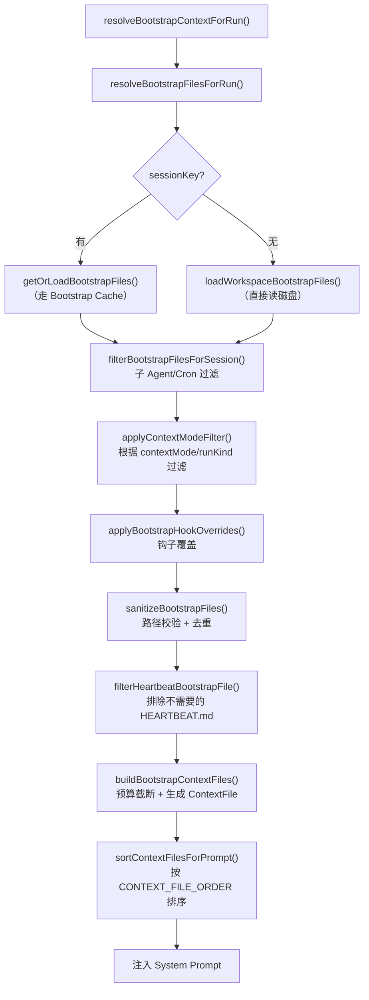

# 第 13 章：Bootstrap Files — SOUL.md 与文件驱动的 Agent 人格

读完本章，你将理解：

- OpenClaw 为什么选择 Markdown 文件（而非数据库或 API）来定义 Agent 的行为、人格和配置
- 7 个 Bootstrap File 各自的职责边界和加载顺序
- HEARTBEAT.md 的特殊地位——它不是 Bootstrap File，但被 heartbeat 机制单独读取
- `bootstrapMaxChars` 预算控制如何防止上下文窗口被 Bootstrap 内容撑爆
- Bootstrap Cache 的两层缓存设计和失效策略
- 编写高质量 SOUL.md 的实践建议

## 13.1 Workspace as Source of Truth

在大多数 Agent 框架中，Agent 的配置存储在数据库或 YAML 文件中，由后端管理界面操作。OpenClaw 做了一个不同的选择：**用 Workspace 目录下的 Markdown 文件作为 Agent 人格和行为的唯一真相源（Source of Truth）**。

这个决策背后有三层考量。

**第一，版本控制。** Workspace 目录本身就是一个 Git 仓库（`ensureAgentWorkspace` 会在新建 Workspace 时自动 `git init`）。SOUL.md 的每一次修改都有完整的 commit 历史。谁改了 Agent 的人格、什么时候改的、改了什么——全部可追溯。数据库方案要达到同样的审计能力，需要额外实现变更日志、版本快照等基础设施。

```typescript
// src/agents/workspace.ts:450-465
async function ensureGitRepo(dir: string, isBrandNewWorkspace: boolean) {
  if (!isBrandNewWorkspace) {
    return;
  }
  if (await hasGitRepo(dir)) {
    return;
  }
  if (!(await isGitAvailable())) {
    return;
  }
  try {
    await runCommandWithTimeout(["git", "init"], { cwd: dir, timeoutMs: 10_000 });
  } catch {
    // 忽略 git init 失败；Workspace 创建不应因此中断
  }
}
```

**第二，可迁移性。** 一个 Workspace 就是一个目录。把它复制到另一台机器上，Agent 的人格、工具配置、路由规则全都跟着走。不依赖外部数据库连接，不依赖特定的云服务。这对自托管（self-hosted）场景尤为重要。

**第三，可编辑性。** Markdown 是开发者最熟悉的格式。编辑 SOUL.md 不需要打开管理后台、不需要学习新的 DSL，用任何文本编辑器就行。Agent 甚至可以在对话过程中读取和修改自己的 Bootstrap Files——这构成了一种"自我进化"的可能性。

## 13.2 Bootstrap Files 全景

OpenClaw 定义了 8 个 Bootstrap File，每个文件对应一个明确的职责。它们在 `workspace.ts` 中以常量形式声明：

```typescript
// src/agents/workspace.ts:19-27
export const DEFAULT_AGENTS_FILENAME = "AGENTS.md";
export const DEFAULT_SOUL_FILENAME = "SOUL.md";
export const DEFAULT_TOOLS_FILENAME = "TOOLS.md";
export const DEFAULT_IDENTITY_FILENAME = "IDENTITY.md";
export const DEFAULT_USER_FILENAME = "USER.md";
export const DEFAULT_HEARTBEAT_FILENAME = "HEARTBEAT.md";
export const DEFAULT_BOOTSTRAP_FILENAME = "BOOTSTRAP.md";
export const DEFAULT_MEMORY_FILENAME = CANONICAL_ROOT_MEMORY_FILENAME;
```

下面逐一拆解。

### AGENTS.md — 路由规则

AGENTS.md 定义 Agent 的路由行为：哪些消息应该由哪个 Agent 处理，如何在多 Agent 之间分发请求。在单 Agent 场景下这个文件可以很简单，但在多 Agent 部署中它是流量调度的核心配置。

### SOUL.md — 人格与行为基线

SOUL.md 是整个 Bootstrap 系统中最核心的文件。它定义了 Agent "是谁"——语气、风格、行为边界、回答偏好。系统提示词在注入 SOUL.md 内容时，会附加一条明确的指令：

```typescript
// src/agents/system-prompt.ts:115-118
if (hasSoulFile) {
  lines.push(
    "If SOUL.md is present, embody its persona and tone. Avoid stiff, generic replies; follow its guidance unless higher-priority instructions override it.",
  );
}
```

这意味着 SOUL.md 的优先级低于系统层面的硬性指令（如安全策略），但高于 Agent 的默认行为模式。它建立的是"行为基线"而非"绝对命令"。

### IDENTITY.md — 结构化元数据

如果说 SOUL.md 是自由文本描述"我是谁"，IDENTITY.md 就是用结构化的 key-value 格式记录具体的身份属性。它支持 6 个字段：

```typescript
// src/agents/identity-file.ts:6-13
export type AgentIdentityFile = {
  name?: string;     // Agent 的名字
  emoji?: string;    // 签名 emoji，也用作消息确认的 reaction
  theme?: string;    // 主题色调
  creature?: string; // 角色设定（AI？机器人？幽灵？）
  vibe?: string;     // 气质（sharp？warm？chaotic？calm？）
  avatar?: string;   // 头像路径或 URL
};
```

`parseIdentityMarkdown` 函数从 Markdown 的列表格式中解析这些字段。它不是简单的正则匹配——它会跳过占位符值（如 "pick something you like"），标准化格式差异（去掉粗体标记、处理中文标点）：

```typescript
// src/agents/identity-file.ts:24-30
const IDENTITY_PLACEHOLDER_VALUES = new Set([
  "pick something you like",
  "ai? robot? familiar? ghost in the machine? something weirder?",
  "how do you come across? sharp? warm? chaotic? calm?",
  "your signature - pick one that feels right",
  "workspace-relative path, http(s) url, or data uri",
]);
```

IDENTITY.md 的信息不仅用于系统提示词。`identity.ts` 中的 `resolveAckReaction` 函数会读取 emoji 字段作为消息确认的 reaction，`resolveMessagePrefix` 会用 name 字段给回复添加前缀标识。这些信息直接影响 Agent 在各消息渠道中的"外观"。

### TOOLS.md — 工具声明

TOOLS.md 用于声明 Agent 可以使用的额外工具和能力。它不控制底层工具注册——那是 Tool System 的职责（见第 9 章）——而是为 Agent 提供上下文层面的工具使用指导。

### USER.md — 用户画像

USER.md 描述 Agent 的主要用户。它告诉 Agent 对话对象的背景、偏好、技术水平，帮助 Agent 调整回答的深度和风格。这是一种"静态上下文"，不随对话变化。

### BOOTSTRAP.md — 首次引导

BOOTSTRAP.md 是一个特殊的一次性文件。当 Workspace 刚创建时，它会触发一个引导流程——Agent 会按照 BOOTSTRAP.md 的内容与用户交互，收集必要的配置信息。一旦引导完成，BOOTSTRAP.md 会被删除，Workspace 的状态会标记为 `setupCompletedAt`。

```typescript
// src/agents/workspace.ts:277-284
if (params.state.bootstrapSeededAt && !bootstrapExists) {
  const completedState: WorkspaceSetupState = {
    ...params.state,
    setupCompletedAt: new Date().toISOString(),
  };
  await writeWorkspaceSetupState(params.statePath, completedState);
  return { repaired: true, bootstrapExists: false, state: completedState };
}
```

### MEMORY.md — 长期记忆索引

MEMORY.md 是 Memory 系统的根文件（详见第 15 章）。它只有在 Workspace 中存在精确匹配的文件时才会被加载——`exactWorkspaceEntryExists` 做了这个检查。

## 13.3 HEARTBEAT.md 的特殊地位

HEARTBEAT.md 在技术上属于 Bootstrap Files 的加载列表（`loadWorkspaceBootstrapFiles` 会读取它），但它的运行时行为与其他文件完全不同。

**在系统提示词中，HEARTBEAT.md 被归入"动态上下文文件"（Dynamic Context Files），放在 cache boundary 之后：**

```typescript
// src/agents/system-prompt.ts:55
const DYNAMIC_CONTEXT_FILE_BASENAMES = new Set(["heartbeat.md"]);
```

其他 Bootstrap Files 是静态的——一旦加载就固定在系统提示词的前部，享受 prompt cache 的缓存优化。HEARTBEAT.md 的内容经常变化（用户可能随时更新任务清单），放在 cache boundary 之后避免频繁的缓存失效。

**在 Session 过滤阶段，子 Agent 和 Cron 会话不会加载 HEARTBEAT.md：**

```typescript
// src/agents/workspace.ts:669-675
const MINIMAL_BOOTSTRAP_ALLOWLIST = new Set([
  DEFAULT_AGENTS_FILENAME,
  DEFAULT_TOOLS_FILENAME,
  DEFAULT_SOUL_FILENAME,
  DEFAULT_IDENTITY_FILENAME,
  DEFAULT_USER_FILENAME,
]);
```

HEARTBEAT.md 不在 `MINIMAL_BOOTSTRAP_ALLOWLIST` 中。子 Agent 会话和 Cron 会话调用 `filterBootstrapFilesForSession` 时，HEARTBEAT.md 会被过滤掉。

**在 lightweight 模式下，heartbeat run 只加载 HEARTBEAT.md：**

```typescript
// src/agents/bootstrap-files.ts:187-189
if (runKind === "heartbeat") {
  return params.files.filter((file) => file.name === "HEARTBEAT.md");
}
```

**对于非 heartbeat 的默认 Agent 会话，HEARTBEAT.md 可能被完全排除：** `shouldExcludeHeartbeatBootstrapFile` 会检查当前 Agent 是否启用了 heartbeat 功能——如果没启用，就没必要把 HEARTBEAT.md 的内容塞进系统提示词浪费 token。

## 13.4 加载顺序与优先级

Bootstrap Files 的最终呈现顺序由两个阶段决定：加载阶段和排序阶段。

**加载阶段**在 `loadWorkspaceBootstrapFiles` 中完成，文件按固定顺序逐个读取：

```
AGENTS.md → SOUL.md → TOOLS.md → IDENTITY.md → USER.md → HEARTBEAT.md → BOOTSTRAP.md → MEMORY.md
```

**排序阶段**在 `sortContextFilesForPrompt` 中完成，使用 `CONTEXT_FILE_ORDER` 映射表决定最终在系统提示词中的位置：

```typescript
// src/agents/system-prompt.ts:45-53
const CONTEXT_FILE_ORDER = new Map<string, number>([
  ["agents.md", 10],
  ["soul.md", 20],
  ["identity.md", 30],
  ["user.md", 40],
  ["tools.md", 50],
  ["bootstrap.md", 60],
  ["memory.md", 70],
]);
```

注意 HEARTBEAT.md 不在这个排序表中。它被归入动态上下文组，单独处理。

这个排序设计反映了一个优先级逻辑：**Agent 的路由规则（AGENTS.md）优先级最高，人格定义（SOUL.md）次之，身份元数据（IDENTITY.md）再次，然后是用户画像（USER.md）、工具声明（TOOLS.md），最后是引导文件和记忆索引。** 对 LLM 而言，系统提示词中越靠前的内容影响力越大。

整个 Bootstrap 加载流程如下图：



## 13.5 bootstrapMaxChars 预算控制

Bootstrap Files 的内容最终要注入 System Prompt。如果用户写了一个 5000 字的 SOUL.md 加上一个 3000 字的 TOOLS.md，上下文窗口的相当一部分就被占掉了。OpenClaw 用两个参数控制预算：

- **`bootstrapMaxChars`**：单个文件的最大字符数，默认 12,000
- **`bootstrapTotalMaxChars`**：所有 Bootstrap Files 的总字符数上限，默认 60,000

```typescript
// src/agents/pi-embedded-helpers/bootstrap.ts:87-88
export const DEFAULT_BOOTSTRAP_MAX_CHARS = 12_000;
export const DEFAULT_BOOTSTRAP_TOTAL_MAX_CHARS = 60_000;
```

这两个参数可以通过配置文件 `agents.defaults.bootstrapMaxChars` 和 `agents.defaults.bootstrapTotalMaxChars` 覆盖。

### 截断策略

当单个文件超过 `bootstrapMaxChars` 时，`trimBootstrapContent` 执行一个"保头保尾"的截断算法：

1. 计算 marker 模板的长度开销（类似 `[...truncated, read SOUL.md for full content...]`）
2. 将剩余预算按 **75:25** 的比例分配给 head 和 tail
3. 保留文件开头 75% 和结尾 25% 的内容，中间插入截断标记

```typescript
// src/agents/pi-embedded-helpers/bootstrap.ts:95-96
const BOOTSTRAP_HEAD_RATIO = 0.75;
const BOOTSTRAP_TAIL_RATIO = 0.25;
```

这个 75:25 的比例基于一个实际观察：Markdown 文件的核心定义通常在开头（标题、总述、主要指令），而结尾可能包含重要的补充说明或签名。中间部分往往是展开的细节，截断损失相对最小。

截断标记中会告诉 Agent 去读原始文件获取完整内容——Agent 拿到的是摘要版，但知道完整版在哪里，需要时可以自行读取。

**总预算控制**在 `buildBootstrapContextFiles` 中实现。它维护一个 `remainingTotalChars` 计数器，逐个处理文件。当剩余预算低于 64 字符时，后续文件直接跳过：

```typescript
// src/agents/pi-embedded-helpers/bootstrap.ts:306-310
if (remainingTotalChars < MIN_BOOTSTRAP_FILE_BUDGET_CHARS) {
  opts?.warn?.(
    `remaining bootstrap budget is ${remainingTotalChars} chars (<${MIN_BOOTSTRAP_FILE_BUDGET_CHARS}); skipping additional bootstrap files`,
  );
  break;
}
```

## 13.6 Bootstrap Cache：两层缓存设计

Bootstrap Files 的读取在每次 Agent Turn 都会发生——系统需要确认是否有文件变更。在高频对话场景下，反复读取磁盘文件会成为性能瓶颈。OpenClaw 用两层缓存解决这个问题。

### 第一层：文件内容缓存（inode/mtime 级别）

`readWorkspaceFileWithGuards` 在读取文件后，会用 `dev:ino:size:mtimeMs` 组合作为文件身份标识：

```typescript
// src/agents/workspace.ts:50-51
function workspaceFileIdentity(stat: syncFs.Stats, canonicalPath: string): string {
  return `${canonicalPath}|${stat.dev}:${stat.ino}:${stat.size}:${stat.mtimeMs}`;
}
```

如果文件的 inode、大小和修改时间都没变，直接返回缓存的内容，跳过 `readFileSync`。这一层的命中率很高——用户不会每轮对话都去改 SOUL.md。

### 第二层：Session 级别的 Bootstrap 快照

`bootstrap-cache.ts` 维护一个以 `sessionKey` 为 key 的 Map。每轮 Turn 调用 `getOrLoadBootstrapFiles` 时，它会先通过第一层缓存拿到文件内容，然后与上一轮的快照做深比较（`bootstrapFilesEqual`）。如果文件列表、路径、内容、missing 状态全部相同，直接返回旧的引用：

```typescript
// src/agents/bootstrap-cache.ts:30-48
export async function getOrLoadBootstrapFiles(params: {
  workspaceDir: string;
  sessionKey: string;
}): Promise<WorkspaceBootstrapFile[]> {
  const existing = cache.get(params.sessionKey);
  const files = await loadWorkspaceBootstrapFiles(params.workspaceDir);
  if (
    existing &&
    existing.workspaceDir === params.workspaceDir &&
    bootstrapFilesEqual(existing.files, files)
  ) {
    return existing.files;
  }
  cache.set(params.sessionKey, { workspaceDir: params.workspaceDir, files });
  return files;
}
```

### 缓存失效时机

两层缓存的失效策略不同：

- **第一层**：当文件的 `stat` 信息变化（修改时间、大小、inode）时，自动失效。如果文件被删除或无法访问，对应缓存条目被清除。
- **第二层**：当 Session 发生 rollover（会话翻转）时，通过 `clearBootstrapSnapshotOnSessionRollover` 主动清除。这确保新会话不会继承旧会话的 Bootstrap 快照。

这种设计的取舍很明确：它牺牲了极端实时性（文件修改后第一次 Turn 不一定立即反映，取决于 `stat` 的更新粒度），换取了每轮 Turn 的低延迟。

## 13.7 SOUL.md 编写实践

SOUL.md 是自由格式的 Markdown 文件，但有效的写法需要注意几个要点。

### 长度建议：200-500 词

SOUL.md 的默认单文件预算是 12,000 字符，但不建议写到极限。200-500 英文词（约 400-1000 中文字）是一个经过实践验证的区间。这个长度足够传达清晰的人格定义和行为边界，又不会在截断时丢失关键信息。

超过 1000 词的 SOUL.md 通常意味着混入了 TOOLS.md 或 AGENTS.md 应该承载的内容。如果发现自己在 SOUL.md 里写工具使用指南或路由规则，考虑拆分到对应的文件中。

### 结构建议

一个有效的 SOUL.md 通常包含以下部分：

```markdown
# 角色定位
一句话说清楚 Agent 是谁、做什么。

# 语气与风格
简明直接 / 学术严谨 / 轻松幽默 / 技术务实——选一个基调并坚持。

# 行为边界
明确列出"不做什么"比列出"做什么"更有效。
- 不要使用 emoji
- 不要输出超过 500 字的回答，除非被要求
- 遇到不确定的问题，说明不确定，不要编造

# 领域知识
Agent 应该具备或假设的专业背景。不需要详尽——点到为止。
```

### 关键原则

**具体优于抽象。** "回答风格简洁直接" 比 "保持专业" 有效得多。LLM 对具体的行为指令执行得更好。

**禁止项比要求项更有效。** 人格描述中，明确的"不做什么"比模糊的"做什么"更能约束 Agent 行为。

**不要重复系统提示词已有的内容。** OpenClaw 的系统提示词已经包含了安全策略、工具使用规范等硬性指令。SOUL.md 的价值在于补充人格和领域特色，不是重复框架级别的约束。

## 13.8 文件驱动配置的优势

把所有 Agent 配置放在 Workspace 文件中，带来三个工程上的好处。

**可审计（Auditable）。** 每个 Bootstrap File 都有 Git 历史。当 Agent 行为异常时，可以 `git log SOUL.md` 回溯最近的变更。在合规要求严格的场景中，这种可追溯性不需要额外基础设施。

**可迁移（Portable）。** 一个 Workspace 目录就是 Agent 的完整定义。`scp -r workspace/ new-server:` 就完成了迁移。不需要数据库导出、不需要 API 密钥迁移脚本。

**可协作（Collaborative）。** SOUL.md 可以像代码一样做 Code Review。团队成员对 Agent 人格的调整以 Pull Request 的形式提交，经过 review 后合并。这把 "prompt engineering" 从个人技艺提升为团队工程实践。

OpenClaw 的 Workspace State 管理（`.openclaw/workspace-state.json`）也值得一提。它记录了 Bootstrap 的种子时间和完成时间，作为 Workspace 生命周期的元数据，但不干预 Bootstrap Files 本身的内容。状态归状态，内容归内容——职责分离干净利落。

## 本章小结

Bootstrap Files 是 OpenClaw 的"文件即配置"哲学的核心体现。7 个 Markdown 文件加上 1 个特殊的 HEARTBEAT.md，覆盖了 Agent 定义的全部维度：路由、人格、身份、用户、工具、引导、记忆。

这套设计的核心权衡是：**用文件系统的简单性换取了版本控制、可迁移、可审计的工程属性，代价是失去了数据库方案的查询能力和实时更新能力。** 对于一个以 Workspace 为中心的 Agent 系统，这个取舍合理——Agent 的人格定义不需要毫秒级更新，也不需要跨实例的分布式查询。

下一章将介绍 Skills 系统——另一种文件驱动的能力扩展机制。

## 练习

**思考题**

1. Bootstrap Files 中 `SOUL.md` 定义 Agent 的人格和行为准则，`AGENTS.md` 定义消息路由规则。这两个文件的内容都会注入到 System Prompt 中。如果一个用户在 `SOUL.md` 中写了与 `AGENTS.md` 矛盾的指令（比如 SOUL.md 说"回复所有消息"，AGENTS.md 说"只回复 @mention 的消息"），哪个优先？OpenClaw 的加载顺序是如何决定这种冲突的解决方式的？

**动手题**

2. 在一个测试 workspace 中创建完整的 7 个 Bootstrap Files（SOUL.md、AGENTS.md、IDENTITY.md、USER.md、TOOLS.md、BOOTSTRAP.md、MEMORY.md），每个文件写入 2-3 行简短的指令。启动 OpenClaw，通过对话验证每个文件的内容是否生效。然后删除其中一个文件（比如 IDENTITY.md），观察 Agent 行为是否发生变化。

3. 编写一个超大的 `SOUL.md`（超过 `bootstrapMaxChars` 预算），观察 OpenClaw 的截断行为。通过日志或调试确认哪些内容被保留、哪些被丢弃，验证截断策略是否符合本章描述的优先级规则。
