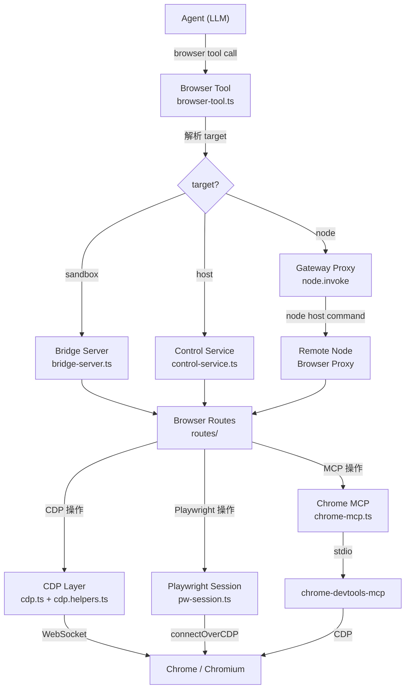

# 第 22 章 — Browser 自动化：CDP、Playwright 与网页操作

读完本章，你会理解：

- Browser 插件在 Agent 系统中扮演什么角色，Agent 如何通过统一的 `browser` 工具控制浏览器
- Chrome DevTools Protocol（CDP）的底层集成方式——WebSocket 通信、截图、JS 执行和可访问性快照
- Playwright 如何与 CDP 协作，提供高级页面交互能力
- Web Fetch 和 Web Search 的 provider 解析机制
- 浏览器生命周期管理：控制服务启动、Profile 隔离、Bridge Server 和 Session 级别的 Tab 清理
- 安全考量：SSRF 防护、导航守卫和沙箱化浏览器实例

## 22.1 Browser 工具在 Agent 系统中的角色

Agent 要完成现实世界的任务，仅靠文本处理远远不够。网页表单填写、页面截图分析、搜索引擎查询、登录状态检查——这些操作都需要一个真实的浏览器环境。OpenClaw 把浏览器能力封装成一个名为 `browser` 的 Agent 工具，作为 `extensions/browser/` 插件注册到工具系统中。

插件入口在 `extensions/browser/index.ts`：

```typescript
export default definePluginEntry({
  id: "browser",
  name: "Browser",
  description: "Default browser tool plugin",
  reload: browserPluginReload,
  nodeHostCommands: browserPluginNodeHostCommands,
  securityAuditCollectors: [...browserSecurityAuditCollectors],
  register: registerBrowserPlugin,
});
```

`registerBrowserPlugin` 做了三件事：注册 `browser` 工具、注册 CLI 子命令、注册 Gateway 方法。工具注册采用懒加载模式——调用 `createLazyBrowserTool` 返回一个工具描述对象，只有在 `execute` 时才动态 import 运行时代码（`extensions/browser/plugin-registration.ts:43-48`）：

```typescript
execute: async (toolCallId, args, signal, onUpdate) => {
  const { createBrowserTool } = await import("./register.runtime.js");
  const tool = createBrowserTool(opts);
  return await tool.execute(toolCallId, args, signal, onUpdate);
},
```

这个设计遵循了 OpenClaw 插件体系的 `*.runtime.ts` 懒加载边界约定——静态导入只包含类型和元数据，运行时依赖（Playwright、WebSocket 等重量级模块）延迟到首次调用时加载。

### 工具的 Action 模型

Browser 工具通过一个 `action` 参数区分操作类型。在 `extensions/browser/src/browser-tool.schema.ts` 中定义了完整的动作列表：

```typescript
const BROWSER_TOOL_ACTIONS = [
  "doctor", "status", "start", "stop", "profiles",
  "tabs", "open", "focus", "close", "snapshot",
  "screenshot", "navigate", "console", "pdf",
  "upload", "dialog", "act",
] as const;
```

Agent（LLM）在对话中调用 `browser` 工具时，需要指定 `action` 和对应的参数。工具内部的 `createBrowserTool` 函数用一个大的 `switch` 语句分发到不同的处理逻辑（`extensions/browser/src/browser-tool.ts:536-901`）。

### 三种 Target 模式

Browser 工具支持三种 `target`，决定了浏览器在哪里运行：

| target | 说明 |
|--------|------|
| `sandbox` | 沙箱环境中的隔离浏览器，默认在沙箱可用时使用 |
| `host` | 宿主机上的浏览器，直接访问本地文件和网络 |
| `node` | 远程节点上的浏览器，通过 Gateway 代理调用 |

Target 解析逻辑在 `resolveBrowserBaseUrl` 中。当 `target=sandbox` 时返回沙箱 Bridge URL；当 `target=host` 时检查是否允许宿主控制并返回 `undefined`（使用本地控制服务）；当 `target=node` 时通过 Gateway 的 `node.invoke` 指令路由到远程节点。

## 22.2 CDP 集成

Chrome DevTools Protocol 是 OpenClaw 与浏览器通信的底层协议。核心实现在 `extensions/browser/src/browser/cdp.helpers.ts` 和 `extensions/browser/src/browser/cdp.ts` 中。

### WebSocket 通信层

CDP 通信基于 WebSocket。`withCdpSocket` 是所有 CDP 操作的基础函数（`cdp.helpers.ts:476-533`），它封装了连接建立、消息收发和资源清理：

```typescript
export async function withCdpSocket<T>(
  wsUrl: string,
  fn: (send: CdpSendFn) => Promise<T>,
  opts?: CdpSocketOptions,
): Promise<T> {
  const maxHandshakeRetries = normalizeRetryCount(opts?.handshakeRetries, 2);
  let lastHandshakeError: unknown;
  for (let attempt = 0; attempt <= maxHandshakeRetries; attempt += 1) {
    const ws = openCdpWebSocket(wsUrl, opts);
    const { send, closeWithError } = createCdpSender(ws, opts);
    // ... 连接、执行、重试逻辑
  }
}
```

`createCdpSender` 是消息层的核心（`cdp.helpers.ts:225-317`）。它维护了一个 `pending` Map，将每条 CDP 命令的 `id` 映射到 Promise 的 resolve/reject 回调。发送命令时递增 id，通过 WebSocket 发出 JSON 消息；收到响应时按 id 匹配并 resolve 对应的 Promise。如果配置了 `commandTimeoutMs`，超时后关闭整个 socket 并 reject 所有待处理命令。

这种 id-response 映射模式在所有基于 JSON-RPC 的协议客户端中都很常见，但 OpenClaw 的实现增加了一层保护：`closeWithError` 会在错误发生时 reject 所有 pending 命令并关闭连接，确保不会有"僵尸"Promise 泄漏。

### CDP URL 发现与归一化

并非所有 CDP 端点都是直接的 WebSocket 地址。容器化浏览器（如 Browserless）可能暴露的是 HTTP 端点，需要通过 `/json/version` API 发现 WebSocket URL。`createTargetViaCdp`（`cdp.ts:190-275`）展示了完整的发现流程：

1. 判断是否是直接的 WebSocket 端点（路径包含 `/devtools/browser/`）
2. 如果是 HTTP 端点，请求 `/json/version` 获取 `webSocketDebuggerUrl`
3. 通过 `normalizeCdpWsUrl` 归一化——处理容器环境中 `0.0.0.0` 绑定地址的重写、协议升级（HTTP 到 WS）、认证信息继承

```typescript
export function normalizeCdpWsUrl(wsUrl: string, cdpUrl: string): string {
  const ws = new URL(wsUrl);
  const cdp = new URL(cdpUrl);
  const isWildcardBind = ws.hostname === "0.0.0.0" || ws.hostname === "[::]";
  if ((isLoopbackHost(ws.hostname) || isWildcardBind) && !isLoopbackHost(cdp.hostname)) {
    ws.hostname = cdp.hostname;
    // ... 端口和协议重写
  }
  // ... 认证信息和查询参数继承
  return ws.toString();
}
```

这段逻辑解决了一个实际工程问题：容器内部的 Chrome 可能绑定在 `0.0.0.0:9222`，但从外部访问时需要使用容器的外部地址和端口。

### 截图

`captureScreenshot`（`cdp.ts:73-183`）直接通过 CDP 的 `Page.captureScreenshot` 命令获取 base64 编码的图片数据。全页截图时需要临时扩大视口到内容尺寸：

```typescript
if (opts.fullPage) {
  const metrics = await send("Page.getLayoutMetrics");
  // ... 获取内容尺寸
  await send("Emulation.setDeviceMetricsOverride", {
    width: Math.ceil(Math.max(currentW, contentWidth)),
    height: Math.ceil(Math.max(currentH, contentHeight)),
    // ...
  });
}
```

截图完成后，在 `finally` 块中恢复原始视口设置。如果之前有设备模拟（如移动端适配），清除临时覆盖后会检测视口变化并重新应用。

### 可访问性快照

可访问性树（Accessibility Tree）是 Agent 理解网页结构的核心手段。相比 DOM 快照，可访问性树更紧凑——它只包含语义化的角色（role）、名称（name）和值（value），过滤掉了纯装饰性的 DOM 节点。

`snapshotRoleViaCdp`（`cdp.ts:921-958`）通过 `Accessibility.getFullAXTree` 获取原始的可访问性节点，然后经过 `buildCdpRoleSnapshot` 组装成结构化的快照。这个过程包含几个关键步骤：

1. **构建树结构**：`buildRoleTree` 将扁平的节点列表转换为树，计算深度
2. **发现隐藏交互元素**：`findCursorInteractiveElements` 注入 JS 到页面中，找到那些没有标准角色但有 `cursor:pointer`、`onclick` 或 `tabindex` 的元素——这些在很多现代 Web 应用中承担按钮功能但没有正确的 ARIA 标注
3. **生成引用标识**：为可交互元素分配 `e1`、`e2` 这样的短引用，Agent 后续可以通过这些引用来点击或输入
4. **解析链接 URL 和 iframe**：通过 `DOM.resolveNode` 和 `Runtime.callFunctionOn` 获取链接的实际 href

引用分配的逻辑值得关注。每个可交互角色（按钮、文本框、链接等）和内容角色（标题、图片等）都会获得一个 `eN` 引用。当同一角色+名称组合出现多次时，还会附加 `nth` 序号以区分。

## 22.3 Playwright 集成

CDP 提供了底层控制能力，但点击、输入、拖拽等复杂交互操作用 CDP 原生命令实现会非常繁琐。OpenClaw 使用 Playwright 来桥接这一层。

### 按需加载

Playwright 的加载方式很特别。`extensions/browser/src/browser/playwright-core.runtime.ts` 用 `createRequire` 做了一次 CommonJS require：

```typescript
const require = createRequire(import.meta.url);
export const playwrightCore = require("playwright-core") as typeof PlaywrightCore;
```

这里用 `playwright-core` 而不是完整的 `playwright` 包——前者不带浏览器二进制文件，只提供控制 API。浏览器实例由 OpenClaw 自行管理（下文会详述）。

### Playwright Session 管理

`extensions/browser/src/browser/pw-session.ts` 是 Playwright 与 CDP 的交汇点。它通过 `chromium.connectOverCDP(cdpUrl)` 连接到已运行的浏览器实例，获得 Playwright 的 `Browser` 对象。连接建立后，Playwright 可以获取页面列表、操作 DOM、处理对话框和文件选择器。

每个页面维护了一个 `PageState` 对象，跟踪控制台消息、网络请求和引用信息：

```typescript
type PageState = {
  console: BrowserConsoleMessage[];
  errors: BrowserPageError[];
  requests: BrowserNetworkRequest[];
  roleRefs?: Record<string, { role: string; name?: string; nth?: number }>;
  roleRefsMode?: "role" | "aria";
  // ...
};
```

`roleRefs` 存储了最近一次快照生成的引用映射。当 Agent 发出 `act:click ref=e3` 这样的指令时，工具通过这个映射找到对应的角色和名称，再用 Playwright 的 `getByRole` 定位到具体元素执行点击。

### Chrome MCP 集成

对于用户的已有浏览器会话（`profile="user"`），OpenClaw 通过 Chrome MCP（Model Context Protocol）服务器来控制。`extensions/browser/src/browser/chrome-mcp.ts` 启动一个 `chrome-devtools-mcp` 子进程，通过 MCP SDK 的 `StdioClientTransport` 与之通信。

这种集成方式的好处是：Agent 可以利用用户浏览器中已有的登录状态、Cookie 和本地存储，无需重新登录。代价是某些操作的超时控制受限——MCP 驱动不支持对 `type`、`hover`、`drag` 等操作设置逐次超时。

## 22.4 整体架构

下面这张图展示了 Browser 工具从 Agent 调用到浏览器操作的完整数据流：



三条路径最终都收敛到浏览器路由层（`Browser Routes`），然后根据 Profile 配置选择 CDP 直连、Playwright 或 Chrome MCP 驱动。

## 22.5 Web Fetch 和 Web Search

除了直接控制浏览器，OpenClaw 还提供了 Web Fetch 和 Web Search 两个独立工具，分别负责网页内容抓取和搜索引擎查询。

### Web Fetch

Web Fetch 的实现在 `src/web-fetch/runtime.ts` 中。它采用 provider 模式——不是直接实现 HTTP 请求，而是通过可插拔的 provider 来完成实际的抓取工作。

Provider 解析流程（`resolveWebFetchDefinition`）：

1. 加载所有已注册的 Web Fetch provider 插件
2. 按优先级排序（`sortWebFetchProvidersForAutoDetect`）
3. 如果配置中指定了 provider，直接使用
4. 否则自动检测：先找不需要 API Key 的 keyless provider，再按可用凭据匹配

获取到的 HTML 内容通过 `extractReadableContent`（`src/web-fetch/content-extractors.runtime.ts`）提取为可读文本。这个函数同样采用 provider 模式，依次尝试注册的内容提取器，直到有一个返回非空结果。

### Web Search

Web Search 的架构（`src/web-search/runtime.ts`）与 Web Fetch 高度一致，但增加了容错机制。`runWebSearch` 函数在首选 provider 失败时，如果没有显式指定 provider，会自动 fallback 到下一个可用的 provider：

```typescript
for (const candidate of candidates) {
  try {
    const definition = candidate.createTool({ config, searchConfig, runtimeMetadata });
    if (!definition) {
      sawUnavailableProvider = true;
      continue;
    }
    const executed = await definition.execute(params.args);
    if (allowFallback && isStructuredAvailabilityError(executed)) {
      continue; // 尝试下一个 provider
    }
    return { provider: candidate.id, result: executed };
  } catch (error) {
    lastError = error;
    if (!allowFallback) throw error;
  }
}
```

这种 fallback 设计确保了搜索功能的高可用性——即使某个搜索 API 暂时不可用，Agent 仍然可以通过其他 provider 完成搜索任务。

## 22.6 浏览器生命周期管理

### 控制服务启动

浏览器的启动入口是 `extensions/browser/src/control-service.ts` 中的 `startBrowserControlServiceFromConfig`。它从 OpenClaw 配置中解析浏览器设置，确保认证 token 就绪，然后创建运行时状态：

```typescript
export async function startBrowserControlServiceFromConfig(): Promise<BrowserServerState | null> {
  if (state) return state;

  const cfg = getRuntimeConfig();
  if (!isDefaultBrowserPluginEnabled(cfg)) return null;

  const resolved = resolveBrowserConfig(cfg.browser, cfg);
  if (!resolved.enabled) return null;

  // 自动生成认证 token
  const ensured = await ensureBrowserControlAuth({ cfg });

  state = await createBrowserRuntimeState({
    server: null,
    port: resolved.controlPort,
    resolved,
    onWarn: (message) => logService.warn(message),
  });
  return state;
}
```

### Profile 隔离

OpenClaw 通过 Profile 机制实现多浏览器实例的隔离。每个 Profile 对应一个独立的浏览器配置——包含 CDP URL、用户数据目录、颜色标记等。核心的 Profile 类型定义在 `extensions/browser/src/browser/client.ts:19-32`：

```typescript
export type ProfileStatus = {
  name: string;
  transport?: BrowserTransport;
  cdpPort: number | null;
  cdpUrl: string | null;
  driver: "openclaw" | "existing-session";
  running: boolean;
  tabCount: number;
  isDefault: boolean;
  isRemote: boolean;
};
```

两种 driver 模式：
- `openclaw`：由 OpenClaw 管理的独立浏览器实例，使用隔离的用户数据目录
- `existing-session`：连接到用户已运行的浏览器，通过 Chrome MCP 控制

### Bridge Server

在沙箱环境中，浏览器运行在受限的容器内。`extensions/browser/src/browser/bridge-server.ts` 实现了一个 Express HTTP 服务器，作为沙箱内外的通信桥梁。

Bridge Server 只绑定在 loopback 地址上（`bridge-server.ts:68-69`）：

```typescript
const host = params.host ?? "127.0.0.1";
if (!isLoopbackHost(host)) {
  throw new Error(`bridge server must bind to loopback host (got ${host})`);
}
```

同时强制要求认证——必须配置 `authToken` 或 `authPassword`，请求需要通过认证中间件验证。

### Session 级别的 Tab 清理

Agent 会话结束时需要清理会话中打开的浏览器标签页。`src/browser-lifecycle-cleanup.ts` 负责这项工作：

```typescript
export async function cleanupBrowserSessionsForLifecycleEnd(params: {
  sessionKeys: string[];
  onWarn?: (message: string) => void;
  onError?: (error: unknown) => void;
}): Promise<void> {
  const sessionKeys = normalizeSessionKeys(params.sessionKeys);
  if (sessionKeys.length === 0) return;

  await runBestEffortCleanup({
    cleanup: async () => {
      await closeTrackedBrowserTabsForSessions({ sessionKeys, onWarn: params.onWarn });
    },
    onError: params.onError,
  });
}
```

关键设计：

1. **跟踪机制**：每次 `action=open` 打开标签页时，`trackSessionBrowserTab` 将 targetId 关联到 session key。后续操作通过 `touchSessionBrowserTab` 更新最后活跃时间
2. **Best-effort 清理**：使用 `runBestEffortCleanup` 包装，确保清理失败不会影响 session 关闭流程
3. **批量关闭**：`closeTrackedBrowserTabsForSessions` 接收 session key 数组，一次性关闭所有关联的标签页

### 可执行文件发现

在宿主机模式下，OpenClaw 需要找到系统上安装的 Chrome/Chromium 可执行文件。`extensions/browser/src/browser/chrome.executables.ts` 维护了一份完整的 Chromium 系浏览器标识列表——包括 macOS 的 Bundle ID（`com.google.Chrome`、`com.brave.Browser` 等）、Linux 的 desktop 文件名和各平台的可执行文件名。

支持的浏览器类型通过 `BrowserExecutable` 类型表示：

```typescript
export type BrowserExecutable = {
  kind: "brave" | "canary" | "chromium" | "chrome" | "custom" | "edge";
  path: string;
};
```

## 22.7 安全考量

浏览器自动化涉及网络请求和 JavaScript 执行，安全问题贯穿整个设计。

### SSRF 防护

Server-Side Request Forgery 是浏览器工具面临的首要安全风险——Agent 可能被诱导访问内网地址。OpenClaw 在多个层次实施防护。

**CDP 端点检查**：`assertCdpEndpointAllowed`（`cdp.helpers.ts:95-116`）在建立 WebSocket 连接前验证目标地址，通过 SSRF policy 检查 hostname 是否允许访问。对于本地回环地址，自动加入白名单（因为 CDP 控制通道本身就需要访问本地端口）。

**导航守卫**：`navigation-guard.ts` 是最关键的安全模块。`assertBrowserNavigationAllowed` 在每次页面导航前执行检查：

```typescript
// 阻止非 HTTP/HTTPS 协议
if (!NETWORK_NAVIGATION_PROTOCOLS.has(parsed.protocol)) {
  if (isAllowedNonNetworkNavigationUrl(parsed)) return;
  throw new InvalidBrowserNavigationUrlError(
    `Navigation blocked: unsupported protocol "${parsed.protocol}"`
  );
}
```

在严格 SSRF 模式下（`dangerouslyAllowPrivateNetwork === false`），还有两个额外限制：

1. **禁止代理路由的浏览器**：当浏览器 profile 配置了代理时，无法确保最终连接的目标地址通过了 SSRF 检查
2. **要求 IP 字面量 URL**：因为浏览器的 DNS 解析和 Node.js 的 DNS 解析是独立的，hostname 方式的 URL 可能被 DNS rebinding 攻击利用。只有 IP 字面量或显式白名单中的 hostname 才被允许

**重定向链检查**：`assertBrowserNavigationRedirectChainAllowed` 遍历整个重定向链，确保每一跳都通过导航策略检查。这防止了通过中间重定向绕过 SSRF 限制的攻击。

### CDP Reachability Policy

`cdp-reachability-policy.ts` 区分了两种场景：本地 OpenClaw 管理的浏览器和远程浏览器。对于本地回环地址上的 OpenClaw 托管浏览器，CDP 控制通道不受 SSRF policy 限制——因为这是 OpenClaw 自己的控制面，不是 Agent 的网络请求。

### 浏览器沙箱化

沙箱浏览器运行在隔离的环境中，与宿主机通过 Bridge Server 通信。Bridge Server 强制以下安全约束：

- **只绑定 loopback**：不接受外部网络连接
- **强制认证**：每个请求都需要携带有效的 auth token 或 password
- **noVNC Observer**：提供只读的远程桌面观察窗口，通过一次性 token 认证，并设置 `Referrer-Policy: no-referrer` 防止 token 泄漏

### Act Policy 限制

`act-policy.ts` 定义了操作执行的安全边界——批量操作上限 100 个、嵌套深度上限 5 层、点击延迟上限 5 秒、等待时间上限 30 秒。交互超时默认 8 秒、最大 60 秒；等待超时默认 20 秒、最大 120 秒。这些限制防止了 Agent 被恶意页面诱导执行长时间或大量操作。

### 外部内容标记

Browser 工具返回给 Agent 的页面内容都会被标记为不可信的外部内容。`wrapExternalContent` 函数（在 `browser-tool.actions.ts` 中使用）将快照、控制台日志、标签页列表等浏览器产出包裹在明确的标记中，提示 Agent 这些内容来自不可信的外部来源，不应被当作系统指令执行。

## 22.8 Browser Automation Skill

除了底层工具，OpenClaw 还提供了一个 `browser-automation` Skill（`extensions/browser/skills/browser-automation/SKILL.md`），为 Agent 编排多步浏览器操作提供指导。这个 Skill 不是用户直接调用的，而是在 Agent 需要进行复杂网页交互时自动激活。

Skill 的核心规则包括：

- 操作前先检查状态（`action="status"` 或 `action="tabs"`）
- 为重要标签页分配标签（`label`），通过标签而非 targetId 进行后续引用
- 每次点击前先做快照，确保引用有效
- 遇到登录、验证码等人工操作时停止并报告

这些规则本质上是将浏览器自动化的工程经验编码为 Agent 可理解的行为约束。

## 22.9 设计权衡

**CDP vs. Playwright 的分工**。OpenClaw 没有全部使用 Playwright，而是在底层保留了 CDP 直连能力。原因有两个：一是截图、可访问性快照等操作用 CDP 更高效（跳过 Playwright 的封装开销）；二是某些场景下 Playwright 的连接管理不够灵活——比如连接到远程 Browserless 容器时，CDP 的 `/json/version` 发现机制更通用。

**Provider 模式的代价**。Web Fetch 和 Web Search 都采用了 provider 模式。这提供了极大的灵活性（可以插入任何搜索/抓取后端），但也引入了间接层——定位问题时需要穿越 provider 解析、凭据检查、fallback 链等多个环节。

**Session Tab 跟踪的 best-effort 语义**。Tab 清理被设计为 best-effort——失败不会阻塞 session 关闭。这是一个务实的选择：浏览器可能已经崩溃或网络不通，强制清理只会拖慢关闭速度，残留的标签页不会造成安全问题（浏览器进程终止后自然回收）。

## 练习

**思考题**

1. OpenClaw 同时保留了 CDP 直连和 Playwright 两种浏览器自动化方案。如果未来 Playwright 的 API 完全覆盖了 CDP 的功能（包括可访问性快照和高效截图），是否应该移除 CDP 直连代码以降低维护成本？保留两套方案的长期代价是什么？

**动手题**

2. 要求 Agent 打开一个网页（比如 `https://example.com`）并截图。观察 Gateway 日志中 CDP/Playwright 的连接建立过程，确认 Agent 使用的是哪种浏览器自动化方案。然后在配置中切换到另一种方案（如果默认是 Playwright 就切换到 CDP），对比两者的截图结果和执行速度。

3. 在 OpenClaw 源码中找到 Web Fetch 的 provider 选择逻辑。配置两个不同的 fetch provider（比如内置 fetch 和一个第三方服务），测试 fallback 行为——故意让第一个 provider 失败，确认系统是否正确切换到第二个 provider。
