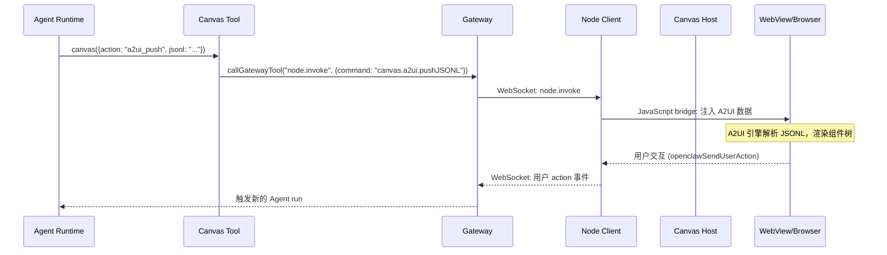
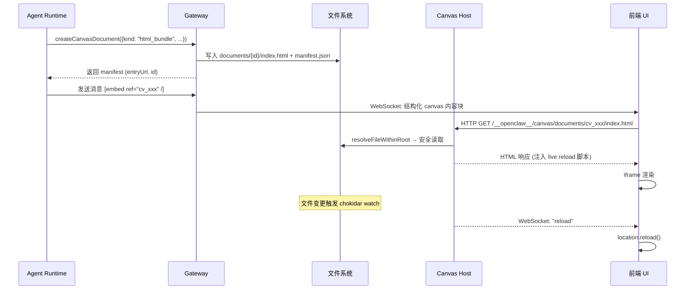

# 第 20 章 Canvas 与 A2UI：Agent 驱动的可视化界面

读完这章，你能掌握：Canvas 作为独立进程隔离于 Gateway 的架构设计及其安全考量；A2UI（Agent-to-User Interface）协议如何让 Agent 直接驱动用户界面渲染；从 Agent 调用 canvas 工具到浏览器最终渲染的完整数据流；Capability Token 机制如何在不暴露 Gateway 凭据的前提下授权 Canvas 访问；以及 Canvas Document 的文件系统布局与 Manifest 管理。

## 20.1 为什么需要 Canvas

传统的 Agent 交互方式是纯文本对话：用户发消息，Agent 回复文本。但很多场景下，文本不够用。Agent 生成了一份数据可视化图表，用纯文本描述远不如直接展示一个交互式 HTML 页面；Agent 构建了一个表单让用户填写，用自然语言引导逐项输入远不如渲染一个真正的 UI 组件。

Canvas 就是 OpenClaw 为这类需求提供的解决方案：一个 Agent 可控的可视化画布。Agent 可以在上面展示 HTML 页面、推送 A2UI 组件、执行 JavaScript、截取快照。它本质上是一个嵌入式 WebView，macOS 上用 WKWebView 实现，Android 上用 Android WebView，桌面端通过独立的 HTTP 服务提供内容。

Canvas 的核心设计思路很明确：Agent 是 UI 的驱动者，而不仅仅是文本的生成者。

## 20.2 Canvas 的双重宿主架构

Canvas 内容的服务有两条路径，这个双重架构是理解后续所有设计的基础。

**路径一：Gateway 内嵌模式。** Canvas 的 HTTP 请求处理器（`CanvasHostHandler`）直接挂载在 Gateway HTTP 服务器上。所有 Canvas 相关的路径（`/__openclaw__/canvas/`、`/__openclaw__/a2ui/`、`/__openclaw__/ws`）由 Gateway 的请求管道统一处理。这是大多数部署场景下的默认模式。

**路径二：独立端口模式。** 通过 `startCanvasHost()` 启动一个独立的 HTTP 服务器，默认监听端口 18793。这个独立服务器有自己的 HTTP 监听循环和 WebSocket 升级处理。

```typescript
// src/config/port-defaults.ts:17
export const DEFAULT_CANVAS_HOST_PORT = 18793;

export function deriveDefaultCanvasHostPort(gatewayPort: number): number {
  return derivePort(gatewayPort, 4, DEFAULT_CANVAS_HOST_PORT);
}
```

端口号的设计遵循 OpenClaw 的端口派生规则：Bridge 是 Gateway + 1（18790），Browser Control 是 Gateway + 2（18791），Canvas 是 Gateway + 4（18793）。这种线性偏移让运维人员一眼就能看出各服务的归属关系。

两种模式可以共存。当 `canvasHost.port` 被配置时，独立服务器启动；同时 Gateway 上的 Canvas 路由仍然可用。客户端在 WebSocket 连接建立时会收到 `canvasHostUrl`，指向实际的 Canvas 服务地址：

```typescript
// src/gateway/server/ws-connection.ts:207-215
const canvasHostPortForWs = canvasHostServerPort ?? (canvasHostEnabled ? port : undefined);
const canvasHostOverride =
  gatewayHost && gatewayHost !== "0.0.0.0" && gatewayHost !== "::" ? gatewayHost : undefined;
const canvasHostUrl = resolveCanvasHostUrl({
  canvasPort: canvasHostPortForWs,
  hostOverride: canvasHostServerPort ? canvasHostOverride : undefined,
  requestHost: upgradeReq.headers.host,
  forwardedProto: upgradeReq.headers["x-forwarded-proto"],
  localAddress: upgradeReq.socket?.localAddress,
});
```

如果配置了独立端口，`canvasHostUrl` 会指向那个端口；否则指向 Gateway 本身。客户端（iOS/Android/Web）根据这个 URL 决定从哪里加载 Canvas 内容。

## 20.3 安全隔离：Capability Token 机制

Canvas 面临一个有意思的安全问题：Canvas 内容在 WebView 中渲染，WebView 里运行的 JavaScript 是 Agent 动态生成的。如果这些 JavaScript 能直接访问 Gateway 的认证凭据，就等于给了 Agent 生成的代码完全的 Gateway 控制权。

OpenClaw 的解决方案是 **Capability Token**——一种范围受限、时效短暂的访问令牌。

```typescript
// src/gateway/canvas-capability.ts:5-6
export const CANVAS_CAPABILITY_PATH_PREFIX = "/__openclaw__/cap";
export const CANVAS_CAPABILITY_TTL_MS = 10 * 60_000; // 10 分钟
```

Capability Token 的生命周期：

1. **铸造（Mint）**：客户端连接 Gateway 后，调用 `node.canvas.capability.refresh` RPC 方法，Gateway 用 `randomBytes(18).toString("base64url")` 生成一个 24 字符的随机令牌。
2. **下发**：令牌和一个 scoped URL 一起返回给客户端。scoped URL 把令牌编码在路径中：`/__openclaw__/cap/{token}/...`。
3. **验证**：Canvas 的每个 HTTP 请求和 WebSocket 升级都会经过 `authorizeCanvasRequest`，检查请求中的 Capability Token 是否有效。
4. **过期**：10 分钟后令牌失效，客户端需要重新刷新。

```typescript
// src/gateway/canvas-capability.ts:20-22
export function mintCanvasCapabilityToken(): string {
  return randomBytes(18).toString("base64url");
}
```

URL scoping 的具体实现值得一看。`normalizeCanvasScopedUrl` 从请求路径中提取令牌，重写 URL 为实际的 Canvas 路径，并把令牌注入到 query parameter 中：

```typescript
// src/gateway/canvas-capability.ts:42-86
export function normalizeCanvasScopedUrl(rawUrl: string): NormalizedCanvasScopedUrl {
  const url = new URL(rawUrl, "http://localhost");
  const prefix = `${CANVAS_CAPABILITY_PATH_PREFIX}/`;
  // ...
  if (url.pathname.startsWith(prefix)) {
    scopedPath = true;
    const remainder = url.pathname.slice(prefix.length);
    const slashIndex = remainder.indexOf("/");
    // 提取 token 和实际路径
    const encodedCapability = remainder.slice(0, slashIndex);
    const canonicalPath = remainder.slice(slashIndex) || "/";
    // 重写 URL，把 token 放入 query param
    url.pathname = canonicalPath;
    url.searchParams.set(CANVAS_CAPABILITY_QUERY_PARAM, capabilityFromPath);
    rewrittenUrl = `${url.pathname}${url.search}`;
  }
  // ...
}
```

关键点在于：WebView 中的 JavaScript 只能看到 scoped URL，而不是 Gateway 的认证 token。即使 Canvas 中的恶意代码尝试访问 Gateway 的其他端点，它手里只有一个范围受限、10 分钟过期的 Capability Token。

## 20.4 Canvas Host 服务的内部实现

Canvas Host 的核心是一个标准的 Node.js HTTP 服务器，外加文件服务和 WebSocket 实时重载两部分功能。

### 文件服务与安全沙箱

文件服务逻辑集中在 `file-resolver.ts`。每个文件请求都要通过 `resolveFileWithinRoot` 检查，确保请求的路径不会逃逸出 Canvas 根目录：

```typescript
// src/canvas-host/file-resolver.ts:11-14
export async function resolveFileWithinRoot(
  rootReal: string,
  urlPath: string,
): Promise<SafeOpenResult | null> {
```

关键的安全措施包括：路径中不能包含 `..` 段、最终路径必须在根目录下、符号链接会被拒绝。底层调用 `openFileWithinRoot`（来自 `src/infra/fs-safe.ts`），通过 `realpath` 解析后再做路径前缀检查，防止符号链接绕过。

### WebSocket 实时重载

Canvas 的 live reload 机制很直接：用 chokidar 监控根目录的文件变更，变更发生时通过 WebSocket 发送 `"reload"` 消息，浏览器端收到后调用 `location.reload()`。

```typescript
// src/canvas-host/server.ts:276-299（简化）
const broadcastReload = () => {
  for (const ws of sockets) {
    ws.send("reload");
  }
};

const watcher = liveReload
  ? watchFactory(rootReal, {
      ignoreInitial: true,
      awaitWriteFinish: {
        stabilityThreshold: writeStabilityThresholdMs,
        pollInterval: writePollIntervalMs,
      },
    })
  : null;
watcher?.on("all", () => scheduleReload());
```

`awaitWriteFinish` 配置的作用是等待文件写入稳定后才触发重载，避免了文件写到一半就触发重载导致页面白屏。debounce 时间在正常模式下是 75ms，测试模式下是 12ms。

### HTML 注入

每个从 Canvas 服务的 HTML 文件都会被注入一段脚本。这段脚本做两件事：建立 WebSocket 连接用于 live reload，以及提供 A2UI action bridge 让 Canvas 内容能向 Agent 发送用户交互事件。

```typescript
// src/canvas-host/a2ui-shared.ts:13-72（核心逻辑）
export function injectCanvasLiveReload(html: string): string {
  const snippet = `<script>
    // Action bridge: iOS/Android/Web 统一接口
    globalThis.OpenClaw = globalThis.OpenClaw ?? {};
    globalThis.OpenClaw.sendUserAction = sendUserAction;
    // WebSocket live reload
    const ws = new WebSocket(proto + "://" + location.host + "/__openclaw__/ws");
    ws.onmessage = (ev) => {
      if (String(ev.data || "") === "reload") location.reload();
    };
  </script>`;
  // 注入到 </body> 之前
  const idx = html.lastIndexOf("</body>");
  return idx >= 0 ? `${html.slice(0, idx)}\n${snippet}\n${html.slice(idx)}` : `${html}\n${snippet}`;
}
```

注入位置选在 `</body>` 之前而非 `<head>` 中，这样可以确保页面自身的脚本和样式优先加载，Bridge 脚本在最后初始化。

## 20.5 A2UI：Agent-to-User Interface 协议

A2UI 是 Canvas 之上的一层结构化 UI 协议。如果说 Canvas 让 Agent 能展示任意 HTML，那 A2UI 让 Agent 能用声明式的方式构建 UI 组件，而不需要自己拼 HTML。

### 协议设计

A2UI 采用 JSONL（JSON Lines）格式传输，每行一个命令。目前支持的命令包括：

| 命令 | 作用 |
|------|------|
| `surfaceUpdate` | 更新一个 surface 的组件树 |
| `beginRendering` | 开始渲染指定 surface |
| `dataModelUpdate` | 更新数据模型 |
| `deleteSurface` | 删除一个 surface |

一个典型的 A2UI 推送长这样：

```jsonl
{"surfaceUpdate":{"surfaceId":"main","components":[{"id":"root","component":{"Column":{"children":{"explicitList":["title","content"]}}}},{"id":"title","component":{"Text":{"text":{"literalString":"Hello"},"usageHint":"h1"}}},{"id":"content","component":{"Text":{"text":{"literalString":"From A2UI"},"usageHint":"body"}}}]}}
{"beginRendering":{"surfaceId":"main","root":"root"}}
```

组件树是一棵声明式的 UI 树：`Column` 包含 `Text` 节点，每个节点有唯一 ID。`beginRendering` 指定哪个节点作为根节点开始渲染。这种设计借鉴了 React 的虚拟 DOM 思路——Agent 描述 UI 应该长什么样，渲染引擎负责实际的 DOM 操作。

### A2UI 的宿主页面

A2UI 的渲染引擎打包为 `a2ui.bundle.js`，运行在 `src/canvas-host/a2ui/index.html` 这个宿主页面中。页面结构很清晰：

```html
<!-- src/canvas-host/a2ui/index.html（核心结构） -->
<canvas id="openclaw-canvas"></canvas>
<div id="openclaw-status" role="status">...</div>
<openclaw-a2ui-host></openclaw-a2ui-host>
<script src="a2ui.bundle.js"></script>
```

三层结构各司其职：底层的 `<canvas>` 元素用于粒子动画等视觉效果；中间的 status 区域显示连接状态；顶层的 `<openclaw-a2ui-host>` 自定义元素是 A2UI 组件的渲染容器。

### Agent 如何调用 A2UI

Agent 通过 `canvas` 工具与 A2UI 交互。工具定义在 `src/agents/tools/canvas-tool.ts`，支持 7 种 action：

```typescript
// src/agents/tools/canvas-tool.ts:19-27
const CANVAS_ACTIONS = [
  "present",    // 显示 Canvas
  "hide",       // 隐藏 Canvas
  "navigate",   // 导航到指定 URL
  "eval",       // 执行 JavaScript
  "snapshot",   // 截取画面快照
  "a2ui_push",  // 推送 A2UI 组件
  "a2ui_reset", // 重置 A2UI 状态
] as const;
```

`a2ui_push` 接受 JSONL 格式的组件描述，可以内联传递（`jsonl` 参数），也可以从文件读取（`jsonlPath` 参数）。文件读取有路径安全检查，不允许读取 `mediaLocalRoots` 之外的文件：

```typescript
// src/agents/tools/canvas-tool.ts:194-205
case "a2ui_push": {
  const jsonl =
    typeof params.jsonl === "string" && params.jsonl.trim()
      ? params.jsonl
      : typeof params.jsonlPath === "string" && params.jsonlPath.trim()
        ? await readJsonlFromPath(params.jsonlPath)
        : "";
  if (!jsonl.trim()) {
    throw new Error("jsonl or jsonlPath required");
  }
  await invoke("canvas.a2ui.pushJSONL", { jsonl });
  return jsonResult({ ok: true });
}
```

所有 canvas action 的执行路径都是相同的：通过 `callGatewayTool("node.invoke", ...)` 调用 Gateway 的节点调用接口，Gateway 再把命令转发给对应的 Node 客户端。

## 20.6 Canvas Document 系统

当 Agent 需要展示自定义 HTML 内容时，Canvas Document 提供了完整的文件打包和服务能力。

### Document 的创建流程

`createCanvasDocument`（`src/gateway/canvas-documents.ts:275`）是入口函数。它接受一个 `CanvasDocumentCreateInput`，包含文档类型（`html_bundle`、`url_embed`、`document`、`image`、`video_asset`）、入口点、资源文件列表和展示位置偏好：

```typescript
// src/gateway/canvas-documents.ts:21-29
export type CanvasDocumentCreateInput = {
  id?: string;
  kind: CanvasDocumentKind;
  title?: string;
  preferredHeight?: number;
  entrypoint?: CanvasDocumentEntrypoint;
  assets?: CanvasDocumentAsset[];
  surface?: "assistant_message" | "tool_card" | "sidebar";
};
```

`surface` 字段决定了文档在 UI 中的展示位置：嵌入在助手消息中（`assistant_message`）、显示在工具卡片区域（`tool_card`）、或者固定在侧边栏（`sidebar`）。

创建过程分三步：
1. 在 `{stateDir}/canvas/documents/{documentId}/` 下创建目录
2. 把资源文件（assets）复制到目录中
3. 处理入口点（materialize entrypoint），生成 `manifest.json`

入口点有三种类型：
- `html`：直接把 HTML 字符串写入 `index.html`
- `path`：从本地文件系统复制文件
- `url`：引用外部 URL（PDF 会生成一个包装页面）

### Manifest 与 URL 构建

每个 Document 目录下有一个 `manifest.json`，记录文档的元数据和入口 URL。入口 URL 的格式固定为 `/__openclaw__/canvas/documents/{documentId}/{entrypoint}`：

```typescript
// src/gateway/canvas-documents.ts:116-123
export function buildCanvasDocumentEntryUrl(documentId: string, entrypoint: string): string {
  const normalizedEntrypoint = normalizeLogicalPath(entrypoint);
  const encodedEntrypoint = normalizedEntrypoint
    .split("/")
    .map((segment) => encodeURIComponent(segment))
    .join("/");
  return `${CANVAS_HOST_PATH}/${CANVAS_DOCUMENTS_DIR_NAME}/${encodeURIComponent(documentId)}/${encodedEntrypoint}`;
}
```

Document ID 以 `cv_` 前缀加 32 位十六进制字符组成（UUID 去掉连字符），格式如 `cv_a1b2c3d4...`。这个前缀让其他系统在看到一个 ID 时能快速判断它是否是 Canvas Document 的引用。

### 与 Rich Output 协议的集成

Canvas Document 创建后，Agent 通过 `[embed ref="cv_123" /]` 短代码在助手消息中引用它。Gateway 在处理消息输出时，把短代码解析为结构化的 `canvas` 内容块：

```json
{
  "type": "canvas",
  "preview": {
    "kind": "canvas",
    "surface": "assistant_message",
    "render": "url",
    "viewId": "cv_123",
    "url": "/__openclaw__/canvas/documents/cv_123/index.html",
    "title": "Status",
    "preferredHeight": 320
  }
}
```

前端 UI 收到这个结构化块后，渲染一个 iframe 或 WebView 加载对应的 URL。

## 20.7 完整数据流

把前面的各个环节串起来，Canvas 的完整数据流如下：



对于 Canvas Document 的展示流程：



## 20.8 跨平台 Action Bridge

Canvas 需要在 iOS、Android 和 Web 三个平台上运行，用户在 Canvas UI 上的交互需要回传给 Agent。Action Bridge 是统一这三个平台的通信层。

注入到 HTML 中的 Bridge 脚本（`a2ui-shared.ts:injectCanvasLiveReload`）会探测当前运行环境并选择对应的通信通道：

| 平台 | 通信通道 | 接口 |
|------|---------|------|
| iOS | WKWebView message handler | `window.webkit.messageHandlers.openclawCanvasA2UIAction.postMessage(...)` |
| Android | JavaScript interface | `window.openclawCanvasA2UIAction.postMessage(...)` |
| Web | WebSocket | 通过 Gateway 转发 |

Bridge 暴露两个全局函数：
- `openclawPostMessage(payload)`：底层的消息发送，直接把 JSON 传给原生层
- `openclawSendUserAction(action)`：高层的 action 发送，自动添加 ID 和序列化

```javascript
// src/canvas-host/a2ui-shared.ts（注入脚本的核心逻辑）
function sendUserAction(userAction) {
  const id = userAction?.id?.trim() ||
    (globalThis.crypto?.randomUUID?.() ?? String(Date.now()));
  const action = { ...userAction, id };
  return postToNode({ userAction: action });
}
globalThis.OpenClaw = globalThis.OpenClaw ?? {};
globalThis.OpenClaw.sendUserAction = sendUserAction;
```

这意味着 Canvas 中的任何 HTML 页面，只要调用 `OpenClaw.sendUserAction({ name: "submit", context: { ... } })`，就能把用户的操作反馈给 Agent，触发新一轮的 Agent 运行。

## 20.9 Canvas 的应用场景

理解了架构之后，Canvas 的应用场景变得很直观：

**数据可视化。** Agent 分析完数据后，生成一个包含 Chart.js 或 D3 的 HTML 页面，通过 `createCanvasDocument` 打包，在消息中用 `[embed]` 展示。用户看到的不是一堆数字，而是一个可交互的图表。

**表单与向导。** Agent 需要收集结构化信息时，推送 A2UI 组件构建一个表单。用户填写后，通过 Action Bridge 把数据发回。相比逐条询问，这种方式效率高得多。

**实时状态面板。** 通过 A2UI 的 `surfaceUpdate` 持续推送组件更新，构建一个实时更新的状态面板。因为 A2UI 是声明式的，Agent 只需要描述"现在 UI 该长什么样"，渲染引擎处理差异更新。

**PDF 和媒体预览。** Canvas Document 对 PDF、图片、视频有原生支持。`materializeEntrypoint` 会自动为 PDF 生成一个 `<object>` + `<iframe>` 包装页面，为图片和视频生成居中展示的包装页面。

## 20.10 架构决策与 Trade-off

**为什么 Canvas 可以独立端口部署？** Gateway 处理认证、WebSocket 多路复用、Agent 调度等核心逻辑，职责已经足够重。Canvas 作为静态文件服务 + live reload，和 Gateway 的核心关注点不同。独立端口部署可以把 Canvas 流量（可能包含大体积的媒体文件）与 Gateway 的控制流量隔离，避免大文件下载阻塞 WebSocket 消息处理。此外，独立进程在安全上也有好处——即使 Canvas 服务出现问题（比如 chokidar watcher 崩溃），Gateway 的核心功能不受影响。

**为什么不用 iframe sandbox？** Capability Token 方案比浏览器的 iframe sandbox 更灵活。iframe sandbox 的限制粒度是固定的几个 flag，而 Capability Token 可以精确控制访问范围和有效期。更重要的是，Canvas 需要跨平台工作——iOS 的 WKWebView 和 Android 的 WebView 对 iframe sandbox 的支持不完全一致，Capability Token 在所有平台上的行为是统一的。

**A2UI 为什么用 JSONL 而不是自定义二进制协议？** JSONL 的好处是可读、可调试、可增量解析。Agent 生成 JSONL 也比生成二进制格式简单。缺点是体积稍大，但 A2UI 的 payload 通常不大（组件描述），这个 trade-off 是合理的。

**live reload 为什么用 chokidar 而不是 fs.watch？** Node.js 原生的 `fs.watch` 在不同操作系统上的行为差异很大，事件的可靠性也不稳定。chokidar 封装了这些差异，提供了稳定的跨平台文件监控。`awaitWriteFinish` 选项还能避免文件写到一半就触发重载——这在 Agent 写入大文件时尤其重要。

## 20.11 关键源码索引

| 模块 | 路径 | 职责 |
|------|------|------|
| Canvas Host 服务器 | `src/canvas-host/server.ts` | HTTP 服务、WebSocket live reload、文件服务 |
| A2UI 共享定义 | `src/canvas-host/a2ui-shared.ts` | 路径常量、HTML 注入、Action Bridge |
| A2UI HTTP 处理 | `src/canvas-host/a2ui.ts` | A2UI 资源的 HTTP 请求处理 |
| 文件安全解析 | `src/canvas-host/file-resolver.ts` | 路径标准化、沙箱内文件解析 |
| Canvas Document | `src/gateway/canvas-documents.ts` | Document 创建、Manifest、URL 构建 |
| Capability Token | `src/gateway/canvas-capability.ts` | Token 铸造、URL scoping、过期管理 |
| Canvas 工具 | `src/agents/tools/canvas-tool.ts` | Agent 侧的 canvas 操作封装 |
| 端口默认值 | `src/config/port-defaults.ts` | Canvas Host 默认端口 18793 |
| Gateway HTTP 集成 | `src/gateway/server-http.ts` | Canvas 路径路由、auth 管道 |
| A2UI 宿主页面 | `src/canvas-host/a2ui/index.html` | A2UI 渲染引擎的宿主 HTML |

## 练习

**思考题**

1. Canvas 使用 Capability Token 机制控制安全访问，Token 有 URL scoping 和过期时间。如果一个 Agent 生成了一个 Canvas 页面并分享给用户，用户又把这个 URL 分享给了第三方，第三方能访问到什么内容？Token 的安全边界在这种场景下是否足够？

2. A2UI 让 Agent 可以生成交互式 UI 组件（按钮、表单等），用户的操作通过 Action Bridge 回传给 Agent。这种模式和传统的 Web 应用有什么本质区别？Agent 驱动的 UI 在响应延迟、状态管理、错误处理方面有哪些特殊挑战？

**动手题**

3. 在 OpenClaw 中要求 Agent 创建一个简单的 Canvas 页面（比如一个带按钮的计数器），观察 Canvas Host 服务的启动过程。通过浏览器开发者工具检查 Canvas 页面的请求，找到 Capability Token 在哪个 HTTP header 或 URL 参数中传递，以及 Token 的有效期是多长。
