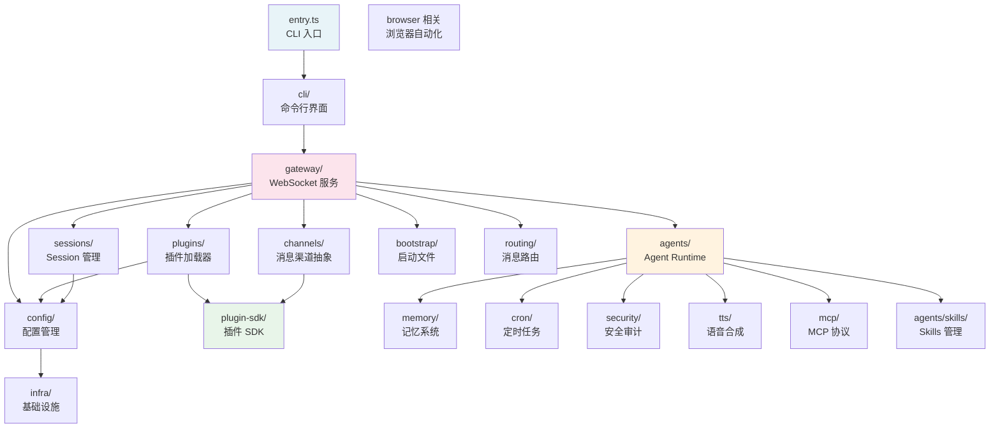
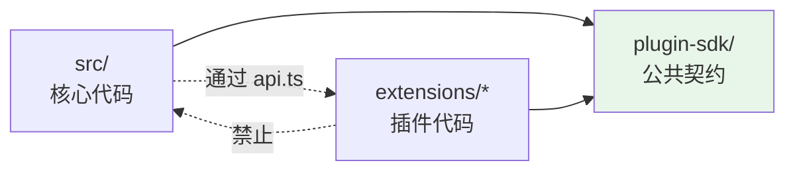

# 第 2 章 — 项目工程结构：Monorepo、模块划分与构建体系

读完这章，你会清楚 OpenClaw 140 万行代码是如何组织的——Monorepo 的分包策略、`src/` 下每个核心模块的职责边界、`extensions/` 与核心代码的隔离机制、以及构建工具链的选型逻辑。掌握这些，你在后续章节中就能快速定位到任何一个功能的实现位置。

## 2.1 顶层目录结构

先看 OpenClaw 仓库的顶层目录布局：

```
openclaw/
  src/              # 核心代码，约 4,500 个非测试 TS 文件
  extensions/       # 130+ 个插件包（Channel 和 Provider）
  packages/         # 3 个内部共享包
  ui/               # Web 控制台（Vite + Lit）
  apps/             # 原生客户端（macOS、iOS、Android）
  skills/           # 52 个内置 Skill
  docs/             # 文档
  scripts/          # 构建和检查脚本
  patches/          # pnpm 依赖补丁
  package.json      # 根包配置
  pnpm-workspace.yaml
  tsconfig.json
```

这个布局可以分成三个圈层来理解：

**核心圈**：`src/` 包含 Gateway、Agent Runtime、CLI、配置管理、Session 管理等所有核心逻辑。这是 OpenClaw 的心脏。

**插件圈**：`extensions/` 包含所有消息渠道和模型供应商的接入适配器。每个子目录是一个独立的 pnpm 包，通过 Plugin SDK 与核心交互。

**外围圈**：`ui/`、`apps/`、`skills/`、`docs/` 提供用户界面、原生客户端、内置技能和文档。

## 2.2 Monorepo 管理：pnpm Workspace

OpenClaw 使用 pnpm workspace 管理 Monorepo。配置文件 `pnpm-workspace.yaml` 定义了包的分布：

```yaml
# pnpm-workspace.yaml
packages:
  - .
  - ui
  - packages/*
  - extensions/*
```

四行配置，划出了四个区域：

- `.`（根目录）：OpenClaw 主包，即 npm 上发布的 `openclaw` 包。它的 `package.json` 定义了 CLI 入口（`openclaw.mjs`）、构建脚本、以及所有核心依赖。
- `ui`：Web 控制台，独立的 Vite 项目，有自己的 `package.json` 和构建流程。
- `packages/*`：内部共享包，目前有三个——`plugin-sdk`、`memory-host-sdk`、`plugin-package-contract`。
- `extensions/*`：所有插件包。每个插件是一个独立的 pnpm 包，可以声明自己的依赖。

这个结构的核心设计决策是：**核心代码和插件代码使用不同的依赖解析策略**。根包的依赖对 `src/` 下的所有代码可用，但每个 `extensions/*` 包有自己独立的依赖声明。插件只能通过 `@openclaw/plugin-sdk`（`workspace:*` 链接到 `packages/plugin-sdk`）访问核心能力，不允许直接 import `src/` 下的内部模块。

### packages/ 的三个共享包

`packages/` 下有三个内部包，它们的角色各不相同：

| 包名 | 用途 |
|------|------|
| `@openclaw/plugin-sdk` | 插件开发的公共 API 契约，插件通过它访问核心能力 |
| `@openclaw/memory-host-sdk` | Memory 引擎的宿主端 SDK，定义嵌入、存储、查询等接口 |
| `@openclaw/plugin-package-contract` | 插件包的元数据契约，定义 manifest 结构 |

这三个包都标记为 `"private": true`，不会发布到 npm。它们存在的目的是建立模块边界——通过 TypeScript 的 path mapping 和 pnpm 的 workspace 协议，确保插件代码只能访问被明确暴露的接口。

### 依赖隔离策略

OpenClaw 的依赖隔离体现在两个层面：

**编译时隔离**。`tsconfig.json` 通过 `paths` 配置建立了模块别名：

```json
// tsconfig.json（节选）
{
  "compilerOptions": {
    "paths": {
      "openclaw/plugin-sdk": ["./src/plugin-sdk/index.ts"],
      "openclaw/plugin-sdk/*": ["./src/plugin-sdk/*.ts"],
      "@openclaw/plugin-sdk": ["./src/plugin-sdk/index.ts"],
      "@openclaw/plugin-sdk/*": ["./src/plugin-sdk/*.ts"],
      "@openclaw/*": ["./extensions/*"]
    }
  }
}
```

插件代码 import `openclaw/plugin-sdk/core` 时，TypeScript 会解析到 `src/plugin-sdk/core.ts`。这样插件在开发时能获得完整的类型支持，同时被限制在 SDK 暴露的接口范围内。

**运行时隔离**。`pnpm-workspace.yaml` 中的 `onlyBuiltDependencies` 和 `minimumReleaseAge` 配置控制了原生依赖的构建策略和新版本依赖的安全等待期（48 小时），避免供应链攻击。

## 2.3 src/ 核心模块地图

`src/` 目录包含约 90 个子目录和若干顶层文件。下面按功能域逐一拆解最重要的模块。

### 模块依赖关系

先用一张图展示核心模块之间的依赖关系：



### agents/ — Agent Runtime（核心中的核心）

`src/agents/` 是整个项目最大的模块，包含 870 多个文件。它负责 Agent 的完整运行时：System Prompt 组装、LLM 调用、流式响应处理、工具执行、上下文窗口管理、Sub-Agent 编排。

这个目录内部按功能进一步组织：

- `agents/skills/` — Skills 的加载、过滤、序列化，包括前端元数据解析和运行时配置（约 27 个文件）
- `agents/subagent-*` — Sub-Agent 系统，处理异步编排和消息投递（约 20 个文件）
- `agents/system-prompt*` — System Prompt 的动态组装管线
- `agents/tool-*` — 工具注册、执行策略和结果处理
- `agents/context-*` — 上下文窗口管理和 Compaction 策略
- `agents/model-*` — 模型选择和 Provider 调度
- `agents/anthropic-*` — Anthropic 特有的传输和流处理逻辑

为什么 Anthropic 相关的代码会在核心 `agents/` 里而不是 `extensions/anthropic/` 里？因为 OpenClaw 最初就是围绕 Claude API 构建的，Anthropic 的流式协议处理（SSE 解析、content block delta 合并等）深度嵌入了 Agent Runtime 的核心逻辑。这是一个历史决策——在架构上不够"干净"，但在工程实践中是合理的取舍。

### gateway/ — WebSocket 服务与控制平面

`src/gateway/` 包含 300 多个文件，实现了 Gateway 守护进程的核心功能。从文件名可以看出它的职责范围：

- `server.ts`、`server-http.ts`、`server-ws-runtime.ts` — HTTP 和 WebSocket 服务
- `server-channels.ts`、`server-plugins.ts` — 渠道和插件的生命周期管理
- `server-chat.ts`、`server-cron.ts` — 聊天消息处理和定时任务调度
- `server-startup*.ts` — 启动流程（配置加载、Session 迁移、插件初始化）
- `session-*.ts` — Session 的持久化、归档、历史查询
- `auth*.ts` — 鉴权和令牌管理
- `protocol/` — WebSocket 协议定义

Gateway 的一个设计特点是**启动流程被拆分成多个阶段**（early startup、config startup、plugin startup、post-attach），每个阶段有独立的文件和测试。这种拆分让启动流程的每一步都可以单独测试和调试。

### config/ — 配置管理

`src/config/` 包含 200 多个文件，是项目中第三大的模块。OpenClaw 的配置系统基于 Zod schema 做校验，支持多层配置合并、环境变量覆盖、运行时热更新。

关键的内部组织：

- `schema.ts`、`schema.base.generated.ts` — 配置 schema 定义（使用 Zod）
- `zod-schema.*.ts` — 按域拆分的 schema 文件（agents、channels、providers、tools 等）
- `io.ts` — 配置文件的读写
- `defaults.ts` — 默认值
- `legacy.ts`、`legacy-migrate.*.ts` — 旧版配置的迁移逻辑
- `types.*.ts` — 按域拆分的类型定义

配置模块的规模可能超出预期。原因是 OpenClaw 支持 25+ 渠道和 30+ 模型供应商，每个渠道和供应商都有自己的配置项，加上多 Agent、安全策略、Hooks、MCP 等功能域的配置，总量自然膨胀。

### cli/ — 命令行界面

`src/cli/` 包含 200 多个文件，实现了 `openclaw` CLI 的所有子命令。CLI 是用户与 OpenClaw 交互的主要入口。

按子命令组织：

- `program.ts` — 命令注册和入口分发
- `gateway-cli.ts`、`daemon-cli.ts` — Gateway 的启动/停止/状态管理
- `config-cli.ts` — 配置的查看和修改
- `plugins-cli.ts` — 插件的安装/卸载/更新
- `skills-cli.ts` — Skills 的管理
- `models-cli.ts` — 模型列表和切换
- `security-cli.ts` — 安全审计
- `secrets-cli.ts` — 凭据管理
- `nodes-cli.ts` — Node（远程设备）管理
- `pairing-cli.ts` — 设备配对

### channels/ — 消息渠道抽象层

`src/channels/` 包含约 80 个文件，定义了消息渠道的核心抽象——Channel 的注册、状态管理、消息分发、线程绑定等。这里是**抽象层**，具体的渠道实现（Telegram、WhatsApp 等）在 `extensions/` 里。

关键文件：

- `registry.ts` — 渠道注册表
- `session.ts` — 渠道级的 Session 管理
- `conversation-binding-context.ts` — 会话绑定上下文
- `draft-stream-controls.ts` — 流式草稿控制
- `mention-gating.ts` — @提及过滤
- `thread-bindings-policy.ts` — 线程绑定策略

### plugins/ — 插件加载器

`src/plugins/` 是一个大型模块（300+ 文件），负责插件的完整生命周期：发现、加载、注册、配置、Hooks 系统、marketplace 集成。注意区分：`plugins/` 是核心侧的插件管理框架，`plugin-sdk/` 是暴露给插件的公共 API。

重要的内部组织：

- `loader.ts` — 插件加载器，处理 jiti 动态 import
- `manifest.ts`、`manifest-registry.ts` — 插件 manifest 解析和注册
- `hooks.ts` — Hooks 系统（before-agent-start、before-tool-call 等）
- `provider-runtime.ts` — Provider 插件的运行时管理
- `installed-plugin-index*.ts` — 已安装插件的索引和缓存
- `clawhub.ts` — ClawHub（插件市场）集成

### plugin-sdk/ — 插件开发 SDK

`src/plugin-sdk/` 包含 400 多个文件，是核心与插件之间的**公共契约**。根据 `AGENTS.md` 的明确规定：

> Host loads plugins; plugins should not reach through the SDK into arbitrary host internals.

Plugin SDK 的文件按能力域组织，每个文件是一个独立的 subpath export：

- `core.ts` — 核心类型和基础工具
- `plugin-entry.ts` — Channel 插件入口定义
- `provider-entry.ts` — Provider 插件入口定义
- `channel-*.ts` — 渠道相关的 SDK（streaming、setup、secret 等）
- `provider-*.ts` — Provider 相关的 SDK（auth、stream、tools 等）
- `reply-*.ts` — 回复管线（分块、去重、派发）
- `approval-*.ts` — 执行审批系统
- `config-runtime.ts`、`config-mutation.ts` — 配置读写
- `memory-*.ts` — Memory 宿主引擎接口
- `testing.ts` — 插件测试工具

SDK 的设计原则是**窄接口**：每个 subpath 只暴露一个能力域，避免插件启动时加载不必要的模块。这一点在 `AGENTS.md` 中被反复强调：

> Keep public SDK entrypoints cheap at module load. Prefer a narrow `*.runtime` subpath over re-exporting it through a broad SDK barrel.

### memory/ — 记忆系统

`src/memory/` 只有一个文件 `root-memory-files.ts`，它看起来很小，但 Memory 的实际实现分散在几个地方：

- `src/plugin-sdk/memory-*.ts` — Memory 引擎的宿主端 SDK（约 15 个文件）
- `packages/memory-host-sdk/` — Memory 宿主 SDK 包
- `extensions/memory-core/`、`extensions/memory-lancedb/`、`extensions/memory-wiki/` — Memory 的具体引擎实现

这种分散是 Plugin 架构的结果：Memory 被抽象为一种插件能力，核心只定义接口，具体的向量存储（LanceDB）和检索策略由插件实现。

### cron/ — 定时任务

`src/cron/` 包含约 80 个文件，实现了 Cron 任务的调度、持久化和执行：

- `service.ts` — Cron 服务主体，管理定时器和任务队列
- `delivery.ts` — 任务执行和结果投递
- `store.ts` — 任务持久化
- `schedule.ts` — 调度策略（支持 cron 表达式和 `every` 间隔）
- `isolated-agent/` — 隔离 Agent 模式，用于在独立上下文中执行 Cron 任务
- `heartbeat-policy.ts` — Heartbeat（Agent 主动唤醒）策略
- `session-reaper.ts` — 过期 Session 清理

### security/ — 安全审计

`src/security/` 包含约 70 个文件，实现了 OpenClaw 的多层安全审计系统：

- `audit.ts` — 安全审计主入口
- `audit-config-*.ts` — 配置安全检查
- `audit-gateway-*.ts` — Gateway 暴露面检查
- `audit-exec-*.ts` — 执行沙箱检查
- `audit-plugin-*.ts` — 插件安全检查
- `audit-workspace-*.ts` — Workspace 和 Skill 安全扫描
- `fix.ts` — 自动修复
- `dangerous-config-flags.ts` — 危险配置标记

安全模块能对整个 OpenClaw 实例做深度扫描，检测配置风险、插件信任度、Skill 注入风险等问题。

### tts/ — 语音合成

`src/tts/` 约 20 个文件，实现了 TTS 的核心框架：Provider 注册、文本预处理、配置管理。和 Memory 类似，具体的 TTS Provider（ElevenLabs、Azure Speech 等）由 `extensions/` 实现。

### 其他重要目录

| 目录 | 文件数 | 职责 |
|------|--------|------|
| `sessions/` | ~18 | Session ID 解析、生命周期事件、发送策略 |
| `routing/` | ~15 | 消息路由、Account 绑定、路由解析 |
| `bootstrap/` | ~4 | Node.js 启动环境初始化 |
| `mcp/` | ~12 | MCP 协议实现（Channel Bridge、工具服务） |
| `context-engine/` | ~7 | 上下文引擎，管理 prompt 注入的优先级和预算 |
| `hooks/` | ~15 | Hooks 框架（Setup、Doctor、Channel 维护） |
| `flows/` | ~15 | 交互式流程（Channel Setup、Provider 配置向导） |
| `infra/` | ~20 | 基础设施工具（环境变量、进程管理、日志） |
| `shared/` | ~15+ | 跨模块共享的工具函数和类型 |
| `web-search/` | ~3 | Web 搜索运行时 |
| `web-fetch/` | ~3 | 网页内容抓取 |
| `image-generation/` | ~数个 | 图片生成框架 |
| `video-generation/` | ~数个 | 视频生成框架 |
| `realtime-voice/` | ~数个 | 实时语音交互 |

## 2.4 extensions/ — 插件生态

`extensions/` 目录包含 130+ 个插件包，这是 OpenClaw 的扩展层。所有与具体外部平台或服务交互的代码都在这里。

### 插件的分类

插件分为两大类：

**Channel 插件**——消息渠道适配器，负责与具体的消息平台对接：

```
extensions/
  telegram/       # Telegram Bot API
  whatsapp/       # WhatsApp (Baileys)
  discord/        # Discord (Carbon)
  slack/          # Slack
  signal/         # Signal
  matrix/         # Matrix
  imessage/       # iMessage (BlueBubbles)
  feishu/         # 飞书
  qqbot/          # QQ
  line/           # LINE
  irc/            # IRC
  msteams/        # Microsoft Teams
  googlechat/     # Google Chat
  nostr/          # Nostr
  ...
```

**Provider 插件**——模型供应商适配器，负责与 LLM API 对接：

```
extensions/
  anthropic/        # Claude (Anthropic)
  openai/           # GPT (OpenAI)
  google/           # Gemini
  deepseek/         # DeepSeek
  ollama/           # Ollama (本地模型)
  amazon-bedrock/   # AWS Bedrock
  azure-speech/     # Azure Speech
  groq/             # Groq
  mistral/          # Mistral
  fireworks/        # Fireworks AI
  openrouter/       # OpenRouter
  together/         # Together AI
  ...
```

除了这两大类，还有一些功能性插件：

```
extensions/
  browser/              # 浏览器自动化
  memory-core/          # Memory 核心引擎
  memory-lancedb/       # LanceDB 向量存储
  brave/                # Brave 搜索
  exa/                  # Exa 搜索
  tavily/               # Tavily 搜索
  elevenlabs/           # ElevenLabs TTS
  deepgram/             # Deepgram STT
  fal/                  # fal.ai (图片/视频生成)
  comfy/                # ComfyUI
  document-extract/     # 文档提取
  shared/               # 跨插件共享工具
  ...
```

### 插件的内部结构

每个插件包遵循一致的结构约定。以 `extensions/telegram/` 为例：

```
extensions/telegram/
  package.json            # 包配置，声明 @openclaw/plugin-sdk 依赖
  openclaw.plugin.json    # 插件 manifest（元数据、激活策略、能力声明）
  tsconfig.json           # TypeScript 配置
  index.ts                # 插件入口
  api.ts                  # 公共 API（供核心代码引用）
  src/                    # 实现代码
    ...
```

`package.json` 中有一个 `openclaw` 字段声明插件入口：

```json
{
  "name": "@openclaw/telegram",
  "devDependencies": {
    "@openclaw/plugin-sdk": "workspace:*"
  },
  "openclaw": {
    "extensions": ["./index.ts"]
  }
}
```

`openclaw.plugin.json` 声明插件的元数据，包括 ID、激活策略、支持的能力。以 Anthropic Provider 插件为例：

```json
{
  "id": "anthropic",
  "activation": { "onStartup": false },
  "enabledByDefault": true,
  "providers": ["anthropic"],
  "providerDiscoveryEntry": "./provider-discovery.ts",
  "modelSupport": {
    "modelPrefixes": ["claude-"]
  }
}
```

### 核心与插件的边界

这是整个 OpenClaw 架构中最重要的边界之一。`extensions/AGENTS.md` 明确规定了跨界规则：

**插件只能通过 SDK 访问核心**。插件的生产代码只能 import `openclaw/plugin-sdk/*` 和自己的本地模块，不能直接 import `src/` 下的任何文件。

**核心只能通过公共 API 访问插件**。核心代码通过插件的 `api.ts` 或 `runtime-api.ts` 访问插件能力，不能深入 `extensions/*/src/` 目录。

**插件之间不能互相访问**。每个插件是独立的包，不允许跨插件 import。

这三条规则构成了一个清晰的依赖方向：



这种隔离带来一个实际的工程约束：如果你在阅读核心代码时发现某个功能的实现"不见了"——比如 Memory 的向量检索——大概率它在 `extensions/` 的某个插件里。反过来，如果你在读一个插件的代码时想了解它调用的 SDK 方法具体做了什么，去 `src/plugin-sdk/` 对应的文件里找。

## 2.5 ui/ — Web 控制台

`ui/` 是一个独立的前端项目，使用 Vite 构建。它提供了 OpenClaw 的 Web 管理界面（Control UI），通过 WebSocket 连接本地 Gateway 进行交互。

```
ui/
  package.json          # 独立的依赖声明
  vite.config.ts        # Vite 构建配置
  vitest.config.ts      # 测试配置
  index.html            # 入口 HTML
  public/               # 静态资源
  src/                  # 源代码
    main.ts             # 应用入口
    ui/                 # UI 组件
    i18n/               # 国际化
    styles/             # 样式
```

UI 项目作为 pnpm workspace 的一个独立包存在，不依赖核心代码的内部模块。它和 Gateway 的交互完全通过 WebSocket 协议完成。

## 2.6 apps/ — 原生客户端

`apps/` 包含原生平台的客户端实现：

```
apps/
  macos/          # macOS 客户端（SwiftUI）
  ios/            # iOS 客户端（SwiftUI）
  android/        # Android 客户端（Kotlin）
  macos-mlx-tts/  # macOS 本地 TTS（MLX）
  shared/         # 跨平台共享代码
```

原生客户端通过 WebSocket 连接本地或远程的 Gateway 实例。macOS 客户端还嵌入了一个本地 Node.js Gateway 进程。

## 2.7 skills/ — 内置 Skill

`skills/` 包含 52 个内置 Skill 目录，覆盖了常见的使用场景：

```
skills/
  coding-agent/         # 编码 Agent
  github/               # GitHub 操作
  slack/                # Slack 操作
  discord/              # Discord 操作
  obsidian/             # Obsidian 笔记
  notion/               # Notion 集成
  spotify-player/       # Spotify 控制
  weather/              # 天气查询
  healthcheck/          # 健康检查
  session-logs/         # Session 日志分析
  skill-creator/        # Skill 生成器
  ...
```

每个 Skill 目录包含 `SKILL.md`，用自然语言描述 Agent 在该领域的操作方式。Skill 不是代码插件——它们是 Markdown 文件，由 Agent Runtime 在需要时加载到 System Prompt 中。

## 2.8 构建工具链

OpenClaw 选择了一套"快"字当头的工具链，替代了 TypeScript 生态中的传统选项。

### tsdown — 代码构建

OpenClaw 使用 tsdown（基于 Rolldown/Rust）替代传统的 tsc 或 esbuild 进行代码构建：

```json
// package.json（节选）
{
  "devDependencies": {
    "tsdown": "0.21.10"
  },
  "scripts": {
    "build": "node scripts/build-all.mjs"
  }
}
```

构建流程由 `scripts/build-all.mjs` 编排，内部调用 `scripts/tsdown-build.mjs`，然后执行一系列后处理步骤：CLI 引导检查、运行时后处理、Plugin SDK 类型声明生成、资源拷贝等。

### tsgo — 类型检查

类型检查使用 tsgo（TypeScript 的 Go 实现），而不是原生的 `tsc --noEmit`：

```json
{
  "scripts": {
    "tsgo": "pnpm tsgo:core"
  }
}
```

`tsconfig.json` 中 `noEmit: true` 确认了 TypeScript 编译器只做类型检查，不负责产出代码。类型检查被分成多个"lanes"（通道），按变更范围选择性执行。

### oxfmt — 代码格式化

OpenClaw 使用 oxfmt（基于 Rust 的格式化工具）替代 Prettier：

```json
{
  "devDependencies": {
    "oxfmt": "0.46.0"
  },
  "scripts": {
    "format": "oxfmt --write --threads=1",
    "format:check": "oxfmt --check --threads=1"
  }
}
```

选择 oxfmt 的原因很直接：在 13,000+ 文件的代码库中，Prettier 的格式化速度是生产力瓶颈。oxfmt 的 Rust 实现提供了数量级的速度提升。

### oxlint — 代码检查

Linting 使用 oxlint（基于 Rust），通过分片并行执行：

```json
{
  "devDependencies": {
    "oxlint": "^1.61.0"
  },
  "scripts": {
    "lint": "node scripts/run-oxlint-shards.mjs"
  }
}
```

### Vitest — 测试

测试框架使用 Vitest：

```json
{
  "devDependencies": {
    "vitest": "^4.1.5"
  },
  "scripts": {
    "test": "node scripts/test-projects.mjs"
  }
}
```

测试文件和源文件共置（colocated），命名为 `*.test.ts`，E2E 测试为 `*.e2e.test.ts`。测试执行通过自定义脚本 `scripts/test-projects.mjs` 管理，支持按变更范围执行（`pnpm test:changed`）和串行执行（`pnpm test:serial`）。

### 工具链总览

| 环节 | 传统选项 | OpenClaw 选择 | 选择原因 |
|------|----------|---------------|----------|
| 构建 | tsc / esbuild | tsdown (Rolldown) | Rust 实现，更快 |
| 类型检查 | tsc --noEmit | tsgo | Go 实现，大型项目更快 |
| 格式化 | Prettier | oxfmt | Rust 实现，数量级提速 |
| Lint | ESLint | oxlint | Rust 实现，更快 |
| 测试 | Jest | Vitest | 更快的 HMR，原生 ESM 支持 |
| 运行时 | Node.js 18/20 | Node 24（推荐），最低 22.14+ | 需要新特性（compile cache 等） |

这套工具链的共同主题是**性能**。在 140 万行非测试代码的规模下，构建、格式化、类型检查的速度直接影响开发者的日常体验。传统工具在这个规模下的等待时间是不可接受的。

## 2.9 变更检测与分层验证

OpenClaw 的 CI 检查不是每次都跑全量。`pnpm check:changed` 根据 Git diff 分析受影响的模块，只执行相关的检查：

- **core prod lane**：核心生产代码变更 -> 核心类型检查 + 核心测试
- **core tests lane**：核心测试变更 -> 核心测试类型检查和测试
- **extension prod lane**：插件生产代码变更 -> 插件类型检查 + 插件测试
- **extension tests lane**：插件测试变更 -> 插件测试类型检查和测试
- **SDK/契约变更**：同时触发核心和插件的检查
- **根配置变更**：触发全量检查

这个分层策略使得日常开发中的改动只需要等待相关模块的检查完成，而不是等待全项目的 `pnpm check`。对于一个 13,000+ 文件的项目来说，这种分层检测是保持开发效率的关键。

## 2.10 入口文件与启动链

最后，看一下代码是如何被串联起来的。OpenClaw 的 CLI 入口是 `openclaw.mjs`，它指向 `src/entry.ts`。

`entry.ts` 的职责包括（`src/entry.ts:1-30`）：

1. 启用 Node.js compile cache（加速重复启动）
2. 解析 CLI 参数和 profile 环境变量
3. 处理容器化部署的参数转换
4. 判断是否需要 respawn（版本不匹配等情况）
5. 分发到 `src/cli/program.ts` 执行具体命令

从 `entry.ts` 到一个实际运行的 Gateway 实例，调用链大致是：

```
entry.ts -> cli/program.ts -> cli/gateway-cli.ts -> gateway/boot.ts -> gateway/server.ts
```

这条链路在后续的第 4 章（Gateway 架构）和第 5 章（请求生命周期）中会详细展开。

## 2.11 小结

OpenClaw 的工程结构可以用三句话概括：

1. **核心代码在 `src/`，插件代码在 `extensions/`，两者通过 `plugin-sdk/` 这个公共契约层通信**。这是整个项目最重要的架构边界。

2. **pnpm workspace 提供了包级别的依赖隔离**。插件声明自己的依赖，通过 `workspace:*` 链接引用 SDK 包，编译时通过 TypeScript path mapping 获得类型支持。

3. **构建工具链全面拥抱 Rust 生态**（tsdown、oxfmt、oxlint），配合分层变更检测，在 140 万行代码的规模下保持了可接受的开发体验。

下一章，我们从实际操作开始——在你自己的机器上部署一个 OpenClaw 实例，跑通第一个 Agent。

## 练习

**思考题**

1. OpenClaw 把 Channel 和 Provider 放在 `extensions/` 下作为独立的 pnpm 包，而不是直接放在 `src/` 中。如果一个新的 Channel 实现需要访问 Gateway 的内部状态（比如直接读写 Session Store），这种隔离会带来什么限制？Plugin SDK 的窄接口设计在这里起到了什么作用？

**动手题**

2. 在 OpenClaw 源码中，沿着 `src/entry.ts` → `src/run-main.ts` → `src/gateway-cli/run.ts` 的调用链，画出从 `openclaw gateway` 命令到 `startGatewayServer` 被调用之间的完整启动路径。标注每个文件负责的职责（进程守卫、命令路由、快速路径判断等）。

3. 查看 `pnpm-workspace.yaml` 和根 `package.json`，找出所有 workspace 包的列表。选一个 Extension 包（比如 `extensions/telegram`），检查它的 `package.json` 中对 Plugin SDK 的依赖声明方式，理解 `workspace:*` 协议在开发时和发布时的行为差异。
