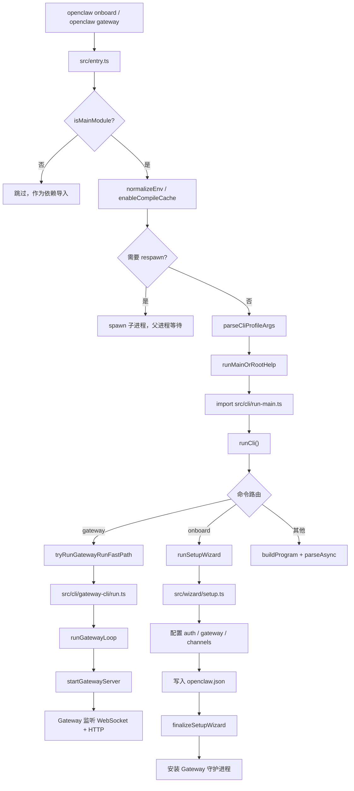
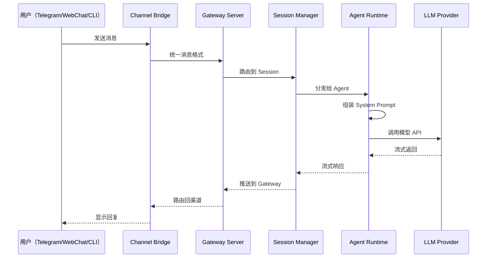

# 第 3 章 — 快速上手：本地部署你的第一个 Agent

读完这章，你将在本地跑通一个完整的 OpenClaw 实例，理解从 `npm install` 到发送第一条消息的全部流程，并能看懂启动过程中每一步对应的源码位置。

## 3.1 环境准备

OpenClaw 的运行时要求很明确：**Node 24（推荐）或 Node 22.14+**。Dockerfile 中锁定的基础镜像是 `node:24-bookworm`（`Dockerfile:16`），README 也反复强调了这一点。

检查本地环境：

```bash
node --version
# v24.x.x

npm --version
# 10.x.x 或更高
```

如果版本不够，用 nvm 安装：

```bash
nvm install 24
nvm use 24
```

除了 Node 之外，不需要额外的系统依赖。Gateway 是纯 Node.js 进程，没有原生编译步骤（除非你要启用 Matrix 渠道，那需要 matrix-sdk-crypto 的原生 addon，但首次部署可以跳过）。

## 3.2 安装

一行命令完成全局安装：

```bash
npm install -g openclaw@latest
```

也可以用 pnpm：

```bash
pnpm add -g openclaw@latest
```

安装完成后验证：

```bash
openclaw --version
```

这个命令触发的是入口文件 `src/entry.ts` 中的版本号快速路径（`tryHandleRootVersionFastPath`，`src/entry.ts:171`），直接输出版本号就退出，不会加载完整 CLI。

## 3.3 启动流程源码走读

在动手之前，先花几分钟理解 OpenClaw 从命令行输入到 Gateway 启动的完整链路。下面这张图概括了核心路径：



几个关键节点：

**entry.ts 的守卫逻辑。** 入口文件首先检查自己是否是主模块（`src/entry.ts:77-83`）。这是为了防止打包器把 `entry.js` 作为共享依赖导入时重复执行启动逻辑。如果不是主模块，直接跳过所有副作用。

**respawn 机制。** `buildCliRespawnPlan`（`src/entry.respawn.ts`）检查是否需要用不同的 Node 参数重新启动进程。如果需要，父进程 spawn 一个子进程然后等待它退出。这个设计保证了编译缓存、内存限制等参数能正确生效。

**Gateway 快速路径。** 当命令是 `openclaw gateway` 时，`run-main.ts` 会走一条优化过的快速路径（`tryRunGatewayRunFastPath`，`src/cli/run-main.ts:137-191`），只加载 Gateway 相关的模块，跳过完整的 CLI 程序构建。这把 Gateway 启动时间压缩到了最短。关于 Gateway 的内部架构，第 4 章会详细拆解。

**Commander 命令注册。** 非快速路径的命令走 `buildProgram`（`src/cli/program.ts`），通过 Commander.js 注册所有子命令。插件命令也在这里动态注册。

## 3.4 运行 Onboard 向导

OpenClaw 提供了一个交互式向导来完成首次配置。这是官方推荐的入门方式：

```bash
openclaw onboard --install-daemon
```

`--install-daemon` 参数告诉向导在配置完成后自动安装 Gateway 守护进程（macOS 用 launchd，Linux 用 systemd user service）。

向导的源码在 `src/wizard/setup.ts`，核心函数是 `runSetupWizard`（`src/wizard/setup.ts:179`）。它依次完成以下步骤：

### 步骤 1：安全风险确认

向导首先要求你确认一条安全声明。Agent 运行在你的机器上，能执行 bash 命令，这意味着它有你的用户权限。确认后继续。

### 步骤 2：选择 Setup 模式

```
? Setup mode
> QuickStart        — 使用默认设置，跳过网络/认证的细节配置
  Manual            — 手动配置端口、网络绑定、Tailscale、认证方式
  Import from ...   — 从其他 Agent 系统迁移配置
```

首次安装选 QuickStart 即可。它会使用以下默认值（`src/wizard/setup.ts:417-435`）：

- Gateway 端口：18789
- 绑定地址：Loopback（127.0.0.1）
- 认证方式：Token（自动生成）
- Tailscale：关闭

### 步骤 3：配置 Workspace 目录

默认的 Workspace 目录是 `~/.openclaw/workspace`。向导会自动创建这个目录。Workspace 是 Agent 的"工作空间"，存放 bootstrap 文件、session 数据、skills 等。第 13 章会深入讲解 Workspace 的设计哲学。

### 步骤 4：选择 Model Provider

向导会列出可用的 LLM Provider，你需要选择一个并提供 API Key。常见选项：

- OpenAI（ChatGPT/Codex）
- Anthropic（Claude）
- Google（Gemini）
- OpenRouter（聚合多个模型）
- 本地模型（Ollama/LM Studio）

选好 Provider 后，向导还会让你选择默认模型。Model Provider 的抽象设计在第 11 章有完整分析。

### 步骤 5：配置 Gateway 网络

QuickStart 模式跳过这一步，直接用默认值。Manual 模式下，你可以配置端口、绑定地址（loopback/LAN/Tailscale/自定义 IP）、认证方式（Token 或 Password）。这些配置的处理逻辑在 `src/wizard/setup.gateway-config.ts:54`。

### 步骤 6：配置消息渠道

向导会列出所有支持的渠道，你可以选择启用哪些。首次安装建议先选一个简单的渠道——Telegram 或 WebChat。渠道配置的具体操作下一节单独说。

### 步骤 7：安装 Gateway 守护进程

QuickStart 模式默认安装守护进程（`src/wizard/setup.finalize.ts:113-114`）。安装完成后，Gateway 会作为系统服务在后台运行，重启机器也会自动拉起。

### 步骤 8：健康检查

向导最后会探测 Gateway 是否成功启动（`src/wizard/setup.finalize.ts:260-339`），检查 WebSocket 连接是否可达，并运行 `healthCommand` 验证整体状态。

## 3.5 openclaw.json 配置文件

向导执行完毕后，会在 `~/.openclaw/openclaw.json` 生成配置文件。这个路径由 `src/config/paths.ts:23` 中的常量 `CONFIG_FILENAME = "openclaw.json"` 决定，存放在 state 目录下（默认 `~/.openclaw/`）。

配置文件的 TypeScript 类型定义在 `src/config/types.openclaw.ts:43`，是一个名为 `OpenClawConfig` 的大型接口。下面是一个最小可运行的配置示例：

```json
{
  "gateway": {
    "port": 18789,
    "bind": "loopback",
    "auth": {
      "mode": "token",
      "token": "你的-gateway-token"
    }
  },
  "agents": {
    "defaults": {
      "workspace": "~/.openclaw/workspace",
      "model": "gpt-4o"
    }
  }
}
```

几个关键字段的含义：

| 字段 | 类型 | 说明 |
|------|------|------|
| `gateway.port` | number | Gateway 监听端口，默认 18789 |
| `gateway.bind` | string | 绑定模式：`loopback` / `lan` / `auto` / `tailnet` / `custom` |
| `gateway.auth.mode` | string | 认证方式：`token` 或 `password` |
| `gateway.auth.token` | string | Gateway 访问令牌 |
| `agents.defaults.workspace` | string | Agent Workspace 目录 |
| `agents.defaults.model` | string | 默认 LLM 模型 |
| `channels` | object | 各渠道的配置（Telegram、Discord、Slack 等） |

完整的配置参考见附录 B。这里只需要知道：Gateway 相关配置控制网络和认证，Agent 相关配置控制模型和工作空间，Channel 配置控制消息渠道的接入。

环境变量也可以覆盖部分配置。`.env` 文件按以下优先级加载（从高到低）：

1. 进程环境变量
2. 项目目录下的 `.env`
3. `~/.openclaw/.env`
4. `openclaw.json` 中的 `env` 字段

`.env.example` 中列出了所有支持的环境变量，包括 `OPENCLAW_GATEWAY_TOKEN`、各种 Provider 的 API Key、以及渠道 Token。

## 3.6 手动启动 Gateway

如果没有使用 `--install-daemon` 安装守护进程，或者你想在前台调试，可以手动启动 Gateway：

```bash
openclaw gateway --port 18789 --verbose
```

这条命令走的是 Gateway 快速路径。最终调用 `runGatewayLoop`（`src/cli/gateway-cli/run-loop.ts`），它做三件事：

1. 获取 Gateway 锁（`acquireGatewayLock`，防止同一端口多实例冲突）
2. 调用 `startGatewayServer`（`src/gateway/server.ts`）启动 WebSocket 和 HTTP 服务
3. 进入事件循环，处理 SIGTERM/SIGINT 信号以优雅关闭

启动成功后，Gateway 会监听两个端口：

- **18789**：主端口，WebSocket + HTTP（Control UI、健康检查端点 `/healthz`、`/readyz`）
- **18790**：Bridge 端口，用于 Node 设备（macOS/iOS/Android app）的连接

检查 Gateway 状态：

```bash
openclaw health
```

或者直接用 curl 探测健康检查端点：

```bash
curl http://127.0.0.1:18789/healthz
```

## 3.7 连接第一个渠道

Gateway 跑起来之后，需要至少连接一个消息渠道才能和 Agent 对话。两个最容易上手的选项：

### 方案 A：WebChat（零配置）

WebChat 是 OpenClaw 内置的 Web 聊天界面，不需要任何第三方账号。打开 Control UI 就能用：

```bash
openclaw dashboard
```

浏览器会打开 `http://127.0.0.1:18789`，这就是 Control UI。在左侧导航找到 WebChat，直接开始对话。

如果你在远程服务器上运行，需要用 SSH 端口转发：

```bash
ssh -L 18789:127.0.0.1:18789 your-server
```

然后在本地浏览器打开 `http://127.0.0.1:18789`。

### 方案 B：Telegram

Telegram 是最常用的外部渠道之一，配置过程简单明了：

1. 在 Telegram 中找到 [@BotFather](https://t.me/BotFather)，创建一个 Bot，拿到 Bot Token
2. 通过 `openclaw onboard` 向导配置（会自动引导你填入 Token），或者手动编辑 `openclaw.json`：

```json
{
  "channels": {
    "telegram": {
      "enabled": true,
      "botToken": "123456:ABCDEF..."
    }
  }
}
```

3. 也可以把 Token 放在环境变量中：

```bash
export TELEGRAM_BOT_TOKEN="123456:ABCDEF..."
```

4. 重启 Gateway 或运行 `openclaw gateway restart`

配置完成后，在 Telegram 中给你的 Bot 发消息，Agent 就会回复。

渠道系统的设计细节（统一消息抽象、多渠道路由等）在第 17 章展开。

## 3.8 发送第一条消息

一切就绪后，无论通过哪个渠道发送一条消息：

- WebChat：在 Control UI 的 WebChat 面板直接输入
- Telegram：给 Bot 发消息
- CLI：用命令行直接发送

```bash
openclaw agent --message "你好，介绍一下你自己"
```

消息从发出到收到回复，经历了以下完整链路：



这条链路中的每个环节，后续章节都会逐一拆解：

- 渠道如何抽象统一：第 17 章
- Gateway 如何路由和分发：第 4 章、第 5 章
- Session 的单写者模型：第 6 章
- Agent Runtime 如何组装 Prompt 和调用模型：第 8 章、第 11 章
- 流式响应机制：第 7 章

## 3.9 Docker 部署（替代方案）

如果你更习惯容器化部署，OpenClaw 提供了完整的 Docker 支持。项目根目录的 `docker-compose.yml` 定义了两个服务：

- **openclaw-gateway**：Gateway 主服务，暴露 18789（WebSocket/HTTP）和 18790（Bridge）端口
- **openclaw-cli**：CLI 工具容器，共享 Gateway 的网络

```bash
# 构建镜像
docker build -t openclaw:local .

# 配置环境变量
export OPENCLAW_CONFIG_DIR=~/.openclaw
export OPENCLAW_WORKSPACE_DIR=~/.openclaw/workspace

# 启动
docker compose up -d
```

`docker-compose.yml` 中 Gateway 的启动命令是：

```yaml
command: ["node", "dist/index.js", "gateway", "--bind", "lan", "--port", "18789"]
```

注意 Docker 环境下绑定地址必须是 `lan`（0.0.0.0），因为 Docker bridge 网络下 loopback 绑定无法从宿主机访问。同时需要设置 `OPENCLAW_GATEWAY_TOKEN` 或 `OPENCLAW_GATEWAY_PASSWORD` 来保护 Gateway 的访问。

容器内的配置通过 volume 挂载 `~/.openclaw` 目录实现，和裸机部署共享同一份 `openclaw.json`。

生产环境部署（包括 Kubernetes、fly.io 等）的完整方案在第 25 章讨论。

## 3.10 常见问题排查

**Gateway 启动失败，提示端口被占用。** Gateway 使用文件锁防止多实例冲突（`acquireGatewayLock`，`src/infra/gateway-lock.ts`）。检查是否已有 Gateway 在运行：

```bash
lsof -i :18789
```

**健康检查失败。** 运行诊断命令：

```bash
openclaw doctor
```

`doctor` 命令会检查配置文件语法、渠道连接状态、模型 Provider 可用性等。

**Model Provider 认证失败。** 确认 API Key 正确且有额度。检查当前配置：

```bash
openclaw config get agents.defaults.model
openclaw secrets audit
```

**Telegram Bot 收不到消息。** 确认 Bot Token 正确，且 Gateway 可以访问 Telegram API（可能需要代理）。检查 Gateway 日志：

```bash
openclaw gateway --verbose
```

## 本章小结

这一章完成了从零到一的全部流程：安装 Node 24、全局安装 OpenClaw、运行 onboard 向导、理解 `openclaw.json` 的核心配置、启动 Gateway、连接渠道、发送第一条消息。

同时，我们跟踪了启动过程对应的源码路径：`entry.ts` 做进程守卫和编译缓存 -> `run-main.ts` 做命令路由 -> `gateway-cli/run.ts` 走快速路径启动 Gateway -> `setup.ts` 运行 onboard 向导。

下一章开始进入 Gateway 的内部世界。第 4 章会拆解 Gateway 的单进程守护架构和 WebSocket 协议设计，这是理解整个系统的基础。

## 练习

**思考题**

1. OpenClaw 的 onboard 向导将配置写入 `openclaw.json`，而不是使用环境变量或数据库。如果你要支持"团队共享一份 Agent 配置"的场景，`openclaw.json` 的文件驱动方式会遇到什么问题？你会如何改进？

**动手题**

2. 在本地部署 OpenClaw 后，打开 `openclaw.json`，尝试修改 `defaultModel` 为另一个模型（如从 Claude 切换到 GPT），然后重启 Gateway 并发送一条消息。观察 Gateway 日志，确认模型切换是否生效。如果切换失败，排查原因（API Key 配置、模型名称格式等）。

3. 阅读 `src/entry.ts` 中的 `ensureSingleInstance` 逻辑（进程守卫），理解它是如何防止多个 Gateway 实例同时运行的。然后尝试在两个终端中同时执行 `openclaw gateway`，观察第二个实例的错误提示。
