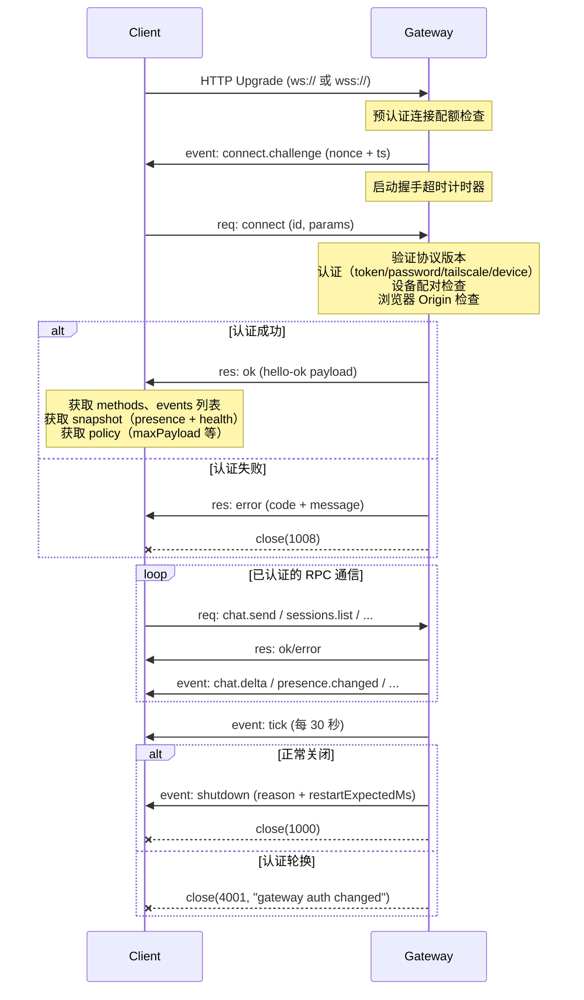

# 第 4 章 — Gateway 架构：单进程守护与 WebSocket 协议设计

读完这章，你能学到 Gateway 作为单进程守护进程的设计动机、WebSocket 与 HTTP 在同一端口上的多路复用机制、协议帧格式的完整定义、连接生命周期的每一步细节、四种认证模式的实现逻辑，以及健康检查和就绪探针的分层设计。

## 4.1 为什么是单进程守护？

OpenClaw Gateway 是整个系统的控制平面。所有客户端——CLI、iOS/Android 客户端、Web Control UI、消息渠道桥接——都通过 Gateway 与 Agent 运行时通信。理解 Gateway 的进程模型是理解后续所有架构决策的前提。

Gateway 选择了单进程守护进程模型。`startGatewayServer` 函数（`src/gateway/server.impl.ts:314`）接收一个端口号（默认 18789）和一组配置选项，在一个 Node.js 进程里启动 HTTP 服务器、WebSocket 服务器、定时任务调度器、配置热重载监听器、渠道管理器和插件运行时。

```typescript
// src/gateway/server.impl.ts:314
export async function startGatewayServer(
  port = 18789,
  opts: GatewayServerOptions = {},
): Promise<GatewayServer> {
  bootstrapGatewayNetworkRuntime();
  // ...
}
```

为什么不用多进程或微服务？三个原因。

**部署复杂度**。OpenClaw 的目标用户是在自己机器上跑一个 AI 助手。如果 Gateway 是一组微服务，用户需要管理多个进程的启停和端口分配，`docker-compose` 或 K8s 就成了硬性依赖。单进程意味着 `openclaw gateway` 一条命令就能启动全部功能。

**状态一致性**。Gateway 维护着大量内存状态——当前连接的客户端列表（`clients: Set<GatewayWsClient>`）、聊天运行状态（`chatRunState`）、请求去重表（`dedupe: Map<string, DedupeEntry>`）、Presence 信息、健康快照缓存。这些状态在单进程内通过引用共享，不需要跨进程同步。如果拆成多进程，就需要引入 Redis 或共享内存，复杂度和延迟都会上升。

**连接亲和性**。WebSocket 是有状态的长连接。客户端连上 Gateway 后，后续的所有请求都在同一条连接上。如果引入多进程负载均衡，就需要解决 WebSocket 的 Session Affinity 问题。单进程天然不存在这个问题。

代价是什么？单进程模型放弃了水平扩展能力。一个 Gateway 实例能服务的客户端数量受限于单机的内存和 CPU。但 OpenClaw 的使用场景是"个人 AI 助手"——并发客户端通常是个位数（CLI + 手机 + Web UI），而不是几千个。这个 trade-off 在目标场景下是合理的。

Gateway 通过事件循环健康监控（`src/gateway/server/event-loop-health.ts`）来检测单进程的瓶颈。如果事件循环延迟过高，readiness 检查会反映出来，允许外部编排系统（如果有的话）做出响应。

## 4.2 WebSocket + HTTP 多路复用

Gateway 在同一个端口上同时提供 HTTP 和 WebSocket 服务。这不是两个独立的服务器，而是一个 `http.Server`（或 `https.Server`，取决于 TLS 配置）处理两种协议。

```typescript
// src/gateway/server-http.ts:470
export function createGatewayHttpServer(opts: { /* ... */ }): HttpServer {
  const httpServer: HttpServer = opts.tlsOptions
    ? createHttpsServer(opts.tlsOptions, (req, res) => {
        void handleRequestWithTrace(req, res);
      })
    : createHttpServer((req, res) => {
        void handleRequestWithTrace(req, res);
      });
  // ...
  return httpServer;
}
```

HTTP 请求处理器在发现请求头中包含 `upgrade: websocket` 时，直接跳过：

```typescript
// src/gateway/server-http.ts:533
if ((req.headers.upgrade ?? "").toLowerCase() === "websocket") {
  return;
}
```

WebSocket 升级由 `server-http.ts:806` 中的 `attachGatewayUpgradeHandler` 函数处理，它监听 HTTP 服务器的 `upgrade` 事件：

```typescript
// src/gateway/server-http.ts:830
httpServer.on("upgrade", (req, socket, head) => {
  // ...认证、Canvas 路径检查、预认证连接配额...
  wss.handleUpgrade(req, socket, head, (ws) => {
    wss.emit("connection", ws, req);
  });
});
```

HTTP 层的请求处理采用了 **阶段式流水线（staged pipeline）** 设计。`runGatewayHttpRequestStages` 函数依次执行一组处理阶段，每个阶段返回 `true` 表示已处理该请求，流水线终止：

```typescript
// src/gateway/server-http.ts:373
export async function runGatewayHttpRequestStages(
  stages: readonly GatewayHttpRequestStage[],
): Promise<boolean> {
  for (const stage of stages) {
    try {
      if (await stage.run()) {
        return true;
      }
    } catch (err) {
      if (!stage.continueOnError) { throw err; }
      console.error(`[gateway-http] stage "${stage.name}" threw — skipping:`, err);
    }
  }
  return false;
}
```

流水线的阶段顺序（`src/gateway/server-http.ts:568-786`）决定了路由优先级：

1. **gateway-probes** — `/health`、`/healthz`、`/ready`、`/readyz` 健康检查端点
2. **hooks** — webhook 回调端点
3. **models** — `/v1/models` OpenAI 兼容接口
4. **embeddings** — `/v1/embeddings` 嵌入向量接口
5. **tools-invoke** — `/tools/invoke` 工具调用端口
6. **sessions** — session 管理端点
7. **openresponses / openai** — OpenAI 兼容的 chat completions
8. **canvas** — Canvas/A2UI 相关路径
9. **plugin-http** — 插件注册的 HTTP 路由
10. **control-ui** — Web 控制台静态资源和 SPA 路由

这个设计的关键点在于 `continueOnError` 标志。插件路由（`plugin-http`）允许在抛异常时继续执行后续阶段，这样一个有 bug 的插件不会导致整个 HTTP 层不可用。核心路由（如健康检查）则没有这个容错——如果它们出错，直接抛异常是正确的行为。

每个 HTTP 阶段都采用了延迟加载（lazy import）模式，避免启动时加载不需要的模块：

```typescript
// src/gateway/server-http.ts:107
function getOpenAiHttpModule() {
  openAiHttpModulePromise ??= import("./openai-http.js");
  return openAiHttpModulePromise;
}
```

这是 OpenClaw 源码中反复出现的模式：用 `??=` 实现单例延迟加载。第一次调用时触发 `import()`，后续调用直接返回缓存的 Promise。对于 Gateway 启动性能来说，这个策略很关键——`server.impl.ts` 文件导入了 30+ 个模块，如果这些模块再递归加载它们的依赖，启动时间会显著增加。

## 4.3 协议帧格式

Gateway 的 WebSocket 协议是一个基于 JSON 的 RPC 协议，当前版本号为 3（`src/gateway/protocol/schema/protocol-schemas.ts:405`）。

所有通信都基于三种帧类型，定义在 `src/gateway/protocol/schema/frames.ts` 中。

### 请求帧（Request Frame）

```json
{
  "type": "req",
  "id": "unique-request-id",
  "method": "chat.send",
  "params": { /* 方法特定的参数 */ }
}
```

`id` 字段是请求的唯一标识符，用于将响应与请求关联。客户端生成这个 ID，通常是 UUID。同一个 `id` 不能重复使用。

`method` 字段指定要调用的 Gateway 方法，如 `connect`、`chat.send`、`sessions.list`、`config.get` 等。Gateway 在启动时构建支持的方法列表，通过 `hello-ok` 响应告知客户端。

### 响应帧（Response Frame）

```json
{
  "type": "res",
  "id": "same-request-id",
  "ok": true,
  "payload": { /* 方法特定的返回值 */ }
}
```

失败时：

```json
{
  "type": "res",
  "id": "same-request-id",
  "ok": false,
  "error": {
    "code": "INVALID_PARAMS",
    "message": "session key is required",
    "retryable": false
  }
}
```

`id` 与请求帧的 `id` 对应。`ok` 是布尔值，表示请求是否成功。失败时 `error` 包含结构化的错误信息，其中 `code` 是预定义的错误码（定义在 `src/gateway/protocol/schema/error-codes.ts`），`retryable` 告诉客户端是否可以重试，`retryAfterMs` 提供建议的重试间隔。

### 事件帧（Event Frame）

```json
{
  "type": "event",
  "event": "chat.delta",
  "payload": { "text": "Hello" },
  "seq": 42,
  "stateVersion": { "presence": 5, "health": 3 }
}
```

事件帧是服务器主动推送的消息。`seq` 是可选的序列号，用于客户端检测是否有丢失的事件。`stateVersion` 是可选的状态版本向量，客户端可以用它来判断本地缓存的 Presence 和 Health 快照是否过期。

三种帧类型组成一个 discriminated union，以 `type` 字段区分：

```typescript
// src/gateway/protocol/schema/frames.ts:172
export const GatewayFrameSchema = Type.Union(
  [RequestFrameSchema, ResponseFrameSchema, EventFrameSchema],
  { discriminator: "type" },
);
```

所有帧的 schema 使用 TypeBox 定义，通过 AJV 编译成运行时验证器。AJV 编译后的验证函数是预优化的——它在第一次编译时生成专用的 JavaScript 代码，后续验证只执行简单的条件检查，性能远好于运行时遍历 schema 树。

### 请求去重（Deduplication）

Gateway 维护一个内存去重表（`src/gateway/server-constants.ts:27`）：

```typescript
export const DEDUPE_TTL_MS = 5 * 60_000; // 5 分钟过期
export const DEDUPE_MAX = 1000;           // 最多 1000 条
```

每个请求的 `id` 被记录在这个 Map 中。如果同一个 `id` 在 5 分钟内重复出现，Gateway 可以返回缓存的结果而不重新执行。超过 1000 条时，按时间戳从旧到新淘汰。客户端通过生成唯一的请求 `id`（通常是 UUID）来实现幂等性。

### 载荷大小限制

Gateway 定义了严格的载荷大小限制（`src/gateway/server-constants.ts:1-5`）：

```typescript
export const MAX_PAYLOAD_BYTES = 25 * 1024 * 1024;        // 25 MB，认证后
export const MAX_BUFFERED_BYTES = 50 * 1024 * 1024;       // 50 MB，每连接发送缓冲
export const MAX_PREAUTH_PAYLOAD_BYTES = 64 * 1024;        // 64 KB，认证前
```

认证前的载荷限制只有 64 KB，这是一个安全措施——未认证的连接不应该发送大量数据。认证后提升到 25 MB 是为了支持 Canvas 截图等大载荷。通过 `hello-ok` 响应中的 `policy` 字段将这些限制告知客户端：

```typescript
// src/gateway/server/ws-connection/message-handler.ts:1440
policy: {
  maxPayload: MAX_PAYLOAD_BYTES,
  maxBufferedBytes: MAX_BUFFERED_BYTES,
  tickIntervalMs: TICK_INTERVAL_MS,
},
```

## 4.4 连接生命周期

一个 WebSocket 连接从建立到关闭，经历以下阶段。



### 4.4.1 升级与预认证

HTTP Upgrade 请求到达时，Gateway 首先检查预认证连接配额（`PreauthConnectionBudget`，`src/gateway/server/preauth-connection-budget.ts`）。这是一个按 IP 分组的并发限制，防止攻击者通过大量未认证的 WebSocket 连接耗尽服务器资源。

配额通过后，Gateway 创建一个新的连接上下文：

```typescript
// src/gateway/server/ws-connection.ts:260-265
const connectNonce = randomUUID();
send({
  type: "event",
  event: "connect.challenge",
  payload: { nonce: connectNonce, ts: Date.now() },
});
```

`connect.challenge` 事件包含一个一次性的 nonce 和时间戳。客户端在后续的 `connect` 请求中可以引用这个 nonce 来证明它收到了 challenge。

同时启动一个握手超时计时器（`src/gateway/server/ws-connection.ts:369`）。如果客户端在超时窗口内没有完成 `connect` 握手，连接会被主动断开。超时时间通过环境变量 `OPENCLAW_GATEWAY_PREAUTH_HANDSHAKE_TIMEOUT_MS` 可配置。

### 4.4.2 Connect 握手

客户端发送的第一个帧必须是 `{ type: "req", method: "connect", params: ConnectParams }`。任何其他帧都会导致连接被关闭。

`ConnectParams`（`src/gateway/protocol/schema/frames.ts:20`）包含：

- `minProtocol` / `maxProtocol` — 客户端支持的协议版本范围
- `client` — 客户端标识信息（id、version、platform、mode）
- `auth` — 认证凭据（token、password、deviceToken、bootstrapToken）
- `device` — 设备身份信息（公钥、签名、nonce）
- `caps` — 客户端声明的能力列表
- `role` / `scopes` — 请求的角色和权限范围

Gateway 验证协议版本兼容性后，进入认证流程（详见 4.5 节）。认证通过后，构建并发送 `hello-ok` 响应：

```typescript
// src/gateway/server/ws-connection/message-handler.ts:1417-1445
const helloOk = {
  type: "hello-ok",
  protocol: PROTOCOL_VERSION,
  server: { version: resolveRuntimeServiceVersion(process.env), connId },
  features: { methods: gatewayMethods, events },
  snapshot,
  canvasHostUrl: scopedCanvasHostUrl,
  auth: { role, scopes: helloOkAuthScopes, /* deviceToken... */ },
  policy: { maxPayload: MAX_PAYLOAD_BYTES, maxBufferedBytes: MAX_BUFFERED_BYTES, tickIntervalMs: TICK_INTERVAL_MS },
};
```

`hello-ok` 告诉客户端三件关键信息：

1. **features** — Gateway 支持哪些 RPC 方法和事件。客户端据此决定 UI 上显示哪些功能。
2. **snapshot** — 当前的系统状态快照，包含 Presence（在线设备列表）和 Health（健康状态）。客户端可以立即渲染而不需要额外请求。
3. **policy** — 通信策略参数。客户端据此设置最大发送大小和心跳间隔。

### 4.4.3 设备配对（Device Pairing）

移动客户端（iOS/Android）通过设备配对机制与 Gateway 建立信任关系。这个机制类似于蓝牙配对：

1. 移动设备在 `connect` 请求中附带一个公钥和签名。
2. Gateway 收到后创建一个配对请求（`requestDevicePairing`，`src/infra/device-pairing.ts`）。
3. 已连接的管理客户端（如 CLI 或 Web UI）收到 `device.pair.requested` 事件。
4. 管理客户端调用 `device.pair.approve` 或 `device.pair.reject` 方法。
5. 配对通过后，Gateway 为该设备签发一个长期有效的 `deviceToken`。
6. 后续连接时，设备使用 `deviceToken` 认证，不再需要配对流程。

本地 loopback 连接可以自动批准配对（`shouldAllowSilentLocalPairing`，`src/gateway/server/ws-connection/handshake-auth-helpers.ts`），避免用户在同一台机器上使用时被要求手动确认。

### 4.4.4 心跳与断开

认证完成后，Gateway 每 30 秒发送一次 `tick` 事件（`src/gateway/server-constants.ts:24`）：

```json
{ "type": "event", "event": "tick", "payload": { "ts": 1714000000000 } }
```

客户端可以用 `tick` 事件来检测连接是否存活。如果超过一定时间没有收到 `tick`，客户端应该断开并重连。

Gateway 关闭时，先发送 `shutdown` 事件通知所有客户端：

```json
{
  "type": "event",
  "event": "shutdown",
  "payload": { "reason": "gateway restart", "restartExpectedMs": 5000 }
}
```

`restartExpectedMs` 告诉客户端 Gateway 预计多久后恢复。客户端可以据此在 UI 上显示倒计时，而不是一个模糊的"连接已断开"。

当 Gateway 的认证凭据被轮换（比如管理员修改了 token），已有连接会收到 `4001` 状态码的关闭帧，`reason` 为 `"gateway auth changed"`。客户端收到这个状态码后应该提示用户重新输入凭据。

## 4.5 认证模型

Gateway 支持四种认证模式，由配置 `gateway.auth.mode` 决定。认证解析逻辑在 `src/gateway/auth-resolve.ts` 中，认证执行逻辑在 `src/gateway/auth.ts` 中。

### 4.5.1 Token 模式

默认模式。Gateway 启动时生成或读取一个共享 token，客户端在 `connect` 请求的 `auth.token` 字段中提供这个 token。

```typescript
// src/gateway/auth.ts:342-364
function authorizeTokenAuth(params: {
  authToken?: string;
  connectToken?: string;
  limiter?: AuthRateLimiter;
  ip?: string;
  rateLimitScope: string;
}): GatewayAuthResult {
  if (!params.authToken) { return { ok: false, reason: "token_missing_config" }; }
  if (!params.connectToken) { return { ok: false, reason: "token_missing" }; }
  if (!safeEqualSecret(params.connectToken, params.authToken)) {
    params.limiter?.recordFailure(params.ip, params.rateLimitScope);
    return { ok: false, reason: "token_mismatch" };
  }
  params.limiter?.reset(params.ip, params.rateLimitScope);
  return { ok: true, method: "token" };
}
```

token 比较使用 `safeEqualSecret`（`src/security/secret-equal.ts`），这是一个常量时间比较函数，防止 timing attack。认证失败时调用速率限制器的 `recordFailure`，成功时调用 `reset` 清除该 IP 的失败计数。

如果 Gateway 启动时没有配置 token 且没有从环境变量 `OPENCLAW_GATEWAY_TOKEN` 读取到，它会自动生成一个并尝试持久化到配置文件（`src/gateway/server.impl.ts:376-383`）。如果持久化失败（比如配置文件只读），生成的 token 只在本次运行期间有效，下次启动会生成新的。

### 4.5.2 Password 模式

与 Token 模式类似，但使用密码。客户端在 `auth.password` 字段中提供。两者的区别是语义上的：token 通常由系统生成并自动传递（如 CLI 从配置文件读取），password 由用户手动输入。

### 4.5.3 Tailscale Identity 模式

Tailscale 是一个基于 WireGuard 的 VPN 网络。当 Gateway 运行在 Tailscale 的 serve/funnel 模式下，Tailscale 代理会在请求中注入 `Tailscale-User-Login`、`Tailscale-User-Name` 等头。

Gateway 验证这些头的真实性：

```typescript
// src/gateway/auth.ts:187-218
async function resolveVerifiedTailscaleUser(params: {
  req?: IncomingMessage;
  tailscaleWhois: TailscaleWhoisLookup;
}): Promise<{ ok: true; user: TailscaleUser } | { ok: false; reason: string }> {
  const tailscaleUser = getTailscaleUser(req);
  if (!tailscaleUser) { return { ok: false, reason: "tailscale_user_missing" }; }
  if (!isTailscaleProxyRequest(req)) { return { ok: false, reason: "tailscale_proxy_missing" }; }
  const clientIp = resolveTailscaleClientIp(req);
  if (!clientIp) { return { ok: false, reason: "tailscale_whois_failed" }; }
  const whois = await tailscaleWhois(clientIp);
  if (!whois?.login) { return { ok: false, reason: "tailscale_whois_failed" }; }
  if (normalizeLogin(whois.login) !== normalizeLogin(tailscaleUser.login)) {
    return { ok: false, reason: "tailscale_user_mismatch" };
  }
  return { ok: true, user: { /* ... */ } };
}
```

验证逻辑是两步的：先检查 HTTP 头中的用户信息，然后通过 Tailscale 的 whois API 反查客户端 IP 对应的用户身份，确认两者一致。这防止了伪造 HTTP 头的攻击——即使攻击者设置了正确的 `Tailscale-User-Login` 头，whois 查询会暴露真实身份。

Tailscale 认证只在 `ws-control-ui` 表面上启用（`src/gateway/auth.ts:312-314`），HTTP API 不启用。这是因为 Tailscale 代理注入的头只能从 loopback 代理请求中信任，而 HTTP API 可能被直接访问。

### 4.5.4 Trusted-Proxy 模式

当 Gateway 运行在反向代理（如 Nginx、Caddy）后面时，代理负责认证，并通过自定义 HTTP 头传递用户身份。

```typescript
// src/gateway/auth.ts:268-310
function authorizeTrustedProxy(params: {
  req?: IncomingMessage;
  trustedProxies?: string[];
  trustedProxyConfig: GatewayTrustedProxyConfig;
}): { user: string } | { reason: string } {
  const remoteAddr = req.socket?.remoteAddress;
  if (!remoteAddr || !isTrustedProxyAddress(remoteAddr, trustedProxies)) {
    return { reason: "trusted_proxy_untrusted_source" };
  }
  // ...检查 requiredHeaders...
  const userHeaderValue = headerValue(
    req.headers[normalizeLowercaseStringOrEmpty(trustedProxyConfig.userHeader)],
  );
  if (!userHeaderValue || userHeaderValue.trim() === "") {
    return { reason: "trusted_proxy_user_missing" };
  }
  return { user: userHeaderValue.trim() };
}
```

安全模型的关键点：Gateway 只信任来自 `trustedProxies` 列表中 IP 的请求。`trustedProxies` 使用 CIDR 格式匹配（`isIpInCidr`）。如果请求来自 loopback 地址但 `allowLoopback` 没有显式启用，也会被拒绝——这防止了本地进程绕过代理直接访问 Gateway。

Trusted-proxy 模式和 token 模式互斥。如果同时配置了 `trustedProxy` 和 `token`，Gateway 启动时会抛错（`src/gateway/auth.ts:256-260`）。这是一个有意的约束——两种认证模式混合使用会导致难以审计的安全边界。

### 4.5.5 速率限制

所有认证模式共享一个速率限制器（`src/gateway/auth-rate-limit.ts`），按 IP + 认证范围（scope）跟踪失败次数。关键的设计细节：

- **缺失凭据不计入失败**。如果客户端没有提供 token（`token_missing`），不消耗速率限制配额。只有错误的凭据（`token_mismatch`）才计数。这防止了浏览器首次打开时因为没带 token 就被限速。
- **成功认证重置计数**。一次成功的认证会清除该 IP 的所有失败记录。
- **浏览器连接使用独立限制器**。浏览器来源的 WebSocket 连接使用一个 `browserRateLimiter`，loopback 地址不豁免（`exemptLoopback: false`）。这是因为浏览器连接天然来自 loopback，如果豁免就等于没有速率限制。

## 4.6 绑定地址策略

Gateway 的绑定地址不是硬编码的，而是通过一个策略系统动态解析（`src/gateway/net.ts:251-306`）。

| 模式 | 绑定地址 | 适用场景 |
|------|---------|---------|
| `loopback`（默认） | `127.0.0.1` | 本机使用，安全 |
| `lan` | `0.0.0.0` | 局域网访问 |
| `tailnet` | Tailscale IPv4 地址 | Tailnet 内部访问 |
| `auto` | 容器内 `0.0.0.0`，其他 `127.0.0.1` | 自动检测 |
| `custom` | 用户指定的 IP | 特殊网络配置 |

`auto` 模式的容器检测（`isContainerEnvironment`）通过检查 `/.dockerenv`、`/run/.containerenv` 或 cgroup 路径中的容器标识来判断。在容器内绑定 `127.0.0.1` 会导致端口转发失效，所以自动切换到 `0.0.0.0`。

绑定前会做可达性检查（`canBindToHost`，`src/gateway/net.ts:336-349`）：创建一个临时 TCP 服务器，尝试绑定到目标地址的随机端口，成功后立即关闭。如果绑定失败（比如 Tailscale 接口还没初始化），回退到下一个候选地址。

当绑定 `127.0.0.1` 时，Gateway 还会尝试同时绑定 `::1`（IPv6 loopback），确保 IPv4 和 IPv6 客户端都能连接（`resolveGatewayListenHosts`，`src/gateway/net.ts:351-363`）。

## 4.7 健康检查与就绪探针

Gateway 暴露四个探针端点，定义在 `src/gateway/server-http.ts:152-157`：

```typescript
const GATEWAY_PROBE_STATUS_BY_PATH = new Map<string, "live" | "ready">([
  ["/health",  "live"],
  ["/healthz", "live"],
  ["/ready",   "ready"],
  ["/readyz",  "ready"],
]);
```

**Liveness 探针**（`/health`、`/healthz`）总是返回 `200 OK`，只要 HTTP 服务器在运行就表示进程存活。

**Readiness 探针**（`/ready`、`/readyz`）执行真正的健康检查（`src/gateway/server/readiness.ts`），返回 `200` 或 `503`：

```typescript
// src/gateway/server/readiness.ts:48
return (): ReadinessResult => {
  const now = Date.now();
  if (deps.getStartupPending?.()) {
    return { ready: false, failing: ["startup-sidecars"], uptimeMs };
  }
  // 检查每个渠道的健康状态
  for (const [channelId, accounts] of Object.entries(snapshot.channelAccounts)) {
    const health = evaluateChannelHealth(accountSnapshot, policy);
    if (!health.healthy && !shouldIgnoreReadinessFailure(accountSnapshot, health)) {
      failing.push(channelId);
    }
  }
  return { ready: failing.length === 0, failing };
};
```

Readiness 检查有 1 秒的结果缓存（`DEFAULT_READINESS_CACHE_TTL_MS`），避免频繁的探针请求造成计算开销。

认证后的本地请求或持有有效凭据的请求可以看到详细的 readiness 信息（哪些渠道不健康、事件循环延迟数据）。未认证的请求只能看到 `{ ready: true/false }`。这是一个安全考量——详细的健康信息可能泄露内部架构。

事件循环健康监控（`src/gateway/server/event-loop-health.ts`）使用 Node.js 的 `perf_hooks.monitorEventLoopDelay` API，在 readiness 结果中附加事件循环延迟分布数据，帮助诊断性能问题。

## 4.8 启动流程

Gateway 的启动流程是一个精心编排的多阶段过程，通过 `startupTrace` 追踪每个阶段的耗时。设置 `OPENCLAW_GATEWAY_STARTUP_TRACE=1` 环境变量可以输出详细的启动性能日志。

主要阶段（`src/gateway/server.impl.ts:335-994`）：

1. **config.snapshot** — 读取配置快照，应用运行时覆盖
2. **config.auth** — 解析认证配置，生成 token（如果需要）
3. **control-ui.seed** — 为非 loopback 实例初始化 Control UI 允许的 Origins
4. **plugins.bootstrap** — 加载插件注册表和 Gateway 方法列表
5. **tls.runtime** — 加载 TLS 证书（如果配置了 HTTPS）
6. **runtime.state** — 创建 HTTP 服务器、WebSocket 服务器、广播器
7. **runtime.early** — 启动 mDNS 发现、事件订阅、维护任务
8. **http.bound** — 开始监听端口
9. **runtime.post-attach** — 启动 Tailscale、渠道桥接、插件服务
10. **ready** — 标记 Gateway 就绪

如果任何阶段失败，`closeOnStartupFailure`（`src/gateway/server.impl.ts:734-741`）负责清理已创建的资源：

```typescript
const closeOnStartupFailure = async () => {
  try {
    await runClosePrelude();
    await createCloseHandler()({ reason: "gateway startup failed" });
  } finally {
    clearFallbackGatewayContextForServer();
  }
};
```

这个设计保证了即使启动中途崩溃，端口、文件句柄和计时器都能被正确释放。Gateway 返回的 `close` 函数也执行同样的清理逻辑，还会额外触发 `gateway_stop` 插件钩子，让插件有机会做自己的清理。

## 4.9 本章小结

Gateway 的设计围绕一个核心前提：它是一个给个人用的守护进程，不是一个给千人并发的服务集群。这个前提决定了单进程模型、内存状态管理、同端口多路复用等所有关键决策。

协议层的设计体现了务实的工程判断：JSON 帧而不是二进制协议（调试方便、生态兼容），TypeBox + AJV 的 schema-first 验证（编译时类型安全 + 运行时完整性检查），以及通过 `hello-ok` 做能力协商而不是硬编码 API 版本号（向前兼容性好）。

认证模型的分层设计——从最简单的 token 到最复杂的 trusted-proxy——让 OpenClaw 能适应从"笔记本上跑着玩"到"部署在公网服务器上对外暴露"的全部场景，同时通过速率限制和常量时间比较来维持安全基线。

下一章将深入 Gateway 收到请求后的处理流程——从 WebSocket 帧解析到 Agent 运行时调度的完整路径。

## 练习

**思考题**

1. Gateway 选择了单进程模型，所有功能（WebSocket、HTTP、定时任务、渠道管理）都在一个 Node.js 进程内。如果某个 Channel 的消息处理出现死循环或内存泄漏，会影响整个 Gateway 的可用性。你认为哪些子系统最适合拆分到独立进程？拆分后如何保持当前"一条命令启动全部功能"的用户体验？

2. OpenClaw 在同一端口上同时提供 WebSocket 和 HTTP 服务。对比"WebSocket 和 HTTP 分端口"的方案，各自在反向代理配置、防火墙规则、负载均衡方面有什么差异？

**动手题**

3. 用 `wscat` 或浏览器的 WebSocket 调试工具连接到运行中的 Gateway（默认 `ws://localhost:18789`），手动发送一个 `hello` 帧，观察返回的 `hello-ok` 帧中包含哪些能力声明字段。对比源码中 `hello-ok` 的构造逻辑，理解能力协商的完整内容。
