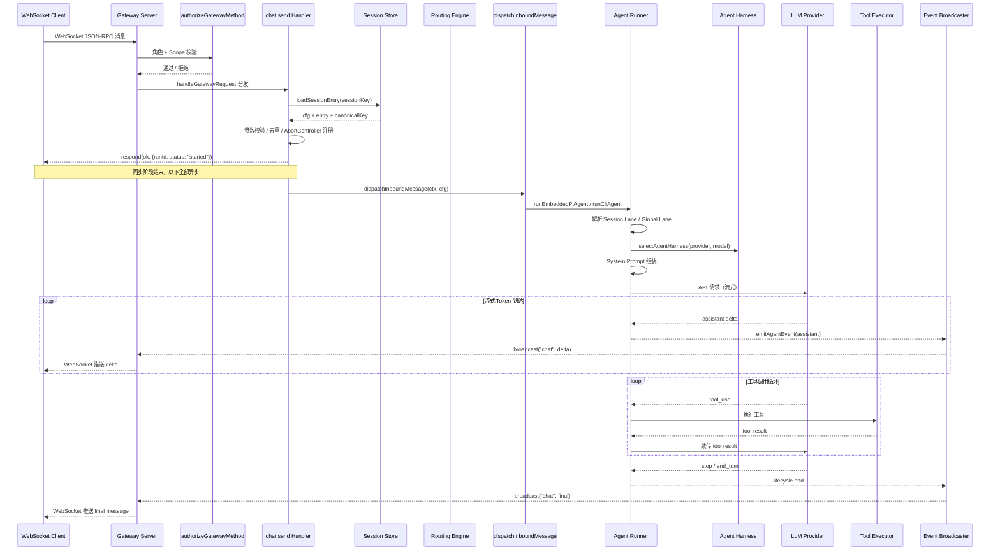

# 第 5 章 请求生命周期：从消息到达到响应返回的完整链路

读完这一章，你会理解一条用户消息在 OpenClaw 系统中经历的完整旅程——从 WebSocket 帧到达 Gateway，经过权限校验、方法分发、Session 加载、消息路由、Agent Run 启动，直到模型响应流式推回客户端。你还会知道每个阶段的时间预算、同步与异步的分界线在哪里，以及为什么系统在某些地方选择了"先应答再执行"的设计。

## 5.1 全景时序图

先看整体。下面这张时序图覆盖了一条 `chat.send` 请求从进入到离开系统的关键节点：



整条链路可以切成两个大阶段：**同步应答阶段**（从消息到达到返回 `{status: "started"}`）和**异步执行阶段**（从 Agent Run 启动到最终响应推送）。这个切分是理解 OpenClaw 请求模型的关键。

## 5.2 第一阶段：消息接收与方法分发

### 5.2.1 WebSocket 帧到 JSON-RPC

客户端与 Gateway 之间使用 WebSocket 长连接通信。每条消息是一个 JSON-RPC 风格的请求：

```json
{
  "method": "chat.send",
  "params": {
    "sessionKey": "agent:main:main",
    "message": "帮我写一个排序算法",
    "idempotencyKey": "run-abc-123"
  }
}
```

Gateway 收到原始 WebSocket 帧后，解析 JSON，提取 `method` 字段，进入 `handleGatewayRequest`（`src/gateway/server-methods.ts:112`）。

### 5.2.2 权限校验：三层过滤

`handleGatewayRequest` 做的第一件事是权限校验，由 `authorizeGatewayMethod`（`src/gateway/server-methods.ts:45`）执行。校验分三层：

1. **角色校验**：调用 `parseGatewayRole` 解析连接角色（`operator`、`node` 等），再通过 `isRoleAuthorizedForMethod` 判断该角色是否有权调用目标方法。
2. **Scope 校验**：对 `operator` 角色，进一步检查连接携带的 Scope 列表。`ADMIN_SCOPE`（`operator.admin`）拥有所有权限；其他 Scope 通过 `authorizeOperatorScopesForMethod` 做细粒度匹配。
3. **速率限制**：对写操作（`config.apply`、`config.patch`、`update.run`），通过 `consumeControlPlaneWriteBudget` 执行令牌桶限流，上限 3 次 / 60 秒。

```typescript
// src/gateway/server-methods.ts:45
function authorizeGatewayMethod(method: string, client: GatewayRequestOptions["client"]) {
  // ...
  const role = parseGatewayRole(roleRaw);
  if (!isRoleAuthorizedForMethod(role, method)) {
    return errorShape(ErrorCodes.INVALID_REQUEST, `unauthorized role: ${role}`);
  }
  // Scope 检查 ...
  const scopeAuth = authorizeOperatorScopesForMethod(method, scopes);
  if (!scopeAuth.allowed) {
    return errorShape(ErrorCodes.INVALID_REQUEST, `missing scope: ${scopeAuth.missingScope}`);
  }
  return null;
}
```

`health` 方法跳过所有校验，`node` 角色跳过 Scope 校验。这些都是硬编码的快速通道，保证健康检查和节点通信零开销。

### 5.2.3 方法分发表

权限通过后，Gateway 查找对应的 handler：

```typescript
// src/gateway/server-methods.ts:159
const handler = opts.extraHandlers?.[req.method] ?? coreGatewayHandlers[req.method];
```

`coreGatewayHandlers` 是一个扁平的方法映射表，由 30+ 个 handler 模块展开合并而成（`src/gateway/server-methods.ts:74-110`）。这里没有用路由树或正则匹配——就是一个对象属性查找，O(1) 复杂度。

整个 handler 调用被包裹在 `withPluginRuntimeGatewayRequestScope` 中（`src/gateway/server-methods.ts:180`），为插件子 Agent 提供上下文作用域，确保插件在处理请求时能回调 Gateway。

## 5.3 第二阶段：chat.send 的同步处理

`chat.send` 是最核心的消息入口。它在同步阶段要完成一系列准备工作，然后尽快给客户端返回确认。

### 5.3.1 参数校验

Handler 首先用 `validateChatSendParams` 做 schema 校验，然后执行业务层的合法性检查：

- **sessionKey 存在性**：通过 `loadSessionEntry`（`src/gateway/session-utils.ts`）加载 Session 配置和持久化条目
- **Agent 存活检查**：`resolveDeletedAgentIdFromSessionKey` 检测目标 Agent 是否已从配置中删除
- **发送策略**：`resolveSendPolicy` 根据 Session 配置判断是否允许发送，`deny` 策略直接拒绝
- **停止命令**：如果消息内容是 `/stop`，走中断逻辑而不是正常的消息处理

### 5.3.2 去重与幂等

OpenClaw 用 `idempotencyKey` 做请求去重，避免网络抖动导致的重复处理：

```typescript
// src/gateway/server-methods/chat.ts:1961
const cached = context.dedupe.get(`chat:${clientRunId}`);
if (cached) {
  respond(cached.ok, cached.payload, cached.error, { cached: true });
  return;
}
const activeExisting = context.chatAbortControllers.get(clientRunId);
if (activeExisting) {
  respond(true, { runId: clientRunId, status: "in_flight" }, undefined, { cached: true });
  return;
}
```

两道检查：先查去重缓存（已完成的请求），再查活跃的 AbortController（正在执行的请求）。命中任一个都直接返回，不会重复触发 Agent Run。

### 5.3.3 AbortController 注册与立即响应

去重检查通过后，系统注册一个 `ChatAbortController`，绑定 `runId`、`sessionKey`、超时时间，然后立即给客户端回复：

```typescript
// src/gateway/server-methods/chat.ts:2062-2066
context.addChatRun(clientRunId, { sessionKey, clientRunId });
const ackPayload = { runId: clientRunId, status: "started" as const };
respond(true, ackPayload, undefined, { runId: clientRunId });
```

这就是同步/异步的分界线。从客户端视角，收到 `{status: "started"}` 意味着消息已被接受，后续的 Agent 处理结果会通过 WebSocket 事件异步推送。这个设计有两个好处：

1. **快速反馈**：客户端不需要等待模型响应就能知道消息已被接收
2. **超时解耦**：HTTP/WebSocket 连接的超时与 Agent 执行的超时是独立的

## 5.4 第三阶段：消息路由

### 5.4.1 路由引擎的工作原理

在渠道消息（Telegram、Discord 等）到达时，系统需要通过路由引擎决定把消息交给哪个 Agent 处理。路由引擎的核心是 `resolveAgentRoute`（`src/routing/resolve-route.ts:610`），输入是渠道、账号、对话对端信息，输出是 `ResolvedAgentRoute`，包含 `agentId`、`sessionKey`、`matchedBy` 等字段。

路由匹配采用分层优先级策略，共 8 个层级从高到低：

| 优先级 | 匹配方式 | matchedBy | 典型场景 |
|--------|----------|-----------|----------|
| 1 | 精确对端匹配 | `binding.peer` | 指定群组绑定到特定 Agent |
| 2 | 父对端匹配 | `binding.peer.parent` | 线程继承父消息的 Agent 绑定 |
| 3 | 通配对端匹配 | `binding.peer.wildcard` | 所有群组绑定到同一 Agent |
| 4 | Guild + Roles | `binding.guild+roles` | Discord 按角色路由 |
| 5 | Guild | `binding.guild` | Discord 按服务器路由 |
| 6 | Team | `binding.team` | Slack 按团队路由 |
| 7 | Account | `binding.account` | 按账号路由 |
| 8 | Channel | `binding.channel` | 按渠道路由 |

如果所有层级都未命中，使用 `resolveDefaultAgentId` 返回默认 Agent。

### 5.4.2 Session Key 的构造

路由解析的核心产物之一是 `sessionKey`，它决定了消息的会话归属。Session Key 的格式遵循固定模式：

```
agent:{agentId}:{scope}
```

具体构造由 `buildAgentPeerSessionKey`（`src/routing/session-key.ts:130`）完成，根据对话类型（direct/group/channel）和 `dmScope` 配置生成不同粒度的 key：

- `main` → `agent:main:main`（所有 DM 合并到一个 Session）
- `per-peer` → `agent:main:direct:{peerId}`（每个联系人独立 Session）
- `per-channel-peer` → `agent:main:{channel}:direct:{peerId}`（按渠道+联系人隔离）

这种分层设计让运营者可以灵活控制会话隔离粒度，而不需要修改代码。

### 5.4.3 路由缓存

路由解析涉及遍历 binding 列表和多级匹配，OpenClaw 用了两层缓存来避免重复计算：

- **Binding 评估缓存**（`evaluatedBindingsCacheByCfg`）：按 `channel + accountId` 索引，最多 2000 条
- **路由结果缓存**（`resolvedRouteCacheByCfg`）：按完整路由参数索引，最多 4000 条

两层缓存都使用 `WeakMap<OpenClawConfig, ...>` 作为顶层容器，配置对象被 GC 回收时缓存自动清除。当缓存条目超过上限，采用全量清除策略——简单粗暴但有效，因为配置变更本身就会触发缓存失效。

## 5.5 第四阶段：Agent Run 启动

### 5.5.1 从 dispatch 到 runner

`chat.send` 的异步处理核心是 `dispatchInboundMessage`（`src/auto-reply/dispatch.ts:121`），它通过 `dispatchReplyFromConfig` 进入自动回复管道。管道的末端会调用到 Agent Runner——要么是嵌入式的 `runEmbeddedPiAgent`，要么是 CLI 模式的 `runCliAgent`。

两种 Runner 的选择取决于 provider 和运行时配置：

- **runEmbeddedPiAgent**（`src/agents/pi-embedded-runner/run.ts:273`）：主路径。在进程内完成模型调用和工具执行。支持所有 Provider（OpenAI、Anthropic、Gemini 等）。
- **runCliAgent**（`src/agents/cli-runner.ts:64`）：特殊路径。通过子进程调用外部 CLI（如 Claude CLI），适用于需要独立沙箱环境的场景。

### 5.5.2 Lane 队列：并发控制的核心

`runEmbeddedPiAgent` 启动时做的第一件事是排队。OpenClaw 用双层 Lane 队列控制并发：

```typescript
// src/agents/pi-embedded-runner/run.ts:287-292
const sessionLane = resolveSessionLane(params.sessionKey?.trim() || params.sessionId);
const globalLane = resolveGlobalLane(params.lane);
// ...
return enqueueSession(() => {
  throwIfAborted();
  return enqueueGlobal(async () => {
    // 实际执行逻辑
  });
});
```

**Session Lane**：同一个 Session 的请求串行执行，避免并发写入同一个 Session 文件导致数据损坏。

**Global Lane**：全局并发上限，防止过多的 Agent Run 同时占用内存和 API 配额。

这是一个嵌套排队模型——先拿 Session 锁，再拿全局锁。拿到两把锁后才进入实际的模型调用。如果 AbortSignal 在排队期间触发，`throwIfAborted()` 会立即抛出异常，避免无意义的等待。

### 5.5.3 Harness 选择

进入执行阶段后，系统通过 `selectAgentHarness`（`src/agents/harness/selection.ts:74`）选择 Agent Harness。Harness 是模型调用的运行时适配层，不同的 Harness 封装了不同的 API 协议和交互模式。

选择逻辑分三个分支：

1. **Pinned**：配置指定了 `agentHarnessId`，直接使用
2. **Plugin**：有插件注册了支持当前 provider/model 的 Harness，按优先级选取
3. **PI Fallback**：没有匹配的插件 Harness，回退到内置的 PI（Provider Interface）

内置的 PI Harness 是最通用的路径，支持 OpenAI-compatible API、Anthropic API、Responses API 等主流协议。

## 5.6 第五阶段：Prompt 组装与模型调用

### 5.6.1 上下文构建

Agent Run 启动后，需要组装发送给模型的完整 prompt。这个过程涉及：

1. **System Prompt**：从 Agent 配置和 Skills 中组装系统提示词
2. **Session History**：从 Session 文件加载历史消息
3. **User Message**：当前用户输入（可能经过时间戳注入、thinking 指令包装等预处理）
4. **Tool Definitions**：可用工具的 schema 定义
5. **Context Engine 数据**：如果配置了上下文引擎，还会注入检索到的相关文档片段

### 5.6.2 模型调用与 Failover

模型调用由 `runEmbeddedAttemptWithBackend`（`src/agents/pi-embedded-runner/run/backend.ts`）执行。这一层封装了：

- **Auth Profile 轮换**：多个 API Key 之间的负载均衡和故障切换
- **Failover 策略**：当主模型返回错误时，自动切换到备用模型。`classifyFailoverReason`（`src/agents/pi-embedded-helpers.ts`）会分类错误类型（rate_limit、context_overflow、auth_error 等），`resolveRunFailoverDecision` 决定是否重试以及使用哪个备选模型
- **Session 过期重试**：CLI Runner 路径会检测 session_expired 错误并自动创建新 Session 重试

Failover 的重试次数由 `resolveMaxRunRetryIterations` 控制，避免无限循环。每次重试都会记录在 `executionTrace` 中，最终体现在响应元数据里。

## 5.7 第六阶段：工具执行循环

模型返回 `tool_use` 时，系统进入工具执行循环。这是 Agent 系统的核心能力所在。

### 5.7.1 Agentic Loop

工具执行遵循标准的 Agentic Loop 模式：

1. 模型输出一个或多个 `tool_use` 块
2. 系统执行对应的工具，收集结果
3. 将 tool result 追加到会话中，再次调用模型
4. 重复直到模型输出 `end_turn` 或达到迭代上限

每次工具执行都会触发 `tool` 类型的 Agent Event，通过 `broadcastToConnIds` 推送给注册了工具事件的客户端。工具事件的推送与 verbose 级别设置无关——WS 客户端始终收到工具生命周期事件；verbose 级别只控制是否将工具详情发送到消息渠道。

### 5.7.2 工具执行的审批机制

部分高风险工具（如 shell 命令执行）需要人工审批。Gateway 通过 `ExecApprovalManager` 管理审批流程：工具执行前发送审批请求，等待操作员通过 Control UI 批准或拒绝，然后才继续执行。

## 5.8 第七阶段：流式响应与事件广播

### 5.8.1 Agent Event 体系

Agent 运行过程中产生的所有事件——assistant text delta、tool start/end、lifecycle start/end/error——都通过统一的 Agent Event 体系分发。`createAgentEventHandler`（`src/gateway/server-chat.ts:430`）是事件处理的中枢。

事件处理按 stream 类型分流：

| stream 类型 | 处理方式 |
|-------------|----------|
| `assistant` | 缓冲 + 节流后作为 chat delta 推送 |
| `tool` | 发给注册的 tool event 接收者 + session 订阅者 |
| `lifecycle` | 驱动 Session 状态变更 + 最终消息推送 |
| `item` | flush 缓冲区后广播 |

### 5.8.2 Delta 节流与缓冲

模型的流式输出是逐 token 到达的，如果每个 token 都推送一次 WebSocket 消息，网络开销巨大。OpenClaw 的处理方式是缓冲 + 节流：

```typescript
// src/gateway/server-chat.ts:669
const now = Date.now();
const last = chatRunState.deltaSentAt.get(clientRunId) ?? 0;
if (now - last < 150) {
  return; // 150ms 内不重复推送
}
```

每 150ms 最多推送一次 delta。`rawBuffers` 存储原始文本，`buffers` 存储经过 `projectLiveAssistantBufferedText` 处理后的可展示文本（去除了思维链中间态、heartbeat token 等噪音）。

当工具调用开始时（`toolPhase === "start"`），系统会调用 `flushBufferedChatDeltaIfNeeded` 强制刷新缓冲区，确保客户端在看到工具卡片之前能看到完整的前置文本。

### 5.8.3 Final 事件与缓冲区清理

当 `lifecycle.end` 事件到达时，`finalizeLifecycleEvent`（`src/gateway/server-chat.ts:532`）执行收尾：

1. 刷新最后一批缓冲的 delta（避免丢失节流窗口内的最后几个 token）
2. 发送 `{state: "final"}` 事件，携带完整的 assistant 文本
3. 清理 buffer、deltaSentAt 等运行时状态
4. 通过 `persistGatewaySessionLifecycleEvent` 持久化 Session 生命周期事件
5. 广播 `sessions.changed` 事件给 Session 事件订阅者

对于 `lifecycle.error` 事件，处理方式不同——系统不会立即终结，而是通过 `scheduleTerminalLifecycleError` 设置一个 15 秒的 grace period（`AGENT_LIFECYCLE_ERROR_RETRY_GRACE_MS`）。在这个窗口期内，如果 Agent 重试成功（比如 failover 到备用模型），之前的错误就不会暴露给客户端。

## 5.9 延迟预算

根据各阶段的特性，一个合理的延迟预算分配如下：

| 阶段 | 预算 | 说明 |
|------|------|------|
| WebSocket 帧解析 + JSON 反序列化 | < 1ms | 纯 CPU，无 I/O |
| 权限校验（authorizeGatewayMethod） | < 1ms | 内存查表，无外部调用 |
| 方法分发（handler 查找） | < 1ms | 对象属性查找 |
| Session 加载（loadSessionEntry） | < 10ms | 本地文件 I/O，有内存缓存 |
| 路由解析（resolveAgentRoute） | < 5ms | 内存计算 + 缓存命中；首次约 10-20ms |
| 同步阶段总计（到 respond 返回） | < 20ms | 客户端感知的请求延迟 |
| Lane 排队等待 | 0ms - 数秒 | 取决于队列深度和并发配置 |
| Prompt 组装 | 10ms - 100ms | 取决于 Session 历史长度和 Context Engine 检索 |
| 模型首 Token 延迟 (TTFT) | 200ms - 5s | 取决于模型和 prompt 长度 |
| 工具执行 | 100ms - 60s+ | 取决于工具类型，shell 命令可能很长 |
| 流式 Token 传输 | 1s - 120s | 取决于生成长度 |
| 异步阶段总计 | 1s - 数分钟 | 上限受 Agent 超时控制 |

关键指标：同步阶段的 20ms 预算是硬性要求。如果 Session 加载或路由解析超出预算，说明配置文件过大或缓存失效频率过高，需要排查。

## 5.10 同步与异步的边界

OpenClaw 的请求处理有一条清晰的同步/异步分界线，理解这条线是排查生产问题的前提。

**同步阶段**（在 `respond()` 调用之前）：
- 参数校验
- Session 加载
- 去重检查
- AbortController 注册
- 返回 `{status: "started"}`

**异步阶段**（在 `respond()` 调用之后）：
- 图片持久化（`persistChatSendImages`）
- 消息上下文构造（`MsgContext`）
- `dispatchInboundMessage` → Agent Run
- 模型调用 + 工具执行循环
- 流式响应推送
- Session 持久化

这个设计的关键权衡：同步阶段必须足够快（< 20ms），因为它阻塞了 WebSocket 连接的消息处理。一旦 `respond()` 返回，客户端就能继续发送其他消息，而 Agent 的长时间执行不会阻塞连接。

异步阶段的错误不会通过 JSON-RPC 响应返回，而是通过 Agent Event 体系推送。客户端需要监听 `chat` 事件，处理 `state: "error"` 的情况。

## 5.11 请求上下文：贯穿全链路的状态容器

`GatewayRequestContext`（`src/gateway/server-request-context.ts:64`）是贯穿整个请求处理链路的状态容器。它不是按请求创建的（那样太重），而是在 Gateway 启动时创建一次，所有请求共享同一个实例。

它携带的关键状态包括：

- **broadcast / broadcastToConnIds**：WebSocket 事件广播函数
- **chatAbortControllers**：活跃 Agent Run 的中断控制器
- **dedupe**：请求去重缓存
- **nodeRegistry**：已连接的 Node 注册表
- **agentRunSeq**：每个 Run 的事件序号追踪（用于检测序号跳跃）
- **getRuntimeConfig**：运行时配置的 getter（支持配置热加载）

`getRuntimeConfig` 是一个 getter 而不是静态值，因为配置可能在 Gateway 运行期间被热加载更新。每次访问都拿到最新的配置快照。

## 5.12 错误处理与恢复

### 5.12.1 分层错误处理

错误在不同阶段有不同的处理方式：

- **同步阶段错误**：直接通过 `respond(false, ...)` 返回给客户端，携带 ErrorCode 和错误描述
- **模型调用错误**：触发 Failover 策略，尝试切换模型或 Auth Profile
- **工具执行错误**：作为 tool result 返回给模型，由模型决定下一步行动
- **生命周期错误**：通过 `lifecycle.error` 事件推送，带 15 秒 grace period

### 5.12.2 ErrorKind 分类

`detectErrorKind`（`src/infra/errors.ts`）将错误分为几类：`refusal`（模型拒绝）、`timeout`（超时）、`rate_limit`（限流）、`context_length`（上下文过长）、`unknown`（其他）。这个分类影响客户端的错误展示和重试策略。

## 5.13 小结

一条消息在 OpenClaw 中的完整旅程：

1. WebSocket 帧到达 Gateway，解析为 JSON-RPC 请求
2. `authorizeGatewayMethod` 做角色和 Scope 校验（< 1ms）
3. `handleGatewayRequest` 查表找到对应的 handler
4. `chat.send` handler 加载 Session、校验参数、注册 AbortController
5. 立即返回 `{status: "started"}`——同步阶段结束
6. `dispatchInboundMessage` 驱动自动回复管道
7. Agent Runner 排队（Session Lane → Global Lane），选择 Harness
8. 组装 Prompt，调用 LLM API
9. 流式 Token 通过 Agent Event 体系推送给客户端（150ms 节流）
10. 工具调用循环：model → tool_use → execute → tool_result → model
11. 模型输出 `end_turn`，发送 final 事件，清理状态

这条链路的设计核心是**快速确认 + 异步执行 + 流式推送**。同步阶段的极短延迟保证了客户端体验，异步阶段的 Lane 队列保证了系统稳定性，流式推送让用户能实时看到 Agent 的思考过程。

## 练习

**思考题**

1. 请求生命周期中存在一个"先应答再执行"的设计——Gateway 在 `chat.send` 的同步阶段立即返回确认，然后异步启动 Agent Run。如果同步确认已经返回但异步阶段启动失败（比如 LLM API Key 过期），客户端会处于什么状态？OpenClaw 是如何通知客户端这类延迟错误的？

2. 工具执行循环是 `model → tool_use → execute → tool_result → model` 的递归结构。如果一个恶意的 tool_result 内容非常大（比如读取了一个 100MB 的文件），这条链路的哪个环节会最先出问题？OpenClaw 在哪些层面做了保护？

**动手题**

3. 在 OpenClaw 源码中找到 `dispatchInboundMessage` 函数，跟踪一条 `chat.send` 请求从进入该函数到 Agent Runner 启动的完整路径。记录这条路径上涉及的所有文件名和关键函数名，画出你自己的调用关系图。
