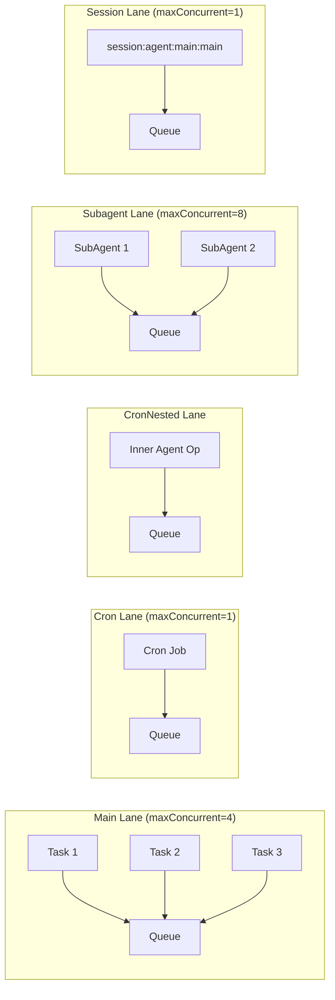
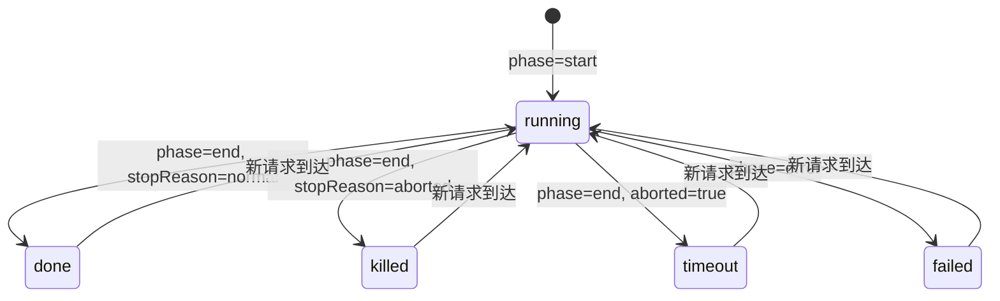

# 第 6 章 — Session 管理：单写者模型与 Lane-aware 命令队列

读完本章，你会理解：

- OpenClaw 的 Session 数据模型——JSONL transcript 文件的结构和 session key 的命名规则
- 单写者（Single-Writer）架构的设计动机，以及文件锁如何保证 transcript 写入的安全性
- Lane-aware 命令队列如何将不同来源的请求隔离到独立泳道，在并发度可控的前提下最大化吞吐
- 六种 Queue Mode（collect、steer、followup、steer-backlog、interrupt、queue）分别解决什么场景的问题
- Session 生命周期的完整状态流转

## 6.1 Session 数据模型

### JSONL Transcript

每个 Session 对应一个 `.jsonl` 文件，存储完整的对话记录。文件的第一行是 Session header，后续每一行是一条独立的 JSON 消息记录。

```jsonl
{"type":"session","version":"...","id":"abc123","timestamp":"2024-01-01T00:00:00.000Z","cwd":"/workspace"}
{"id":"msg_1","message":{"role":"user","content":[{"type":"text","text":"hello"}]}}
{"id":"msg_2","message":{"role":"assistant","content":[{"type":"text","text":"Hi!"}],...}}
```

Header 创建的关键代码在 `src/config/sessions/transcript.ts:27-47`：

```typescript
const header = {
  type: "session",
  version: CURRENT_SESSION_VERSION,
  id: params.sessionId,
  timestamp: new Date().toISOString(),
  cwd: process.cwd(),
};
await fs.promises.writeFile(
  params.sessionFile,
  `${JSON.stringify(header)}\n`,
  { encoding: "utf-8", mode: 0o600 }
);
```

选择 JSONL 而非 JSON 或数据库有两个实际原因：

1. **追加写入**：新消息直接 append 一行，不需要解析整个文件再写回。对于长对话，这避免了反复序列化/反序列化大 JSON 的开销。
2. **容错性**：即使进程在写入中途崩溃，最多丢失最后一行，前面的记录不受影响。JSON 文件如果写到一半，整个文件都无法解析。

每条消息记录带有 `__openclaw.seq` 序号，用于分页游标和增量同步。`SessionHistorySseState`（`src/gateway/session-history-state.ts:115-213`）据此实现 SSE 推送时的增量更新——客户端订阅后，只需要发送 seq 大于上次推送的新消息。

### Session Key 格式

Session key 是 OpenClaw 全局唯一定位一个 Session 的标识符，采用冒号分隔的层级结构：

| 格式 | 示例 | 说明 |
|------|------|------|
| `agent:{agentId}:{mainKey}` | `agent:main:main` | 默认主 Session |
| `agent:{agentId}:{channel}:{peerKind}:{peerId}` | `agent:main:telegram:group:12345` | 群组/频道 Session |
| `agent:{agentId}:direct:{peerId}` | `agent:main:direct:user_001` | 私聊 Session (per-peer) |
| `agent:{agentId}:cron:{jobId}:run:{runId}` | `agent:main:cron:daily:run:20240101` | 定时任务运行记录 |
| `agent:{agentId}:...:thread:{threadId}` | `agent:main:telegram:group:123:thread:456` | 话题/线程 Session |
| `subagent:...` | `subagent:task_abc` | 子 Agent Session |

解析逻辑集中在 `src/sessions/session-key-utils.ts:28-48`。核心规则很简单——按冒号 split，第一段必须是 `"agent"`，第二段是 agentId，剩下的拼成 `rest`：

```typescript
export function parseAgentSessionKey(
  sessionKey: string | undefined | null,
): ParsedAgentSessionKey | null {
  const raw = normalizeOptionalLowercaseString(sessionKey);
  if (!raw) return null;
  const parts = raw.split(":").filter(Boolean);
  if (parts.length < 3 || parts[0] !== "agent") return null;
  const agentId = normalizeOptionalString(parts[1]);
  const rest = parts.slice(2).join(":");
  return agentId && rest ? { agentId, rest } : null;
}
```

DM 会话支持四种 scope 策略：`main`（所有 DM 共享）、`per-peer`（每个用户独立）、`per-channel-peer`（按渠道+用户隔离）、`per-account-channel-peer`（按账号+渠道+用户隔离），通过 `buildAgentPeerSessionKey`（`src/routing/session-key.ts:130-177`）构建对应的 key。

### Session 解析

Gateway 通过 `resolveSessionKeyFromResolveParams`（`src/gateway/sessions-resolve.ts:73`）统一处理 Session 查找。调用方可以传入 `key`、`sessionId` 或 `label` 三者之一。函数内部做了几件事：

- 互斥校验：三个参数只能传一个
- 对 key 查找，先查 canonical key，再回退查 legacy key 并自动迁移
- 对 sessionId/label 查找，从合并后的 store 中列举并匹配
- 校验 Agent 是否仍存在于配置中，防止查到已删除 Agent 的残留 Session

## 6.2 单写者架构

### 设计动机

一个 Agent 可能同时被多个渠道（Telegram、WhatsApp、Slack）的用户访问，同一个 Session 有可能被并发写入。JSONL 文件没有数据库的事务能力——两个进程同时 append 到同一个文件，行与行之间可能交叉写入，产生损坏的记录。

OpenClaw 的解决方案是**单写者模型（Single-Writer）**：任何时刻，每个 Session 的 transcript 文件只允许一个写者持有锁。其他想写入的请求必须排队等待。

### 文件锁实现

写锁的核心在 `src/agents/session-write-lock.ts`。实现基于文件系统的排他创建（`open(lockPath, "wx")`）——`wx` 标志位意味着"创建并写入，如果文件已存在则失败"。这是一个原子操作，不依赖任何外部服务。

锁文件内容是一个 JSON，记录了持有者信息：

```typescript
type LockFilePayload = {
  pid?: number;        // 持有锁的进程 PID
  createdAt?: string;  // 锁创建时间
  starttime?: number;  // 进程启动时的 clock ticks（从 /proc/pid/stat 读取）
};
```

`acquireSessionWriteLock`（`src/agents/session-write-lock.ts:501`）的核心流程：

1. 尝试 `fs.open(lockPath, "wx")` 创建锁文件
2. 成功 → 将 PID 和时间戳写入锁文件，返回 `release` 回调
3. 失败（`EEXIST`） → 锁已被持有，读取锁文件内容判断是否过期
4. 过期 → 删除旧锁文件，重试
5. 未过期 → 等待一段时间后重试，超时则抛出 `SessionWriteLockTimeoutError`

过期检测（stale detection）是这个锁设计中最精巧的部分。判断一个锁是否过期，有三个信号源：

- **PID 存活检测**：通过 `isPidAlive` 检查持有锁的进程是否还在运行
- **PID 回收检测**：即使 PID 存活，也要对比 `/proc/pid/stat` 中的启动时间（starttime）和锁文件记录是否一致——操作系统会回收 PID 号码，同一个 PID 可能属于不同的进程
- **时间超期**：默认 30 分钟（`DEFAULT_STALE_MS`）后认为锁过期

```typescript
// src/agents/session-write-lock.ts:366-380
const staleReasons: string[] = [];
if (pid === null) {
  staleReasons.push("missing-pid");
} else if (!pidAlive) {
  staleReasons.push("dead-pid");
} else if (pidRecycled) {
  staleReasons.push("recycled-pid");
}
if (ageMs === null) {
  staleReasons.push("invalid-createdAt");
} else if (ageMs > staleMs) {
  staleReasons.push("too-old");
}
```

### 锁的生命周期保障

写锁持有后需要保证释放，否则会死锁。OpenClaw 做了三层防护：

1. **正常释放**：调用方通过返回的 `release()` 回调主动释放
2. **进程退出清理**：注册了 `process.on("exit")` 和信号处理器（SIGINT、SIGTERM 等），在进程退出时同步释放所有锁（`releaseAllLocksSync`）
3. **看门狗（Watchdog）**：后台定时器每 60 秒检查一次，超过 `maxHoldMs`（默认 5 分钟）的锁会被强制释放

可重入（reentrant）锁也有支持——同一个进程可以多次获取同一 Session 的锁，内部通过引用计数（`held.count`）跟踪。只有所有引用都释放后才真正删除锁文件。

## 6.3 Lane-aware 命令队列

### 为什么需要 Lane

Agent 系统面临一个核心矛盾：既要保证同一 Session 的消息顺序执行（否则对话上下文会错乱），又不能让所有消息排成一条队列（否则某个 Session 的长耗时操作会阻塞其他 Session）。

OpenClaw 的解决方案是 **Lane-aware 命令队列**——将请求按来源分流到不同的"泳道"（Lane），每个 Lane 有独立的队列和可配置的并发度。

### Lane 定义

Lane 的枚举定义在 `src/process/lanes.ts:1-7`：

```typescript
export const enum CommandLane {
  Main = "main",           // 主消息通道
  Cron = "cron",           // 定时任务
  CronNested = "cron-nested", // 定时任务内嵌 Agent
  Subagent = "subagent",   // 子 Agent
  Nested = "nested",       // 嵌套 Agent
}
```

除了这五个静态 Lane，运行时还会动态创建 `session:{sessionKey}` 格式的 Session-scoped Lane（`src/agents/pi-embedded-runner/lanes.ts:3-6`）。

### 并发度配置

Lane 并发度在 Gateway 启动时通过 `applyGatewayLaneConcurrency`（`src/gateway/server-lanes.ts:6-13`）设置：

```typescript
export function applyGatewayLaneConcurrency(cfg: OpenClawConfig) {
  const cronMaxConcurrentRuns = cfg.cron?.maxConcurrentRuns ?? 1;
  setCommandLaneConcurrency(CommandLane.Cron, cronMaxConcurrentRuns);
  setCommandLaneConcurrency(CommandLane.CronNested, cronMaxConcurrentRuns);
  setCommandLaneConcurrency(CommandLane.Main, resolveAgentMaxConcurrent(cfg));
  setCommandLaneConcurrency(CommandLane.Subagent, resolveSubagentMaxConcurrent(cfg));
}
```

默认并发度（`src/config/agent-limits.ts:3-4`）：

| Lane | 默认并发度 | 配置项 |
|------|-----------|--------|
| Main | 4 | `agents.defaults.maxConcurrent` |
| Cron | 1 | `cron.maxConcurrentRuns` |
| CronNested | 与 Cron 相同 | — |
| Subagent | 8 | `agents.defaults.subagents.maxConcurrent` |
| Nested | 1（默认） | — |
| session:* | 1（默认） | — |

Main Lane 并发度为 4 意味着最多 4 个 Session 可以同时执行 LLM 推理。Subagent Lane 设为 8，高于 Main，是因为子 Agent 通常是轻量级的辅助任务，且可能被多个主 Agent 并行触发。Cron Lane 默认只允许 1 个定时任务同时运行，避免批量定时任务集中触发时耗尽 API 配额。

### Lane 死锁防护

Cron 任务会遇到一个微妙的问题：cron job 占住了 Cron Lane 的执行槽位，如果它内部的 Agent 操作也需要排入 Cron Lane，就会自己等自己——死锁。

OpenClaw 通过 CronNested Lane 解决这个问题。`resolveCronAgentLane`（`src/agents/lanes.ts:18-25`）将 cron 任务内的 Agent 操作重映射到 `cron-nested` Lane：

```typescript
export function resolveCronAgentLane(lane?: string): string {
  const trimmed = lane?.trim();
  if (!trimmed || trimmed === AGENT_LANE_CRON) {
    return AGENT_LANE_CRON_NESTED;
  }
  return trimmed;
}
```

类似地，`resolveGlobalLane`（`src/agents/pi-embedded-runner/lanes.ts:8-16`）在全局层面做了同样的防护。

### 命令队列实现

队列的核心实现在 `src/process/command-queue.ts`。每个 Lane 维护一个内部状态：

```typescript
type LaneState = {
  lane: string;                    // Lane 标识
  queue: QueueEntry[];             // 等待队列
  activeTaskIds: Set<number>;      // 正在执行的任务 ID 集合
  maxConcurrent: number;           // 最大并发度
  draining: boolean;               // 是否正在泵送
  generation: number;              // 代数（用于 SIGUSR1 重启时失效旧任务）
};
```

`enqueueCommandInLane` 入队后立即调用 `drainLane`。drain 的 pump 循环很直接——只要活跃任务数小于 `maxConcurrent` 且队列非空，就取出下一个任务执行。任务完成后递归调用 pump 继续泵送。



`generation` 字段值得单独说明。OpenClaw 支持通过 SIGUSR1 信号触发进程内重启。重启后，旧的 in-flight 任务的 finally 块可能不会执行，导致 `activeTaskIds` 里残留无效的 task ID，永远不会被清除——新任务就永远排不上了。`resetAllLanes`（`src/process/command-queue.ts:341-358`）在重启时递增 generation 并清空 activeTaskIds，同时保留队列中的待执行任务。旧任务完成时检查 generation 不匹配，直接丢弃结果。

Gateway 关闭时，`markGatewayDraining` 会设置全局标记，之后所有 `enqueueCommandInLane` 调用都会立即抛出 `GatewayDrainingError`，避免新任务在关闭过程中被静默丢弃。

## 6.4 Queue Mode 详解

Queue Mode 控制的是：当一个 Session 正在处理消息时，新消息到达后怎么办。这是消息平台场景下的核心策略——用户可能在 Agent 还没回复时连续发送多条消息。

### 六种模式

Queue Mode 定义在 `src/config/types.queue.ts:1-8`：

```typescript
export type QueueMode =
  | "steer"
  | "followup"
  | "collect"
  | "steer-backlog"
  | "steer+backlog"
  | "queue"
  | "interrupt";
```

实际行为由 `resolveActiveRunQueueAction`（`src/auto-reply/reply/queue-policy.ts:5-21`）决定：

| 模式 | 活跃时行为 | 适用场景 |
|------|-----------|---------|
| **collect** | 新消息入队，等当前 run 结束后，将队列中所有消息合并为一个 batch 提交给 LLM | 群聊场景。多个用户短时间内密集发言，合并后一次性处理，减少 API 调用 |
| **steer** | 新消息入队，等当前 run 结束后，取队列中**最新**的一条作为新 prompt | 私聊场景。用户连续发了多条，最后一条通常是最终意图，中间的可以丢弃 |
| **followup** | 新消息入队，等当前 run 结束后，**逐条依次**执行 | 需要每条消息都得到回复的场景。按 FIFO 顺序处理，但不并发 |
| **steer-backlog** | 结合 steer 和 followup：取最新消息 steer，同时保留被跳过的消息作为 followup 补充上下文 | 需要既跟随最新意图、又不完全丢弃中间消息的场景 |
| **interrupt** | 终止当前 run，立即开始处理新消息 | 用户发了"停"或改变主意时，需要即时响应 |
| **queue** | 等同于 steer | 兼容别名 |

默认模式是 `collect`（`src/auto-reply/reply/queue/settings.ts:7-9`）。

### 队列状态管理

每个 Session 的 followup 队列通过全局 `FOLLOWUP_QUEUES` Map 管理（`src/auto-reply/reply/queue/state.ts:29`），key 是 `sessionKey` 或 `sessionId`。队列状态结构：

```typescript
type FollowupQueueState = {
  items: FollowupRun[];     // 待处理消息
  draining: boolean;        // 是否正在消费
  lastEnqueuedAt: number;   // 最后入队时间（用于 debounce）
  mode: QueueMode;          // 当前模式
  debounceMs: number;       // 消抖延迟（默认 1000ms）
  cap: number;              // 队列容量上限（默认 20）
  dropPolicy: QueueDropPolicy; // 超容量时的丢弃策略
  droppedCount: number;     // 已丢弃消息数
  summaryLines: string[];   // 被丢弃消息的摘要
};
```

`debounceMs` 是一个实用的设计——在 collect 模式下，用户可能快速连发 5 条消息，debounce 让队列等 1 秒钟没有新消息后再合并处理，避免"刚合并了 3 条就开始处理，后面 2 条又要排队"的情况。

当队列满（超过 `cap`），`dropPolicy` 决定丢弃策略：`old` 丢最早的、`new` 丢最新的、`summarize` 将被丢弃的消息转化为摘要行保留语境。

### collect 模式的消息合并

collect 模式在消费队列时，会将多条消息按发送者的授权上下文分组（`splitCollectItemsByAuthorization`，`src/auto-reply/reply/queue/drain.ts:84-111`）。授权上下文相同的消息可以安全合并——它们的 senderId、权限级别、执行环境一致。不同授权上下文的消息分开批处理，保证安全边界不被突破。

合并后的 prompt 格式：

```
---
Queued #1 (from Alice)
帮我查一下天气
---
Queued #2 (from Bob)
今天的新闻有哪些
```

### Queue Mode 配置优先级

`resolveQueueSettings`（`src/auto-reply/reply/queue/settings.ts:23-59`）按以下优先级解析最终的 queue mode：

1. 内联指定（API 调用时传入）
2. Session 级别覆盖（`sessionEntry.queueMode`）
3. 渠道级别配置（`messages.queue.byChannel.telegram`）
4. 全局配置（`messages.queue.mode`）
5. 默认值（`collect`）

这意味着可以针对不同渠道设置不同的策略——比如 WhatsApp 用 collect（消息密集），Discord 用 followup（每条都需要回复）。

## 6.5 Session 生命周期

### 状态流转

Session 的运行状态通过 `SessionRunStatus` 追踪。`deriveGatewaySessionLifecycleSnapshot`（`src/gateway/session-lifecycle-state.ts:92-130`）根据生命周期事件推导状态快照：



生命周期事件携带以下关键字段：

- `startedAt`：run 开始时间
- `endedAt`：run 结束时间
- `runtimeMs`：`endedAt - startedAt` 的计算值
- `abortedLastRun`：最后一次 run 是否被终止

### 数据持久化

生命周期状态同时维护两个存储层：

1. **Gateway 内存态**（`GatewaySessionRow`）：用于 WebSocket 推送和 API 查询，响应快
2. **持久化存储**（`SessionEntry` 在 session store JSON 中）：通过 `persistGatewaySessionLifecycleEvent`（`src/gateway/session-lifecycle-state.ts:146-169`）异步写入

这两层通过同一个 `deriveGatewaySessionLifecycleSnapshot` 函数推导，保证逻辑一致。`start` 事件将状态设为 `running` 并清除上次的 `endedAt`，`end`/`error` 事件根据具体原因设定终态。

### Session 解析与迁移

Session store 存在 legacy key 的问题——早期版本的 key 格式和当前的 canonical 格式不同。`resolveSessionKeyFromResolveParams` 在查找 Session 时，如果 canonical key 没命中，会回退查找 legacy key 并自动迁移：

```typescript
// src/gateway/sessions-resolve.ts:121-131
const legacyKey = target.storeKeys.find((candidate) => store[candidate]);
if (!legacyKey) return noSessionFoundResult(key);
await updateSessionStore(target.storePath, (s) => {
  const { primaryKey } = migrateAndPruneGatewaySessionStoreKey({ cfg, key, store: s });
  if (!s[primaryKey] && s[legacyKey]) {
    s[primaryKey] = s[legacyKey];
  }
});
```

另外，Session 解析还会检查关联的 Agent 是否仍存在于配置中（`validateSessionAgentExists`）。如果用户删除了一个 Agent 但其 Session 还残留在 store 里，查询会返回明确的错误而不是过期数据。

## 6.6 设计权衡

**为什么不用数据库？** JSONL + 文件锁的方案足够简单——OpenClaw 作为单机部署的 Agent 系统，不需要跨节点的 Session 共享。文件系统天然支持持久化和备份（`cp`/`rsync`），排查问题时用 `cat`/`jq` 就能直接查看 transcript 内容。代价是无法水平扩展到多节点。

**Lane 的粒度选择。** 当前的 Lane 是按"请求来源类型"划分的（Main/Cron/Subagent），而非按 Session 划分。Session 级别的隔离通过 `session:{key}` 动态 Lane 实现，默认并发度为 1（即同一 Session 串行处理）。这个选择平衡了两个目标：不同 Session 之间可以并行执行 LLM 推理（通过 Main Lane 的 maxConcurrent=4），同一 Session 内保证对话顺序。

**Queue Mode 的默认值是 collect 而非 steer。** 这是一个偏保守的选择——collect 不会丢弃任何消息，而 steer 会跳过中间消息。对于付费消息渠道（WhatsApp Business），丢弃用户消息是不可接受的。如果业务场景明确只需要最新意图，可以配置为 steer。

## 练习

**思考题**

1. OpenClaw 用 JSONL 文件存储 Session transcript，而不是用 SQLite 或其他数据库。假设你需要实现一个"搜索历史对话"的功能（在所有 Session 中全文搜索关键词），JSONL 方案的查询效率如何？你会怎样在不改变存储格式的前提下加速搜索？

2. 四种 Queue Mode 中，`steer` 模式会跳过中间消息只处理最新的。在一个客服场景下，用户连续发了三条消息："我要退货"、"订单号是 12345"、"收货地址写错了"。如果使用 steer 模式，Agent 只会看到第三条消息。分析这种信息丢失会导致什么问题，以及 `steer-backlog` 模式是如何缓解的。

**动手题**

3. 找到 OpenClaw 数据目录下的一个 `.jsonl` transcript 文件（通常在 `~/.openclaw/sessions/` 下），用 `cat` 查看其内容。分析第一行的 Session header 包含哪些字段，后续消息行的结构是什么。尝试用 `jq` 提取出所有 `role: "user"` 的消息内容。
