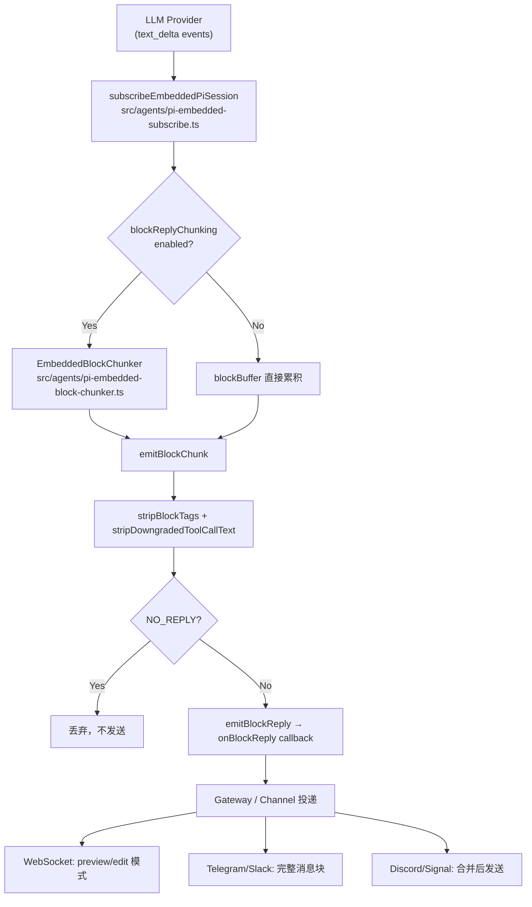

# 第 7 章 流式响应：分块输出、段落感知与 NO_REPLY 机制

读完这章，你能掌握：模型产出 token 后如何经过管道变成用户看到的消息；block streaming 的分块策略为什么选择 800-1200 字符区间和段落边界优先；代码块内部为什么不能拆分以及 OpenClaw 如何做到"拆了又合"；NO_REPLY sentinel 怎样让 agent 在该沉默时真的沉默；tool 执行期间的流式事件如何让用户知道"正在干活"；以及不同渠道为什么需要差异化的流式策略。

## 7.1 流式管道全景

一条从模型到用户的流式消息，经过的管道远比想象中复杂。直觉上，模型吐 token、前端收 token、渲染完事。但实际工程中，你至少要处理这些问题：token 粒度太细不适合直接发送给 IM 渠道、代码块被拆成两截会导致 Markdown 渲染崩掉、模型有时候应该沉默但还是说了话、不同渠道对消息更新的支持能力天差地别。

OpenClaw 的流式管道可以用下图概括：



## 7.2 事件源：从 text_delta 到 message_end

模型侧的流式事件遵循一套固定的生命周期。理解这套生命周期是读懂后续所有机制的前提。

核心事件类型：

| 事件 | 含义 | 频率 |
|------|------|------|
| `message_start` | 一条新的 assistant 消息开始 | 每条消息一次 |
| `text_start` | 文本内容块开始 | 每个 content block 一次 |
| `text_delta` | 增量文本片段 | 高频，每个 token 或几个 token 一次 |
| `text_end` | 文本内容块结束 | 每个 content block 一次 |
| `message_end` | 整条消息结束 | 每条消息一次 |

`handleMessageUpdate` 是处理所有流式文本事件的入口（`src/agents/pi-embedded-subscribe.handlers.messages.ts:399`）。它从 `assistantMessageEvent` 中提取事件类型，只关心 `text_delta`、`text_start` 和 `text_end` 三种文本事件：

```typescript
// src/agents/pi-embedded-subscribe.handlers.messages.ts:460
if (evtType !== "text_delta" && evtType !== "text_start" && evtType !== "text_end") {
  return;
}
```

每个 `text_delta` 事件携带一个 `delta` 字段——模型新产出的文本片段。这些 delta 被追加到 `deltaBuffer`，同时喂给 `blockChunker`（如果启用了分块）：

```typescript
// src/agents/pi-embedded-subscribe.handlers.messages.ts:518
if (chunk) {
  ctx.state.deltaBuffer += chunk;
  if (!shouldUsePhaseAwareBlockReply) {
    appendBlockReplyChunk(ctx, chunk);
  }
}
```

不同 provider 对 `text_end` 的处理并不一致。有些 provider 在 `text_end` 时会重发完整内容，有些只发最后一个 delta，有些什么都不发。`resolveAssistantTextChunk` 函数做了兼容处理（`src/agents/pi-embedded-subscribe.handlers.messages.ts:132`），确保不管 provider 怎么发，输出都是单调递增的：

```typescript
// src/agents/pi-embedded-subscribe.handlers.messages.ts:148-159
// KNOWN: Some providers resend full content on `text_end`.
// We only append a suffix (or nothing) to keep output monotonic.
if (content.startsWith(accumulatedText)) {
  return content.slice(accumulatedText.length);
}
if (accumulatedText.startsWith(content)) {
  return "";
}
```

### blockReplyBreak：两种刷新时机

`blockReplyBreak` 参数决定了何时触发 block reply 的刷新，有两个取值：

- **`text_end`**：在每个文本块结束时就刷新。适用于 WebSocket 类渠道，能更快地推送内容给用户。在 `text_delta` 期间也会尝试 drain chunker，实现"边生成边发送"。
- **`message_end`**：等整条消息结束后才刷新。适用于 IM 类渠道，避免频繁编辑消息。

```typescript
// src/agents/pi-embedded-subscribe.handlers.messages.ts:622-630
if (
  ctx.params.onBlockReply &&
  ctx.blockChunking &&
  ctx.state.blockReplyBreak === "text_end"
) {
  ctx.blockChunker?.drain({ force: false, emit: ctx.emitBlockChunk });
}
```

## 7.3 Block Streaming：为什么要分块

直接把模型的每个 token 推给用户是不现实的。以 Telegram 为例，每条消息编辑都是一次 API 调用，如果每收到一个 token 就编辑一次，几秒钟之内就会触发 rate limit。另一个极端——等整条消息生成完再发送——用户体验又太差，长回复可能要等十几秒才看到内容。

Block streaming 是中间方案：把流式 token 累积到一定量后，按"块"发送。OpenClaw 通过 `EmbeddedBlockChunker`（`src/agents/pi-embedded-block-chunker.ts`）实现这个策略。

### 分块参数

`BlockReplyChunking` 配置定义了分块行为：

```typescript
// src/agents/pi-embedded-block-chunker.ts:4-9
export type BlockReplyChunking = {
  minChars: number;
  maxChars: number;
  breakPreference?: "paragraph" | "newline" | "sentence";
  flushOnParagraph?: boolean;
};
```

- **`minChars`**：最小分块大小。buffer 内容不到这个量就不分割。典型值 800。
- **`maxChars`**：最大分块大小。到达这个量必须强制分割。典型值 1200。
- **`breakPreference`**：优先在哪种边界分割。默认 `"paragraph"`。
- **`flushOnParagraph`**：遇到段落边界时是否提前刷新（即使没到 maxChars）。

不同渠道有自己的 coalesce 配置。例如 Discord、Slack、Signal 等 IM 渠道统一使用 `{ minChars: 1500, idleMs: 1000 }`（参见 `extensions/discord/src/shared.ts:114`、`extensions/slack/src/shared.ts:117`），因为这些渠道的 API rate limit 更严格，需要更大的合并窗口。

### 分割优先级

`EmbeddedBlockChunker` 的 `#pickBreakIndex` 方法（`src/agents/pi-embedded-block-chunker.ts:312`）实现了一个多级回退的分割策略：

1. **段落边界（`\n\n`）**：在 `[minChars, maxChars]` 窗口内，从后往前找最后一个 `\n\n` 位置。段落是最自然的分割点——用户读到段落结尾时，心理上已经准备好接收下一块内容。
2. **换行符（`\n`）**：没有段落边界时，退而求其次找单个换行符。
3. **句末标点（`.!?`）**：在句子结尾分割，保证每块至少是语义完整的。
4. **空白字符**：最后的兜底——在任意空白处分割，总好过在单词中间断开。
5. **硬切割**：如果连空白都找不到（比如超长的 URL），在 maxChars 处强制切断。

这里的关键设计是"从后往前找"（`reverse: true`）。在 `[minChars, maxChars]` 的窗口内，分割点越靠后，每块内容越大，总块数越少，API 调用次数也越少。

```typescript
// src/agents/pi-embedded-block-chunker.ts:326-337
if (preference === "paragraph") {
  const paragraphIdx = findSafeParagraphBreakIndex({
    text: window,
    fenceSpans,
    minChars,
    reverse: true,
    offset,
  });
  if (paragraphIdx !== -1) {
    return { index: paragraphIdx };
  }
}
```

### flushOnParagraph 模式

当 `flushOnParagraph` 为 `true` 时，chunker 采取一种更激进的策略：只要累积内容超过 `minChars` 且遇到段落边界，立即刷新，不等到 `maxChars`。这种模式适合对响应速度要求更高的场景——用户能更快看到第一块内容。

在 `drain` 方法中，这个逻辑优先于常规分割执行：

```typescript
// src/agents/pi-embedded-block-chunker.ts:166-181
if (this.#chunking.flushOnParagraph && !force) {
  const paragraphBreak = findNextParagraphBreak(source, fenceSpans, start, minChars);
  const paragraphLimit = Math.max(1, maxChars - reopenPrefix.length);
  if (paragraphBreak && paragraphBreak.index - start <= paragraphLimit) {
    const chunk = `${reopenPrefix}${source.slice(start, paragraphBreak.index)}`;
    if (chunk.trim().length > 0) {
      emit(chunk);
    }
    start = skipLeadingNewlines(source, paragraphBreak.index + paragraphBreak.length);
    reopenFence = undefined;
    continue;
  }
  if (remainingLength < maxChars) {
    break;
  }
}
```

## 7.4 段落感知分块：代码块保护

段落感知分块有一个棘手的问题：Markdown 代码块（fenced code block）内部的空行不是段落边界。如果在代码块内部的 `\n\n` 处分割，会产生两段各自不完整的代码块，Markdown 渲染会崩掉。

OpenClaw 通过 `FenceSpan` 机制解决这个问题。

### Fence 解析

`parseFenceSpans`（`src/markdown/fences.ts:9`）扫描整个 buffer，找出所有 fenced code block 的起止范围。它支持 `` ``` `` 和 `~~~` 两种 fence 标记，并正确处理嵌套（关闭标记的 marker 长度必须不小于打开标记）：

```typescript
// src/markdown/fences.ts:28
const match = line.match(/^( {0,3})(`{3,}|~{3,})(.*)$/);
```

解析结果是一个 `FenceSpan` 数组，每个 span 记录了 `start`、`end`、`openLine`（打开行的完整内容）、`marker`（如 ```` ``` ````）和 `indent`（缩进）。

### 安全分割检查

每次尝试在某个位置分割时，`isSafeFenceBreak` 检查该位置是否落在某个 fenced code block 内部。所有的分割函数——`findSafeParagraphBreakIndex`、`findSafeNewlineBreakIndex`、`findSafeSentenceBreakIndex`——都调用这个检查：

```typescript
// src/agents/pi-embedded-block-chunker.ts:67-68
if (!isSafeFenceBreak(fenceSpans, index)) {
  continue;
}
```

如果所有"安全"的分割点都不满足 minChars 条件，而 buffer 又超过了 maxChars，chunker 进入**fence split** 模式。

### Fence Split：关闭再重开

fence split 是整个分块机制中最精巧的部分。当必须在代码块内部强制分割时，chunker 会：

1. 在分割点插入一个关闭 fence 标记（与原 fence 的 marker 和缩进一致）
2. 在下一块的开头插入重新打开的 fence 标记（复制原始的 openLine）

```typescript
// src/agents/pi-embedded-block-chunker.ts:375-394
const fence = findFenceSpanAt(fenceSpans, offset + maxChars);
if (fence) {
  const closeFenceStart = findFenceCloseLineStart(buffer, fence, offset);
  // ...
  return {
    index: maxChars,
    fenceSplit: {
      closeFenceLine: `${fence.indent}${fence.marker}`,
      reopenFenceLine: fence.openLine,
      fence,
    },
  };
}
```

实际发送时，第一块末尾追加关闭标记，下一块开头带上重新打开标记：

```typescript
// src/agents/pi-embedded-block-chunker.ts:244-249
if (fenceSplit) {
  const closeFence = rawChunk.endsWith("\n")
    ? `${fenceSplit.closeFenceLine}\n`
    : `\n${fenceSplit.closeFenceLine}\n`;
  rawChunk = `${rawChunk}${closeFence}`;
}
```

这样用户在每一块中看到的都是合法的 Markdown。前端渲染不会出问题，代码高亮也能正确工作。代价是总字符数略有膨胀（多出的 fence 标记），但这个代价完全可以接受。

## 7.5 NO_REPLY Sentinel

### 设计动机

Agent 不是每次被触发都需要回复用户。考虑这些场景：

- heartbeat 检查发现没有需要通知的事情
- 群聊中有人说了一句与 agent 无关的话
- subagent 完成任务后，结果已经通过 messaging tool 发送给了用户

在这些场景中，模型应该"沉默"——不产出任何用户可见的消息。但 LLM 的特性决定了它必须生成一些文本作为回复。`NO_REPLY` sentinel 就是为此设计的协议：模型回复 `NO_REPLY` 这个特殊 token，系统识别后丢弃，不投递给用户。

### 实现

`SILENT_REPLY_TOKEN` 定义在 `src/auto-reply/tokens.ts:4`：

```typescript
export const SILENT_REPLY_TOKEN = "NO_REPLY";
```

识别逻辑通过正则匹配，允许首尾有空白：

```typescript
// src/auto-reply/tokens.ts:32-42
export function isSilentReplyText(
  text: string | undefined,
  token: string = SILENT_REPLY_TOKEN,
): boolean {
  if (!text) {
    return false;
  }
  return getSilentExactRegex(token).test(text);
}
```

### 流式过滤

NO_REPLY 的复杂之处在于流式场景。模型逐 token 生成 `N`、`O`、`_`、`R`、`E`、`P`、`L`、`Y`，在前几个 token 到达时，系统还无法确定最终回复是不是 NO_REPLY。

`isSilentReplyPrefixText`（`src/auto-reply/tokens.ts:142`）处理这个问题。它检查当前累积的文本是否是 `NO_REPLY` 的前缀——但要避免误杀。自然语言中 "No" 开头的句子非常常见，所以它加了严格限制：只有全大写文本才被视为前缀，并且至少需要 2 个字符：

```typescript
// src/auto-reply/tokens.ts:155-178
if (trimmed !== trimmed.toUpperCase()) {
  return false;
}
// ...
if (normalized.length < 2) {
  return false;
}
// ...
return tokenUpper === SILENT_REPLY_TOKEN && normalized === "NO";
```

### Gateway 层的控制回复过滤

Gateway 层还有一道额外防线。`isSuppressedControlReplyText`（`src/gateway/control-reply-text.ts:32`）检查最终的回复文本是否是控制 token：

```typescript
// src/gateway/control-reply-text.ts:3-7
const SUPPRESSED_CONTROL_REPLY_TOKENS = [
  SILENT_REPLY_TOKEN,
  "ANNOUNCE_SKIP",
  "REPLY_SKIP",
] as const;
```

除了 `NO_REPLY`，还有 `ANNOUNCE_SKIP`（跳过 announcement）和 `REPLY_SKIP`（跳过回复）两个控制 token。流式场景中，`isSuppressedControlReplyLeadFragment` 检查累积文本是否像某个控制 token 的前缀，使用与 `isSilentReplyPrefixText` 类似的前缀匹配策略。

这种双层过滤——agent 层和 gateway 层各做一次——确保控制 token 在任何路径上都不会泄露给用户。

## 7.6 emitBlockChunk：分块发射的完整流程

理解了分块策略和 NO_REPLY 过滤后，来看看一块内容从 chunker 出来到投递给渠道的完整流程。`emitBlockChunk`（`src/agents/pi-embedded-subscribe.ts:642`）是这个流程的核心：

```typescript
// src/agents/pi-embedded-subscribe.ts:642-702（简化）
const emitBlockChunk = (text: string) => {
  if (state.suppressBlockChunks || params.silentExpected) {
    return;
  }
  // 1. 剥离 <think> 和 <final> 标签，去掉降级的 tool call 文本
  const chunk = stripDowngradedToolCallText(
    stripBlockTags(text, state.blockState)
  ).trimEnd();
  if (!chunk) return;

  // 2. 去重：与上一块相同则跳过
  if (chunk === state.lastBlockReplyText) return;

  // 3. 去重：与 messaging tool 已发送的文本重复则跳过
  const normalizedChunk = normalizeTextForComparison(chunk);
  if (isMessagingToolDuplicateNormalized(normalizedChunk, messagingToolSentTextsNormalized)) {
    return;
  }

  // 4. 记录并推入 assistantTexts
  state.lastBlockReplyText = chunk;
  pushAssistantText(chunk);

  // 5. 解析 reply directives（媒体、回复引用等）
  const splitResult = replyDirectiveAccumulator.consume(chunk);
  // ...
  // 6. 通过 onBlockReply 回调投递给渠道
  emitBlockReply({ text: cleanedText, mediaUrls, ... });
};
```

几个关键点：

- **stripBlockTags** 是有状态的。它跟踪 `<think>` 和 `<final>` 标签的开关状态跨越 chunk 边界。一个 `<think>` 在第 N 块打开，在第 N+2 块关闭，中间的内容全部被过滤。
- **messaging tool 去重**防止 agent 通过 tool 发了消息后，又在回复中重复相同内容。
- **reply directives** 是嵌入在文本中的元数据指令（如 `MEDIA:url`），在发射时被解析并剥离，转为结构化的 payload 字段。

## 7.7 Tool 执行期间的流式事件

模型调用 tool 时，流式管道不会静默等待。OpenClaw 通过 item 事件系统让用户实时看到 tool 的执行状态。

事件处理入口在 `src/agents/pi-embedded-subscribe.handlers.ts:75`，通过 `scheduleEvent` 串行化所有事件处理：

```typescript
// src/agents/pi-embedded-subscribe.handlers.ts:92-109
case "tool_execution_start":
  scheduleEvent(evt, () => {
    return handleToolExecutionStart(ctx, evt);
  });
  return;
case "tool_execution_update":
  scheduleEvent(evt, () => {
    handleToolExecutionUpdate(ctx, evt);
  });
  return;
case "tool_execution_end":
  scheduleEvent(evt, () => {
    return handleToolExecutionEnd(ctx, evt);
  }, { detach: true });
  return;
```

注意 `tool_execution_end` 使用了 `{ detach: true }`——它不阻塞后续事件的处理。tool 结束后的清理工作（hook 回调、媒体提取等）可能比较耗时，detach 确保后续的 `message_start` 或 `text_delta` 不会被阻塞。

### Item 事件广播

`emitTrackedItemEvent`（`src/agents/pi-embedded-subscribe.handlers.tools.ts:135`）负责将 tool 状态变化广播给前端：

```typescript
// src/agents/pi-embedded-subscribe.handlers.tools.ts:135-152
function emitTrackedItemEvent(ctx: ToolHandlerContext, itemData: AgentItemEventData): void {
  if (itemData.phase === "start") {
    ctx.state.itemActiveIds.add(itemData.itemId);
    ctx.state.itemStartedCount += 1;
  } else if (itemData.phase === "end") {
    ctx.state.itemActiveIds.delete(itemData.itemId);
    ctx.state.itemCompletedCount += 1;
  }
  emitAgentItemEvent({
    runId: ctx.params.runId,
    data: itemData,
  });
}
```

每个 tool 调用有唯一的 `itemId`（格式 `tool:<toolCallId>`），前端可以据此展示进度指示器。exec/bash 类 tool 还有专门的 `command:<toolCallId>` item，在 tool 运行期间实时推送命令输出。

### Block reply 的 flush 时机

tool 开始执行前，系统会先 flush 所有已缓冲的 block reply。这确保用户在看到"正在执行 xxx"之前，已经收到了模型之前生成的所有文本。这个行为由 `handleToolExecutionStart` 内部的 `flushBlockReplyBuffer` 调用实现。

## 7.8 多渠道的流式差异处理

不同渠道对消息更新的支持能力差异很大，OpenClaw 通过 `blockReplyBreak` 和 `blockStreamingCoalesceDefaults` 两个维度做适配。

### WebSocket 渠道（Web UI、桌面客户端）

WebSocket 连接天然支持高频的增量更新。这类渠道使用 `blockReplyBreak: "text_end"` 模式：

- 每个 `text_delta` 期间就尝试 drain chunker，实现真正的"流式"体验
- 前端通过 `stream: "assistant"` 事件收到增量 delta，直接追加到已有内容
- `replace` 标志位处理内容回退（如 phase 切换导致的内容替换）

partial reply（`onPartialReply`）让前端可以做打字机效果——逐字显示正在生成的内容。

### IM 渠道（Telegram、Slack、Discord 等）

IM 渠道有严格的 API rate limit，频繁编辑消息会被限流。这类渠道使用 `blockReplyBreak: "message_end"` 配合较大的 coalesce 参数：

```typescript
// extensions/slack/src/shared.ts:117
blockStreamingCoalesceDefaults: { minChars: 1500, idleMs: 1000 },
```

`minChars: 1500` 意味着至少累积 1500 个字符才触发一次消息发送/编辑。`idleMs: 1000` 表示模型停止输出 1 秒后也触发发送——防止短回复一直缓冲。

IM 渠道的流式输出通常采用"先发后编辑"模式：

1. 第一块内容到达时，发送一条新消息，拿到消息 ID
2. 后续块到达时，编辑该消息，追加新内容
3. 最后一块发送后，做一次最终编辑确保内容完整

这种模式要求 block chunking 产出的每一块都是合法的 Markdown——这也是 fence split 机制存在的根本原因。

### message_end 的兜底发送

不管 `blockReplyBreak` 设成什么，`handleMessageEnd` 都会做一次兜底检查（`src/agents/pi-embedded-subscribe.handlers.messages.ts:813-862`）。如果 chunker 里还有未发送的内容，强制 drain；如果 text_end 渠道已经发过了，跳过重复发送：

```typescript
// src/agents/pi-embedded-subscribe.handlers.messages.ts:841
if (ctx.state.blockReplyBreak === "text_end" && ctx.state.lastBlockReplyText != null) {
  ctx.log.debug(
    `Skipping message_end safety send for text_end channel - content already delivered via text_end`
  );
}
```

## 7.9 thinking 流的处理

模型的 thinking/reasoning 内容有独立的流式路径。`<think>` 标签包裹的内容被 `stripBlockTags` 过滤后，不会出现在用户可见的 block reply 中，而是通过 `emitReasoningStream` 走一条独立的广播通道：

```typescript
// src/agents/pi-embedded-subscribe.ts:732-765
const emitReasoningStream = (text: string) => {
  // ...
  emitAgentEvent({
    runId: params.runId,
    stream: "thinking",
    data: { text: formatted, delta },
  });
  void params.onReasoningStream({ text: formatted });
};
```

`stream: "thinking"` 事件让前端可以选择性地展示推理过程（如折叠面板），而不是把推理文本混入回复正文。

`stripBlockTags` 的状态跟踪（`state.blockState.thinking`）跨越 chunk 边界工作。一个 `<think>` 标签可能在第 N 个 delta 中打开，在第 N+50 个 delta 中关闭，中间所有 delta 的文本都会被正确过滤。

## 7.10 设计取舍与工程启示

**分块大小为什么是 800-1200？** 这不是拍脑袋的数字。太小（如 200 字符）导致 API 调用过于频繁，IM 渠道 rate limit 扛不住；太大（如 5000 字符）导致用户等待时间过长，流式体验退化成批处理。800-1200 是在"响应速度"和"API 调用频率"之间的工程折中。IM 渠道进一步提高到 1500，是因为它们的 rate limit 更严格。

**为什么用 sentinel 而不是结构化控制？** 一个合理的替代方案是让模型返回 JSON，通过字段标记"是否沉默"。但 sentinel 方案有一个优势：它对模型的输出格式没有约束。模型可以自由决定是输出自然语言还是 NO_REPLY，不需要强制 JSON 模式。代价是需要前缀检测等复杂的流式过滤逻辑。

**事件串行化为什么重要？** `scheduleEvent` 把所有事件处理串行化到一个 promise chain 上。这避免了并发修改 state 的风险——`deltaBuffer`、`blockBuffer`、`blockState` 等状态在多个事件处理器间共享，并发写入会导致数据竞争。唯一的例外是 `tool_execution_end`，它通过 `detach: true` 脱离 chain，因为 tool 结束的清理工作不修改核心流式状态。

## 练习

**思考题**

1. NO_REPLY sentinel 依赖模型在输出的最前面生成特定字符串来表示"沉默"。如果模型输出 `NO_REPLY but actually I want to say something`，当前的前缀检测逻辑会怎么处理？这种误判的概率有多大？你能想到更健壮的替代方案吗？

2. 流式分块使用 800-1200 字符作为默认大小，IM 渠道提高到 1500。假设你要接入一个限制更严格的渠道（比如短信，单条上限 160 字符），分块策略需要怎么调整？段落感知的代码块保护逻辑是否还能正常工作？

**动手题**

3. 在 OpenClaw 源码中找到 `emitBlockChunk` 函数，阅读其分块逻辑。构造一个包含 Markdown 代码块的长文本（比如一段 2000 字符的代码片段），在代码中模拟该文本的流式到达过程，验证代码块保护逻辑是否会把代码块拆分到两个 chunk 中。
