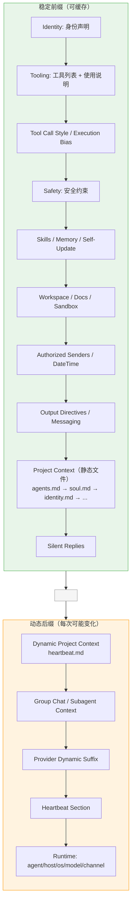

# 第 8 章 — System Prompt 组装：动态拼装的工程艺术

读完这章，你会理解 OpenClaw 如何将十几个来源的信息拼装成一份完整的 System Prompt，包括各段落的组装顺序、Bootstrap 文件的预算控制机制、Prompt Cache 稳定性优化策略，以及"信息量"和"token 成本"之间的工程权衡。这些知识可以直接应用到任何需要动态构建 System Prompt 的 Agent 系统中。

## 8.1 为什么 System Prompt 需要"组装"

大多数 LLM 应用的 System Prompt 是一段写死的字符串。OpenClaw 不同——它是一个多渠道、多 Agent、多工具的运行时，同一个 Agent 在不同场景下需要的上下文完全不同：

- 在 Telegram 上跑和在 Discord 上跑，消息能力不一样
- 主 Agent 和子 Agent 需要的信息量不一样
- 工作区里有没有 SOUL.md、HEARTBEAT.md，prompt 结构不一样
- 用户有没有配置 Skills，工具列表是否包含 browser，都会影响 prompt 内容

把这些全写进一份静态 prompt 是不现实的。OpenClaw 的做法是：定义一套组装规则，在每次请求时按规则拼出一份当前场景专属的 System Prompt。

核心入口是 `buildAgentSystemPrompt()` 函数，位于 `src/agents/system-prompt.ts:448`。这个函数接收一个巨大的参数对象（超过 40 个字段），返回一个拼好的字符串。

## 8.2 组装顺序：从身份声明到运行时元数据

`buildAgentSystemPrompt()` 的输出是一个由 `\n` 连接的字符串数组。下面是完整的组装顺序，每一段对应源码中的一个 section：

| 序号 | Section | 说明 | 是否受 promptMode 控制 |
|------|---------|------|----------------------|
| 1 | Identity | `"You are a personal assistant running inside OpenClaw."` | 始终包含 |
| 2 | Tooling | 可用工具列表及使用说明 | 始终包含 |
| 3 | Tool Call Style | 工具调用的交互风格指导 | 可被 Provider 覆盖 |
| 4 | Execution Bias | 行为偏好（优先行动而非询问） | minimal 模式跳过 |
| 5 | Provider Stable Prefix | Provider 注入的稳定前缀 | 可选 |
| 6 | Safety | 安全约束（不追求自我保存、不绕过防护） | 始终包含 |
| 7 | CLI Quick Reference | OpenClaw CLI 命令参考 | 始终包含 |
| 8 | Skills | Skills 元数据和使用规则 | 有 Skills 时包含 |
| 9 | Memory | 记忆检索指导 | minimal 模式跳过 |
| 10 | Self-Update | 自更新规则（仅限用户明确请求） | 需要 gateway 工具 |
| 11 | Model Aliases | 模型别名映射 | minimal 模式跳过 |
| 12 | Workspace | 工作目录路径和文件操作指导 | 始终包含 |
| 13 | Docs | 文档路径和查询建议 | minimal 模式跳过 |
| 14 | Sandbox | 沙箱运行时信息 | 仅沙箱模式 |
| 15 | Authorized Senders | 用户身份标识 | minimal 模式跳过 |
| 16 | Date & Time | 时区信息 | 有配置时包含 |
| 17 | Workspace Files | 提示"下方有注入的项目上下文" | 始终包含 |
| 18 | Output Directives | MEDIA 标签、reply 标签等输出格式 | minimal 模式跳过 |
| 19 | Webchat Canvas | embed 渲染指导 | 仅 webchat 渠道 |
| 20 | Messaging | 跨 Session 消息路由 | minimal 模式跳过 |
| 21 | Voice | TTS 指导 | 有配置时包含 |
| 22 | Reactions | Telegram 反应指导 | 有配置时包含 |
| 23 | Reasoning Format | 思考标签格式（`<think>...</think>`） | 有配置时包含 |
| 24 | **Project Context（静态）** | 排序后的上下文文件（SOUL.md 等） | 始终包含 |
| 25 | Silent Replies | `NO_REPLY` token 使用规则 | minimal 模式跳过 |
| — | **CACHE BOUNDARY** | `<!-- OPENCLAW_CACHE_BOUNDARY -->` | — |
| 26 | Project Context（动态） | heartbeat.md 等频繁变化的文件 | 有文件时包含 |
| 27 | Extra Context | Group Chat / Subagent 上下文 | 有内容时包含 |
| 28 | Provider Dynamic Suffix | Provider 注入的动态后缀 | 可选 |
| 29 | Heartbeat | 心跳轮询指导 | 非 minimal 且有配置 |
| 30 | Runtime | 运行时元数据（host/os/model/channel） | 始终包含 |

### 三种 Prompt 模式

`promptMode` 参数控制 prompt 的详略程度，有三个取值：

- **`"full"`**：包含所有 section，用于主 Agent（默认值）
- **`"minimal"`**：裁减大部分 section，只保留 Tooling、Workspace、Runtime，用于子 Agent
- **`"none"`**：只返回一行身份声明，不含任何 section

```typescript
// src/agents/system-prompt.ts:708-710
if (promptMode === "none") {
  return "You are a personal assistant running inside OpenClaw.";
}
```

这个三级控制是一个典型的"信息量 vs token 成本"权衡：子 Agent 通常执行单一任务，不需要知道 TTS 怎么用、Reactions 怎么配。给它一份精简的 prompt 能节省 token，也能减少干扰。

## 8.3 Tooling Section：运行时决定工具集

Tooling section 的核心任务是告诉模型"你有哪些工具可用"。OpenClaw 不是在 prompt 里硬编码工具名称——它从运行时传入的 `toolNames` 数组动态生成。

```typescript
// src/agents/system-prompt.ts:544-570
const toolOrder = [
  "read", "write", "edit", "apply_patch", "grep", "find", "ls",
  "exec", "process", "web_search", "web_fetch", "browser", "canvas",
  "nodes", "cron", "message", "gateway", "agents_list",
  "sessions_list", "sessions_history", "sessions_send",
  "subagents", "session_status", "image", "image_generate",
];
```

`toolOrder` 定义了工具在 prompt 中的展示顺序。实际可用的工具是 `toolNames` 和 `toolOrder` 的交集，加上不在 `toolOrder` 中的额外工具（按字母排序追加）。每个工具附带一行摘要说明：

```typescript
// src/agents/system-prompt.ts:604-613
const enabledTools = toolOrder.filter((tool) => availableTools.has(tool));
const toolLines = enabledTools.map((tool) => {
  const summary = coreToolSummaries[tool] ?? externalToolSummaries.get(tool);
  const name = resolveToolName(tool);
  return summary ? `- ${name}: ${summary}` : `- ${name}`;
});
```

这个设计有两个关键细节。第一，工具名称大小写敏感——prompt 里明确写了 `"Tool names are case-sensitive. Call tools exactly as listed."`。第二，外部工具（通过 Plugin SDK 注册的）可以通过 `toolSummaries` 参数注入自己的摘要，和内置工具享受同等的 prompt 待遇。

## 8.4 Bootstrap 文件注入与预算控制

Bootstrap 文件是 OpenClaw 的项目上下文机制——用户在工作区放置 `SOUL.md`、`agents.md`、`tools.md` 等文件，OpenClaw 读取并注入到 System Prompt 中。

### 文件排序

上下文文件不是随意排列的。`CONTEXT_FILE_ORDER` 定义了一份固定的优先级：

```typescript
// src/agents/system-prompt.ts:45-53
const CONTEXT_FILE_ORDER = new Map<string, number>([
  ["agents.md", 10],
  ["soul.md", 20],
  ["identity.md", 30],
  ["user.md", 40],
  ["tools.md", 50],
  ["bootstrap.md", 60],
  ["memory.md", 70],
]);
```

数字越小优先级越高。`agents.md` 排第一，因为它包含最核心的 Agent 行为定义；`soul.md` 紧随其后，定义人格和语气。不在列表中的文件被赋予 `Number.MAX_SAFE_INTEGER`，排到最后，按文件名字母序排列。

### 预算控制

Bootstrap 文件可能很大。一份项目的 CLAUDE.md 写到几万字符并不罕见。如果全部注入，prompt 会膨胀到不可接受的长度。OpenClaw 用两级预算控制来约束：

| 参数 | 默认值 | 含义 |
|------|--------|------|
| `bootstrapMaxChars` | 12,000 | 单个文件的最大字符数 |
| `bootstrapTotalMaxChars` | 60,000 | 所有 Bootstrap 文件的总字符数上限 |

这两个值可以通过配置 `agents.defaults.bootstrapMaxChars` 和 `agents.defaults.bootstrapTotalMaxChars` 调整。

```typescript
// src/agents/pi-embedded-helpers/bootstrap.ts:87-88
export const DEFAULT_BOOTSTRAP_MAX_CHARS = 12_000;
export const DEFAULT_BOOTSTRAP_TOTAL_MAX_CHARS = 60_000;
```

超出预算的文件会被截断，截断策略是保留前 75% 和后 25%：

```typescript
// src/agents/pi-embedded-helpers/bootstrap.ts:95-96
const BOOTSTRAP_HEAD_RATIO = 0.75;
const BOOTSTRAP_TAIL_RATIO = 0.25;
```

为什么是 75/25？因为大多数项目配置文件的开头包含最重要的信息（项目定义、核心规则），尾部包含次要但有时仍然需要的内容（附录、特殊场景），中间是最容易被跳过的部分。

### 截断警告

文件被截断后，OpenClaw 会生成一条警告追加到 prompt 末尾：

```
[Bootstrap truncation warning]
Some workspace bootstrap files were truncated before injection.
Treat Project Context as partial and read the relevant files directly
if details seem missing.
- CLAUDE.md: 25000 raw -> 12000 injected (~52% removed; max/file).
```

这条警告告诉模型"你看到的上下文是不完整的"，引导它在需要时主动用 `read` 工具读取完整文件。这是一个务实的降级策略：先给模型一个精简版，让它自己判断是否需要完整版。

`buildBootstrapPromptWarning()` 还支持 `"once"` 模式（默认）——同一个截断签名只警告一次，避免重复干扰。签名基于被截断文件的路径、原始大小和注入大小生成，只有截断情况发生变化时才会重新警告。

## 8.5 Prompt Cache 稳定性优化

LLM API 的 Prompt Cache（也叫 prefix caching）机制是这样工作的：如果两次请求的 System Prompt 前缀完全相同，API 可以复用上一次的 KV Cache，跳过前缀部分的计算。这能显著降低延迟和成本——在 Anthropic 的定价中，缓存命中的 token 价格是正常价格的 1/10。

但前缀必须**逐字节相同**。哪怕多了一个空格，Cache 就失效了。

OpenClaw 在组装 prompt 时做了两件事来保证前缀稳定。

### 第一：标准化文本内容

`normalizeStructuredPromptSection()` 统一处理换行符和尾部空白：

```typescript
// src/agents/prompt-cache-stability.ts:3-8
export function normalizeStructuredPromptSection(text: string): string {
  return text
    .replace(/\r\n?/g, "\n")     // Windows/Mac 换行 → Unix 换行
    .replace(/[ \t]+$/gm, "")    // 去掉每行尾部空白
    .trim();
}
```

`normalizePromptCapabilityIds()` 对 capabilities 列表做去重和排序：

```typescript
// src/agents/prompt-cache-stability.ts:10-22
export function normalizePromptCapabilityIds(
  capabilities: ReadonlyArray<string>
): string[] {
  const seen = new Set<string>();
  const normalized: string[] = [];
  for (const capability of capabilities) {
    const value = normalizeLowercaseStringOrEmpty(
      normalizeStructuredPromptSection(capability)
    );
    if (!value || seen.has(value)) continue;
    seen.add(value);
    normalized.push(value);
  }
  return normalized.toSorted((left, right) => left.localeCompare(right));
}
```

Map、Set、数组——任何可能因为插入顺序而导致输出不同的数据结构，都需要排序后再拼入 prompt。这一条在项目的 CLAUDE.md 中也有明确记录："deterministic ordering for maps/sets/registries/plugin lists/files/network results before model/tool payloads."

### 第二：用 Cache Boundary 分隔动态部分

```typescript
// src/agents/system-prompt-cache-boundary.ts:3
export const SYSTEM_PROMPT_CACHE_BOUNDARY =
  "\n<!-- OPENCLAW_CACHE_BOUNDARY -->\n";
```

这个 HTML 注释标记把 System Prompt 分成两半：

- **标记之上**：静态或低频变化的内容（Identity、Tooling、Safety、Skills、静态上下文文件）
- **标记之下**：高频变化的内容（动态上下文文件、Group Chat 上下文、Runtime 元数据）

```typescript
// src/agents/system-prompt-cache-boundary.ts:9-20
export function splitSystemPromptCacheBoundary(
  text: string,
): { stablePrefix: string; dynamicSuffix: string } | undefined {
  const boundaryIndex = text.indexOf(SYSTEM_PROMPT_CACHE_BOUNDARY);
  if (boundaryIndex === -1) return undefined;
  return {
    stablePrefix: text.slice(0, boundaryIndex).trimEnd(),
    dynamicSuffix: text.slice(
      boundaryIndex + SYSTEM_PROMPT_CACHE_BOUNDARY.length
    ).trimStart(),
  };
}
```

当 OpenClaw 向 Anthropic API 发送请求时，`stablePrefix` 被标记为可缓存的部分。只要用户没有修改 SOUL.md、没有启用新工具、没有切换渠道，这个前缀在每一轮对话中都是相同的，Cache 就能持续命中。

而 `dynamicSuffix` 中的内容——比如 `heartbeat.md`（可能每分钟变化）、Group Chat 上下文（每条消息都变）、Runtime 行（包含当前时间戳）——不影响前缀的稳定性。

`prependSystemPromptAdditionAfterCacheBoundary()` 确保运行时需要追加的内容（比如 Provider 的动态提示）被插入到 boundary 之后，而非之前：

```typescript
// src/agents/system-prompt-cache-boundary.ts:22-47
export function prependSystemPromptAdditionAfterCacheBoundary(params: {
  systemPrompt: string;
  systemPromptAddition?: string;
}): string {
  // ...
  const split = splitSystemPromptCacheBoundary(params.systemPrompt);
  if (!split) {
    return `${systemPromptAddition}\n\n${params.systemPrompt}`;
  }
  // 插入到 boundary 之后，dynamic suffix 之前
  return `${split.stablePrefix}${SYSTEM_PROMPT_CACHE_BOUNDARY}${systemPromptAddition}\n\n${dynamicSuffix}`;
}
```

这个设计的核心原则只有一条：**不要动前缀**。所有需要变化的内容，都往后放。

## 8.6 动态上下文文件 vs 静态上下文文件

上下文文件被分为两类，分隔的依据在 `DYNAMIC_CONTEXT_FILE_BASENAMES`：

```typescript
// src/agents/system-prompt.ts:55
const DYNAMIC_CONTEXT_FILE_BASENAMES = new Set(["heartbeat.md"]);
```

目前只有 `heartbeat.md` 被标记为动态文件。这个文件在心跳轮询时可能频繁更新，如果放在 Cache Boundary 之前，每次心跳都会打破 Cache。

其他所有上下文文件（`SOUL.md`、`agents.md`、`tools.md` 等）都是静态的——它们只在用户手动编辑时才会变化。

```typescript
// src/agents/system-prompt.ts:950-963
const stableContextFiles = orderedContextFiles.filter(
  (file) => !isDynamicContextFile(file.path)
);
const dynamicContextFiles = orderedContextFiles.filter(
  (file) => isDynamicContextFile(file.path)
);

// 静态文件：放在 Cache Boundary 之前
lines.push(
  ...buildProjectContextSection({
    files: stableContextFiles,
    heading: "# Project Context",
    dynamic: false,
  }),
);

// ... Cache Boundary ...

// 动态文件：放在 Cache Boundary 之后
lines.push(
  ...buildProjectContextSection({
    files: dynamicContextFiles,
    heading: "# Dynamic Project Context",
    dynamic: true,
  }),
);
```

## 8.7 时间信息的注入

时间信息的注入分两条路径。

第一条是 System Prompt 中的时区声明。`buildTimeSection()` 在 prompt 中写入用户的时区：

```typescript
// src/agents/system-prompt.ts:249-254
function buildTimeSection(params: { userTimezone?: string }) {
  if (!params.userTimezone) return [];
  return ["## Current Date & Time", `Time zone: ${params.userTimezone}`, ""];
}
```

注意，这里只写时区，不写具体时间。具体时间是通过 `session_status` 工具获取的——prompt 中的引导是：`"If you need the current date, time, or day of week, run session_status."`

第二条路径是 Cron/心跳场景。`appendCronStyleCurrentTimeLine()` 在 `src/agents/current-time.ts` 中，它直接把格式化后的当前时间追加到 prompt 尾部：

```typescript
// src/agents/current-time.ts:33-40
export function appendCronStyleCurrentTimeLine(
  text: string, cfg: TimeConfigLike, nowMs: number
) {
  const base = text.trimEnd();
  if (!base || base.includes("Current time:")) return base;
  const { timeLine } = resolveCronStyleNow(cfg, nowMs);
  return `${base}\n${timeLine}`;
}
```

格式是 `Current time: 2026-04-29 14:30 (Asia/Shanghai) / 2026-04-29 06:30 UTC`。

为什么正常对话不直接写时间而是让模型调工具？因为时间写在 System Prompt 里会随每一轮对话变化，破坏 Cache 前缀的稳定性。而 Cron/心跳场景是单次请求，没有多轮对话的 Cache 复用需求，直接写入反而更高效。

## 8.8 System Prompt 的分层结构

下图展示了组装后的 System Prompt 的整体结构：



这个分层直接对应 Anthropic API 的 Cache Control 机制：`stablePrefix` 部分被标记为 `cache_control: { type: "ephemeral" }`，告诉 API"这段内容在后续请求中很可能重复出现，请缓存它"。

## 8.9 Provider 覆盖机制

System Prompt 中有几个 section 可以被 Provider 插件覆盖。这通过 `promptContribution` 参数和 `buildOverridablePromptSection()` 实现：

```typescript
// src/agents/system-prompt.ts:325-334
function buildOverridablePromptSection(params: {
  override?: string;
  fallback: string[];
}): string[] {
  const override = normalizeProviderPromptBlock(params.override);
  if (override) {
    return [override, ""];
  }
  return params.fallback;
}
```

可被覆盖的 section 包括：

- `interaction_style`：交互风格
- `tool_call_style`：工具调用风格
- `execution_bias`：执行偏好

此外，Provider 还可以通过 `stablePrefix` 注入内容到 Cache Boundary 之前，通过 `dynamicSuffix` 注入内容到 Cache Boundary 之后。

这个设计让不同的模型供应商可以微调 Agent 的行为。比如某个 Provider 的模型对工具调用的格式有特殊要求，它可以覆盖 `tool_call_style` section，而不影响其他部分。

## 8.10 Bootstrap Pending 状态

OpenClaw 有一个 "Bootstrap Pending" 机制。当工作区存在 `BOOTSTRAP.md` 文件时，Agent 在首次交互时会优先执行 Bootstrap 流程（读取并执行 `BOOTSTRAP.md` 的指令），而不是正常回复。

这个指令不是写在 System Prompt 中，而是通过 `buildAgentUserPromptPrefix()` 注入到用户消息的开头：

```typescript
// src/agents/system-prompt.ts:190-216
export function buildAgentUserPromptPrefix(params: {
  bootstrapMode?: BootstrapMode;
}): string | undefined {
  if (!params.bootstrapMode || params.bootstrapMode === "none") {
    return undefined;
  }
  if (params.bootstrapMode === "limited") {
    return [
      "[Bootstrap pending]",
      ...buildLimitedBootstrapPromptLines({ /* ... */ }),
    ].join("\n");
  }
  return [
    "[Bootstrap pending]",
    ...buildFullBootstrapPromptLines({ /* ... */ }),
  ].join("\n");
}
```

`bootstrapMode` 有三个状态：
- `"none"`：无 Bootstrap 需求
- `"full"`：完整 Bootstrap（主 Agent 主动执行 BOOTSTRAP.md）
- `"limited"`：受限 Bootstrap（子 Agent 或无法安全执行的场景，只告知状态）

Bootstrap 是否已完成的判断通过扫描 Session 文件实现（`hasCompletedBootstrapTurn()`），它从文件尾部读取最多 256KB、最多 500 条记录，查找类型为 `openclaw:bootstrap-context:full` 的自定义记录。

## 8.11 Trade-off：prompt 长度 vs Agent 准确性

System Prompt 的组装面临一个根本性的权衡：**信息越多，模型越准确；但 prompt 越长，token 成本越高，延迟越大。**

OpenClaw 在这个权衡上的策略可以总结为四条原则：

**1. 分级裁剪**。通过 `promptMode`（full/minimal/none）三级控制，子 Agent 拿精简版，主 Agent 拿完整版。这比"一刀切"节省了大量不必要的上下文。

**2. 预算硬上限**。Bootstrap 文件总预算 60,000 字符、单文件 12,000 字符。超出就截断，但通过警告告诉模型"信息不完整"。这比无限膨胀或简单丢弃都更合理。

**3. Cache 友好**。通过 Cache Boundary 分离动态/静态部分，让 Anthropic 的 Prompt Cache 能在多轮对话中持续命中。Prompt 虽然长，但缓存命中后的增量成本很低。

**4. 惰性加载**。时间信息不写死在 prompt 里（除了 Cron 场景），Skills 只写元数据不写内容（让模型按需读取 SKILL.md），大文件截断后引导模型自己去读完整版。这些都是"先给摘要，按需展开"的思路。

这四条原则背后是同一个工程判断：**在 API 级别的 token 成本优化上，Cache 命中率比 prompt 绝对长度更重要。** 一份 8000 token 的 prompt 如果每轮都 Cache miss，总成本远高于一份 15000 token 的 prompt 每轮都 Cache hit。

## 8.12 可迁移的设计模式

从 OpenClaw 的 System Prompt 组装机制中，可以提炼出几个通用的设计模式：

**模式一：Section Builder 函数**。每个 prompt 段落封装成一个独立函数（`buildToolingSection()`、`buildSafetySection()`、`buildMemorySection()` 等），函数内部决定是否返回空数组。主函数只负责拼接。这让每个段落可以独立测试、独立修改。

**模式二：Cache Boundary 标记**。用一个特殊标记把 prompt 分成可缓存和不可缓存两部分。标记本身是一个 HTML 注释，不影响模型的理解。这个模式适用于所有使用 prefix caching 的 API。

**模式三：预算控制 + 降级策略**。为注入内容设上限，超限后截断并告知模型。比"默默丢弃"更好——模型知道信息不完整时，会主动用工具补全，而不是基于不完整信息给出错误答案。

**模式四：确定性排序**。所有可能因为运行时顺序而变化的内容（工具列表、capabilities、上下文文件），在拼入 prompt 前都做排序或去重。这是 Cache 稳定性的基础。

## 8.13 小结

System Prompt 组装是 OpenClaw Agent 运行时的第一道工序。在模型收到任何用户消息之前，这份精心组装的 prompt 已经决定了 Agent 的能力边界、行为倾向和知识范围。

核心流程是：从 40+ 个参数中，按固定顺序生成 30 个 section，用 Cache Boundary 分离静态/动态部分，用预算控制约束注入内容的规模，最终拼出一份当前场景专属的 System Prompt。

这套机制的设计质量，直接影响 Agent 的响应质量和运行成本。

## 练习

**思考题**

1. System Prompt 的 30 个 section 按固定顺序拼装，Cache Boundary 将它们分为静态和动态两部分。如果你想在运行时根据用户身份动态切换 Agent 人格（比如同一个 Agent 对不同用户表现出不同的语言风格），这套 Cache 机制会怎样受到影响？你会把人格相关的内容放在 Cache Boundary 的哪一侧？

2. Bootstrap Files 注入有 `bootstrapMaxChars` 预算控制。如果一个项目的 `CLAUDE.md` 文件超过了预算上限，OpenClaw 会截断内容。截断策略是"按文件优先级丢弃"还是"按内容截断"？哪种策略对 Agent 行为的影响更可控？

**动手题**

3. 创建一个测试 workspace，在其中放置不同大小的 `CLAUDE.md`（比如 1KB、10KB、50KB），启动 OpenClaw 并观察 System Prompt 中实际注入了多少内容。通过日志或调试工具，确认 `bootstrapMaxChars` 的默认值是多少，以及超出预算时的截断行为。
