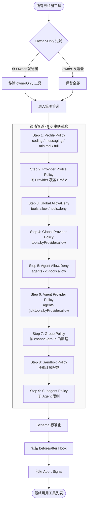
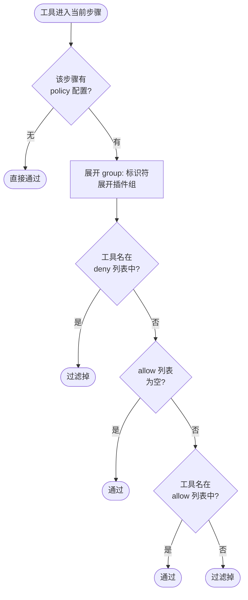

# 第 9 章 — 工具系统：注册、发现、策略与执行

读完这章，你会理解 OpenClaw 工具系统的完整生命周期：一个工具是如何被注册进系统的、Agent 运行时如何发现可用工具、多层策略管道如何决定"这个工具能不能用"、工具执行前后的 hook 机制如何拦截和增强调用、以及不同 LLM Provider 之间的 schema 差异如何被抹平。这些知识可以直接迁移到你自己的 Agent 系统设计中。

## 9.1 工具的三个来源

OpenClaw 中的工具按来源分为三类：内置工具（Core Tools）、插件工具（Plugin Tools）和 MCP 工具。它们的注册路径不同，但最终都会汇入同一个工具列表，经过策略管道的统一筛选。

### 内置工具

内置工具是 OpenClaw 自身提供的能力，定义在 `src/agents/tool-catalog.ts` 中。每个工具有一个固定的 `id`、所属的 `sectionId`（用于分组展示）、以及它隶属的 `profiles`（用于策略筛选）。

```typescript
// src/agents/tool-catalog.ts:53-68
const CORE_TOOL_DEFINITIONS: CoreToolDefinition[] = [
  {
    id: "read",
    label: "read",
    description: "Read file contents",
    sectionId: "fs",
    profiles: ["coding"],
  },
  {
    id: "write",
    label: "write",
    description: "Create or overwrite files",
    sectionId: "fs",
    profiles: ["coding"],
  },
  // ... 30 多个工具
];
```

`sectionId` 把工具按功能域分组：`fs`（文件系统）、`runtime`（代码执行）、`web`（网络搜索）、`memory`（记忆系统）、`sessions`（会话管理）等共 11 个分区。这个分组不只是展示用的——它会被构建成 `group:fs`、`group:web` 等"工具组"标识符，后续策略管道可以按组来批量允许或拒绝工具。

```typescript
// src/agents/tool-catalog.ts:329-344
function buildCoreToolGroupMap() {
  const sectionToolMap = new Map<string, string[]>();
  for (const tool of CORE_TOOL_DEFINITIONS) {
    const groupId = `group:${tool.sectionId}`;
    const list = sectionToolMap.get(groupId) ?? [];
    list.push(tool.id);
    sectionToolMap.set(groupId, list);
  }
  const openclawTools = CORE_TOOL_DEFINITIONS
    .filter((tool) => tool.includeInOpenClawGroup)
    .map((tool) => tool.id);
  return {
    "group:openclaw": openclawTools,
    ...Object.fromEntries(sectionToolMap.entries()),
  };
}
```

注意 `includeInOpenClawGroup` 字段。大部分内置工具都标记了这个字段，唯一的例外是 `read`、`write`、`edit`、`apply_patch`、`exec`、`process` 这几个来自 `pi-coding-agent` 的基础工具。`group:openclaw` 是一个特殊的超集组，包含了所有 OpenClaw 扩展的工具（web_search、memory_search、sessions_spawn 等），但不包含底层文件操作和命令执行。这个分组的设计意图是：当你在策略里写 `allow: ["group:openclaw"]` 时，Agent 能用 OpenClaw 的高级功能，但不能直接操作文件系统或执行 shell 命令。

内置工具的实际创建发生在 `createOpenClawCodingTools()`（`src/agents/pi-tools.ts`）和 `createOpenClawTools()`（`src/agents/openclaw-tools.ts`）两个函数中。前者处理文件操作和代码执行工具，后者处理其余所有 OpenClaw 专有工具。

```typescript
// src/agents/openclaw-tools.ts:236-332 (简化)
const tools: AnyAgentTool[] = [
  createCanvasTool({ config }),
  nodesTool,
  createCronTool({ ... }),
  messageTool,
  createTtsTool({ ... }),
  ...collectPresentOpenClawTools([imageGenerateTool, musicGenerateTool, videoGenerateTool]),
  createGatewayTool({ ... }),
  createAgentsListTool({ ... }),
  createSessionsListTool({ ... }),
  createSessionsHistoryTool({ ... }),
  createSessionsSendTool({ ... }),
  createSessionsSpawnTool({ ... }),
  // ...
  ...collectPresentOpenClawTools([webSearchTool, webFetchTool, imageTool, pdfTool]),
];
```

`collectPresentOpenClawTools()` 是一个简单的 null 过滤器（`src/agents/openclaw-tools.registration.ts:5-9`），过滤掉那些因条件不满足而未被创建的工具（返回 `null` 的工厂函数）。

### 插件工具

插件工具由 OpenClaw 的 Plugin 系统注入，通过 `resolveOpenClawPluginToolsForOptions()` 加载。

```typescript
// src/agents/openclaw-plugin-tools.ts:52-62
const pluginTools = resolvePluginTools({
  ...resolveOpenClawPluginToolInputs({
    options, resolvedConfig, runtimeConfig, getRuntimeConfig,
  }),
  existingToolNames: params.existingToolNames ?? new Set<string>(),
  toolAllowlist: params.options?.pluginToolAllowlist,
  allowGatewaySubagentBinding: params.options?.allowGatewaySubagentBinding,
});
```

两个关键参数值得关注：`existingToolNames` 用于防止名称冲突——如果插件注册了一个和内置工具同名的工具，会被跳过；`toolAllowlist` 是从策略管道中收集到的显式白名单，只有在白名单中的插件工具才会被加载。

插件工具和内置工具最终被合并到同一个数组中：

```typescript
// src/agents/openclaw-tools.ts:334-344
if (options?.disablePluginTools) {
  return tools;
}
const wrappedPluginTools = resolveOpenClawPluginToolsForOptions({ ... });
return [...tools, ...wrappedPluginTools];
```

### MCP 工具

MCP（Model Context Protocol）工具通过 `bundle-mcp` 机制注入。在 `tool-catalog.ts` 中，`coding` 和 `messaging` 两个 profile 的 allow 列表里都包含了 `"bundle-mcp"`：

```typescript
// src/agents/tool-catalog.ts:316-327
const CORE_TOOL_PROFILES: Record<ToolProfileId, ToolProfilePolicy> = {
  coding: {
    allow: [...listCoreToolIdsForProfile("coding"), "bundle-mcp"],
  },
  messaging: {
    allow: [...listCoreToolIdsForProfile("messaging"), "bundle-mcp"],
  },
  full: {},
};
```

`"bundle-mcp"` 不是一个具体的工具 id，而是一个特殊标记。当策略管道展开 allow 列表时，MCP 工具的名称会匹配这个标记，从而被放行。`full` profile 没有设置 allow 列表，意味着不做任何过滤——所有工具（包括 MCP 工具）都被允许。

## 9.2 工具名称标准化

在整个工具系统中，工具名称不是原样比较的。`normalizeToolName()` 把名称转换为小写，并处理历史遗留的别名：

```typescript
// src/agents/tool-policy-shared.ts:13-23
const TOOL_NAME_ALIASES: Record<string, string> = {
  bash: "exec",
  "apply-patch": "apply_patch",
};

export function normalizeToolName(name: string) {
  const normalized = normalizeLowercaseStringOrEmpty(name);
  return TOOL_NAME_ALIASES[normalized] ?? normalized;
}
```

`bash` 是 `exec` 的旧名称。这种别名机制让旧的配置文件不会因为工具改名而失效。所有策略匹配、allow/deny 列表展开、工具分组查找都会先经过这一层标准化。

## 9.3 Tool Profile：四档预设

OpenClaw 用 Profile 来定义不同场景下可用的工具集合，共四档：

| Profile | 说明 | 允许的工具 |
|---------|------|-----------|
| `minimal` | 最精简 | 仅 `session_status` |
| `coding` | 编码场景 | 文件操作 + 执行 + Web + 记忆 + Session + 定时任务 + 媒体 + MCP |
| `messaging` | 消息场景 | Session 工具子集 + 消息发送 + MCP |
| `full` | 不限制 | 不设 allow 列表，等于允许一切 |

Profile 的作用是在策略管道的第一步就划出边界。比如在 `coding` profile 下，`browser`、`canvas`、`gateway`、`nodes` 等工具默认不可用——除非通过 `alsoAllow` 显式追加。

Profile 的解析逻辑在 `resolveToolProfilePolicy()`，它返回一个 `{ allow?: string[] }` 结构，直接作为策略管道的第一个 step 传入。

## 9.4 策略管道（Tool Policy Pipeline）

策略管道是工具系统最核心的部分。它解决的问题是：**面对来自全局配置、Agent 配置、Provider 配置、Group 配置、Sandbox 配置、子 Agent 配置等多个层级的 allow/deny 规则，如何确定一个工具最终能不能用？**

### 9.4.1 管道的结构

`buildDefaultToolPolicyPipelineSteps()` 构建了管道的默认步骤序列（`src/agents/tool-policy-pipeline.ts:39-90`）：

```typescript
return [
  { policy: params.profilePolicy,         label: "tools.profile" },
  { policy: params.providerProfilePolicy,  label: "tools.byProvider.profile" },
  { policy: params.globalPolicy,           label: "tools.allow" },
  { policy: params.globalProviderPolicy,   label: "tools.byProvider.allow" },
  { policy: params.agentPolicy,            label: "agents.${agentId}.tools.allow" },
  { policy: params.agentProviderPolicy,    label: "agents.${agentId}.tools.byProvider.allow" },
  { policy: params.groupPolicy,            label: "group tools.allow" },
];
```

在 `createOpenClawCodingTools()` 中，还额外追加了两个步骤：

```typescript
// src/agents/pi-tools.ts:674-696
const subagentFiltered = applyToolPolicyPipeline({
  tools: toolsByAuthorization,
  steps: [
    ...buildDefaultToolPolicyPipelineSteps({ ... }),
    { policy: sandboxToolPolicy, label: "sandbox tools.allow" },
    { policy: subagentPolicy,    label: "subagent tools.allow" },
  ],
});
```

完整的管道一共 9 个步骤，按顺序依次过滤。

### 9.4.2 单步过滤逻辑

每个步骤都是一个 `ToolPolicyLike` 结构：`{ allow?: string[], deny?: string[] }`。过滤规则在 `tool-policy-match.ts` 中：

```typescript
// src/agents/tool-policy-match.ts:5-33
function makeToolPolicyMatcher(policy: SandboxToolPolicy) {
  const deny = compileGlobPatterns({
    raw: expandToolGroups(policy.deny ?? []),
    normalize: normalizeToolName,
  });
  const allow = compileGlobPatterns({
    raw: expandToolGroups(policy.allow ?? []),
    normalize: normalizeToolName,
  });
  return (name: string) => {
    const normalized = normalizeToolName(name);
    // 1. deny 优先级最高
    if (matchesAnyGlobPattern(normalized, deny)) {
      return false;
    }
    // 2. 没有 allow 列表 = 全部放行
    if (allow.length === 0) {
      return true;
    }
    // 3. 在 allow 列表中 = 放行
    if (matchesAnyGlobPattern(normalized, allow)) {
      return true;
    }
    // 4. 不在 allow 列表中 = 拒绝
    return false;
  };
}
```

关键要点：**每一步都是独立过滤，deny 在每步内部优先于 allow**。管道是串联的——前一步过滤掉的工具不会在后一步复活。也就是说，如果全局 profile 不允许 `browser`，即使 Agent 配置里写了 `allow: ["browser"]`，`browser` 在第一步就已经被移除了，后续步骤看不到它。

另一个细节是 glob 模式支持。allow/deny 列表中的条目会被编译成 glob 模式，支持通配符匹配。同时，`apply_patch` 工具和 `write` 工具存在隐式关联——deny `write` 时 `apply_patch` 也会被 deny，allow `write` 时 `apply_patch` 也会被 allow。

### 9.4.3 工具组展开

在匹配之前，allow/deny 列表中的 `group:xxx` 标识符会被展开成具体的工具列表：

```typescript
// src/agents/tool-policy-shared.ts:32-44
export function expandToolGroups(list?: string[]) {
  const normalized = normalizeToolList(list);
  const expanded: string[] = [];
  for (const value of normalized) {
    const group = TOOL_GROUPS[value];
    if (group) {
      expanded.push(...group);
      continue;
    }
    expanded.push(value);
  }
  return Array.from(new Set(expanded));
}
```

除了按 section 自动生成的 `group:fs`、`group:web` 等分组外，还有插件级别的分组。`expandPluginGroups()` 处理 `group:plugins`（所有插件工具）以及按 pluginId 索引的单个插件工具组（`src/agents/tool-policy.ts:126-152`）。

### 9.4.4 完整的判定流程

用 Mermaid 图来展示整个策略管道的判定过程：



每一步内部的判定逻辑：



### 9.4.5 Owner-Only 工具

在进入策略管道之前，还有一层 Owner-Only 过滤。某些工具（如 `cron`、`gateway`、`nodes`）被标记为仅限 Owner 使用：

```typescript
// src/agents/tool-policy.ts:34-38
const OWNER_ONLY_TOOL_APPROVAL_CLASS_FALLBACKS = new Map<string, OwnerOnlyToolApprovalClass>([
  ["cron", "control_plane"],
  ["gateway", "control_plane"],
  ["nodes", "exec_capable"],
]);
```

`applyOwnerOnlyToolPolicy()` 对非 Owner 的发送者做两件事：过滤掉 ownerOnly 工具，并对漏网的 ownerOnly 工具包装一个拒绝执行的 wrapper。双重保险。

### 9.4.6 子 Agent 工具限制

子 Agent（subagent）有独立的工具限制逻辑。`src/agents/pi-tools.policy.ts:35-44` 定义了两个拒绝列表：

- `SUBAGENT_TOOL_DENY_ALWAYS`：无论子 Agent 深度如何，一律禁止 `gateway`、`agents_list`、`session_status`、`cron`、`sessions_send`
- `SUBAGENT_TOOL_DENY_LEAF`：叶子节点子 Agent（depth >= maxSpawnDepth）额外禁止 `subagents`、`sessions_list`、`sessions_history`、`sessions_spawn`

这个设计背后的意图是：编排器子 Agent（orchestrator，depth < maxSpawnDepth）需要 spawn 和管理下级子 Agent，所以保留 session 管理工具；而叶子子 Agent 只负责执行具体任务，不应该再 spawn 子任务。

## 9.5 工具执行的 Hook 机制

工具通过策略管道后，还会被两层 wrapper 包装：`before_tool_call` hook 和 abort signal 处理。

### before_tool_call Hook

`wrapToolWithBeforeToolCallHook()`（`src/agents/pi-tools.before-tool-call.ts:572-699`）在每个工具的 `execute` 函数外面包了一层。工具被调用时，实际执行的流程是：

1. **循环检测（Loop Detection）**：检查当前 session 中同一个工具是否被反复调用，防止 Agent 陷入无限循环。达到 `warning` 级别时记日志，达到 `critical` 级别时直接 block。

2. **Trusted Tool Policy**：运行插件注册的可信工具策略。插件可以通过这个机制拦截任何工具调用——比如在执行 `exec` 之前检查命令是否安全。

3. **Plugin before_tool_call Hook**：运行插件注册的 `before_tool_call` 钩子。钩子可以修改参数（返回 `params`）、阻止执行（返回 `block: true`）、或要求人工审批（返回 `requireApproval`）。

4. **人工审批流程**：如果钩子返回 `requireApproval`，系统通过 Gateway 发起审批请求，等待用户在 UI 上点击允许或拒绝。审批有超时机制，超时后的行为（allow 或 deny）由插件配置决定。

5. **诊断事件发射**：无论工具执行成功还是失败，都会发射 `tool.execution.started`、`tool.execution.completed`、`tool.execution.error` 等诊断事件，用于可观测性。

```typescript
// src/agents/pi-tools.before-tool-call.ts:583-590 (简化)
execute: async (toolCallId, params, signal, onUpdate) => {
  const outcome = await runBeforeToolCallHook({
    toolName, params, toolCallId, ctx, signal,
  });
  if (outcome.blocked) {
    // veto -> 返回 blocked result
    // failure -> throw Error
  }
  // 执行原始工具
  const result = await execute(toolCallId, outcome.params, signal, onUpdate);
  return result;
};
```

Hook 的返回值类型是一个判别式联合：`blocked: true` 时携带拒绝原因，`blocked: false` 时携带（可能被修改过的）参数。这意味着插件可以在工具执行前悄悄修改参数——比如给 `exec` 工具注入安全策略、或者在 `message` 工具里重写发送目标。

### Abort Signal 包装

`wrapToolWithAbortSignal()` 让工具执行能响应取消信号。当用户中断 Agent 运行或 session 被关闭时，正在执行的工具会收到 abort 通知，避免后台进程悬空。

## 9.6 工具 Schema 适配

不同 LLM Provider 对工具 schema 的要求差异很大。OpenClaw 用 `normalizeToolParameterSchema()`（`src/agents/pi-tools-parameter-schema.ts:135-258`）在工具提交给模型之前统一处理这些差异。

### Provider 差异一览

| Provider | 要求 |
|----------|------|
| OpenAI | 顶层必须是 `type: "object"`，不接受裸 `anyOf`/`oneOf` |
| Gemini | 不接受 `minLength`、`maxLength`、`pattern` 等 JSON Schema 验证关键字；`type` 和 `anyOf` 不能同时出现 |
| Anthropic | 接受完整的 JSON Schema draft 2020-12 |
| xAI | 拒绝所有验证约束关键字 |

### 适配策略

核心思路是把 TypeBox 生成的 union schema（`anyOf`/`oneOf`）拍平成单个 `type: "object"` schema：

```typescript
// src/agents/pi-tools-parameter-schema.ts:196-257 (核心逻辑)
// 遍历 anyOf/oneOf 的每个变体
for (const entry of variants) {
  // 合并所有变体的 properties
  for (const [key, value] of Object.entries(props)) {
    mergedProperties[key] = mergePropertySchemas(mergedProperties[key], value);
  }
  // 统计 required 出现次数
  for (const key of required) {
    requiredCounts.set(key, (requiredCounts.get(key) ?? 0) + 1);
  }
}
// 只有在所有变体中都出现的 required 才保留
const mergedRequired = Array.from(requiredCounts.entries())
  .filter(([, count]) => count === objectVariants)
  .map(([key]) => key);
```

拍平过程中有一个巧妙的合并逻辑 `mergePropertySchemas()`：当两个变体的同名属性都是枚举类型时，它会把枚举值合并（取并集），而不是简单地用后者覆盖前者。这保证了像 `action` 这样的多值枚举字段在拍平后仍然携带完整的选项列表。

然后，根据 Provider 做最后的清理：

```typescript
// src/agents/pi-tools-parameter-schema.ts:159-167
function applyProviderCleaning(s: unknown): TSchema {
  if (isGeminiProvider && !isAnthropicProvider) {
    return cleanSchemaForGemini(s);
  }
  if (unsupportedToolSchemaKeywords.size > 0) {
    return stripUnsupportedSchemaKeywords(s, unsupportedToolSchemaKeywords);
  }
  return s as TSchema;
}
```

Gemini 走专门的 `cleanSchemaForGemini()`，xAI 等 Provider 走 `stripUnsupportedSchemaKeywords()`（由 Provider 的 `modelCompat` 配置声明哪些关键字不支持），Anthropic 和 OpenAI 直接使用拍平后的结果。

这个设计的核心取舍是：**损失一部分 schema 精度，换取跨 Provider 兼容性**。union 拍平后，模型无法区分"参数 A 和参数 B 是互斥的"这种语义，但实际使用中这几乎不会导致问题——模型对参数的理解主要依赖 description 文本，而非 schema 约束。

### 懒加载工具

有一个值得单独说的工程细节：`exec` 和 `process` 两个 bash 执行工具使用了懒加载模式。

```typescript
// src/agents/pi-tools.ts:89-113
function createLazyExecTool(defaults?: ExecToolDefaults): AnyAgentTool {
  let loadedTool: AnyAgentTool | undefined;
  const loadTool = async () => {
    if (!loadedTool) {
      const { createExecTool } = await loadBashToolsModule();
      loadedTool = createExecTool(defaults) as unknown as AnyAgentTool;
    }
    return loadedTool;
  };
  return {
    name: "exec",
    parameters: execSchema,
    execute: async (...args) => (await loadTool()).execute(...args),
  } as AnyAgentTool;
}
```

`bash-tools.ts` 模块体积较大（涉及子进程管理、安全策略等），懒加载避免了在创建工具列表时就把整个模块加载进内存。工具的 `name`、`parameters`、`description` 这些元数据是同步可用的（策略管道和 schema 适配只需要这些），真正的执行逻辑到第一次调用时才加载。这是一个"注册时轻量、执行时按需"的模式。

## 9.7 工具白名单守卫

`tool-allowlist-guard.ts` 提供了一个最终兜底检查。当所有策略管道执行完毕后，如果结果是零个可用工具，且存在显式的 allowlist 配置，这个守卫会生成一个明确的错误消息：

```typescript
// src/agents/tool-allowlist-guard.ts:22-39
export function buildEmptyExplicitToolAllowlistError(params: {
  sources: ExplicitToolAllowlistSource[];
  callableToolNames: string[];
  toolsEnabled: boolean;
  disableTools?: boolean;
}): Error | null {
  if (params.sources.length === 0 || callableToolNames.length > 0) {
    return null;
  }
  const reason = params.disableTools === true
    ? "tools are disabled for this run"
    : params.toolsEnabled
      ? "no registered tools matched"
      : "the selected model does not support tools";
  return new Error(
    `No callable tools remain after resolving explicit tool allowlist (...); ${reason}.`
  );
}
```

这个守卫的价值在于 debuggability。没有它的话，当配置错误导致所有工具被过滤掉时，Agent 会默默失败（模型没有工具可用），用户很难定位问题。有了它，错误消息会告诉你：是 allowlist 配置写错了，还是模型不支持工具，还是工具被全局禁用了。

## 9.8 端到端流程

把所有环节串起来。从 Agent 收到消息到工具被执行，工具系统经历以下阶段：

1. **注册**：`createOpenClawCodingTools()` 创建基础工具 + `createOpenClawTools()` 创建 OpenClaw 专有工具 + 插件工具合并
2. **消息渠道过滤**：`filterToolsByMessageProvider()` 根据消息来源渠道移除不适用的工具
3. **模型/Provider 过滤**：`applyModelProviderToolPolicy()` 处理 Provider 特有的限制（如 Codex 模式精简工具集）
4. **Owner-Only 过滤**：`applyOwnerOnlyToolPolicy()` 移除非 Owner 不可用的工具
5. **策略管道**：`applyToolPolicyPipeline()` 执行 9 步串联过滤
6. **Schema 标准化**：`normalizeToolParameters()` 处理跨 Provider 的 schema 差异
7. **Hook 包装**：`wrapToolWithBeforeToolCallHook()` 注入 before/after 拦截
8. **Abort 包装**：`wrapToolWithAbortSignal()` 注入取消信号支持
9. **提交给模型**：工具列表作为 `tools` 参数传给 LLM API

执行时：

10. **模型返回 tool_call**：模型选择调用某个工具
11. **before_tool_call 拦截**：循环检测 -> 可信策略检查 -> 插件 hook -> 可能的人工审批
12. **工具执行**：调用工具的 `execute` 函数
13. **结果标准化**：`normalizeToolExecutionResult()` 确保返回值符合 `{ content: [...] }` 格式
14. **错误兜底**：执行失败时返回 `{ status: "error", error: message }` 而不是让整个 Agent 循环崩溃

## 9.9 设计决策与 Trade-off

**串联管道 vs 合并策略**。OpenClaw 选择了串联过滤（每步依次缩减工具集），而不是先合并所有策略再一次性应用。串联的好处是每步的语义清晰——Profile 定义上限，Global/Agent/Group 逐层收紧——调试时可以逐步骤排查。代价是后面的步骤无法"撤销"前面步骤的决定，如果你的 Profile 太严格，Agent 级别的 allow 无法补救。`alsoAllow` 机制是对这个限制的缓解——它在 Profile 步骤生效之前就把额外的工具塞进 allow 列表。

**deny 优先于 allow**。在每一步内部，deny 的优先级高于 allow。这是安全方面的惯例——"显式拒绝不可覆盖"比"显式允许可以绕过拒绝"更安全。但这也意味着如果你在全局 deny 了某个工具，没有任何方式能在下游重新启用它，只能修改全局配置。

**Schema 拍平的精度损失**。把 union schema 拍平成单个 object 会丢失互斥关系的语义。OpenClaw 接受了这个损失，因为实际场景中模型对工具的理解主要靠 description 而非 schema 约束。如果你的工具有复杂的互斥参数组，需要在 description 里明确说明，不能依赖 schema 的 `oneOf` 语义。

**Hook 的阻塞式设计**。`before_tool_call` hook 是同步阻塞的——工具调用会等待 hook 完成（包括可能的人工审批）。这在安全场景下合理（你确实需要在执行前确认），但对延迟敏感的场景可能是问题。审批超时的默认值是 120 秒，对于实时对话来说是一个漫长的等待。

## 练习

**思考题**

1. 工具策略管道（Tool Policy Pipeline）按 9 步串联管道（Profile → Provider Profile → Global → Global Provider → Agent → Agent Provider → Group → Sandbox → Subagent）叠加，deny 优先于 allow。设想一个场景：运维团队在全局配置中 deny 了 `exec` 工具，但某个特定的 Agent 需要执行部署脚本。在当前设计下，这个需求无法满足。你认为应该引入一种"全局 deny 可覆盖"的机制，还是应该用其他方式解决？分析两种方案的安全风险。

**动手题**

2. 在 OpenClaw 源码中找到 Tool Profile 的四档预设（`full`、`coding`、`messaging`、`minimal`），对比每一档启用的工具集合。选择 `minimal` 档位启动一个 Agent，测试它能完成哪些任务、不能完成哪些任务，验证档位定义是否与文档一致。

3. 阅读工具 Schema 适配的 `flattenUnionSchema` 函数，找一个使用了 `oneOf` 的工具定义（比如 `exec` 工具的参数 schema），在拍平前后分别打印 schema 内容，观察拍平过程丢失了哪些语义信息。
