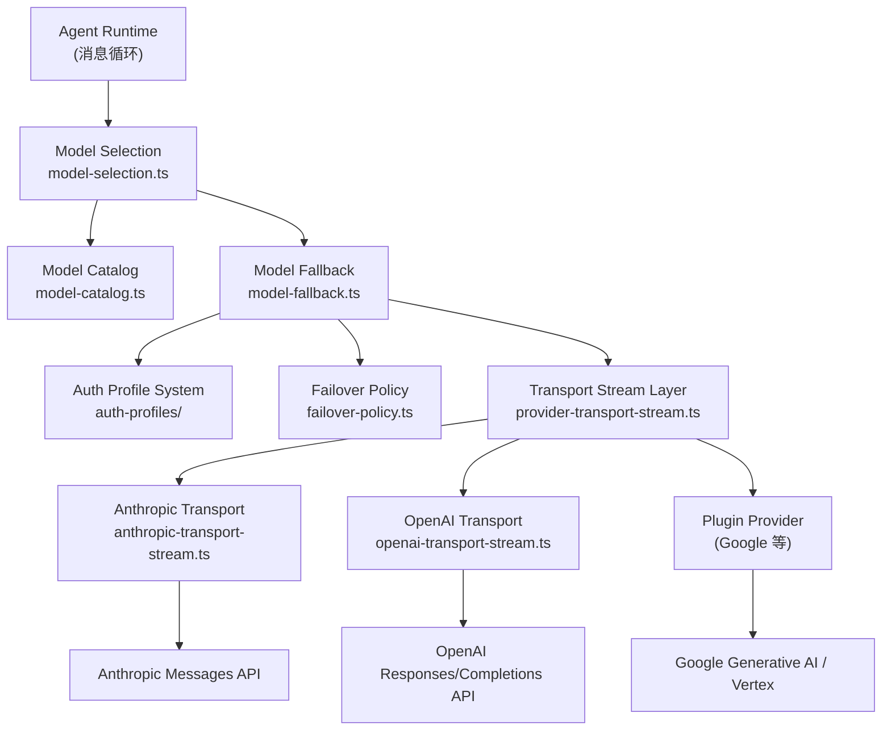
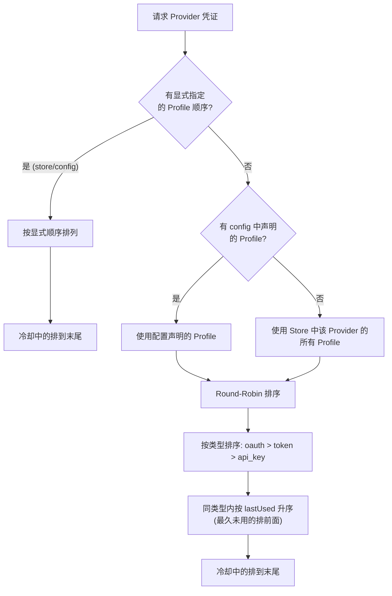
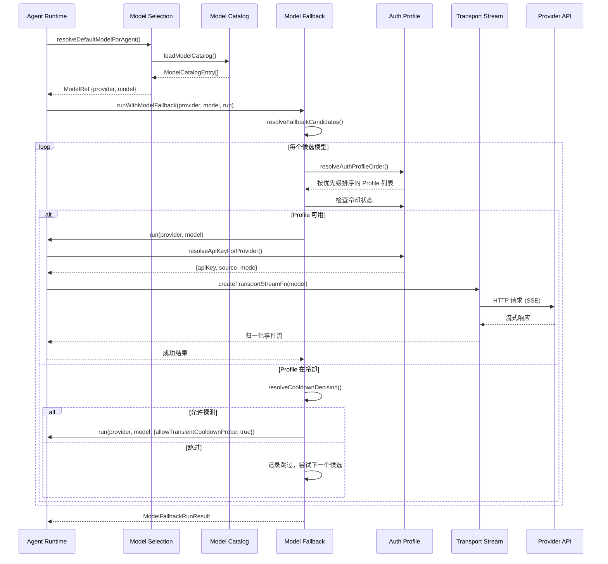

# 第 11 章 — Model Provider 抽象：多模型统一接入与故障转移

读完本章，你会理解 OpenClaw 如何通过一套 Provider 抽象层统一接入 Anthropic、OpenAI、Google、Azure 等不同厂商的大模型 API；掌握 Auth Profile 系统的多账号轮换机制；搞清楚流式传输适配层在不同 Provider 的 SSE 协议差异下如何工作；以及 Failover 策略如何在模型不可用时自动完成故障转移。

## 11.1 为什么需要 Provider 抽象层

一个生产级 Agent 系统要对接的大模型 API 至少有四五家，每家的认证方式、请求格式、流式协议、错误码都不一样。如果在业务代码里直接硬编码每个 Provider 的 HTTP 调用，代码会迅速膨胀到不可维护。

OpenClaw 的做法是在 Agent Runtime 和具体 Provider API 之间插入一个抽象层。这一层做三件事：

1. **协议归一化**——把 Anthropic Messages API、OpenAI Responses/Completions API、Google Generative AI 等不同协议统一为内部的 `StreamFn` 接口
2. **认证解耦**——通过 Auth Profile 系统管理多账号、多 Key，支持轮换和冷却
3. **故障屏蔽**——Failover 机制在某个 Provider 或模型不可用时，自动切换到备选项

下面这张图展示了 Provider 抽象层在整个 Agent Runtime 中的位置：



## 11.2 Provider API Family：两大阵营

OpenClaw 把市面上的大模型 API 归类为两大 "API Family"：**Anthropic 系**和 **OpenAI 系**。这个分类决定了请求构造、流式解析、工具调用格式等一系列行为。

在 `src/agents/provider-transport-stream.ts` 中，可以看到支持的 API 类型清单：

```typescript
// src/agents/provider-transport-stream.ts:13-20
const SUPPORTED_TRANSPORT_APIS = new Set<Api>([
  "openai-responses",
  "openai-codex-responses",
  "openai-completions",
  "azure-openai-responses",
  "anthropic-messages",
  "google-generative-ai",
]);
```

这六种 API 按协议特征分为两大阵营：

| 阵营 | API 类型 | 代表 Provider |
|------|---------|---------------|
| Anthropic 系 | `anthropic-messages` | Anthropic (Claude)、GitHub Copilot (走 Anthropic 协议) |
| OpenAI 系 | `openai-responses`、`openai-completions`、`openai-codex-responses`、`azure-openai-responses` | OpenAI、Azure OpenAI、OpenRouter、各种 OpenAI 兼容服务 |
| 独立 | `google-generative-ai` | Google Gemini、Vertex AI |

Google 的处理比较特殊——它通过 Provider Plugin 系统注入自己的 `StreamFn`，不走内建的 transport 路径。这也是 OpenClaw 插件架构的一个好例子：核心只负责通用协议，厂商特定逻辑通过插件扩展。

### API 选择的路由逻辑

`createSupportedTransportStreamFn` 函数根据 `model.api` 字段分发到对应的 transport 实现：

```typescript
// src/agents/provider-transport-stream.ts:75-94
function createSupportedTransportStreamFn(
  model: Model<Api>,
  ctx?: ProviderTransportStreamContext,
): StreamFn | undefined {
  switch (model.api) {
    case "openai-responses":
    case "openai-codex-responses":
      return createOpenAIResponsesTransportStreamFn();
    case "openai-completions":
      return createOpenAICompletionsTransportStreamFn();
    case "azure-openai-responses":
      return createAzureOpenAIResponsesTransportStreamFn();
    case "anthropic-messages":
      return createAnthropicMessagesTransportStreamFn();
    case "google-generative-ai":
      return createProviderOwnedGoogleTransportStreamFn(model, ctx);
    default:
      return undefined;
  }
}
```

这是一个经典的策略模式。每个 transport 实现都返回一个 `StreamFn`——它接收 Model、Context（消息历史 + 系统提示词 + 工具定义）和选项，返回一个事件流。这让上层的 Agent Runtime 完全不需要知道底层用的是哪家 API。

## 11.3 Model Catalog 和模型发现机制

Agent Runtime 在启动时需要知道有哪些模型可用。这个信息由 Model Catalog 模块管理。

### 模型条目的数据结构

每个模型在 catalog 中是一个 `ModelCatalogEntry`：

```typescript
type ModelCatalogEntry = {
  id: string;           // 模型标识，如 "claude-sonnet-4-6"
  name: string;         // 显示名称
  provider: string;     // Provider 标识，如 "anthropic"
  contextWindow?: number; // 上下文窗口大小
  reasoning?: boolean;    // 是否支持推理模式
  input?: ModelInputType[]; // 支持的输入类型（text、image、document）
};
```

### 三层模型发现

`loadModelCatalog`（`src/agents/model-catalog.ts:107`）通过三个阶段构建完整的模型列表：

**第一层：内建注册表（Pi SDK）**。OpenClaw 依赖 `@mariozechner/pi-ai` 提供基础模型注册表，通过 `ModelRegistry` 加载 `models.json` 配置文件中声明的模型。

**第二层：Provider 插件注入**。调用 `augmentModelCatalogWithProviderPlugins` 让各个 Provider 插件补充自己的模型。比如 Google 插件会注入 Gemini 系列模型。

```typescript
// src/agents/model-catalog.ts:188-201
const supplemental = await augmentModelCatalogWithProviderPlugins({
  config: cfg,
  env: process.env,
  context: { config: cfg, agentDir, env: process.env, entries: [...models] },
});
if (supplemental.length > 0) {
  appendCatalogEntriesIfAbsent(models, supplemental);
}
```

**第三层：用户配置模型**。通过 `buildConfiguredModelCatalog` 加载用户在 `models.json` 的 `providers` 字段中自定义的模型（比如本地 Ollama、vLLM 等）。

三层合并后去重排序，就是最终的可用模型列表。去重的 key 是 `provider::modelId`，也就是说同一个 Provider 下模型 ID 相同的条目只保留第一个出现的。

### 缓存与容错

模型目录加载结果会被缓存在模块级的 `modelCatalogPromise` 中。但有一个重要的容错设计：如果加载过程中抛出异常（比如文件系统临时不可用、pnpm install 导致 node_modules 被替换），**不会把失败的 Promise 缓存下来**。这样下次调用时会重新尝试加载，而不是永远返回错误：

```typescript
// src/agents/model-catalog.ts:219-226
} catch (error) {
  if (!hasLoggedModelCatalogError) {
    hasLoggedModelCatalogError = true;
    log.warn(`Failed to load model catalog: ${String(error)}`);
  }
  if (!readOnly) {
    modelCatalogPromise = null; // 清除缓存，允许重试
  }
```

## 11.4 Model Selection：从用户意图到具体模型

用户可以通过多种方式指定要使用的模型——在配置文件中设置默认值、在会话中覆盖、使用别名。Model Selection 模块（`src/agents/model-selection.ts`）负责把这些不同来源的意图解析为最终的 `provider/model` 引用。

### ModelRef：模型引用的标准形式

所有模型最终都被规范化为一个 `ModelRef`：

```typescript
type ModelRef = {
  provider: string;  // "anthropic"
  model: string;     // "claude-sonnet-4-6"
};
```

### 解析优先级

`resolveDefaultModelForAgent` 展示了模型解析的优先级链：

1. **Agent 级别覆盖**——特定 Agent 可以配置自己专用的模型
2. **全局配置的 primary**——`agents.defaults.model.primary`
3. **系统默认值**——`DEFAULT_PROVIDER`（openai）+ `DEFAULT_MODEL`（gpt-5.5）

```typescript
// src/agents/defaults.ts:1-6
export const DEFAULT_PROVIDER = "openai";
export const DEFAULT_MODEL = "gpt-5.5";
export const DEFAULT_CONTEXT_TOKENS = 200_000;
```

### 模型别名系统

用户可能输入 "sonnet" 而不是完整的 "anthropic/claude-sonnet-4-6"。`buildModelAliasIndex` 构建一个别名索引，让短名称能正确解析到完整的 `ModelRef`。

`resolveAllowedModelRef` 是对外暴露的主要入口。它按顺序尝试：
1. OpenRouter 兼容别名（如 `anthropic/claude-3.5-sonnet`）
2. 用户配置的别名
3. 直接解析为 `provider/model`

如果解析出的模型不在允许列表中，返回错误而不是静默降级——这是一个明确的设计选择，避免用户在不知情的情况下使用了错误的模型。

## 11.5 Auth Profile 系统：多账号管理与 Key 轮换

生产环境中一个 Provider 往往有多个 API Key（不同团队的账号、不同配额的 Key）。OpenClaw 的 Auth Profile 系统管理这些凭证，并提供自动轮换能力。

### 凭证类型

Auth Profile 支持三种凭证类型（`src/agents/auth-profiles/types.ts`）：

| 类型 | 说明 | 典型场景 |
|------|------|---------|
| `api_key` | 静态 API Key | Anthropic API Key、OpenAI API Key |
| `oauth` | OAuth 2.0 令牌（可刷新） | Anthropic OAuth、GitHub Copilot |
| `token` | 静态 Bearer Token（不可刷新） | 第三方网关 Token |

每种类型都有对应的数据结构。以 `ApiKeyCredential` 为例：

```typescript
// src/agents/auth-profiles/types.ts:18-27
type ApiKeyCredential = {
  type: "api_key";
  provider: string;
  key?: string;
  keyRef?: SecretRef;    // 引用外部密钥管理
  email?: string;
  displayName?: string;
  metadata?: Record<string, string>;
};
```

`keyRef` 字段的作用是允许 Key 不直接存储在配置文件中，而是引用外部的密钥管理服务（比如环境变量或密钥管理器），减少明文凭证泄露的风险。

### Profile 选择顺序

当一个请求需要某个 Provider 的凭证时，`resolveAuthProfileOrder`（`src/agents/auth-profiles/order.ts:66`）按以下逻辑排序可用的 Profile：



Round-Robin 策略的核心在 `orderProfilesByMode` 函数中。它按两个维度排序：先按凭证类型（OAuth 优先于 API Key，因为 OAuth 通常有更高的配额），再按 `lastUsed` 时间戳（最久未使用的排在最前面）。冷却中的 Profile 总是排在末尾，按冷却到期时间升序排列。

```typescript
// src/agents/auth-profiles/order.ts:190-207
const scored = available.map((profileId) => {
  const type = store.profiles[profileId]?.type;
  const typeScore = type === "oauth" ? 0 : type === "token" ? 1 : type === "api_key" ? 2 : 3;
  const lastUsed = store.usageStats?.[profileId]?.lastUsed ?? 0;
  return { profileId, typeScore, lastUsed };
});

const sorted = scored
  .toSorted((a, b) => {
    if (a.typeScore !== b.typeScore) {
      return a.typeScore - b.typeScore;
    }
    return a.lastUsed - b.lastUsed;
  })
  .map((entry) => entry.profileId);
```

### 冷却与使用统计

每个 Profile 都有一份 `ProfileUsageStats`，记录最后使用时间、冷却截止时间、冷却原因、错误计数等：

```typescript
// src/agents/auth-profiles/types.ts:69-80
type ProfileUsageStats = {
  lastUsed?: number;
  cooldownUntil?: number;
  cooldownReason?: AuthProfileFailureReason;
  cooldownModel?: string;
  disabledUntil?: number;
  disabledReason?: AuthProfileFailureReason;
  errorCount?: number;
  failureCounts?: Partial<Record<AuthProfileFailureReason, number>>;
  lastFailureAt?: number;
};
```

当一个 Key 触发 rate limit 或 billing 错误时，该 Profile 会进入冷却期。`cooldownModel` 字段的存在说明冷却可以是模型级别的——某个 Key 对模型 A 被限流，不影响它对模型 B 的使用。

### 凭证解析的完整路径

`resolveApiKeyForProvider`（`src/agents/model-auth.ts:441`）是凭证解析的入口，它的查找路径：

1. 如果指定了 `profileId`，直接使用该 Profile 的凭证
2. 检查配置中的 `auth` 模式覆盖（如 `aws-sdk`）
3. 检查 Provider 配置中显式设置的 API Key
4. 如果配置了 `env-first`，优先从环境变量获取
5. 遍历 Auth Profile Store 中的候选 Profile
6. 从环境变量查找（`ANTHROPIC_API_KEY`、`OPENAI_API_KEY` 等）
7. 从 Provider 配置的 `models.json` 中查找
8. 对本地服务（localhost）合成虚拟凭证（不需要真实 Key）

如果所有路径都找不到凭证，抛出明确的错误信息，告诉用户去哪里配置。

## 11.6 流式传输适配层

不同 Provider 的流式 API 在协议层面差异很大。OpenClaw 的 transport stream 层把这些差异封装掉，对上层统一暴露 `StreamFn` 接口。

### Anthropic 系的流式处理

Anthropic Messages API 使用标准的 SSE（Server-Sent Events）协议。`anthropic-transport-stream.ts` 中自己实现了 SSE 解析，没有依赖 Anthropic 的官方 SDK：

```typescript
// src/agents/anthropic-transport-stream.ts:537-580
async function* parseAnthropicSseBody(
  body: ReadableStream<Uint8Array>,
  signal?: AbortSignal,
): AsyncIterable<Record<string, unknown>> {
  const reader = body.getReader();
  const decoder = new TextDecoder();
  let buffer = "";
  try {
    while (true) {
      const { done, value } = await readAnthropicSseChunk(reader, signal);
      if (done) break;
      buffer = `${buffer}${decoder.decode(value, { stream: true })}`.replaceAll("\r\n", "\n");
      let frameEnd = buffer.indexOf("\n\n");
      while (frameEnd >= 0) {
        const frame = buffer.slice(0, frameEnd);
        buffer = buffer.slice(frameEnd + 2);
        const data = frame
          .split("\n")
          .filter((line) => line.startsWith("data:"))
          .map((line) => line.slice(5).trimStart())
          .join("\n");
        if (data && data !== "[DONE]") {
          yield JSON.parse(data) as Record<string, unknown>;
        }
        frameEnd = buffer.indexOf("\n\n");
      }
    }
    // ... 处理剩余 buffer
  } finally {
    reader.releaseLock();
  }
}
```

自己实现 SSE 解析的好处是可以精确控制 AbortSignal 的处理。`readAnthropicSseChunk` 用 Promise race 的方式让 abort 信号能立即中断读取，而不是等到下一个 chunk 到达。

Anthropic transport 还处理了一些协议细节：
- **OAuth vs API Key 认证**——OAuth 用 `Authorization: Bearer`，API Key 用 `x-api-key` 头
- **Claude Code 工具名称映射**——OAuth 模式下把内部工具名（如 `Read`）映射为 Claude Code 的标准名称
- **thinking/reasoning 的自适应模式**——新模型（如 claude-opus-4-6/4-7）使用 adaptive thinking，老模型使用 budget-based thinking

### OpenAI 系的流式处理

OpenAI 系有两条路径：Responses API（新）和 Completions API（旧）。

**Responses API** 直接使用 OpenAI 的 Node.js SDK，通过 `client.responses.create` 获取流：

```typescript
// src/agents/openai-transport-stream.ts:715-789 (简化)
export function createOpenAIResponsesTransportStreamFn(): StreamFn {
  return (model, context, options) => {
    // ... 构建 OpenAI client
    const responseStream = await client.responses.create(params);
    // 处理 response.output_item.added、response.output_text.delta 等事件
    await processResponsesStream(responseStream, output, stream, model);
  };
}
```

**Completions API** 是面向旧版 OpenAI 接口和各种兼容服务（OpenRouter、Ollama 等）的。它需要处理更多的兼容性问题，通过 `getCompat` 函数检测目标服务的能力：

```typescript
// 兼容性参数示例
{
  supportsStore: boolean,         // 是否支持 store 参数
  supportsDeveloperRole: boolean, // 是否支持 developer 角色
  supportsReasoningEffort: boolean, // 是否支持推理力度
  maxTokensField: string,        // "max_tokens" vs "max_completion_tokens"
  requiresStringContent: boolean, // 是否要求纯文本 content
  supportsStrictMode: boolean,   // 是否支持 strict 工具模式
}
```

这套兼容性检测覆盖了市面上主要的 OpenAI 兼容服务，包括 Azure、Google、OpenRouter、Vercel AI Gateway 等。每家对 OpenAI 协议的支持程度不同，`getCompat` 统一处理这些差异。

### 统一的事件流格式

不管底层用的是哪家 API，transport 层都把流式事件归一化为相同的格式：

| 事件类型 | 含义 |
|---------|------|
| `start` | 流开始 |
| `text_start` / `text_delta` / `text_end` | 文本生成 |
| `thinking_start` / `thinking_delta` / `thinking_end` | 思考过程 |
| `toolcall_start` / `toolcall_delta` / `toolcall_end` | 工具调用 |
| `done` | 流正常结束 |
| `error` | 流异常结束 |

上层消费这些事件时完全不需要关心它们来自 Anthropic 还是 OpenAI。

## 11.7 Failover 策略：自动故障转移

Model Fallback 模块（`src/agents/model-fallback.ts`）是 Provider 抽象层中最复杂的部分。它的核心函数 `runWithModelFallback` 接管了模型调用的完整生命周期。

### Fallback 候选链

`resolveFallbackCandidates` 构建模型候选链：

1. 用户当前选择的模型（primary）
2. 配置文件中声明的 fallback 模型列表
3. 全局配置的默认模型

候选链的构建考虑了跨 Provider 的场景。如果用户选择的模型 Provider 与配置中的默认 Provider 不同，只有当前模型本身出现在 fallback 链中时，才会使用配置的 fallback 列表。这避免了"用户选了 Anthropic 的模型，却被 fallback 到 OpenAI"这种出乎意料的行为。

### Fallback 循环的执行逻辑

```mermaid
flowchart TD
    Start["开始 runWithModelFallback"] --> BuildCandidates["构建候选链"]
    BuildCandidates --> Loop["遍历候选模型"]

    Loop --> CheckCooldown{"所有 Profile<br/>都在冷却?"}
    CheckCooldown -->|"否"| TryRun["执行模型调用"]
    CheckCooldown -->|"是"| CooldownDecision{"冷却决策"}

    CooldownDecision -->|"skip"| RecordSkip["记录跳过原因"]
    RecordSkip --> NextCandidate

    CooldownDecision -->|"attempt (probe)"| TryRun

    TryRun -->|"成功"| Success["返回结果"]
    TryRun -->|"失败"| ClassifyError{"错误分类"}

    ClassifyError -->|"AbortError"| Rethrow["直接抛出"]
    ClassifyError -->|"ContextOverflow"| Rethrow
    ClassifyError -->|"FailoverError"| RecordFail["记录失败"]
    ClassifyError -->|"未知错误 + 还有候选"| RecordFail
    ClassifyError -->|"未知错误 + 最后候选"| Rethrow

    RecordFail --> NextCandidate{"还有候选?"}
    NextCandidate -->|"是"| Loop
    NextCandidate -->|"否"| Summary["抛出 FallbackSummaryError"]
```



几个关键的设计决策：

**Context overflow 不触发 fallback。** 如果当前模型因为上下文溢出报错，切换到别的模型（可能上下文窗口更小）只会让情况更糟。所以 `isLikelyContextOverflowError` 检测到上下文溢出时直接抛出，不继续 fallback。

**AbortError 直接抛出。** 用户主动取消的操作不应该被 fallback 吃掉。但有一个例外：timeout 导致的 abort 会继续 fallback，因为超时可能只是某个 Provider 暂时不可用。

**未知错误也继续 fallback。** 只要还有候选模型，即使遇到非 FailoverError 的未知异常也不中断循环。这是一个偏激进的策略——宁可多试一个模型，也不要因为一个意外错误让整个请求失败。

### Failover Policy：冷却期探测

当一个 Provider 的所有 Auth Profile 都进入冷却时，`failover-policy.ts` 决定是跳过还是尝试探测。

```typescript
// src/agents/failover-policy.ts:1-16
export function shouldAllowCooldownProbeForReason(
  reason: FailoverReason | null | undefined,
): boolean {
  return (
    reason === "rate_limit" ||
    reason === "overloaded" ||
    reason === "billing" ||
    reason === "unknown" ||
    reason === "empty_response" ||
    reason === "no_error_details" ||
    reason === "unclassified" ||
    reason === "timeout"
  );
}
```

**可探测的错误**：rate_limit、overloaded、timeout 等暂时性错误。这些情况下 Provider 可能已经恢复，值得用一次请求去试探。

**不可探测的错误**：auth、auth_permanent、model_not_found、format。这些是持久性的，探测也不会改善。

探测还有节流机制：每个 Provider 每 30 秒最多探测一次（`MIN_PROBE_INTERVAL_MS`），每个 fallback 循环中同一个 Provider 最多探测一次。这防止了在 Provider 真的不可用时浪费请求配额。

### FallbackSummaryError

当所有候选模型都失败时，`FallbackSummaryError` 把每次尝试的结果汇总起来：

```typescript
// src/agents/model-fallback.ts:49-64
export class FallbackSummaryError extends Error {
  readonly attempts: FallbackAttempt[];
  readonly soonestCooldownExpiry: number | null;

  constructor(
    message: string,
    attempts: FallbackAttempt[],
    soonestCooldownExpiry: number | null,
    cause?: Error,
  ) {
    super(message, { cause });
    this.name = "FallbackSummaryError";
    this.attempts = attempts;
    this.soonestCooldownExpiry = soonestCooldownExpiry;
  }
}
```

`soonestCooldownExpiry` 字段告诉上层"最快什么时候可以重试"，让 UI 能给用户展示倒计时而不是只说"全部失败"。

## 11.8 整体数据流

把上面的模块串起来，一次完整的模型调用经历以下阶段：



## 11.9 设计取舍

这套 Provider 抽象层在以下几个地方做了值得关注的权衡：

**自建 SSE 解析 vs 依赖 SDK。** Anthropic transport 自己实现了 SSE 解析而不用官方 SDK，代价是维护成本高，收益是对 abort、超时、错误处理有完全控制权。OpenAI transport 则直接用官方 SDK，因为 OpenAI SDK 在 Node.js 生态中足够成熟。

**激进的 fallback vs 保守的 fallback。** OpenClaw 选择了激进策略——只要还有候选就继续尝试，即使遇到未知错误。这对用户体验是好事（尽量不让请求失败），但可能掩盖底层问题。生产中需要配合 `logModelFallbackDecision` 的日志来发现这些被静默处理的错误。

**冷却期探测的时间窗口。** 30 秒的探测间隔和 2 分钟的提前探测边界（`PROBE_MARGIN_MS`）是经验值。太短会在 Provider 限流时产生无效请求，太长会延迟恢复。目前没有根据不同 FailoverReason 动态调整这个值。

**Auth Profile 的类型优先级。** OAuth > Token > API Key 的排序反映了一个实际观察：OAuth 认证（比如 Anthropic 的 Max 订阅）通常有更高的请求配额。但这个假设不一定对所有场景成立，未来可能需要让用户配置优先级权重。

## 练习

**思考题**

1. OpenClaw 的 Failover 策略是"激进的"——遇到任何错误都尝试下一个 Provider。考虑一个场景：用户配置了 Claude 和 GPT 两个 Provider，Claude 因为内容审核拒绝了请求（返回 400），系统自动切换到 GPT。这种 failover 是否合理？哪些类型的错误应该 failover，哪些不应该？设计一个更精细的 failover 判断规则。

2. Model Catalog 使用 `model:*` 通配符语法来匹配模型名称。如果两个 Provider 都注册了名为 `claude-sonnet` 的模型（比如一个是官方 API，一个是代理 API），模型选择的优先级由什么决定？这种歧义会导致什么问题？

**动手题**

3. 在 `openclaw.json` 中配置两个 Provider（比如 Anthropic 和 OpenAI），将其中一个的 API Key 故意设置为无效值。发送一条消息，观察 Gateway 日志中的 fallback 决策过程。确认 `logModelFallbackDecision` 输出了哪些信息，以及 failover 后响应是否正常完成。
