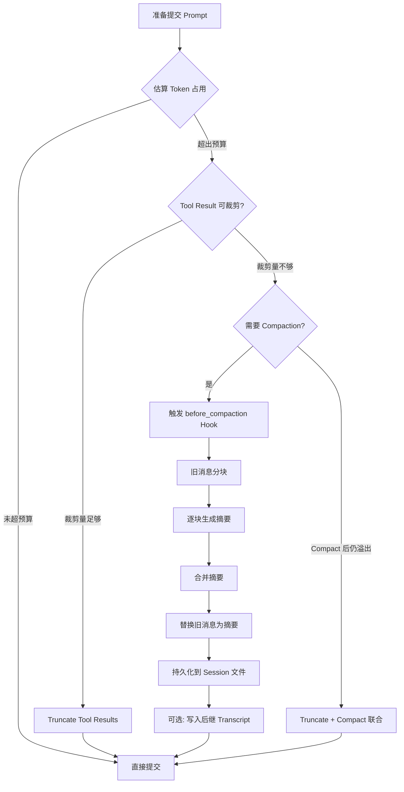
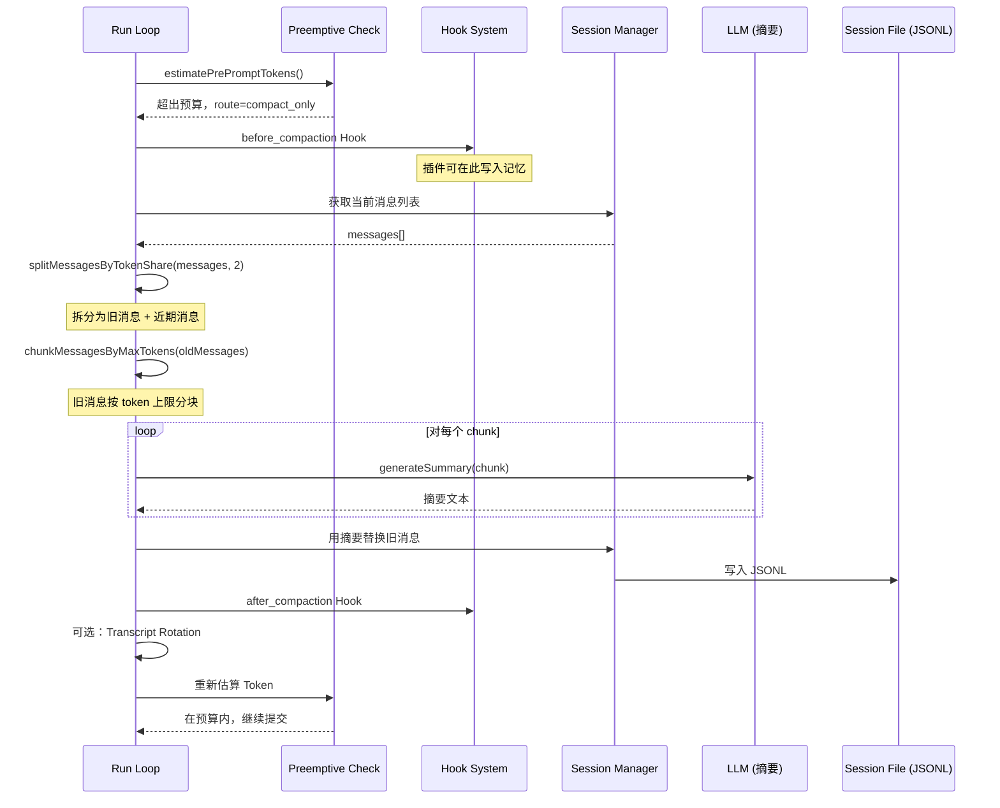

# 第 12 章 Context Window 管理：Compaction、Pruning 与预算控制

读完本章，你会理解 OpenClaw 如何在有限的 Context Window 内维持长时间对话：什么时候触发压缩、压缩的具体流程是什么、Pruning 如何在不丢信息的前提下缩减内存占用、Token 预算怎么计算、以及 `before_compaction` Hook 提供了哪些扩展点。这些机制构成了 Agent 系统的"内存管理层"——类似操作系统对物理内存的管理，Context Window 就是 Agent 的工作内存。

## 12.1 为什么需要主动管理 Context Window

LLM 的 Context Window 是有限的。Claude Sonnet 4 的窗口是 200K tokens，Opus 4 可以到 1M，但无论多大，一次长时间的 Agent 会话——几十轮工具调用、每次 `cat` 一个大文件——很快就能把窗口填满。

填满之后会发生什么？API 返回 `context_overflow` 错误，整个对话直接中断。对用户来说，这意味着 Agent 突然"失忆"了。

所以 Agent 系统必须在窗口溢出之前主动采取行动。OpenClaw 的策略可以用一个类比来理解：**Context Window 就是 CPU 缓存，而 Compaction 就是缓存的 Eviction Policy**。

| 概念 | CPU 缓存 | Context Window |
|------|----------|----------------|
| 容量 | L1/L2/L3 固定大小 | 模型 Context Window（如 200K tokens） |
| 热数据 | 最近访问的内存行 | 最近的对话消息 |
| 冷数据 | 很久没访问的内存行 | 早期的对话历史 |
| 驱逐策略 | LRU / LFU | Compaction（摘要化旧消息） |
| 持久化 | 写回主内存 | 写入 JSONL Session 文件 |
| 非破坏性优化 | 压缩缓存行 | Pruning（裁剪工具结果） |

这个类比不是修辞，而是帮你建立正确的心智模型。后面讲到的每个机制，都可以对应到这张表里。

## 12.2 整体架构

OpenClaw 的 Context Window 管理分三层：

1. **Token 预算控制**：计算当前 prompt 占用了多少 tokens，决定是否需要干预
2. **Pruning（修剪）**：在内存中裁剪工具结果的文本长度，不改变消息结构
3. **Compaction（压缩）**：调用 LLM 对旧消息生成摘要，用摘要替换原始消息

三者的触发时机和侵入性依次递增。下面这张流程图展示了一次 prompt 提交前的决策过程：



对应源码中的核心决策函数是 `shouldPreemptivelyCompactBeforePrompt`（`src/agents/pi-embedded-runner/run/preemptive-compaction.ts`），它返回四种路由之一：

```typescript
// src/agents/pi-embedded-runner/run/preemptive-compaction.ts:100-109
let route: PreemptiveCompactionRoute = "fits";
if (overflowTokens > 0) {
  if (toolResultReducibleChars <= 0) {
    route = "compact_only";
  } else if (toolResultReducibleChars >= truncateOnlyThresholdChars) {
    route = "truncate_tool_results_only";
  } else {
    route = "compact_then_truncate";
  }
}
```

四种路由的含义：

- `fits`：当前 prompt 在预算内，无需干预
- `truncate_tool_results_only`：裁剪工具结果就够了，不需要 Compaction
- `compact_only`：没有可裁剪的工具结果，只能做 Compaction
- `compact_then_truncate`：两者都需要

## 12.3 Token 计数与预算控制

### 12.3.1 Token 估算

OpenClaw 使用一个轻量级的 Token 估算函数 `estimateTokens`（来自 `pi-coding-agent` 包），核心逻辑是字符数除以 4 的粗估。这个估算不精确——多字节字符、代码 token、特殊 token 都会导致偏差——所以代码中用了一个 1.2 倍的安全系数：

```typescript
// src/agents/compaction.ts:22
export const SAFETY_MARGIN = 1.2; // 20% buffer for estimateTokens() inaccuracy
```

估算整个消息列表的 token 数时，会先剥离安全敏感内容：

```typescript
// src/agents/compaction.ts:104-108
export function estimateMessagesTokens(messages: AgentMessage[]): number {
  // SECURITY: toolResult.details 和 runtime-context 不能进入 LLM
  const safe = stripToolResultDetails(stripRuntimeContextCustomMessages(messages));
  return safe.reduce((sum, message) => sum + estimateTokens(message), 0);
}
```

`stripToolResultDetails` 删除 `toolResult` 消息上的 `details` 字段——这个字段包含工具执行的内部元数据，不应该暴露给 LLM。`stripRuntimeContextCustomMessages` 则过滤掉运行时注入的控制消息。这两步清洗在 compaction 和 token 计数中反复出现，是一道重要的安全屏障。

### 12.3.2 Context Window 大小的解析

Context Window 的大小不是固定值，它取决于模型、配置和部署环境。解析优先级如下（`src/agents/context-window-guard.ts:23-58`）：

1. `models.providers[provider].models[model].contextTokens` — 用户在配置文件中为特定模型指定的值
2. `model.contextTokens` 或 `model.contextWindow` — 模型元数据自带的值
3. `DEFAULT_CONTEXT_TOKENS`（200,000）— 兜底默认值

解析后还要检查 `agents.defaults.contextTokens` 配置项——如果用户设了一个更小的全局上限，最终值会被向下压。

```typescript
// src/agents/context-window-guard.ts:52-57
const capTokens = normalizePositiveInt(params.cfg?.agents?.defaults?.contextTokens);
if (capTokens && capTokens < baseInfo.tokens) {
  return { tokens: capTokens, source: "agentContextTokens" };
}
```

### 12.3.3 安全阈值

系统定义了两个硬阈值（`src/agents/context-window-guard.ts:5-6`）：

```typescript
export const CONTEXT_WINDOW_HARD_MIN_TOKENS = 16_000;
export const CONTEXT_WINDOW_WARN_BELOW_TOKENS = 32_000;
```

低于 32K tokens 会打警告日志；低于 16K 则直接阻止 Agent 启动。这不是随意设的——一个 Agent 的 system prompt + 工具定义 + 至少一轮对话，轻松就要 10K+ tokens。16K 的窗口几乎没有余地做任何有意义的工作。

### 12.3.4 预算计算

Prompt 预算的核心公式：

```
promptBudget = contextWindow - reserveTokens
```

`reserveTokens` 是为模型输出预留的空间（默认 20,000 tokens，可通过 `agents.defaults.compaction.reserveTokens` 配置）。但这个值不能无限大——如果 reserve 占了窗口的绝大部分，prompt 就没空间了。所以有一个下限保护（`src/agents/pi-compaction-constants.ts`）：

```typescript
export const MIN_PROMPT_BUDGET_TOKENS = 8_000;
export const MIN_PROMPT_BUDGET_RATIO = 0.5;
```

实际计算时，`minPromptBudget` 取 `MIN_PROMPT_BUDGET_TOKENS` 和 `contextWindow * 0.5` 中的较小值。`reserveTokens` 不允许超过 `contextWindow - minPromptBudget`。

对于小窗口模型（比如 Ollama 本地跑的 16K 模型），没有这个保护机制就无法工作。没有它，默认的 20K reserve 就超过了整个窗口，每次 prompt 都会被判定为溢出，触发无限 compaction 循环。

## 12.4 Pruning：非破坏性的工具结果裁剪

Pruning 是最轻量的干预手段。它不改变消息的结构和数量，只是把过长的工具结果文本截短。

### 12.4.1 单条裁剪

核心函数是 `truncateToolResultText`（`src/agents/pi-embedded-runner/tool-result-truncation.ts:127`）。裁剪策略不是简单地砍掉尾部——它会检测尾部是否包含错误信息、JSON 闭合结构、或总结性内容：

```typescript
// src/agents/pi-embedded-runner/tool-result-truncation.ts:107-117
function hasImportantTail(text: string): boolean {
  const tail = normalizeLowercaseStringOrEmpty(text.slice(-2000));
  return (
    /\b(error|exception|failed|fatal|traceback|panic|stack trace|errno|exit code)\b/.test(tail) ||
    /\}\s*$/.test(tail.trim()) ||
    /\b(total|summary|result|complete|finished|done)\b/.test(tail)
  );
}
```

如果尾部有重要内容，裁剪会采用"头 + 尾"策略：保留开头 70%、尾部 30%，中间插入省略标记。这样即使文件内容被截断，错误信息和执行结果不会丢失。

### 12.4.2 裁剪上限

单条工具结果的最大长度由 Context Window 大小决定：

```typescript
// src/agents/pi-embedded-runner/tool-result-truncation.ts:19
const MAX_TOOL_RESULT_CONTEXT_SHARE = 0.3;
```

一条工具结果最多占 Context Window 的 30%，且不超过硬上限 `DEFAULT_MAX_LIVE_TOOL_RESULT_CHARS`（16,000 字符）。换算公式是 `min(contextWindow * 0.3 * 4, 16000)`，其中 4 是字符到 token 的粗估系数。

### 12.4.3 聚合裁剪

除了单条裁剪，还有聚合裁剪（aggregate truncation）。当多条工具结果的总大小超过预算时，系统会按照"最新的最大的先裁"的顺序，逐条缩减，直到总量回到预算内。这保证了旧的、已经被消化过的工具结果不会白白占用空间。

### 12.4.4 持久化裁剪

Pruning 有两种模式：

- **请求级裁剪**：只在内存中修改，不写回 session 文件。下次加载 session 时，原始内容仍然完整。用于 prompt 提交前的临时优化。
- **Session 级裁剪**：调用 `truncateOversizedToolResultsInSession`，直接修改 session 文件中的 JSONL 条目。这是 context overflow 恢复流程中的最后手段。

## 12.5 Compaction：旧消息的摘要化

当 Pruning 不够用时，就需要 Compaction——调用 LLM 将旧消息压缩成一段摘要文本，然后用这段摘要替换掉原始消息。

### 12.5.1 触发条件

Compaction 在三种场景下触发：

1. **Preemptive（预防性）**：prompt 提交前估算发现会溢出，主动压缩
2. **Overflow Recovery（溢出恢复）**：API 返回 `context_overflow` 错误后，压缩并重试
3. **Timeout Recovery（超时恢复）**：请求超时后，压缩以减少下次请求的体积

Run Loop 中的重试上限：overflow compaction 最多 3 次，timeout compaction 最多 2 次（`src/agents/pi-embedded-runner/run.ts:632-633`）。

### 12.5.2 消息分块

Compaction 不是把所有旧消息一股脑扔给 LLM——那本身就可能超出 Context Window。消息会被分成多个 chunk，逐块摘要。

分块有两种策略：

**按最大 token 数分块**（`chunkMessagesByMaxTokens`，`src/agents/compaction.ts:217`）：每个 chunk 不超过 `maxTokens / SAFETY_MARGIN` 个 token。超大的单条消息会被单独放一个 chunk。

**按 token 份额均分**（`splitMessagesByTokenShare`，`src/agents/compaction.ts:121`）：将消息均匀分成 N 份（默认 2 份），用于 `pruneHistoryForContextShare` 中决定丢弃哪些消息。

分块时有一个重要约束：**不能在 tool_use 和 tool_result 之间切分**。一个 assistant 消息发起了工具调用，它的 tool_result 必须和它在同一个 chunk 里。代码通过跟踪 `pendingToolCallIds` 来保证这一点——只有当所有待处理的 tool_result 都收齐后，才允许在当前位置切分。

### 12.5.3 自适应 Chunk 比例

Chunk 大小不是固定的，而是根据消息的平均大小动态调整（`src/agents/compaction.ts:263`）：

```typescript
export function computeAdaptiveChunkRatio(
  messages: AgentMessage[], contextWindow: number
): number {
  const totalTokens = estimateMessagesTokens(messages);
  const avgTokens = totalTokens / messages.length;
  const safeAvgTokens = avgTokens * SAFETY_MARGIN;
  const avgRatio = safeAvgTokens / contextWindow;

  // 如果平均消息大小超过 Context Window 的 10%，减小 chunk 比例
  if (avgRatio > 0.1) {
    const reduction = Math.min(avgRatio * 2, BASE_CHUNK_RATIO - MIN_CHUNK_RATIO);
    return Math.max(MIN_CHUNK_RATIO, BASE_CHUNK_RATIO - reduction);
  }
  return BASE_CHUNK_RATIO;
}
```

`BASE_CHUNK_RATIO` 是 0.4，`MIN_CHUNK_RATIO` 是 0.15。当消息体积普遍较大时（比如 Agent 一直在读大文件），chunk 比例会从 40% 降到最低 15%，避免单个 chunk 超出 LLM 的处理能力。

### 12.5.4 摘要生成

每个 chunk 会被送给 LLM 生成摘要。摘要指令要求保留以下关键信息：

```typescript
// src/agents/compaction.ts:25-37
const MERGE_SUMMARIES_INSTRUCTIONS = [
  "Merge these partial summaries into a single cohesive summary.",
  "",
  "MUST PRESERVE:",
  "- Active tasks and their current status (in-progress, blocked, pending)",
  "- Batch operation progress (e.g., '5/17 items completed')",
  "- The last thing the user requested and what was being done about it",
  "- Decisions made and their rationale",
  "- TODOs, open questions, and constraints",
  "- Any commitments or follow-ups promised",
  "",
  "PRIORITIZE recent context over older history.",
].join("\n");
```

另一个默认启用的指令是标识符保留策略（`identifierPolicy: "strict"`）：

```typescript
// src/agents/compaction.ts:40-41
const IDENTIFIER_PRESERVATION_INSTRUCTIONS =
  "Preserve all opaque identifiers exactly as written (no shortening or reconstruction), " +
  "including UUIDs, hashes, IDs, hostnames, IPs, ports, URLs, and file names.";
```

这条指令的重要性容易被低估。如果摘要把文件路径 `/home/user/project/src/agents/compaction.ts` 缩写成了"compaction 相关文件"，后续 Agent 就无法精确引用这个路径了。UUID、commit hash 等标识符更是如此——改了一个字符就找不到了。

### 12.5.5 多阶段摘要

`summarizeInStages`（`src/agents/compaction.ts:445`）实现了分阶段摘要策略：

1. 将消息按 token 份额分成 N 个部分（默认 2）
2. 对每个部分独立生成摘要
3. 将所有部分摘要合并成最终摘要

这个设计解决了一个实际问题：当对话历史非常长时，单次摘要可能会丢失细节。分阶段摘要让每个阶段的输入更小，摘要质量更高。

### 12.5.6 容错降级

摘要生成可能失败——API 超时、Rate Limit、甚至某条消息本身就太大。`summarizeWithFallback`（`src/agents/compaction.ts:381`）实现了三级降级：

1. **完整摘要**：尝试对所有消息生成摘要
2. **部分摘要**：如果失败，跳过超大消息（单条超过 Context Window 50% 的），只摘要其余的
3. **占位说明**：如果还是失败，返回一段简单的占位文本，说明有多少条消息、多少条超大

```typescript
// src/agents/compaction.ts:439-442
return (
  `Context contained ${messages.length} messages (${oversizedNotes.length} oversized). ` +
  `Summary unavailable due to size limits.`
);
```

每级尝试都有 3 次重试（500ms-5000ms 指数退避 + 20% jitter），且遇到 AbortError 或 Timeout 不重试。

### 12.5.7 Compaction 的完整流程

把以上步骤串起来，完整的 Compaction 流程如下图所示：



## 12.6 Transcript Rotation：后继文件机制

Compaction 之后，session 文件中仍然保留着所有原始消息（JSONL 是只追加的）。如果配置了 `agents.defaults.compaction.truncateAfterCompaction = true`，系统会执行 Transcript Rotation（`src/agents/pi-embedded-runner/compaction-successor-transcript.ts`）：

1. 从当前 session 的 branch 中找到最后一个 compaction entry
2. 取出 compaction entry 之后的所有消息
3. 生成一个新的 session 文件（successor transcript），只包含 compaction 摘要 + 后续消息
4. 验证新文件可以正常加载
5. 后续对话使用新文件

这类似日志轮转（log rotation）——旧的完整记录归档，新文件从摘要开始。好处是 session 文件不会无限膨胀，坏处是原始对话细节在旧文件里，排查问题时需要翻找。

## 12.7 Session Transcript 修复

Compaction 涉及消息的删除和重组，这可能破坏 `tool_use` / `tool_result` 的配对关系。Anthropic 的 API 对此很严格：如果一个 `tool_result` 找不到对应的 `tool_use`，请求会被拒绝。

`repairToolUseResultPairing`（`src/agents/session-transcript-repair.ts:447`）负责修复这类问题：

- **孤立的 tool_result**：对应的 `tool_use` 所在的消息被 compaction 移除了，直接丢弃
- **缺失的 tool_result**：`tool_use` 存在但没有对应的 result，插入一个合成的错误 result
- **重复的 tool_result**：同一个 tool_call_id 出现多次，只保留第一个
- **位移的 tool_result**：result 出现在错误的位置（比如隔了一个 user 消息），移动到正确位置

这个修复逻辑在 `pruneHistoryForContextShare` 中被调用——每次丢弃一个 chunk 后，都会对剩余消息做一次修复。

## 12.8 before_compaction Hook

Compaction 触发时，系统会先运行 `before_compaction` Plugin Hook（`src/agents/pi-embedded-subscribe.handlers.compaction.ts:22-39`）。这给了插件一个窗口期：在旧消息被摘要化之前，提取需要持久化的信息。

典型用途就是 Memory Flush——把对话中产生的重要信息写入持久记忆文件，避免 compaction 后丢失细节。OpenClaw 的 Memory Flush 机制通过一个 append-only 的写入包装器实现（`src/agents/pi-tools.read.ts:535`），确保 flush 操作只能追加内容到指定的记忆文件，不能覆盖或删除。

Hook 的执行是 fire-and-forget 的——不会阻塞 compaction 流程。如果 hook 失败，只是打一条警告日志，compaction 继续进行。

## 12.9 Context Window Guard：准入检查

在 Agent 启动阶段，`evaluateContextWindowGuard`（`src/agents/context-window-guard.ts:136`）会检查 Context Window 是否足够大：

```typescript
export function evaluateContextWindowGuard(params: {
  info: ContextWindowInfo;
  warnBelowTokens?: number;
  hardMinTokens?: number;
}): ContextWindowGuardResult {
  const warnBelow = Math.max(1, Math.floor(
    params.warnBelowTokens ?? CONTEXT_WINDOW_WARN_BELOW_TOKENS
  ));
  const hardMin = Math.max(1, Math.floor(
    params.hardMinTokens ?? CONTEXT_WINDOW_HARD_MIN_TOKENS
  ));
  const tokens = Math.max(0, Math.floor(params.info.tokens));
  return {
    ...params.info,
    tokens,
    shouldWarn: tokens > 0 && tokens < warnBelow,
    shouldBlock: tokens > 0 && tokens < hardMin,
  };
}
```

对于自托管模型（通过检测 endpoint 是否为 localhost 判断），警告信息会额外提示用户如何调整配置。这是一个很好的实践：错误信息不只是说"出了什么问题"，还要告诉用户"怎么修"。

## 12.10 Context Window 的缓存预热

Context Window 大小的查询涉及多个数据源（模型注册表、配置文件、模型发现服务），加载代价不低。OpenClaw 用一个全局缓存 `MODEL_CONTEXT_TOKEN_CACHE`（`Map<string, number>`）来避免重复查询。

缓存的预热时机（`src/agents/context.ts:281-285`）：

```typescript
if (shouldEagerWarmContextWindowCache()) {
  void ensureContextWindowCacheLoaded();
}
```

`shouldEagerWarmContextWindowCache` 会检查当前进程是否是 OpenClaw CLI 的主进程，避免在插件加载、SDK 导入等场景触发不必要的模型发现流程。预热过程是异步的，不阻塞 CLI 启动。

缓存写入策略是保守的：同一个 model ID 如果已有缓存值，只有新值更小时才覆盖。这确保了跨 provider 场景下使用最保守的限制。

## 12.11 关键设计决策

### 为什么用粗估而不是真实 tokenizer？

真实 tokenizer 需要加载词表文件，不同模型的 tokenizer 还不一样。对于一个需要支持 OpenAI、Anthropic、Google、本地模型的系统来说，维护多个 tokenizer 的成本过高。字符数除以 4 加 20% 安全系数，在实践中足够准确，且零依赖。

### 为什么 Compaction 用 LLM 做摘要，而不是简单截断？

简单截断会丢失上下文的连贯性。Agent 可能在第 5 轮对话中确定了一个方案，第 15 轮在执行，第 30 轮发现问题要回溯。如果把前 20 轮简单砍掉，Agent 就不知道当初为什么选了这个方案。LLM 摘要可以保留决策的 rationale，虽然会丢失细节，但大方向不会丢。

代价是 Compaction 本身需要一次 LLM 调用（或多次，如果分块的话），增加了延迟和成本。

### 为什么 before_compaction Hook 是 fire-and-forget？

如果 hook 可以阻塞 compaction，一个有 bug 的插件就能让整个 Agent 卡死。而 compaction 往往是在时间压力下触发的（prompt 即将溢出），不能等待。所以 hook 只是一个通知机制，不是审批机制。

### 为什么 Pruning 分"请求级"和"Session 级"两种？

请求级 Pruning 是非持久化的，适合常规的 prompt 优化——裁剪只影响本次请求，下次加载 session 时原始数据还在。Session 级 Pruning 会修改文件，用于溢出恢复这种紧急场景。分两级是为了在日常性能和数据完整性之间取平衡。

## 12.12 小结

本章覆盖了 OpenClaw Context Window 管理的完整链路。核心要点：

- Token 预算 = Context Window - Reserve Tokens，受 `MIN_PROMPT_BUDGET` 保护
- Pruning 是最轻量的干预，裁剪工具结果但不改变消息结构
- Compaction 用 LLM 生成摘要替换旧消息，支持分块、多阶段、三级降级
- `before_compaction` Hook 给插件提供了在压缩前保存信息的窗口
- Transcript Rotation 防止 session 文件无限膨胀
- `repairToolUseResultPairing` 保证压缩后的消息对 API 仍然合法

这套机制的设计思路可以直接迁移到任何 Agent 系统中——只要你的 Agent 需要支持长时间对话，就需要类似的分层管理策略。

## 练习

**思考题**

1. Compaction 用 LLM 生成摘要来替换旧消息。这意味着摘要的质量直接影响后续对话的准确性。如果 LLM 在摘要中遗漏了一个关键细节（比如用户之前设定的约束条件），后续对话可能产生不一致。你会怎样设计一个机制来检测或缓解摘要信息丢失的问题？

2. Pruning 的策略是裁剪工具结果的长度，保留前后各一部分。对于不同类型的工具输出（代码文件、命令行日志、搜索结果），"前后各保留一部分"是否是最优策略？举例说明哪些情况下头部信息更重要，哪些情况下尾部信息更重要。

**动手题**

3. 在 OpenClaw 中开启一个长对话（超过 20 轮），持续要求 Agent 读取文件、执行命令。观察 Session 的 `.jsonl` 文件大小变化，以及 Compaction 触发的时机。找到 Compaction 生成的摘要消息（在 transcript 中带有特定标记），评估摘要内容是否完整覆盖了之前的对话要点。
