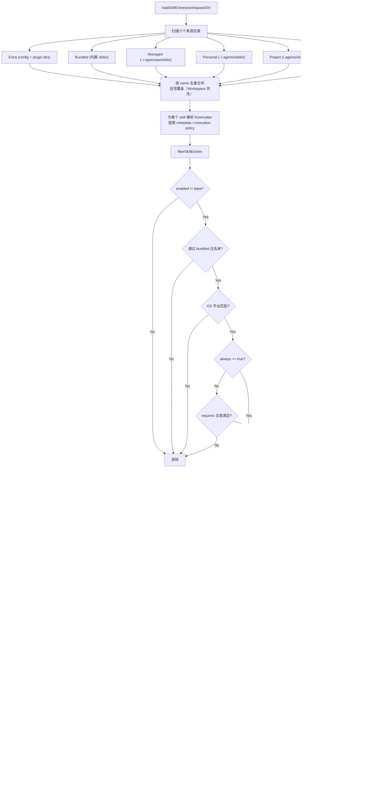
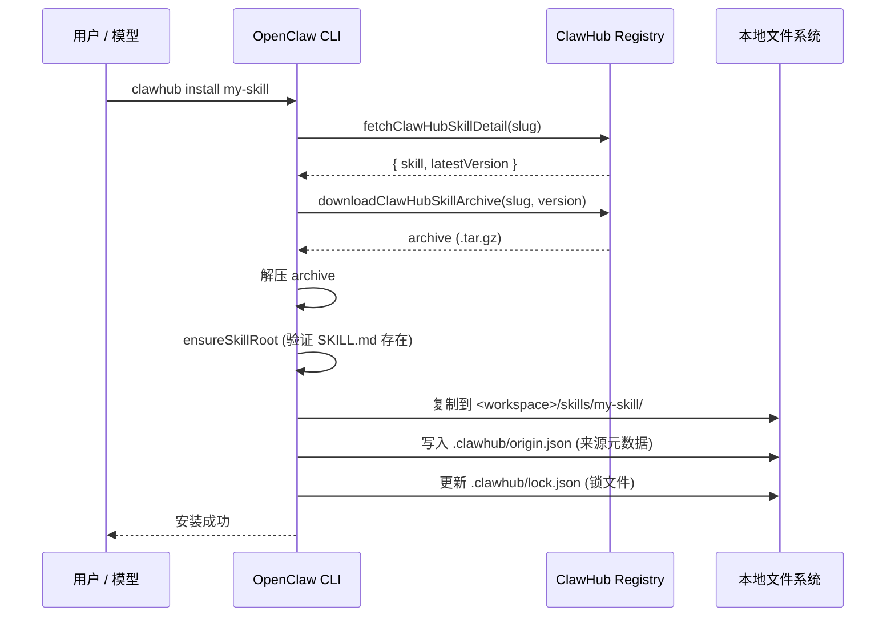

# 第 14 章 Skills 系统：元数据索引与按需加载

读完这章，你将理解 OpenClaw 如何用最小的 token 开销让模型感知上百个 skill 的存在，并在需要时精确加载完整指令。你还会掌握 SKILL.md 的结构规范、多层级解析优先级、Gating 机制的实现细节，以及文件系统热重载的工作方式。

## 14.1 核心设计决策：为什么不把 skill 内容全塞进 prompt

一个直觉想法是：把所有 skill 的完整内容拼接到 system prompt 里，模型自然就知道怎么做了。

这个方案有两个致命问题：

1. **Token 成本线性膨胀。** OpenClaw 内置 52 个 skill，每个 SKILL.md 从几百字到上千字不等。全部注入 system prompt 意味着每次对话至少多消耗数万 token，按 API 计价这是一笔不可忽视的开销。
2. **注意力稀释。** 大量无关内容会降低模型对当前任务的聚焦度。当用户问一个 Git 问题时，模型不需要知道 Apple Reminders 的完整操作手册。

OpenClaw 的方案是**元数据索引 + 按需加载**：system prompt 只包含每个 skill 的名称、描述和文件路径，模型根据用户请求判断需要哪个 skill，再用 `read` 工具加载对应的 SKILL.md 获取完整指令。

这个设计在 `src/agents/skills/skill-contract.ts:44` 的 `formatSkillsForPrompt` 函数中体现得很清楚：

```typescript
// src/agents/skills/skill-contract.ts:44
export function formatSkillsForPrompt(skills: Skill[]): string {
  if (skills.length === 0) {
    return "";
  }
  const lines = [
    "\n\nThe following skills provide specialized instructions for specific tasks.",
    "Use the read tool to load a skill's file when the task matches its description.",
    "When a skill file references a relative path, resolve it against the skill directory ...",
    "",
    "<available_skills>",
  ];
  for (const skill of skills) {
    lines.push("  <skill>");
    lines.push(`    <name>${escapeXml(skill.name)}</name>`);
    lines.push(`    <description>${escapeXml(skill.description)}</description>`);
    lines.push(`    <location>${escapeXml(skill.filePath)}</location>`);
    lines.push("  </skill>");
  }
  lines.push("</available_skills>");
  return lines.join("\n");
}
```

每个 skill 在 prompt 中只占 4 行 XML。模型看到 `<name>` 和 `<description>` 就能判断该 skill 是否相关，确认需要后调用 `read` 工具读取 `<location>` 指向的 SKILL.md。

## 14.2 Token 预算与紧凑降级

即使只传元数据，skill 数量多了也会撑爆预算。`src/agents/skills/workspace.ts` 定义了一组硬性限制：

```typescript
// src/agents/skills/workspace.ts:124-128
const DEFAULT_MAX_CANDIDATES_PER_ROOT = 300;
const DEFAULT_MAX_SKILLS_LOADED_PER_SOURCE = 200;
const DEFAULT_MAX_SKILLS_IN_PROMPT = 150;
const DEFAULT_MAX_SKILLS_PROMPT_CHARS = 18_000;
const DEFAULT_MAX_SKILL_FILE_BYTES = 256_000;
```

当 skill 数量超出字符预算，系统会自动降级到**紧凑格式**——只保留名称和路径，去掉描述：

```typescript
// src/agents/skills/workspace.ts:645
export function formatSkillsCompact(skills: Skill[]): string {
  // ... 省略辅助代码
  for (const skill of skills) {
    lines.push("  <skill>");
    lines.push(`    <name>${escapeXml(skill.name)}</name>`);
    lines.push(`    <location>${escapeXml(skill.filePath)}</location>`);
    lines.push("  </skill>");
  }
  // ...
}
```

降级决策在 `applySkillsPromptLimits` 中通过三级策略实现：

1. **完整格式**：名称 + 描述 + 路径，字符数在 18,000 以内时使用。
2. **紧凑格式**：名称 + 路径，去掉描述。仍然能让模型根据名称匹配。
3. **二分截断**：紧凑格式还是超预算，则二分搜索最大能放下的 skill 子集。

被截断时，prompt 中会附加一条警告：`Skills truncated: included X of Y (compact format, descriptions omitted).`

## 14.3 SKILL.md 的结构规范

每个 skill 是一个目录，核心文件是 `SKILL.md`。它由两部分组成：YAML frontmatter 和自然语言指令正文。

以 `skills/apple-reminders/SKILL.md` 为例：

```yaml
---
name: apple-reminders
description: List, add, edit, complete, or delete Apple Reminders via remindctl.
homepage: https://github.com/steipete/remindctl
metadata:
  {
    "openclaw":
      {
        "emoji": "⏰",
        "os": ["darwin"],
        "requires": { "bins": ["remindctl"] },
        "install":
          [
            {
              "id": "brew",
              "kind": "brew",
              "formula": "steipete/tap/remindctl",
              "bins": ["remindctl"],
              "label": "Install remindctl via Homebrew",
            },
          ],
      },
  }
---

# Apple Reminders CLI (remindctl)

Use `remindctl` to manage Apple Reminders directly from the terminal.
...（后续是完整的操作指南）
```

### Frontmatter 字段解析

**基础字段**（直接位于 YAML 顶层）：

| 字段 | 作用 | 解析位置 |
|------|------|---------|
| `name` | skill 名称，全局唯一标识符 | `local-loader.ts:68` |
| `description` | 一句话描述，出现在 prompt 元数据中 | `local-loader.ts:69` |
| `homepage` | 官方链接 | frontmatter 直接读取 |
| `user-invocable` | 用户是否能通过 `/命令` 调用 | `frontmatter.ts:213` |
| `disable-model-invocation` | 禁止模型自动调用此 skill | `frontmatter.ts:214` |

**OpenClaw 元数据**（嵌套在 `metadata.openclaw` 下）：

| 字段 | 类型 | 作用 |
|------|------|------|
| `always` | boolean | 跳过 requires 检查，始终加载 |
| `emoji` | string | UI 展示用图标 |
| `os` | string[] | 限制操作系统平台 |
| `primaryEnv` | string | 主要环境变量名（用于 API key 注入） |
| `skillKey` | string | 配置键名覆盖（默认用 name） |
| `requires.bins` | string[] | 必须全部存在的可执行文件 |
| `requires.anyBins` | string[] | 至少存在一个的可执行文件 |
| `requires.env` | string[] | 必须设置的环境变量 |
| `requires.config` | string[] | 必须为真的配置路径 |
| `install` | SkillInstallSpec[] | 自动安装方案列表 |

类型定义集中在 `src/agents/skills/types.ts:19-33`，解析逻辑在 `src/agents/skills/frontmatter.ts:187-207` 的 `resolveOpenClawMetadata` 函数中。

### 正文部分

YAML frontmatter 之后是自然语言指令，这才是模型在 `read` 之后真正获取的内容。写法没有固定模板，但好的 skill 通常包含：

- 何时使用 / 何时不使用的判断指南
- 常用命令速查
- 参数格式说明
- 注意事项和边界条件

这部分内容完全是给模型看的，不参与任何程序化解析。

## 14.4 Skill 解析优先级

OpenClaw 从六个位置加载 skill，通过 Map 的后写覆盖策略实现优先级。`src/agents/skills/workspace.ts:579-598` 中的合并逻辑：

```typescript
const merged = new Map<string, LoadedSkillRecord>();
// 优先级从低到高：
for (const record of extraSkills) { merged.set(record.skill.name, record); }      // Extra
for (const record of bundledSkills) { merged.set(record.skill.name, record); }     // Bundled
for (const record of managedSkills) { merged.set(record.skill.name, record); }     // Managed
for (const record of personalAgentsSkills) { merged.set(record.skill.name, record); } // Personal
for (const record of projectAgentsSkills) { merged.set(record.skill.name, record); }  // Project
for (const record of workspaceSkills) { merged.set(record.skill.name, record); }   // Workspace
```

六个来源及其含义：

| 优先级 | 来源 | 目录 | 说明 |
|--------|------|------|------|
| 最低 | Extra | 配置文件 `skills.load.extraDirs` + 插件 skill 目录 | 插件或外部指定的扩展 skill |
| | Bundled | 安装包内的 `skills/` 目录 | OpenClaw 内置的 52 个 skill |
| | Managed | `~/.openclaw/skills/` | 通过 ClawHub 安装的 skill |
| | Personal | `~/.agents/skills/` | 用户个人级 skill |
| | Project | `<workspace>/.agents/skills/` | 项目级 skill |
| 最高 | Workspace | `<workspace>/skills/` | 工作区级 skill |

这意味着如果你在项目的 `skills/` 目录下放一个和内置 skill 同名的 `SKILL.md`，你的版本会覆盖内置版本。这是有意为之——让用户能针对特定项目定制 skill 行为，而不需要修改全局配置。

## 14.5 Gating 机制：谁能被加载

不是所有 skill 都应该出现在 prompt 中。一个 macOS 专属的 skill 在 Linux 上没有意义，一个依赖 `ffmpeg` 的 skill 在没装 `ffmpeg` 的环境中只会产生无效调用。

Gating 逻辑在 `src/agents/skills/config.ts:73-105` 的 `shouldIncludeSkill` 函数中，它调用 `src/shared/config-eval.ts:60-106` 的 `evaluateRuntimeRequires` 进行实际检查：

```typescript
// src/shared/config-eval.ts:60
export function evaluateRuntimeRequires(params: RuntimeRequirementEvalParams): boolean {
  const requires = params.requires;
  if (!requires) { return true; }

  // 1. bins: 所有指定的可执行文件必须在 PATH 中存在
  const requiredBins = requires.bins ?? [];
  if (requiredBins.length > 0) {
    for (const bin of requiredBins) {
      if (params.hasBin(bin)) continue;
      if (params.hasRemoteBin?.(bin)) continue;
      return false;
    }
  }

  // 2. anyBins: 至少有一个存在即可
  const requiredAnyBins = requires.anyBins ?? [];
  if (requiredAnyBins.length > 0) {
    const anyFound = requiredAnyBins.some((bin) => params.hasBin(bin));
    if (!anyFound && !params.hasAnyRemoteBin?.(requiredAnyBins)) return false;
  }

  // 3. env: 所有指定的环境变量必须已设置
  const requiredEnv = requires.env ?? [];
  if (requiredEnv.length > 0) {
    for (const envName of requiredEnv) {
      if (!params.hasEnv(envName)) return false;
    }
  }

  // 4. config: 所有指定的配置路径必须为真
  const requiredConfig = requires.config ?? [];
  if (requiredConfig.length > 0) {
    for (const configPath of requiredConfig) {
      if (!params.isConfigPathTruthy(configPath)) return false;
    }
  }

  return true;
}
```

整个 Gating 流程分四层：

**第一层：操作系统过滤。** `metadata.openclaw.os` 指定 `["darwin"]` 的 skill 在 Linux 上直接被排除。评估时同时检查本地平台和远程节点平台（如果有）。

**第二层：显式禁用。** 配置文件中 `skills.entries.<skillKey>.enabled: false` 直接关闭该 skill。

**第三层：Bundled 白名单。** `skills.allowBundled` 配置项可以限制只加载指定的内置 skill，实现最小化 prompt。

**第四层：运行时依赖检查。** 按 `requires.bins` -> `requires.anyBins` -> `requires.env` -> `requires.config` 的顺序逐项检查，任一不满足则排除。

`always: true` 是一个旁路开关——标记了 `always` 的 skill 跳过第四层的依赖检查，OS 过滤仍然生效。

### 环境变量的特殊处理

环境变量检查不只是看 `process.env`，还会查配置文件中的 skill 级配置。`shouldIncludeSkill` 中的 `hasEnv` 回调：

```typescript
hasEnv: (envName) =>
  Boolean(
    process.env[envName] ||
    skillConfig?.env?.[envName] ||
    (skillConfig?.apiKey && entry.metadata?.primaryEnv === envName),
  ),
```

这意味着你可以在 OpenClaw 配置文件中为某个 skill 设置 API key，而不需要把它导出为系统环境变量。运行时 `applySkillEnvOverrides`（`src/agents/skills/env-overrides.ts:219`）会在 skill 加载时将配置中的值注入 `process.env`，会话结束后自动恢复。

## 14.6 Skill 加载的完整流程

下面用 Mermaid 图展示从启动到 prompt 注入的完整流程：



## 14.7 运行时快照与文件系统热重载

OpenClaw 不会在每次对话 turn 都重新扫描磁盘加载 skill。它使用**快照（Snapshot）+ 版本号**的机制来平衡性能和实时性。

### Snapshot 结构

```typescript
// src/agents/skills/types.ts:93
export type SkillSnapshot = {
  prompt: string;           // 已经渲染好的 prompt 文本
  skills: Array<{
    name: string;
    primaryEnv?: string;
    requiredEnv?: string[];
  }>;
  skillFilter?: string[];   // 当前生效的 skill 过滤器
  resolvedSkills?: Skill[]; // 完整的 skill 对象
  version?: number;         // 快照版本号
};
```

`buildWorkspaceSkillSnapshot`（`src/agents/skills/workspace.ts:719`）一次性完成扫描、过滤、格式化，生成一个不可变的快照对象。后续的对话 turn 直接复用 `snapshot.prompt`，不再重新计算。

### 文件系统监听

`src/agents/skills/refresh.ts` 使用 chokidar 监听所有 skill 目录：

```typescript
// src/agents/skills/refresh.ts:56
function resolveWatchPaths(workspaceDir: string, config?: OpenClawConfig): string[] {
  const paths: string[] = [];
  paths.push(path.join(workspaceDir, "skills"));
  paths.push(path.join(workspaceDir, ".agents", "skills"));
  paths.push(path.join(CONFIG_DIR, "skills"));
  paths.push(path.join(os.homedir(), ".agents", "skills"));
  // ... extraDirs 和 plugin skill dirs
  return paths;
}
```

监听的触发条件只看 `SKILL.md` 文件的变化（`shouldIgnoreSkillsWatchPath` 过滤掉其他文件），变化发生后通过 debounce（默认 250ms）调用 `bumpSkillsSnapshotVersion`。

### 版本号机制

`src/agents/skills/refresh-state.ts` 维护一个全局版本号和每个 workspace 的局部版本号：

```typescript
// src/agents/skills/refresh-state.ts
const workspaceVersions = new Map<string, number>();
let globalVersion = 0;

function bumpVersion(current: number): number {
  const now = Date.now();
  return now <= current ? current + 1 : now;
}
```

版本号用 `Date.now()` 时间戳作为值，保证单调递增。当 Gateway 准备发起下一轮对话时，用 `shouldRefreshSnapshotForVersion` 比较缓存版本和当前版本：

```typescript
export function shouldRefreshSnapshotForVersion(
  cachedVersion?: number,
  nextVersion?: number,
): boolean {
  const cached = typeof cachedVersion === "number" ? cachedVersion : 0;
  const next = typeof nextVersion === "number" ? nextVersion : 0;
  return next === 0 ? cached > 0 : cached < next;
}
```

如果版本号变了，重新构建快照；没变就复用缓存。这个设计避免了两个极端：不必每次对话都扫描磁盘，也不必重启进程才能感知 skill 变化。

外部消费者还可以通过 `registerSkillsChangeListener` 注册回调，在 skill 变化时收到通知。Gateway 用这个机制在下一次对话 turn 时刷新快照。

## 14.8 ClawHub 安装流程

ClawHub 是 OpenClaw 的 skill 注册中心。安装逻辑在 `src/agents/skills-clawhub.ts` 中。

### 安装步骤



关键细节：

**Slug 校验。** `validateRequestedSlug`（`skills-clawhub.ts:78`）用正则 `/^[a-z0-9](?:[a-z0-9-]*[a-z0-9])?$/i` 过滤非法字符，防止路径穿越攻击。

**来源追踪。** 每个已安装的 skill 目录下会写入 `.clawhub/origin.json`：

```json
{
  "version": 1,
  "registry": "https://clawhub.com",
  "slug": "my-skill",
  "installedVersion": "1.2.0",
  "installedAt": 1714387200000
}
```

**锁文件。** workspace 根目录下的 `.clawhub/lock.json` 记录所有已安装 skill 的版本信息，用于批量更新时的比对。

**指纹计算。** `computeSkillFingerprint`（`skills-clawhub.ts:470`）对 skill 目录内所有文件计算 SHA-256 哈希，用于判断本地是否已被修改。

### 更新机制

`updateSkillsFromClawHub` 支持单个更新和批量更新。流程：

1. 读取 lockfile 获取已安装的 skill 列表。
2. 对每个 skill，读取 `origin.json` 获取 registry 地址和当前版本。
3. 从 registry 下载最新版本，强制覆盖安装。
4. 更新 lockfile。
5. 返回结果中标注 `changed: true/false`，告知是否有实际变更。

## 14.9 Skill 安装器

SKILL.md 的 frontmatter 中可以声明 `install` 字段，告诉 OpenClaw 如何自动安装该 skill 依赖的工具。安装逻辑在 `src/agents/skills-install.ts` 中。

支持五种安装方式：

| Kind | 示例 | 说明 |
|------|------|------|
| `brew` | `formula: "steipete/tap/remindctl"` | Homebrew 安装 |
| `node` | `package: "clawhub"` | npm/pnpm/yarn/bun 全局安装 |
| `go` | `module: "github.com/x/y@latest"` | go install |
| `uv` | `package: "ruff"` | Python uv tool install |
| `download` | `url: "https://..."` | 直接下载二进制 |

安装器有严格的安全校验。以 brew formula 为例：

```typescript
// src/agents/skills-install.ts:145
const SAFE_BREW_FORMULA = /^[a-z0-9][a-z0-9+._@-]*(\/[a-z0-9][a-z0-9+._@-]*){0,2}$/;
```

每种安装方式都有对应的正则白名单，拒绝任何可能注入命令行选项的字符串（如以 `-` 开头的值）。

来自非内置来源的 skill 触发安装时，系统会额外发出警告：

```typescript
const trustedInstallSources = new Set(["openclaw-bundled", "openclaw-managed", "openclaw-extra"]);
if (!trustedInstallSources.has(skillSource)) {
  warnings.push(
    `WARNING: Skill "${params.skillName}" install triggered from non-bundled source...`
  );
}
```

## 14.10 路径压缩：省 token 的工程细节

一个容易忽略的优化：skill 文件路径在注入 prompt 前会被压缩。`src/agents/skills/workspace.ts:68-85` 将用户 home 目录前缀替换为 `~`：

```
/Users/alice/.bun/.../skills/github/SKILL.md
→ ~/.bun/.../skills/github/SKILL.md
```

代码注释标注了收益："Saves ~5-6 tokens per skill path x N skills = 400-600 tokens total."

这类微优化单看不起眼，但在 prompt 每个字节都要计费的场景下，几百 token 的节省是值得的。模型能正确理解 `~` 展开，`read` 工具也能解析 `~` 路径。

## 14.11 安全边界

Skill 加载涉及从磁盘读取任意文件并注入到 AI 系统中，安全防护覆盖了多个层面。

**路径逃逸检测。** `resolveContainedSkillPath`（`workspace.ts:268`）用 `realpath` 解析符号链接后检查目标是否仍在允许的根目录内。如果一个 skill 目录通过符号链接指向了根目录外的位置，直接跳过并记录警告。

**文件大小限制。** 单个 SKILL.md 超过 256KB 时被拒绝加载（`DEFAULT_MAX_SKILL_FILE_BYTES`），防止恶意构造的超大文件撑爆内存。

**环境变量注入安全。** `env-overrides.ts` 中的 `sanitizeSkillEnvOverrides` 维护了一个黑名单，阻止 skill 覆盖 `NODE_OPTIONS`、`LD_PRELOAD`、`OPENSSL_CONF` 等可以改变运行时行为的危险变量。

**安装器安全扫描。** 安装前会调用 `scanSkillInstallSource` 对安装指令进行安全审计，非受信来源的安装必须通过额外确认。

## 14.12 一个完整的 SKILL.md 解析示例

以 `skills/gemini/SKILL.md` 为例，追踪它从磁盘到 prompt 的完整路径：

**第一步：发现。** `loadSkillEntries` 扫描到 bundled skills 目录下的 `gemini/` 子目录，确认其中存在 `SKILL.md`，文件大小在限制内。

**第二步：加载与解析。** `loadSingleSkillDirectory`（`local-loader.ts:44`）读取文件内容，`parseFrontmatter` 提取 YAML 头部。从 frontmatter 中获取：
- `name: "gemini"`
- `description: "Gemini CLI for one-shot Q&A, summaries, and generation."`
- `metadata.openclaw.requires.bins: ["gemini"]`
- `metadata.openclaw.install: [{ kind: "brew", formula: "gemini-cli", ... }]`

**第三步：Gating 检查。** `shouldIncludeSkill` 按顺序检查：
- `enabled` 未被设为 false -> 通过
- 没有 `os` 限制 -> 通过
- 不是 `always` -> 进入 requires 检查
- `requires.bins: ["gemini"]` -> 在 PATH 中查找 `gemini` 二进制
  - 找到 -> 通过，进入候选列表
  - 没找到 -> 排除。但用户可以通过 `openclaw skills check` 看到它未满足的依赖，并触发自动安装

**第四步：注入 prompt。** 如果通过了 Gating，它会被渲染成：

```xml
<skill>
  <name>gemini</name>
  <description>Gemini CLI for one-shot Q&A, summaries, and generation.</description>
  <location>~/.bun/.../skills/gemini/SKILL.md</location>
</skill>
```

**第五步：按需加载。** 当用户说"用 Gemini 总结一下这篇文章"，模型识别出关联，调用 `read` 工具读取完整的 SKILL.md，获取具体的命令行用法，然后执行任务。

## 14.13 设计权衡总结

OpenClaw 的 Skills 系统在几个维度上做了明确的取舍：

**Token 效率 vs. 信息完整性。** 只传元数据而非完整内容，节省了大量 token 但引入了一次额外的 `read` 调用。实践中这个 trade-off 是划算的：大多数对话只会触发 0-2 个 skill，而元数据节省的 token 量远超这几次 `read` 的开销。

**灵活性 vs. 确定性。** 六层优先级机制让用户可以在任何层级覆盖 skill 行为，但也意味着同名 skill 的实际来源可能不直观。`openclaw skills check` 命令提供了审计能力。

**实时性 vs. 性能。** 快照 + 文件监听的方案避免了每次请求都扫描磁盘，同时通过版本号机制保证文件变化能在下一轮对话中生效。延迟在 250ms debounce + 一个对话 turn 的范围内。

**安全 vs. 开放。** 路径逃逸检测、文件大小限制、环境变量黑名单、安装器安全扫描——这些防护措施增加了代码复杂度，但对于一个能执行任意命令的 AI 系统来说是必要的。

## 14.14 Skills 生态全景

Skills 系统的技术设计催生了一个庞大的分发生态，这个生态本身的规模和治理模式也值得了解。

### 社区规模

截至 2026 年 3 月，围绕 OpenClaw Skills 形成了三个层次的内容：

- **内置 Skills**：仓库 `skills/` 目录下的 52 个 Skill，覆盖开发工具（`coding-agent`、`gh-issues`）、系统管理（`healthcheck`）、生产力（`apple-reminders`、`obsidian`）等基线场景
- **ClawHub 社区**：10,700+ 个社区贡献的 Skill，通过 ClawHub 注册表分发
- **模板仓库**：awesome-openclaw-agents 收集了 162+ 个生产可用的 Agent 模板，按 19 个分类组织（DevOps、内容创作、销售等）

以内置的 `gh-issues` 为例，这是一个约 900 行的 Skill，用纯自然语言定义了完整的 GitHub Issue 自动修复工作流：获取 Issue → 分析代码 → 创建分支 → 提交修复 → 开 PR → 处理 Review。这展示了 Skills 系统的表达能力上限——一个 Markdown 文件可以编排相当复杂的工作流。

### 治理挑战

开放的 Skill 市场面临的核心问题是安全。根据安全研究报告，ClawHub 上约 7.6% 的 Skill 被标记为恶意或可疑。已知的攻击模式包括：

- **Typosquatting**：创建名称与热门 Skill 相似的恶意 Skill（如 `github-issues` 冒充 `gh-issues`）
- **提权安装**：通过 `install` 配置的 `download` 类型下载恶意二进制
- **Prompt 注入**：在 Skill 正文中嵌入对 Agent 的恶意指令

OpenClaw 的应对是多层防御：白名单正则（14.9 节）、来源标记、安装扫描、加上 `VISION.md` 中的政策约束。但这个比例说明，对于开放的插件生态，安全投入永远不嫌多。

### 对平台设计的启示

从 OpenClaw 的 Skills 生态可以提炼几条经验：**核心保持精简**（52 个内置 vs 10,700+ 社区），为生态增长留出空间；**分层扩展**——Skills（零代码）、Plugins（TypeScript）、内核修改（PR 审查）三个层次覆盖不同开发者群体；**锁文件 + 指纹校验**借鉴自包管理器的最佳实践，确保可复现安装。

## 练习

**思考题**

1. Skills 系统采用"索引 + 按需加载的两阶段设计，而不是把所有 Skill 内容直接注入 System Prompt。如果一个 Agent 配置了 200 个 Skill，每个 Skill 的元数据描述平均 100 tokens，仅索引部分就占 20,000 tokens。当 Skill 数量继续增长到 1,000 个时，索引本身也会成为 token 预算的负担。你会怎样设计一个"索引的索引"机制来解决这个问题？

2. Gating 机制通过 `always`（跳过依赖检查）、`requires`（bins/env/config 依赖检查）、`description`（模型按需加载的判断依据）三种方式控制 Skill 是否被加载。一个设计得不好的 `description` 可能导致模型在不该加载 Skill 时加载了它（误加载），或者在该加载时没加载（漏加载）。对于 Skill 开发者来说，如何写好 description 来平衡召回率和精确率？

**动手题**

3. 编写一个简单的 SKILL.md 文件（比如"代码审查助手"），包含 YAML frontmatter 的完整字段（name、description、homepage、metadata.openclaw 下的 always/requires 等）和 Markdown 正文。将其放到 OpenClaw 的 `skills/` 目录下，验证该 Skill 是否出现在 Agent 的工具索引中。然后在对话中触发该 Skill 的加载，观察 System Prompt 中注入的内容。
