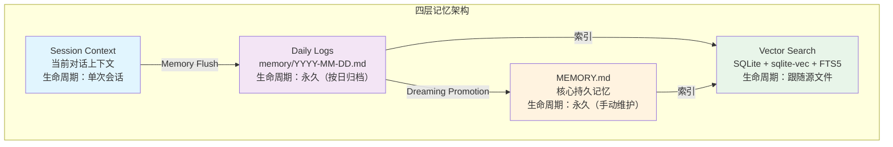
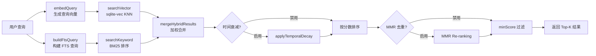
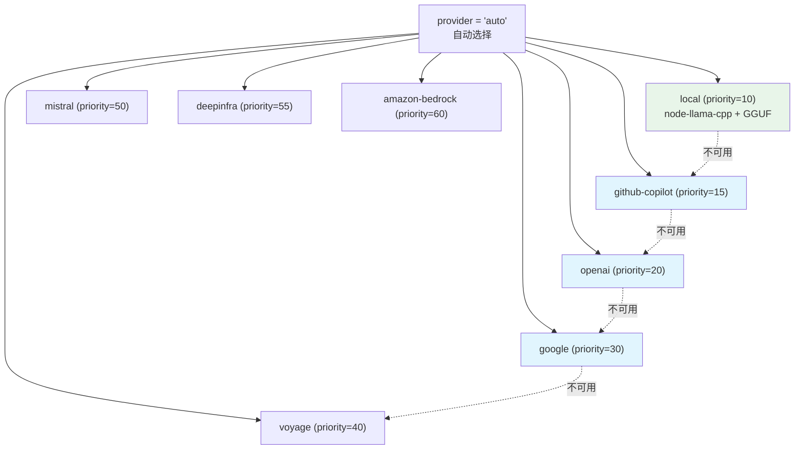
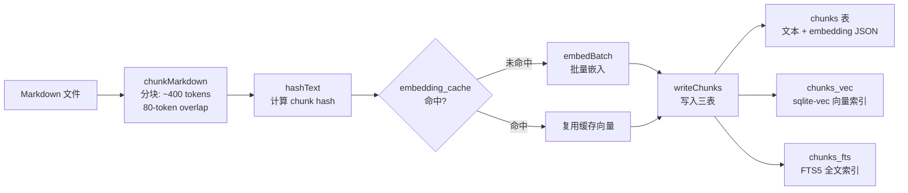

# 第 15 章 Memory 系统：四层记忆架构与混合检索

读完这一章，你将理解 OpenClaw 的四层记忆模型是如何运作的——从短期 Session Context 到持久化的 Daily Logs 和 MEMORY.md，再到基于向量的语义检索。你会掌握混合检索（向量 + BM25）的实现细节、SQLite + sqlite-vec 这一轻量级方案的设计取舍、Embedding Provider 的自动降级策略，以及 Memory Flush 预压缩机制的工作原理。

## 15.1 四层记忆模型

OpenClaw 的 Memory 系统由四个层次组成，每一层的生命周期和访问方式不同：



**第一层：Session Context**。当前对话的上下文窗口，包括 system prompt、用户消息、工具调用历史。这是 LLM 的"工作记忆"，受 context window 大小限制，会话结束即丢失。

**第二层：Daily Logs**。按日期归档的 Markdown 文件，路径格式为 `memory/YYYY-MM-DD.md`。当 Session Context 接近压缩阈值时，Memory Flush 机制将重要信息写入当日的 Daily Log。

**第三层：MEMORY.md**。工作空间根目录下的核心记忆文件，存放经过筛选和整理的持久知识。Dreaming 机制会定期从 Daily Logs 中提取高价值内容，"晋升"到 MEMORY.md。

**第四层：Vector Search**。所有 Markdown 文件（MEMORY.md、Daily Logs、extraPaths 指定的额外文件）被分块、嵌入、索引到 SQLite 数据库中，支持语义检索。

## 15.2 "Memory is plain Markdown" 的设计哲学

OpenClaw 的记忆系统有一个核心设计原则：**所有持久化记忆都是纯 Markdown 文件**。

这不是偶然选择。在 `src/memory/root-memory-files.ts` 中可以看到，MEMORY.md 的路径解析逻辑非常直接：

```typescript
// src/memory/root-memory-files.ts:4-6
export const CANONICAL_ROOT_MEMORY_FILENAME = "MEMORY.md";
export const LEGACY_ROOT_MEMORY_FILENAME = "memory.md";
```

这意味着：

1. **用户可以直接编辑**。打开 MEMORY.md 就能修改 Agent 的"长期记忆"，不需要数据库客户端或专用工具
2. **Git 友好**。记忆文件可以纳入版本控制，支持 diff、review、回滚
3. **跨工具互通**。任何能读 Markdown 的工具都能消费这些记忆
4. **透明可审计**。用户随时可以检查 Agent "记住了什么"

向量索引（SQLite 数据库）是 Markdown 文件的派生物，丢了可以从原始文件重建。源码中 `manager-sync-ops.ts` 的 `runSafeReindex` 方法会在检测到索引状态不一致时，创建临时数据库完成重建，然后原子替换：

```typescript
// extensions/memory-core/src/memory/manager-sync-ops.ts:1136-1143
private async runSafeReindex(params: { ... }): Promise<void> {
  const dbPath = resolveUserPath(this.settings.store.path);
  const tempDbPath = `${dbPath}.tmp-${randomUUID()}`;
  const tempDb = openMemoryDatabaseAtPath(tempDbPath, ...);
  // ... 在临时数据库中重建索引 ...
  // 原子替换：关闭旧数据库，重命名临时文件
}
```

OpenClaw 的 Memory 系统代码分布在两个位置：`src/memory/` 存放宿主端的文件管理，`extensions/memory-core/` 存放核心的检索和索引逻辑。后续代码引用会在这两个目录之间切换。

## 15.3 Daily Logs 的写入时机和加载策略

Daily Logs（`memory/YYYY-MM-DD.md`）是 Session Context 和持久记忆之间的桥梁。

### 写入时机：Memory Flush

写入由 Memory Flush 机制触发。在 `extensions/memory-core/src/flush-plan.ts` 中定义了触发条件：

```typescript
// extensions/memory-core/src/flush-plan.ts:10-11
export const DEFAULT_MEMORY_FLUSH_SOFT_TOKENS = 4000;
export const DEFAULT_MEMORY_FLUSH_FORCE_TRANSCRIPT_BYTES = 2 * 1024 * 1024;
```

两个阈值控制 Flush 的触发：

- **softThresholdTokens（4000 tokens）**：当剩余可用 token 数低于该阈值时，触发 Flush
- **forceFlushTranscriptBytes（2MB）**：当对话 transcript 体积达到该值时，强制 Flush

Flush 实际上是一次特殊的 Agent 交互。系统注入一条 prompt，要求 Agent 将值得保留的信息写入 `memory/YYYY-MM-DD.md`：

```typescript
// extensions/memory-core/src/flush-plan.ts:25-32
export const DEFAULT_MEMORY_FLUSH_PROMPT = [
  "Pre-compaction memory flush.",
  MEMORY_FLUSH_TARGET_HINT,
  MEMORY_FLUSH_READ_ONLY_HINT,
  MEMORY_FLUSH_APPEND_ONLY_HINT,
  "Do NOT create timestamped variant files ...",
  `If nothing to store, reply with ${SILENT_REPLY_TOKEN}.`,
].join(" ");
```

注意几个安全约束：

1. **只写 Daily Logs**：目标固定为 `memory/YYYY-MM-DD.md`，不允许写其他文件
2. **Append Only**：只追加，不覆盖已有条目
3. **引导文件只读**：MEMORY.md、AGENTS.md 等 bootstrap 文件在 Flush 期间严格只读

`buildMemoryFlushPlan` 函数负责生成 Flush 计划，其中包含日期戳的格式化（支持用户时区）和完整的 prompt 模板。

### 加载策略

Daily Logs 通过文件系统监听（chokidar）和索引同步进入 Vector Search 层。`manager-sync-ops.ts` 中的 `ensureWatcher` 方法监听 `memory/` 目录的变化：

```typescript
// extensions/memory-core/src/memory/manager-sync-ops.ts:398-402
const watchPaths = new Set<string>([
  path.join(this.workspaceDir, "MEMORY.md"),
  path.join(this.workspaceDir, "memory"),
]);
```

文件变更触发 `dirty` 标记，经过 `watchDebounceMs`（默认 1500ms）防抖后执行增量索引。

## 15.4 MEMORY.md 的安全边界

MEMORY.md 包含 Agent 的核心持久记忆，OpenClaw 对它的访问施加了严格限制。

### Session 可见性控制

`extensions/memory-core/src/session-search-visibility.ts` 实现了基于 Session 的访问控制。当 Memory Search 返回结果时，系统会根据请求者的 session key 过滤可见范围：

```typescript
// extensions/memory-core/src/session-search-visibility.ts:14-18
export async function filterMemorySearchHitsBySessionVisibility(params: {
  cfg: OpenClawConfig;
  requesterSessionKey: string | undefined;
  sandboxed: boolean;
  hits: MemorySearchResult[];
}): Promise<MemorySearchResult[]> {
```

对于 `source: "sessions"` 类型的搜索结果，系统通过 `createSessionVisibilityGuard` 判断请求者是否有权访问目标 session 的转录内容。这防止了一个 session 中的 Agent 读取另一个 session 的私密对话。

### System Prompt 集成

MEMORY.md 的内容通过 `memory-state.ts` 中的 `buildMemoryPromptSection` 注入系统提示词。memory-core 插件注册 `promptBuilder`，在每次 Agent 响应前构建 Memory 相关的 system prompt 片段：

```typescript
// src/plugins/memory-state.ts:207-220
export function buildMemoryPromptSection(params: {
  availableTools: Set<string>;
  citationsMode?: MemoryCitationsMode;
}): string[] {
  const primary =
    memoryPluginState.capability?.capability.promptBuilder?.(params) ??
    memoryPluginState.promptBuilder?.(params) ?? [];
  const supplements = memoryPluginState.promptSupplements
    .toSorted((left, right) => left.pluginId.localeCompare(right.pluginId))
    .flatMap((registration) => registration.builder(params));
  return [...primary, ...supplements];
}
```

system-prompt.ts 中定义了 context file 的加载顺序，`memory.md` 的优先级是 70：

```typescript
// src/agents/system-prompt.ts:45-53
const CONTEXT_FILE_ORDER = new Map<string, number>([
  ["agents.md", 10],
  ["soul.md", 20],
  ["identity.md", 30],
  ["user.md", 40],
  ["tools.md", 50],
  ["bootstrap.md", 60],
  ["memory.md", 70],
]);
```

## 15.5 混合检索实现

OpenClaw 的 Memory Search 采用向量相似度 + BM25 关键词搜索的混合检索策略。默认权重配置在 `src/agents/memory-search.ts` 中：

```typescript
// src/agents/memory-search.ts:110-113
const DEFAULT_HYBRID_VECTOR_WEIGHT = 0.7;
const DEFAULT_HYBRID_TEXT_WEIGHT = 0.3;
const DEFAULT_HYBRID_CANDIDATE_MULTIPLIER = 4;
```

### 检索流程



### 向量检索

`manager-search.ts` 中的 `searchVector` 函数利用 sqlite-vec 的原生 KNN 查询：

```typescript
// extensions/memory-core/src/memory/manager-search.ts:146-154
const runVectorQuery = (candidateLimit: number) =>
  params.db.prepare(
    `SELECT c.id, c.path, c.start_line, c.end_line, c.text,
            c.source,
            vec_distance_cosine(v.embedding, ?) AS dist
       FROM ${params.vectorTable} v
       JOIN chunks c ON c.id = v.id
      WHERE v.embedding MATCH ? AND k = ? AND c.model = ?${sourceFilter}
      ORDER BY dist ASC
      LIMIT ?`,
  ).all(qBlob, qBlob, candidateLimit, ...);
```

sqlite-vec 的 `vec0` 虚拟表支持 `MATCH ? AND k = ?` 语法，执行复杂度约为 O(log N + k)，远优于全表扫描。最终分数通过 `score = 1 - dist` 转换到 [0, 1] 的余弦相似度区间。

如果 sqlite-vec 扩展不可用（加载失败或未安装），系统降级为全表扫描计算余弦相似度：

```typescript
// extensions/memory-core/src/memory/manager-search.ts:208-215
return searchChunksByEmbedding({
  // 逐行遍历 chunks 表，调用 cosineSimilarity() 计算分数
});
```

### 关键词检索

FTS5 全文检索通过 `searchKeyword` 函数实现。查询构建支持两种 tokenizer：

- **unicode61**（默认）：标准 Unicode 分词，用 `AND` 连接各 token
- **trigram**：三字符分词，适合 CJK 文本中短 token 的模糊匹配

SQLite FTS5 的 `bm25()` 函数返回负值（相关性越高，值越小），需要取反后归一化。BM25 排名分数通过 `bm25RankToScore` 转换到 [0, 1] 区间：

```typescript
// extensions/memory-core/src/memory/hybrid.ts:46-55
export function bm25RankToScore(rank: number): number {
  if (!Number.isFinite(rank)) return 1 / (1 + 999);
  if (rank < 0) {
    const relevance = -rank;
    return relevance / (1 + relevance);
  }
  return 1 / (1 + rank);
}
```

### 合并策略

`mergeHybridResults` 函数按 chunk ID 合并两路结果，对每个 chunk 计算加权分数：

```
finalScore = vectorWeight × vectorScore + textWeight × textScore
```

默认配置下，70% 权重给向量相似度，30% 给 BM25。这个比例可以通过 `query.hybrid.vectorWeight` 和 `query.hybrid.textWeight` 调整，系统会自动归一化使两者之和为 1。

### 时间衰减（Temporal Decay）

对于按日期命名的 Daily Logs（`memory/YYYY-MM-DD.md`），系统支持可选的时间衰减。`temporal-decay.ts` 从文件路径中提取日期，计算指数衰减：

```typescript
// extensions/memory-core/src/memory/temporal-decay.ts:24-34
export function calculateTemporalDecayMultiplier(params: {
  ageInDays: number;
  halfLifeDays: number;
}): number {
  const lambda = Math.LN2 / params.halfLifeDays;
  return Math.exp(-lambda * Math.max(0, params.ageInDays));
}
```

默认半衰期为 30 天，即 30 天前的记忆分数降为原来的 50%。MEMORY.md 和非日期命名的文件被视为"常青知识"（evergreen），不受衰减影响。

### MMR 多样性重排序

Maximal Marginal Relevance（MMR）是一种可选的后处理步骤。`mmr.ts` 实现了 Carbonell & Goldstein (1998) 的算法，使用 Jaccard 相似度作为内容相似度度量：

```
MMR = λ × relevance - (1-λ) × max_similarity_to_selected
```

MMR 的核心价值在于避免返回高度重复的检索结果。例如，如果 Daily Logs 中多天记录了相似的内容，MMR 会倾向于只保留最相关的那一条，把名额让给不同主题的结果。

## 15.6 SQLite + sqlite-vec + FTS5：为什么不用外部向量数据库？

OpenClaw 的存储方案是 SQLite 一体化：主数据、向量索引、全文索引全在一个 `.sqlite` 文件中。这和 Pinecone、Weaviate 等专用向量数据库的路线完全不同。

### 存储架构

```
~/.openclaw/state/memory/{agentId}.sqlite
├── meta          — 索引元信息（model、provider、chunkTokens...）
├── files         — 已索引文件列表（path、hash、mtime、size）
├── chunks        — 文本分块（id、path、source、text、embedding JSON）
├── chunks_vec    — sqlite-vec 向量索引（vec0 虚拟表）
├── chunks_fts    — FTS5 全文索引
└── embedding_cache — 嵌入缓存（避免重复计算）
```

sqlite-vec 的加载在 `src/memory-host-sdk/host/sqlite-vec.ts` 中实现：

```typescript
// src/memory-host-sdk/host/sqlite-vec.ts:18-39
export async function loadSqliteVecExtension(params: {
  db: DatabaseSync;
  extensionPath?: string;
}): Promise<{ ok: boolean; extensionPath?: string; error?: string }> {
  const sqliteVec = await loadSqliteVecModule();
  params.db.enableLoadExtension(true);
  sqliteVec.load(params.db);
  return { ok: true, extensionPath };
}
```

向量表使用 `vec0` 虚拟表，维度在运行时根据 embedding provider 的输出动态确定：

```typescript
// extensions/memory-core/src/memory/manager-sync-ops.ts:275-280
this.db.exec(
  `CREATE VIRTUAL TABLE IF NOT EXISTS ${VECTOR_TABLE} USING vec0(
    id TEXT PRIMARY KEY,
    embedding FLOAT[${dimensions}]
  )`
);
```

### 设计取舍

选择 SQLite 而非外部向量数据库，是一个有意识的工程决策：

| 维度 | SQLite + sqlite-vec | 外部向量数据库 |
|------|-------------------|--------------|
| 部署复杂度 | 零配置，单文件 | 需要独立服务 |
| 数据一致性 | 同一事务覆盖三种索引 | 跨服务最终一致 |
| 延迟 | 本地文件 I/O，微秒级 | 网络往返，毫秒级 |
| 扩展性 | 单机，十万级 chunk | 分布式，百万级以上 |
| 离线支持 | 完整支持 | 依赖网络 |

对于 Agent 助手的使用场景，一个工作空间的 Memory 文件通常在几十到几百个量级，chunk 总数在千到万级别。SQLite 的性能在这个规模下绰绰有余，而零部署成本是决定性优势——用户不需要启动任何额外服务就能获得语义检索能力。

## 15.7 Embedding Provider 链：自动选择与降级

OpenClaw 支持多种 Embedding Provider，采用优先级自动选择 + 失败降级的策略。

### Provider 优先级



优先级通过各 provider 插件的 `autoSelectPriority` 字段定义：

```typescript
// extensions/openai/memory-embedding-adapter.ts:18
autoSelectPriority: 20,

// extensions/google/memory-embedding-adapter.ts:28
autoSelectPriority: 30,
```

local provider 优先级最高（10），但有前置条件：需要 `node-llama-cpp` 可用且 GGUF 模型文件存在于磁盘。`provider-adapters.ts` 中的 `canAutoSelectLocal` 函数检查这个条件：

```typescript
// extensions/memory-core/src/memory/provider-adapters.ts:71-85
function canAutoSelectLocal(modelPath?: string): boolean {
  const trimmed = modelPath?.trim();
  if (!trimmed) return false;
  if (/^(hf:|https?:)/i.test(trimmed)) return false;
  const resolved = resolveUserPath(trimmed);
  try {
    return fsSync.statSync(resolved).isFile();
  } catch {
    return false;
  }
}
```

### 自动选择流程

`createEmbeddingProvider` 在 `provider = "auto"` 模式下，按优先级逐个尝试：

```typescript
// extensions/memory-core/src/memory/embeddings.ts:107-139
export async function createEmbeddingProvider(
  options: CreateEmbeddingProviderOptions,
): Promise<EmbeddingProviderResult> {
  if (options.provider === "auto") {
    for (const adapter of listAutoSelectAdapters(options)) {
      try {
        const result = await createWithAdapter(adapter, { ... });
        return { ...result, requestedProvider: "auto" };
      } catch (err) {
        if (shouldContinueAutoSelection(adapter, err)) {
          reasons.push(message);
          continue;  // 尝试下一个 provider
        }
        throw wrapped;  // 致命错误，不再继续
      }
    }
    // 所有 provider 都不可用
    return { provider: null, requestedProvider: "auto",
             providerUnavailableReason: ... };
  }
}
```

关键细节：每个 adapter 通过 `shouldContinueAutoSelection` 决定失败时是否继续尝试下一个。local provider 总是返回 `true`（因为缺少本地模型不应阻止使用远程 provider），而远程 provider 的凭证错误则会直接抛出。

### FTS-Only 降级

如果所有 Embedding Provider 都不可用，系统不会报错退出，而是降级为"FTS-Only"模式——仅使用 BM25 关键词检索：

```typescript
// extensions/memory-core/src/memory/manager.ts:370-424
if (!this.provider) {
  if (!this.fts.enabled || !this.fts.available) {
    log.warn("memory search: no provider and FTS unavailable");
    return [];
  }
  // 纯关键词检索，带 fallback 宽松策略
  const fullQueryResults = await this.searchKeyword(cleaned, candidates, {
    boostFallbackRanking: true,
  }, sourceFilterList);
  // ...
}
```

`boostFallbackRanking: true` 启用增强评分逻辑，综合考虑 token 覆盖率、密度和路径匹配度，弥补缺少语义理解的不足。

## 15.8 索引管道

从 Markdown 文件到可检索的向量索引，经过一条完整的管道：



### 分块参数

```typescript
// src/agents/memory-search.ts:103-104
const DEFAULT_CHUNK_TOKENS = 400;
const DEFAULT_CHUNK_OVERLAP = 80;
```

400 tokens 的块大小是一个权衡点。太小会丢失上下文，太大会稀释语义聚焦度。80 tokens 的重叠（约 20%）确保跨块边界的信息不会丢失。

### 嵌入缓存

`embedding_cache` 表按 `(provider, model, provider_key, hash)` 缓存已计算的向量。当文件内容未变时（hash 匹配），直接复用缓存，跳过昂贵的嵌入调用：

```typescript
// extensions/memory-core/src/memory/manager-embedding-ops.ts:139-148
private async embedChunksInBatches(chunks: MemoryChunk[]): Promise<number[][]> {
  const { embeddings, missing } = this.collectCachedEmbeddings(chunks);
  if (missing.length === 0) {
    return embeddings;  // 全部命中缓存
  }
  // 仅对未命中的 chunk 调用 embedding API
}
```

### 文件监听与增量更新

`manager-sync-ops.ts` 使用 chokidar 监听文件系统变化，实现增量索引：

1. **文件变更检测**：chokidar 监听 `MEMORY.md` 和 `memory/` 目录
2. **防抖处理**：通过 `watchDebounceMs`（默认 1500ms）避免频繁重建
3. **Hash 比对**：每个文件记录 hash，只有内容实际变化才触发重新索引
4. **原子重建**：当 provider 或配置变化需要全量重建时，使用临时数据库 + 原子替换，避免服务中断

Session Transcript 的监听策略更精细。系统通过字节增量（默认 100KB）和消息增量（默认 50 条）两个阈值控制同步频率：

```typescript
// src/agents/memory-search.ts:107-108
const DEFAULT_SESSION_DELTA_BYTES = 100_000;
const DEFAULT_SESSION_DELTA_MESSAGES = 50;
```

这避免了每条消息都触发重新索引，在实时性和性能之间找到平衡。

### 并发控制

索引操作的并发度根据 provider 类型动态调整：

```typescript
// extensions/memory-core/src/memory/manager-embedding-ops.ts:90-103
export function resolveMemoryIndexConcurrency(params: {
  batch: { enabled: boolean; concurrency: number };
  configuredNonBatchConcurrency?: number;
  providerId?: string;
}): number {
  if (params.batch.enabled) return params.batch.concurrency;
  // Ollama 本地推理，串行避免 GPU 争抢
  return params.providerId === "ollama" ? 1 : EMBEDDING_INDEX_CONCURRENCY;
}
```

默认并发度为 4，Ollama 强制降为 1（避免 GPU 资源争抢），batch 模式使用独立的并发配置。

## 15.9 Memory Flush 预压缩机制

Memory Flush 是 OpenClaw 在自动压缩（compaction）之前执行的一道保护措施。当 context window 快要满时，与其直接截断历史消息，不如先让 Agent 把重要信息写入持久化存储。

### 触发时机

Flush 的触发判断在 compaction 流程中完成。`flush-plan.ts` 中的 `buildMemoryFlushPlan` 构建 Flush 计划：

```typescript
// extensions/memory-core/src/flush-plan.ts:95-140
export function buildMemoryFlushPlan(params = {}): MemoryFlushPlan | null {
  // 可通过配置禁用
  if (defaults?.enabled === false) return null;

  // 解析时区，生成当日日期戳
  const { timeLine, userTimezone } = resolveCronStyleNow(cfg ?? {}, nowMs);
  const dateStamp = formatDateStampInTimezone(nowMs, userTimezone);
  const relativePath = `memory/${dateStamp}.md`;

  return {
    softThresholdTokens,          // 4000 tokens
    forceFlushTranscriptBytes,    // 2MB
    reserveTokensFloor,
    prompt: ...,                  // 注入 Agent 的 flush 指令
    systemPrompt: ...,            // flush 系统提示
    relativePath,                 // 目标文件路径
  };
}
```

### Flush 安全约束

Flush prompt 中嵌入了多层安全约束，通过 `ensureMemoryFlushSafetyHints` 强制注入：

```typescript
// extensions/memory-core/src/flush-plan.ts:14-23
const MEMORY_FLUSH_TARGET_HINT =
  "Store durable memories only in memory/YYYY-MM-DD.md ...";
const MEMORY_FLUSH_APPEND_ONLY_HINT =
  "If memory/YYYY-MM-DD.md already exists, APPEND new content only ...";
const MEMORY_FLUSH_READ_ONLY_HINT =
  "Treat workspace bootstrap/reference files such as MEMORY.md, DREAMS.md, " +
  "SOUL.md, TOOLS.md, and AGENTS.md as read-only during this flush ...";
```

即使用户自定义了 Flush prompt，这三条约束也会被强制追加。

## 15.10 Dreaming：从短期记忆到长期记忆的晋升

Dreaming 是 OpenClaw 的"记忆整理"机制——定期扫描 Daily Logs 中被频繁检索的内容，将高价值条目"晋升"到 MEMORY.md。

### 晋升流程

1. **扫描 recall store**：统计每个 chunk 被检索的次数（`recallCount`）、被多少不同查询检索过（`uniqueQueries`）、平均相关度分数（`score`）
2. **加权排序**：综合频率、相关度、多样性、时间衰减、概念关联等六个维度打分
3. **写入 MEMORY.md**：通过 `applyShortTermPromotions` 将候选条目追加到 MEMORY.md

### 触发方式

Dreaming 通过 Cron Job 触发，在隔离 session 中执行，不干扰用户正在进行的对话：

```typescript
// extensions/memory-core/src/dreaming.ts:163-187
function buildManagedDreamingCronJob(
  config: ShortTermPromotionDreamingConfig,
): ManagedCronJobCreate {
  return {
    name: MANAGED_DREAMING_CRON_NAME,
    enabled: true,
    schedule: { kind: "cron", expr: config.cron },
    sessionTarget: "isolated",   // 隔离 session，不影响主对话
    wakeMode: "now",
    payload: {
      kind: "agentTurn",
      message: DREAMING_SYSTEM_EVENT_TEXT,
      lightContext: true,
    },
    delivery: { mode: "none" },  // 不发送到用户
  };
}
```

### 筛选阈值

```typescript
// 默认筛选条件（从 dreaming.ts 导入的常量）
limit: 10,              // 每次最多晋升 10 条
minScore: 0.5,          // 最低综合评分
minRecallCount: 3,      // 至少被检索 3 次
minUniqueQueries: 2,    // 至少被 2 个不同查询检索
recencyHalfLifeDays: 7  // 近期检索权重更高
```

这些阈值确保只有真正被反复需要的信息才会进入 MEMORY.md，避免噪声污染核心记忆。

## 15.11 配置参考

Memory 系统的完整配置在 `resolveMemorySearchConfig` 中解析（`src/agents/memory-search.ts`）：

```yaml
agents:
  defaults:
    memorySearch:
      enabled: true
      provider: "auto"           # 或 "openai" / "local" / "google" 等
      fallback: "none"
      model: ""                  # 留空使用 provider 默认模型
      sources: ["memory"]        # 可选 ["memory", "sessions"]
      extraPaths: []             # 额外的 Markdown 文件/目录

      chunking:
        tokens: 400
        overlap: 80

      store:
        driver: "sqlite"
        fts:
          tokenizer: "unicode61"  # 或 "trigram"（适合 CJK）
        vector:
          enabled: true

      sync:
        onSessionStart: true
        onSearch: true
        watch: true
        watchDebounceMs: 1500

      query:
        maxResults: 6
        minScore: 0.35
        hybrid:
          enabled: true
          vectorWeight: 0.7
          textWeight: 0.3
          candidateMultiplier: 4
          mmr:
            enabled: false
            lambda: 0.7
          temporalDecay:
            enabled: false
            halfLifeDays: 30

      cache:
        enabled: true
```

## 本章小结

OpenClaw 的 Memory 系统通过四层架构解决了 Agent 的长期记忆问题：Session Context 提供工作记忆，Daily Logs 按日归档对话中的关键信息，MEMORY.md 存放经过整理的核心知识，Vector Search 让这些记忆可被语义检索。

几个关键的设计决策值得在自己的项目中参考：

- **Markdown-first**：记忆的持久化格式选择纯 Markdown，确保透明性和可编辑性
- **SQLite 一体化**：用 sqlite-vec + FTS5 把向量检索和全文检索打包到一个文件中，零部署成本
- **优雅降级**：从本地 GGUF 到 OpenAI 到纯 FTS，每一层失败都有兜底方案
- **预压缩保护**：Memory Flush 在 context 截断前主动保存信息，而非被动丢失
- **混合检索**：向量和关键词各取所长，70/30 的默认权重在实践中表现稳健

## 练习

**思考题**

1. 混合检索的默认权重是 70% 向量 + 30% 关键词。考虑两个极端场景：(a) 用户查询的是一个精确的变量名 `handleWebSocketUpgrade`，(b) 用户查询的是模糊的意图"之前讨论过的那个性能优化方案"。在这两种情况下，70/30 的权重是否合适？你会怎样设计一个动态权重调整策略？

2. Dreaming 机制将短期记忆晋升为长期记忆。这个过程需要 LLM 参与总结和提取。如果 LLM 在总结时遗漏了关键信息，或者引入了幻觉内容，这些错误会被永久化到长期记忆中。你认为应该怎样设计校验机制来减少这种风险？

**动手题**

3. 在 OpenClaw 中进行一系列有主题的对话（比如讨论一个具体的技术方案），然后在新 Session 中查询相关内容，观察 Memory 系统的检索结果。对比向量检索和关键词检索各自返回了什么，理解混合检索的实际效果。
