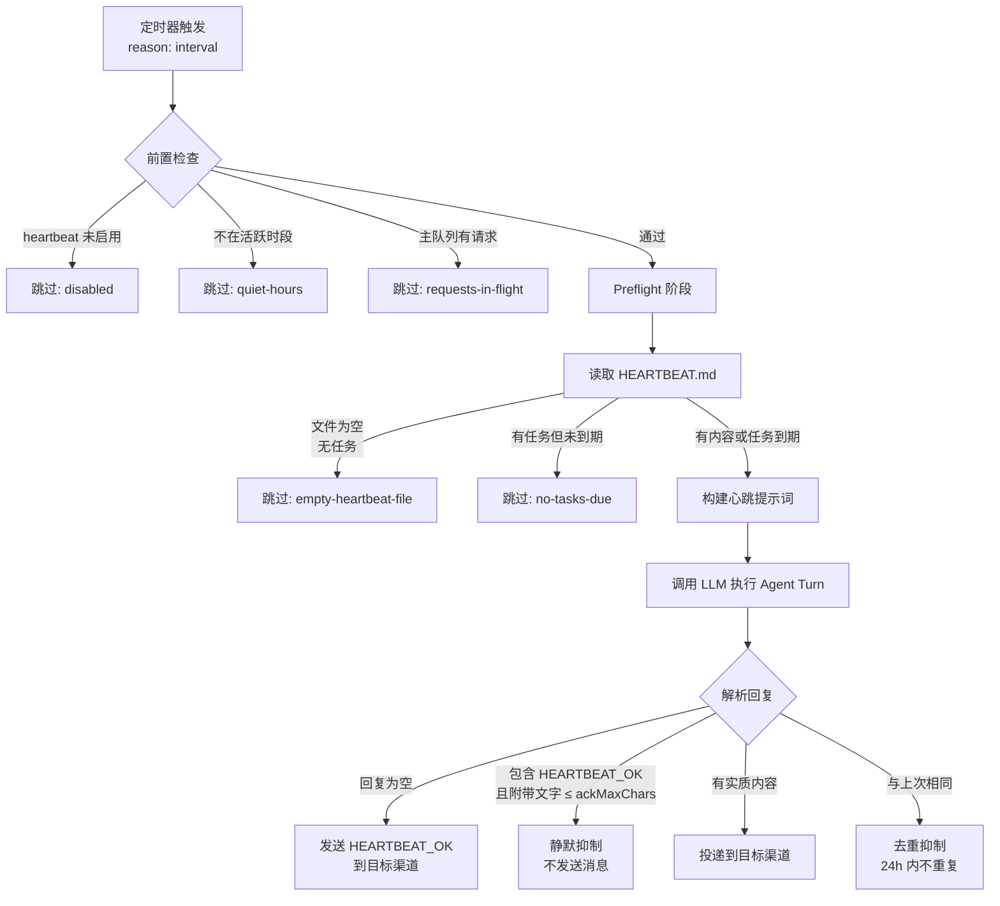
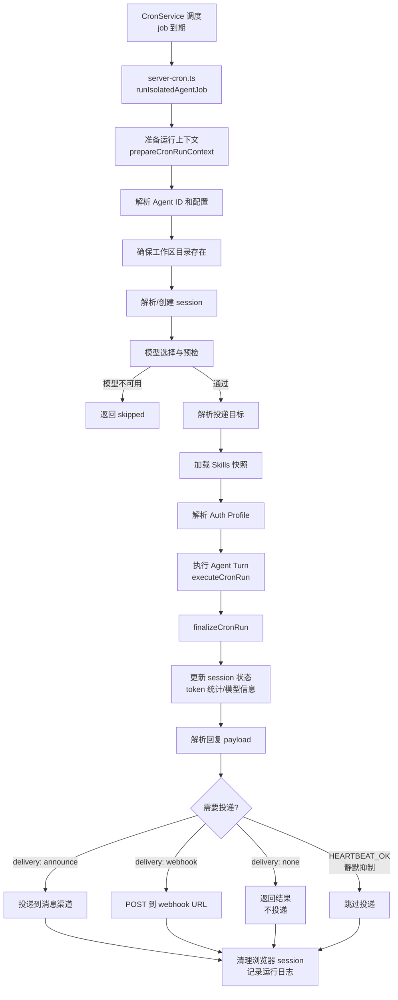

# 第 16 章 — Heartbeat 与 Cron：Agent 的主动行为机制

读完这章，你会理解 OpenClaw 如何让 Agent 从"被动回答"升级为"主动行动"：Heartbeat 提供周期性的自检循环，Cron 提供精确定时的独立任务执行。你还会掌握 HEARTBEAT_OK 静默抑制机制、HEARTBEAT.md 检查清单的设计、Cron 的 session 隔离策略，以及这两个系统的本质区别。

## 16.1 为什么 Agent 需要主动行为

传统 chatbot 的工作模式是请求-响应：用户发消息，bot 回复。这种模式下，如果用户不说话，bot 就是一块砖。

但一个真正有用的 AI 助手不应该只在被叫到时才出现。它应该能定期检查邮箱里有没有紧急邮件、每天早上整理待办事项、在股票价格异动时发送通知。这些能力的共同点是：**不需要用户触发**。

OpenClaw 用两套互补的机制实现了这个目标：

| 机制 | 触发方式 | 典型场景 |
|------|---------|---------|
| Heartbeat | 固定间隔轮询（默认 30 分钟） | 检查新邮件、巡视待办清单、状态自检 |
| Cron | 精确定时调度（cron 表达式 / 固定间隔 / 一次性） | 每天 8:00 发早报、每周五生成周报、某个时刻执行一次性任务 |

两者的核心区别：Heartbeat 是 Agent 的"心跳"，它周期性地唤醒 Agent 做一轮检查，如果没什么事就静默回去；Cron 是独立的定时任务，每次运行都在隔离 session 中执行一个明确的指令。

## 16.2 Heartbeat 机制

### 16.2.1 默认 30 分钟的心跳周期

Heartbeat 的核心参数是 `every`，默认值定义在 `src/auto-reply/heartbeat.ts:17`：

```typescript
export const DEFAULT_HEARTBEAT_EVERY = "30m";
```

这个值支持人类可读的时间字符串格式（`30m`、`1h`、`2h30m` 等），由 `parseDurationMs()` 解析为毫秒。Gateway 启动时，`startHeartbeatRunner()` 读取配置，为每个启用了 heartbeat 的 Agent 创建定时器。到达 `nextDueMs` 时，调用 `requestHeartbeatNow({ reason: "interval" })` 触发一次心跳。

配置方式：

```yaml
# openclaw.yaml
agents:
  defaults:
    heartbeat:
      every: "30m"          # 心跳间隔
      prompt: "..."         # 自定义心跳提示词
      ackMaxChars: 300      # HEARTBEAT_OK 附带文字的最大长度
      isolatedSession: true # 是否使用隔离 session（避免发送完整对话历史）
      target: "last"        # 回复目标：last（最近对话渠道）或具体渠道
```

### 16.2.2 一次心跳的完整流程

一次心跳执行的逻辑集中在 `src/infra/heartbeat-runner.ts` 的 `runHeartbeatOnce()` 函数中。整个过程可以分为五个阶段：



**阶段一：前置检查。** 在发起 LLM 调用之前，先做一系列低成本检查——heartbeat 是否启用、是否在配置的活跃时段内（`activeHours`）、主命令队列是否有正在处理的请求。如果当前 session lane 有活跃的流式输出，也会跳过，避免中断用户正在进行的对话。

**阶段二：Preflight。** `resolveHeartbeatPreflight()` 集中处理了触发分类、事件检查和 HEARTBEAT.md 文件门控。它会读取工作区中的 HEARTBEAT.md 文件，检查内容是否"有效为空"（只有标题和空列表项），如果是就直接跳过，省下一次 LLM API 调用。

**阶段三：构建提示词。** 根据不同的触发原因，构建不同的提示词。普通定时心跳使用 `resolveHeartbeatPrompt()` 返回的提示词；由 exec 完成事件触发的心跳使用 `buildExecEventPrompt()`；由 Cron 系统事件触发的使用 `buildCronEventPrompt()`。

**阶段四：LLM 执行。** 通过 `getReplyFromConfig()` 发起一次标准的 Agent turn。这里复用了整个 reply 管线，意味着 Agent 在心跳期间可以使用工具、读取文件、调用 API——和正常对话没有区别。

**阶段五：回复处理。** 这是 heartbeat 最精巧的部分，涉及 HEARTBEAT_OK 的静默抑制、去重、和消息投递。

### 16.2.3 HEARTBEAT_OK：静默抑制的信号令牌

`HEARTBEAT_OK` 是定义在 `src/auto-reply/tokens.ts:3` 的常量：

```typescript
export const HEARTBEAT_TOKEN = "HEARTBEAT_OK";
```

它的含义很简单：**Agent 检查了一切，没有什么需要报告的。** 当 LLM 的回复中包含这个令牌，heartbeat runner 会执行静默抑制——不向任何消息渠道发送消息。

令牌的剥离逻辑在 `stripHeartbeatToken()` 中实现（`src/auto-reply/heartbeat.ts:125`）。这个函数处理了多种边界情况：

- 回复只有 `HEARTBEAT_OK` → 跳过投递
- 回复是 `HEARTBEAT_OK 一切正常` → 如果附带文字不超过 `ackMaxChars`（默认 300 字符），仍然跳过
- 回复是 `检查了邮箱，发现一封紧急邮件 HEARTBEAT_OK` → 剥离令牌，投递剩余文字
- 回复中有 `<b>HEARTBEAT_OK</b>` 或 `**HEARTBEAT_OK**` → 先做 markup 归一化，再剥离

这个设计解决了一个实际问题：如果没有 HEARTBEAT_OK 机制，Agent 每 30 分钟就会发一条"一切正常"的消息，对用户来说就是垃圾信息。静默抑制让心跳真正成为"有事报告，无事免扰"。

在 system prompt 中，heartbeat 指引也被注入到了 Agent 的行为规则里（`src/agents/system-prompt.ts`）：

```typescript
function buildHeartbeatSection(params: { isMinimal: boolean; heartbeatPrompt?: string }) {
  if (params.isMinimal || !params.heartbeatPrompt) {
    return [];
  }
  return [
    "## Heartbeats",
    "If the current user message is a heartbeat poll and nothing needs attention, reply exactly:",
    "HEARTBEAT_OK",
    'If something needs attention, do NOT include "HEARTBEAT_OK"; reply with the alert text instead.',
    "",
  ];
}
```

这段 system prompt 明确告诉 LLM：没事就说 HEARTBEAT_OK，有事就不要说。二者互斥，不能同时出现。

### 16.2.4 HEARTBEAT.md：Agent 的检查清单

每次心跳时，默认的提示词是（`src/auto-reply/heartbeat.ts:14`）：

```
Read HEARTBEAT.md if it exists (workspace context). Follow it strictly.
Do not infer or repeat old tasks from prior chats.
If nothing needs attention, reply HEARTBEAT_OK.
```

HEARTBEAT.md 是放在 Agent 工作区目录下的一个 Markdown 文件。它的内容就是 Agent 在每次心跳时需要执行的检查清单。一个典型的 HEARTBEAT.md 可能长这样：

```markdown
# Heartbeat 检查项

- 检查 Gmail 中是否有未读的紧急邮件
- 如果有股票价格异动（涨跌超过 5%），通知用户
- 检查日历中未来 2 小时内是否有会议
```

HEARTBEAT.md 还支持结构化的定时任务定义：

```markdown
tasks:
  - name: email-check
    interval: 30m
    prompt: "Check for urgent unread emails"
  - name: stock-alert
    interval: 1h
    prompt: "Check stock portfolio for significant movements"
```

`parseHeartbeatTasks()` 函数（`src/auto-reply/heartbeat.ts:197`）解析这种 YAML 风格的任务定义，每个任务有自己的 `interval`。heartbeat runner 在每次运行时通过 `isTaskDue()` 检查每个任务是否到期，只有到期的任务才会被放进提示词中。这意味着你可以在一个 30 分钟的心跳周期内定义不同频率的子任务——邮件每 30 分钟查一次，股票每小时查一次。

有一个关键优化：如果 HEARTBEAT.md 存在但内容"有效为空"（只有标题和空列表项），`isHeartbeatContentEffectivelyEmpty()` 会返回 true，heartbeat runner 会直接跳过 LLM 调用。这个函数的实现非常仔细，只跳过确实没有内容的情况，不会误判包含任务定义的文件。

### 16.2.5 心跳的调度与相位

心跳并不是简单的 `setInterval`。`startHeartbeatRunner()` 使用了基于 phase 的调度策略。每个 Agent 根据 `schedulerSeed`（通常是设备 ID）和 agentId 计算出一个固定的相位偏移（`resolveHeartbeatPhaseMs`），确保多个 Agent 的心跳不会在同一时刻触发。

```mermaid
gantt
    title 两个 Agent 的心跳调度（间隔 30 分钟，不同相位）
    dateFormat HH:mm
    axisFormat %H:%M
    section Agent A
    心跳 A1 :a1, 00:05, 1m
    心跳 A2 :a2, 00:35, 1m
    心跳 A3 :a3, 01:05, 1m
    section Agent B
    心跳 B1 :b1, 00:20, 1m
    心跳 B2 :b2, 00:50, 1m
    心跳 B3 :b3, 01:20, 1m
```



这个设计避免了并发 LLM 调用的资源争抢，也降低了消息渠道被同时发送多条消息的概率。

当心跳因为某个原因被跳过时（队列繁忙、session lane 占用），系统不会丢弃这次心跳——wake 层（`heartbeat-wake.ts`）会在 1 秒后重试。但如果是正常的"无事可做"跳过（HEARTBEAT_OK），时间表正常前进到下一个周期。

## 16.3 Cron 系统

### 16.3.1 精确定时任务

Cron 系统位于 `src/cron/` 目录，是一个独立于 heartbeat 的定时任务调度器。两者的关键区别在于：heartbeat 是一个"通用巡检"机制，每次运行都读 HEARTBEAT.md 来决定做什么；Cron 的每个 job 有自己明确的指令和调度计划。

Cron job 的类型定义在 `src/cron/types.ts:172`：

```typescript
export type CronJob = CronJobBase<
  CronSchedule,
  CronSessionTarget,
  CronWakeMode,
  CronPayload,
  CronDelivery,
  CronFailureAlert | false
> & {
  state: CronJobState;
};
```

调度计划支持三种类型（`src/cron/types.ts:6`）：

```typescript
export type CronSchedule =
  | { kind: "at"; at: string }                           // 一次性：在指定时间执行
  | { kind: "every"; everyMs: number; anchorMs?: number } // 固定间隔
  | { kind: "cron"; expr: string; tz?: string; staggerMs?: number }; // cron 表达式
```

`at` 类型用于一次性任务（比如"15 分钟后提醒我开会"），执行完会自动删除（`deleteAfterRun: true`）。`every` 类型和 heartbeat 的 `every` 类似，但是 job 级别的。`cron` 类型支持标准的 cron 表达式，还支持时区和 stagger（随机偏移，防止多个 job 在同一秒触发）。

`computeNextRunAtMs()` 函数（`src/cron/schedule.ts:65`）负责计算下一次执行时间。它对 `croner` 库的一个已知 bug 做了防御处理——某些时区和日期组合下，`nextRun()` 可能返回过去的时间。函数会做最多两轮重试，如果仍然拿到过去的时间就放弃这次调度。

### 16.3.2 Payload：两种任务类型

每个 Cron job 有一个 `payload`，决定了任务的执行方式（`src/cron/types.ts:114`）：

```typescript
export type CronPayload =
  | { kind: "systemEvent"; text: string }
  | CronAgentTurnPayload;
```

**systemEvent**：向指定 session 注入一个系统事件文本。不会触发独立的 LLM 调用，而是等待下一次心跳或用户交互时被 Agent 看到并处理。适合低优先级的提醒。

**agentTurn**：触发一次完整的隔离 Agent turn。Agent 会收到 payload 中的 `message` 作为指令，在独立 session 中执行，可以使用工具，执行完后将结果投递到指定渠道。适合需要 Agent 实际"做事"的场景——检查邮件、生成报告、调用外部 API。

agentTurn 类型还支持丰富的配置：

- `model`：为这个 job 指定不同的模型（比如用便宜的模型做日常巡检）
- `thinking`：控制思考级别
- `timeoutSeconds`：单次执行超时
- `toolsAllow`：工具白名单
- `lightContext`：轻量上下文模式（减少 bootstrap 文件加载）

### 16.3.3 Session 隔离策略

Cron 的 session 管理是整个系统最精妙的设计之一。`sessionTarget` 字段控制 job 在哪个 session 中执行（`src/cron/types.ts:17`）：

```typescript
export type CronSessionTarget = "main" | "isolated" | "current" | `session:${string}`;
```

| sessionTarget | 行为 | 适用场景 |
|--------------|------|---------|
| `isolated` | 每次运行创建全新 session（空 transcript） | 默认值。独立任务，不需要对话历史 |
| `main` | 使用 Agent 的主 session | systemEvent 的默认值。注入到主对话流 |
| `current` | 绑定到创建 job 时的活跃 session | 在当前对话上下文中执行后续任务 |
| `session:xxx` | 绑定到指定的 session key | 多个 job 共享同一个持久 session |

**为什么 agentTurn 默认是 `isolated`？** 这个决策在 `src/cron/normalize.ts:572` 中明确写了注释：

```typescript
// agentTurn defaults to "isolated" (NOT "current", to avoid token accumulation)
```

如果每次 Cron 运行都在同一个 session 中追加消息，几轮之后 transcript 就会膨胀到撑满 context window。isolated 模式让每次运行从零开始，只发送 system prompt + 当前指令，token 消耗恒定可控。

`resolveCronSession()` 函数（`src/cron/isolated-agent/session.ts:103`）处理了 session 的创建和复用逻辑。当 `forceNew` 为 true（isolated 模式），它会生成一个新的 `sessionId`，但仍然保留上一个 session 的一些偏好设置（thinking level、model override、auth profile 等）。这通过 `sanitizeFreshCronSessionEntry()` 实现——它只保留 `FRESH_CRON_CARRIED_PREFERENCE_FIELDS` 中列出的字段，丢弃其他所有状态。

这是一个典型的"在隔离性和连续性之间做权衡"的设计。完全隔离意味着每次都是全新环境，但用户手动设置的模型偏好、thinking level 等配置不应该因为 session 隔离而丢失。

### 16.3.4 Cron Job 的执行流程

完整的 Cron job 执行流程在 `src/cron/isolated-agent/run.ts` 中实现，函数入口是 `runCronIsolatedAgentTurn()`：



几个关键细节：

**模型预检（Model Preflight）。** 在发起 LLM 调用前，`preflightCronModelProvider()` 会检查目标模型/provider 是否可用。如果模型不可用（比如 API key 失效），直接返回 `skipped` 而不是浪费时间等待超时。

**投递链路。** Cron job 的执行结果通过 `dispatchCronDelivery()` 投递。投递模式有三种：`announce`（通过消息渠道发送给用户）、`webhook`（POST 到 HTTP endpoint）、`none`（不投递）。如果 Agent 在执行过程中已经通过 message 工具主动发送了消息，系统会检测到这一点（`didSendViaMessagingTool`），避免重复投递。

**浏览器 session 清理。** 在 `server-cron.ts:303` 的 finally 块中，`cleanupBrowserSessionsForLifecycleEnd()` 确保 Cron job 执行期间打开的浏览器实例被正确关闭。这是一个容易被忽略但很重要的资源管理细节——如果 Cron job 使用了浏览器工具来截图或爬取网页，不清理就会造成内存泄漏。

### 16.3.5 CronService 类

`CronService`（`src/cron/service.ts`）是 Cron 系统的对外接口，实现了 `CronServiceContract`：

```typescript
export class CronService implements CronServiceContract {
  async start() { /* 启动调度循环 */ }
  stop() { /* 停止调度 */ }
  async add(input: CronJobCreate) { /* 添加 job */ }
  async update(id: string, patch: CronJobPatch) { /* 更新 job */ }
  async remove(id: string) { /* 删除 job */ }
  async run(id: string, mode?: "due" | "force") { /* 手动触发 */ }
  getJob(id: string): CronJob | undefined { /* 查询 job */ }
  wake(opts: { mode: "now" | "next-heartbeat"; text: string }) { /* 唤醒 */ }
}
```

CronService 在 Gateway 启动时通过 `buildGatewayCronService()`（`src/gateway/server-cron.ts:85`）创建。这个函数把 CronService 需要的各种回调注入进去——`enqueueSystemEvent`、`requestHeartbeatNow`、`runHeartbeatOnce`、`runIsolatedAgentJob`。CronService 本身不直接依赖 Gateway 的其他模块，所有外部交互都通过依赖注入的回调完成。

job 的状态通过 JSON 文件持久化在 `cron/store` 目录下。每次 job 执行完成后，`onEvent` 回调会将运行日志追加到独立的 run log 文件中，并触发 `cron_changed` plugin hook，让插件系统感知到 Cron 事件。

## 16.4 Heartbeat vs Cron：如何选择

| 维度 | Heartbeat | Cron |
|------|-----------|------|
| 触发模型 | 固定间隔轮询 | 精确时间调度 |
| 指令来源 | HEARTBEAT.md（每次运行读取） | job.payload（创建时指定） |
| Session 策略 | 默认复用主 session（可选隔离） | 默认隔离 session |
| 静默机制 | HEARTBEAT_OK 令牌 | 无（总是产出结果） |
| 配置方式 | 全局/Agent 级别 | 每个 job 独立配置 |
| 运行时修改 | 编辑 HEARTBEAT.md 即时生效 | 通过 API/UI 管理 job |
| 模型选择 | 跟随 Agent 默认模型 | 可以 per-job 指定 |
| 适合场景 | "有没有什么需要我处理的" | "在这个时间做这件具体的事" |

一个实际的使用建议：如果你需要 Agent 定期"巡视"一些不确定的事项，用 heartbeat；如果你需要在精确的时间执行确定的任务，用 cron。两者可以同时使用，互不冲突。

实际上，两个系统之间也有联动。Cron 的 `wakeMode` 字段支持两种值：`now`（立即触发隔离 Agent turn）和 `next-heartbeat`（在下一次心跳时执行）。`next-heartbeat` 模式会通过 `requestHeartbeatNow()` 将任务注入到心跳流程中，利用心跳的投递链路和静默抑制机制。

## 16.5 设计哲学：Agent 作为主动实体

Heartbeat 和 Cron 的存在，代表了 OpenClaw 对 Agent 角色的一个根本性定义：**Agent 不是一个等待调用的函数，而是一个持续运行的实体。**

这个定义体现在几个设计决策中：

**心跳即生命体征。** Heartbeat 这个名字本身就暗示了 Agent 是"活着的"。一个有心跳的系统和一个只响应请求的服务有本质区别——前者有自己的节奏，后者只是工具。默认 30 分钟的间隔是一个精心选择的平衡点：足够频繁以捕获大多数时效性事件，又不会因为过于频繁而浪费 API 调用费用。

**静默是默认状态。** HEARTBEAT_OK 机制确保了"无事可做"是零成本的——不消耗用户注意力，不发送无意义消息。只有当确实有事需要报告时，Agent 才会打破沉默。这和通知系统的设计原则一致：好的通知系统的核心能力不是"能发通知"，而是"知道什么时候不发通知"。

**隔离保证可预测性。** Cron 默认使用 isolated session，每次运行从干净状态开始。这个决策牺牲了"上下文连续性"，换来了"行为可预测性"。一个依赖完整对话历史的 Cron job，其行为会随着历史的增长而变化——这在生产环境中是不可接受的。

**检查清单外部化。** HEARTBEAT.md 作为一个普通文件存在于工作区中，意味着用户可以随时修改它，无需重启服务。这个设计比把检查项写死在配置中灵活得多——你甚至可以让 Agent 自己修改 HEARTBEAT.md，实现"Agent 自我编程"的能力。

## 16.6 小结

本章拆解了 OpenClaw 的两个主动行为机制。Heartbeat 提供了周期性的 Agent 自检循环，通过 HEARTBEAT.md 定义检查清单，用 HEARTBEAT_OK 令牌实现静默抑制。Cron 提供了精确定时的独立任务执行，通过 session 隔离保证行为的可预测性。两者共同将 Agent 从被动的问答工具，提升为能够自主感知和行动的持续运行实体。

下一章将进入渠道桥接（Channel Bridge）系统，看 OpenClaw 如何将 Agent 的能力接入 WhatsApp、Telegram、Discord 等消息渠道。

## 练习

**思考题**

1. Heartbeat 使用 HEARTBEAT_OK 令牌来让 Agent 表示"一切正常，无需响应"。如果 Agent 的 HEARTBEAT.md 中定义了 5 项检查清单，Agent 完成了 4 项但第 5 项失败了，它应该输出 HEARTBEAT_OK 还是输出异常报告？当前的设计中，这个判断完全交给模型。你认为是否应该引入结构化的检查结果格式，让系统（而非模型）来判断是否"全部通过"？

**动手题**

2. 在 OpenClaw 的 workspace 中创建一个 `HEARTBEAT.md`，定义 2-3 项简单的检查任务（比如"检查 /tmp 目录是否存在"、"检查当前时间是否在工作时间内"）。配置 Heartbeat 间隔为较短的时间（如 2 分钟），启动 Gateway 后观察 Agent 的 Heartbeat 行为。确认 HEARTBEAT_OK 的静默抑制是否正常工作。

3. 配置一个 Cron 任务（比如每 5 分钟执行一次"列出 /tmp 目录下最近修改的文件"），观察 Cron Session 是否与主 Session 隔离——在 Cron 任务执行期间，主 Session 是否仍然可以正常对话。
