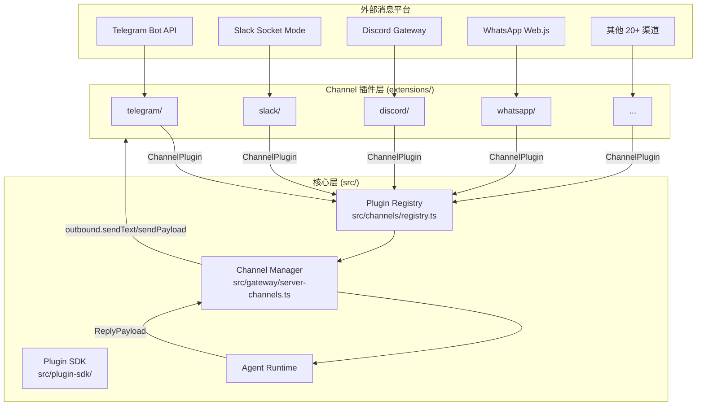
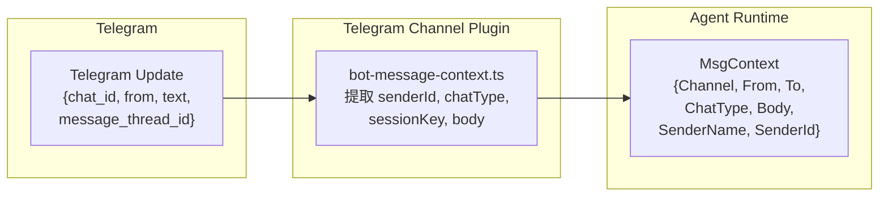

# 第 17 章 — Channel Bridge：25+ 渠道的统一消息抽象

读完这章，你能学到 OpenClaw 如何用一套 Channel 插件契约统一接入 Telegram、Slack、Discord、WhatsApp 等 25+ 个消息渠道；`ChannelPlugin` 接口的完整结构和各个 Adapter 的职责划分；消息入站转换和出站格式化的标准化流程；渠道能力差异（edit、reactions、threads、polls）的声明式处理方式；Channel 插件的注册、生命周期管理和自动重启策略；以及 per-channel allowlist 的访问控制实现。

## 17.1 问题：消息协议碎片化

一个 Agent 系统要同时对接 Telegram、Slack、Discord、WhatsApp、Signal、飞书、iMessage、LINE、Matrix、IRC、QQ Bot、Microsoft Teams、Google Chat，还有 Nostr、Mattermost、Synology Chat、Twitch、Tlon 等小众平台。每个平台的 API 形态完全不同：

- Telegram 用长轮询或 Webhook 接收 Update 对象，消息体里有 `chat_id`、`message_thread_id`、`reply_to_message`
- Slack 用 Socket Mode 或 Events API，消息结构是 `channel`、`thread_ts`、`blocks`
- Discord 有 Gateway WebSocket 和 Interaction 两种入口，消息是 `channelId`、`guildId`、`components`
- WhatsApp 用 Web.js 或 Cloud API，消息格式是 `chatId`、`quotedMsgId`

如果每接入一个渠道就在 Agent 核心代码里写一套 if-else 分支，代码会迅速腐化。OpenClaw 用 Bridge Pattern 解决这个问题：定义一组标准化的 Channel 契约接口，把平台特定的逻辑封装在各自的插件里，核心只和契约对话。

## 17.2 架构总览

下图展示了消息从用户发送到 Agent 回复的完整流转路径：



核心的分层逻辑：

1. **Channel 插件**（`extensions/*/`）负责和平台 API 交互，把平台消息转换为统一的 session context
2. **Plugin SDK**（`src/plugin-sdk/`）定义插件开发契约和工具函数
3. **Channel Manager**（`src/gateway/server-channels.ts`）管理所有渠道的启动、停止和自动重启
4. **Plugin Registry**（`src/channels/registry.ts`）维护已注册渠道的元数据索引

## 17.3 ChannelPlugin 接口：渠道的完整契约

`ChannelPlugin` 是整个 Channel 系统的核心类型。每个渠道插件必须提供一个符合这个接口的对象。定义在 `src/channels/plugins/types.plugin.ts:53`：

```typescript
// src/channels/plugins/types.plugin.ts:53
export type ChannelPlugin<ResolvedAccount = any, Probe = unknown, Audit = unknown> = {
  id: ChannelId;
  meta: ChannelMeta;
  capabilities: ChannelCapabilities;
  config: ChannelConfigAdapter<ResolvedAccount>;

  // 可选的功能适配器
  setup?: ChannelSetupAdapter;
  pairing?: ChannelPairingAdapter;
  security?: ChannelSecurityAdapter<ResolvedAccount>;
  groups?: ChannelGroupAdapter;
  mentions?: ChannelMentionAdapter;
  outbound?: ChannelOutboundAdapter;
  status?: ChannelStatusAdapter<ResolvedAccount, Probe, Audit>;
  gateway?: ChannelGatewayAdapter<ResolvedAccount>;
  auth?: ChannelAuthAdapter;
  commands?: ChannelCommandAdapter;
  lifecycle?: ChannelLifecycleAdapter;
  secrets?: ChannelSecretsAdapter;
  allowlist?: ChannelAllowlistAdapter;
  doctor?: ChannelDoctorAdapter;
  streaming?: ChannelStreamingAdapter;
  threading?: ChannelThreadingAdapter;
  messaging?: ChannelMessagingAdapter;
  directory?: ChannelDirectoryAdapter;
  actions?: ChannelMessageActionAdapter;
  heartbeat?: ChannelHeartbeatAdapter;
  agentTools?: ChannelAgentToolFactory | ChannelAgentTool[];
  // ...
};
```

这个接口采用了"必选核心 + 可选适配器"的设计。`id`、`meta`、`capabilities`、`config` 四个字段是每个渠道必须实现的，其余十几个 Adapter 都是可选的——渠道按自身能力挑选实现。

### 17.3.1 必选字段

**`id`** 是渠道的唯一标识符，如 `"telegram"`、`"slack"`、`"discord"`。所有路由、配置、日志都用这个 id 来定位渠道。

**`meta`** 是面向用户的元数据（`src/channels/plugins/types.core.ts:163`）：

```typescript
// src/channels/plugins/types.core.ts:163
export type ChannelMeta = {
  id: ChannelId;
  label: string;           // 用户可见的名称，如 "Telegram"
  selectionLabel: string;   // 选择列表中的标签，如 "Telegram (Bot API)"
  docsPath: string;         // 文档路径
  blurb: string;            // 一句话描述
  order?: number;           // 排列顺序
  aliases?: readonly string[];  // 别名，如 telegram 可以用 "tg"
  markdownCapable?: boolean;    // 是否支持 Markdown 渲染
  // ...
};
```

`aliases` 允许用户在配置中用简写（如 `tg` 代替 `telegram`），底层通过 `normalizeChatChannelId`（`src/channels/ids.ts:46`）做标准化匹配。

**`capabilities`** 声明这个渠道支持哪些功能（`src/channels/plugins/types.core.ts:302`）：

```typescript
// src/channels/plugins/types.core.ts:302
export type ChannelCapabilities = {
  chatTypes: Array<ChatType | "thread">;  // "direct" | "group" | "channel" | "thread"
  polls?: boolean;
  reactions?: boolean;
  edit?: boolean;
  unsend?: boolean;
  reply?: boolean;
  effects?: boolean;
  groupManagement?: boolean;
  threads?: boolean;
  media?: boolean;
  tts?: { voice?: ChannelTtsVoiceDeliveryCapabilities };
  nativeCommands?: boolean;
  blockStreaming?: boolean;
};
```

这个声明式结构是处理渠道差异的核心手段，17.7 节会详细讨论。

**`config`** 是账号配置适配器（`src/channels/plugins/types.adapters.ts:115`），负责从全局配置中解析出当前渠道的账号列表和参数。每个渠道的配置结构不同（Telegram 需要 botToken，Slack 需要 appToken + botToken + signingSecret），但通过 `listAccountIds` 和 `resolveAccount` 两个方法统一了访问方式。

### 17.3.2 适配器矩阵

剩余的可选字段是一组功能适配器。以下是关键适配器的职责：

| 适配器 | 职责 | 典型实现场景 |
|--------|------|------------|
| `gateway` | 渠道的启动/停止，长连接管理 | 所有需要主动连接的渠道 |
| `outbound` | 出站消息发送（文本、媒体、投票） | 所有渠道 |
| `security` | DM 策略、allowFrom 规则 | 所有渠道 |
| `setup` | 渠道配置的 CLI 交互设置 | 需要引导式配置的渠道 |
| `threading` | 线程/回复模式解析 | Slack、Discord、Telegram（forum topics） |
| `messaging` | 目标解析、会话路由、session key 构建 | 所有渠道 |
| `actions` | 消息工具的动作发现和执行 | 支持 send/edit/react/poll 等操作的渠道 |
| `allowlist` | allowFrom 配置的读写 | 所有有访问控制需求的渠道 |
| `directory` | 联系人/群组列表查询 | Telegram、Slack、Discord |
| `heartbeat` | typing 状态发送和清除 | 支持"正在输入"指示的渠道 |
| `doctor` | 配置修复和健康检查 | 有复杂配置结构的渠道 |
| `streaming` | 流式输出配置 | 支持消息编辑的渠道可做 block streaming |
| `lifecycle` | 账号变更和状态迁移钩子 | 需要在配置变更时清理状态的渠道 |

这种"大接口 + 可选适配器"的模式比 abstract class 继承更灵活。IRC 不支持 reactions 和 threads，那就不实现 `threading` 和相关 actions；Telegram 支持 forum topics，就在 `threading` 里提供完整的线程解析逻辑。核心代码在调用前检查适配器是否存在，不存在就跳过。

## 17.4 消息标准化：入站与出站

### 17.4.1 入站转换

入站消息的标准化发生在每个渠道插件的 gateway 适配器内部。以 Telegram 为例，`extensions/telegram/src/bot-message-context.ts` 负责把 Telegram 的 `Update` 对象转换为统一的 `MsgContext`。核心转换逻辑包括：

1. **发送者身份标准化**：Telegram 的 `from.id`（数字）转为字符串 senderId，`from.username` 映射为 senderUsername
2. **会话路由标准化**：`chat.id` 和 `message_thread_id` 组合为 sessionKey，区分 direct / group / channel / thread 四种 chatType
3. **消息体标准化**：文本、媒体附件、reply 引用统一为核心可处理的格式
4. **提及检测**：通过 `mentions.stripRegexes` 移除平台特定的 @mention 格式

每个渠道完成这一步后，Agent Runtime 看到的就是统一的 session context，完全不知道消息来自 Telegram 还是 Slack。



### 17.4.2 出站格式化

出站消息通过 `ChannelOutboundAdapter`（`src/channels/plugins/outbound.types.ts:75`）完成标准化到平台格式的反向转换：

```typescript
// src/channels/plugins/outbound.types.ts:75
export type ChannelOutboundAdapter = {
  deliveryMode: "direct" | "gateway" | "hybrid";
  chunker?: (text: string, limit: number, ctx?) => string[];
  textChunkLimit?: number;
  sanitizeText?: (params: { text: string; payload: ReplyPayload }) => string;
  sendText?: (ctx: ChannelOutboundContext) => Promise<OutboundDeliveryResult>;
  sendMedia?: (ctx: ChannelOutboundContext) => Promise<OutboundDeliveryResult>;
  sendPayload?: (ctx: ChannelOutboundPayloadContext) => Promise<OutboundDeliveryResult>;
  sendPoll?: (ctx: ChannelPollContext) => Promise<ChannelPollResult>;
  presentationCapabilities?: ChannelPresentationCapabilities;
  renderPresentation?: (...) => Promise<ReplyPayload | null> | ReplyPayload | null;
  // ...
};
```

三个关键设计点：

**`deliveryMode`** 决定消息发送的路径。`"direct"` 表示插件自己直接调平台 API 发送（Telegram、Signal）；`"gateway"` 表示通过 Gateway 中转（适合需要额外处理的场景）；`"hybrid"` 是混合模式。

**`chunker`** 处理长消息分割。不同平台有不同的消息长度限制（Telegram 4096 字符，Slack 40000 字符，Discord 2000 字符）。`textChunkLimit` 声明限制，`chunker` 负责在合适的位置（段落边界、代码块边界）切割。

**`sanitizeText`** 负责平台特定的格式转换。比如 Telegram 支持 MarkdownV2 但有严格的转义规则，Slack 用 mrkdwn 格式，IRC 不支持任何富文本。

## 17.5 Telegram Channel 详解

Telegram 是功能最完整的 Channel 实现之一，包含 200+ 源文件。通过拆解它的实现，可以理解 Channel 插件开发的全套模式。

### 17.5.1 入口注册

`extensions/telegram/index.ts` 是插件入口，使用 `defineBundledChannelEntry` 注册：

```typescript
// extensions/telegram/index.ts
import { defineBundledChannelEntry } from "openclaw/plugin-sdk/channel-entry-contract";

export default defineBundledChannelEntry({
  id: "telegram",
  name: "Telegram",
  description: "Telegram channel plugin",
  importMetaUrl: import.meta.url,
  plugin: {
    specifier: "./channel-plugin-api.js",
    exportName: "telegramPlugin",
  },
  secrets: {
    specifier: "./secret-contract-api.js",
    exportName: "channelSecrets",
  },
  runtime: {
    specifier: "./runtime-setter-api.js",
    exportName: "setTelegramRuntime",
  },
  accountInspect: {
    specifier: "./account-inspect-api.js",
    exportName: "inspectTelegramReadOnlyAccount",
  },
});
```

`defineBundledChannelEntry`（`src/plugin-sdk/channel-entry-contract.ts:433`）返回一个 `BundledChannelEntryContract` 对象。这个函数做了几件事：

1. 通过 `specifier` + `exportName` 定义懒加载路径，插件代码不在启动时全量加载
2. `register` 方法根据 `registrationMode`（`cli-metadata` / `discovery` / `full`）决定加载深度
3. 在 `discovery` 模式下加载 plugin 和 runtime sidecar，但跳过 `registerFull` 回调
4. 在 `full` 模式下完整加载所有功能

这种分级加载策略避免了 Gateway 启动时把 25+ 个渠道的全部代码加载进内存。

### 17.5.2 能力声明

Telegram 的能力声明在 `extensions/telegram/src/shared.ts:140`：

```typescript
// extensions/telegram/src/shared.ts:140
capabilities: {
  chatTypes: ["direct", "group", "channel", "thread"],
  reactions: true,
  threads: true,
  media: true,
  tts: {
    voice: { synthesisTarget: "voice-note" },
  },
  polls: true,
  nativeCommands: true,
  blockStreaming: true,
},
```

这告诉核心：Telegram 支持私聊、群聊、频道和线程四种会话类型；支持 reaction 表情回复；有 forum topics 线程能力；可以发送图片/视频/文件；语音合成输出为 voice note；支持投票；支持原生 /command 菜单；支持 block streaming（通过编辑消息实现流式输出）。

### 17.5.3 Gateway 适配器：长轮询与 Webhook

Telegram 插件的 `gateway.startAccount` 是整个渠道的入口。调用后启动一个 Bot 实例，根据配置选择长轮询或 Webhook 模式接收消息。核心流程：

1. 通过 `resolveTelegramToken` 解析 bot token（支持环境变量、配置文件、SecretRef 三种来源）
2. 调用 `createTelegramBot` 创建 Bot 实例
3. Bot 接收到 Update 后，通过 `bot-message-context.ts` 转换为标准 MsgContext
4. 标准 MsgContext 交给 Agent Runtime 处理
5. Agent 回复通过 `outbound-adapter.ts` 转换回 Telegram API 格式发送

### 17.5.4 出站适配器

Telegram 的出站适配器（`extensions/telegram/src/outbound-base.ts`）声明了：

- `deliveryMode: "direct"` — 直接调用 Telegram Bot API
- `textChunkLimit` — Telegram 的 4096 字符限制
- `sendPayload` — 处理富文本、inline keyboard、media group 等 Telegram 特有格式
- `presentationCapabilities` — 支持 buttons 和 context（inline keyboard）

消息发送最终通过 `sendMessageTelegram`（`extensions/telegram/src/send.ts`）调用 Telegram 的 `sendMessage`、`sendPhoto`、`sendDocument` 等 API。

### 17.5.5 消息动作

Telegram 通过 `actions` 适配器注册了一组消息动作。`describeMessageTool` 方法告诉 Agent 它可以执行哪些操作：

```typescript
// 简化自 extensions/telegram/src/channel-actions.ts
const telegramMessageActions: ChannelMessageActionAdapter = {
  describeMessageTool: (ctx) => ({
    actions: ["send", "edit", "react", "poll", "reply", "pin", "sticker"],
    capabilities: ["presentation"],
    schema: [/* Telegram 特有的参数 schema */],
  }),
  handleAction: async (ctx) => {
    // 根据 ctx.action 分发到具体的 Telegram API 调用
  },
};
```

所有 25+ 个渠道共用一个 `message` 工具（Agent 看到的是统一的 `message` tool），但各渠道通过 `describeMessageTool` 声明自己支持的动作子集。Agent 在生成工具调用时，只会使用当前渠道声明的动作。动作名在 `src/channels/plugins/message-action-names.ts` 中统一定义了 59 种：

```typescript
// src/channels/plugins/message-action-names.ts:1
export const CHANNEL_MESSAGE_ACTION_NAMES = [
  "send", "broadcast", "poll", "poll-vote", "react", "reactions",
  "read", "edit", "unsend", "reply", "sendWithEffect", "renameGroup",
  "pin", "unpin", "sticker", "search", "thread-create", "thread-reply",
  // ... 共 59 种
] as const;
```

## 17.6 Channel 插件的注册与生命周期

### 17.6.1 渠道发现

OpenClaw 启动时，首先扫描 `extensions/` 目录下所有插件的 `package.json`。每个 Channel 插件在 `package.json` 的 `openclaw.channel` 字段声明自己的身份：

```json
// extensions/telegram/package.json (简化)
{
  "openclaw": {
    "channel": {
      "id": "telegram",
      "label": "Telegram",
      "selectionLabel": "Telegram (Bot API)",
      "order": 1,
      "aliases": ["tg"]
    }
  }
}
```

`listBundledChannelCatalogEntries`（`src/channels/bundled-channel-catalog-read.ts:110`）读取所有这些声明，构建渠道目录。这个过程不需要加载任何 JavaScript 代码——只解析 JSON 文件。

### 17.6.2 注册流程

渠道注册分三个级别，通过 `BundledChannelEntryContract.register(api)` 中的 `api.registrationMode` 区分：

```mermaid
graph TB
    subgraph Discovery["discovery 模式"]
        D1["加载 channel plugin 对象"]
        D2["调用 api.registerChannel()"]
        D3["设置 runtime sidecar"]
        D4["执行 registerCliMetadata"]
        D1 --> D2 --> D3 --> D4
    end

    subgraph Full["full 模式"]
        F1["加载 channel plugin 对象"]
        F2["调用 api.registerChannel()"]
        F3["设置 runtime sidecar"]
        F4["执行 registerCliMetadata"]
        F5["执行 registerFull (HTTP 路由等)"]
        F1 --> F2 --> F3 --> F4 --> F5
    end

    subgraph CLI["cli-metadata 模式"]
        C1["执行 registerCliMetadata"]
    end
```



**`cli-metadata`** 是最轻量的模式。CLI 只需要知道有哪些渠道可选，不需要加载任何渠道逻辑。比如执行 `openclaw channel list` 时走这个路径。

**`discovery`** 是 Gateway 启动时的默认模式。加载 plugin 对象拿到 capabilities 和 config 信息，注册到全局 channel registry，但不启动长连接。

**`full`** 在 Gateway 完全初始化后触发。此时会注册 HTTP 路由（如 Slack 的 OAuth 回调路由）、sub-agent hooks（如 Discord 的子 Agent 钩子）等完整功能。

### 17.6.3 Channel Manager 与生命周期

`createChannelManager`（`src/gateway/server-channels.ts:199`）是 Gateway 层的渠道管理器。它接管了所有渠道的启动、停止和自动重启：

```typescript
// src/gateway/server-channels.ts:199 (简化)
export function createChannelManager(opts: ChannelManagerOptions): ChannelManager {
  return {
    startChannels,    // 并行启动所有已配置的渠道
    startChannel,     // 启动指定渠道的指定账号
    stopChannel,      // 停止指定渠道
    getRuntimeSnapshot, // 获取所有渠道的运行状态快照
    markChannelLoggedOut,
    isManuallyStopped,
    resetRestartAttempts,
    isHealthMonitorEnabled,
  };
}
```

**启动流程**（`startChannelInternal`）：

1. 通过 `plugin.config.listAccountIds(cfg)` 获取该渠道的所有账号 ID
2. 对每个账号，检查 `isEnabled` 和 `isConfigured` 状态
3. 创建 `AbortController` 用于后续的优雅停止
4. 初始化 scoped channel runtime（给外部插件提供 AI dispatch、routing 等能力）
5. 启动 approval handler bootstrap（审批流程的渠道端）
6. 调用 `plugin.gateway.startAccount(ctx)` 启动渠道连接

**自动重启策略**：

渠道崩溃后，Channel Manager 自动执行指数退避重启。策略定义在 `src/gateway/server-channels.ts:27`：

```typescript
// src/gateway/server-channels.ts:27
const CHANNEL_RESTART_POLICY: BackoffPolicy = {
  initialMs: 5_000,       // 首次重启等待 5 秒
  maxMs: 5 * 60_000,      // 最长等待 5 分钟
  factor: 2,               // 每次翻倍
  jitter: 0.1,             // 10% 抖动
};
const MAX_RESTART_ATTEMPTS = 10;
```

最多重试 10 次，重试间隔从 5 秒开始指数增长到 5 分钟封顶。如果用户手动停止了渠道（`manuallyStopped`），不会触发自动重启。

**并行启动优化**（`startChannels`）：

```typescript
// src/gateway/server-channels.ts:686
const startChannels = async () => {
  const pending = [...listChannelPlugins()];
  const workerCount = Math.min(8, pending.length);
  await Promise.all(
    Array.from({ length: workerCount }, async () => {
      for (;;) {
        const plugin = pending.shift();
        if (!plugin) return;
        await startChannel(plugin.id);
      }
    }),
  );
};
```

用 8 个并行 worker 从队列中取渠道逐个启动。这个设计既避免了所有渠道同时初始化导致的网络和内存压力，又比串行启动快得多。

## 17.7 能力差异处理

25+ 个渠道的能力差异巨大。OpenClaw 用声明式能力标志 + 运行时检查两层机制来处理。

### 17.7.1 声明式能力标志

每个渠道在 `capabilities` 中声明支持的功能。核心代码根据标志决定行为：

| 能力 | Telegram | Slack | Discord | WhatsApp | IRC | Signal |
|------|----------|-------|---------|----------|-----|--------|
| edit | - | 有 | 有 | - | - | - |
| reactions | 有 | 有 | 有 | 有 | - | 有 |
| threads | 有 | 有 | 有 | - | - | - |
| polls | 有 | - | 有 | 有 | - | - |
| media | 有 | 有 | 有 | 有 | - | 有 |
| blockStreaming | 有 | 有 | 有 | - | - | - |
| nativeCommands | 有 | 有 | 有 | - | - | - |

没有 `edit` 能力的渠道，Agent 不会尝试编辑已发送的消息。没有 `blockStreaming` 能力的渠道，流式响应会退化为"等全部生成完再发送"模式。

### 17.7.2 消息动作的渠道适配

核心的 `message` 工具通过 `ChannelMessageActionAdapter.describeMessageTool` 在运行时查询当前渠道支持哪些动作。不同渠道返回不同的动作集合：

- **Telegram**: send, edit, react, poll, reply, pin, sticker, topic-create, topic-edit
- **Discord**: send, edit, react, reply, pin, thread-create, thread-reply, channel-create, channel-edit, role-add, role-remove, kick, ban, emoji-upload
- **Slack**: send, edit, react, reply, pin, thread-reply, channel-list, channel-create, set-profile
- **IRC**: send（仅此一个）

这意味着同一个 Agent 在 Telegram 上可以创建投票、在 Discord 上可以管理角色，但在 IRC 上只能发文本消息。Agent 的行为自动适配当前渠道的能力边界。

### 17.7.3 出站格式降级

当 Agent 生成了一个包含 inline buttons 的回复，但当前渠道不支持 `presentationCapabilities.buttons`，出站管道会自动降级：把按钮渲染为纯文本选项列表。这个逻辑在 `renderPresentation` 的缺失处理中完成——如果渠道没有实现 `renderPresentation`，`ReplyPayload` 中的 `presentation` 字段会被忽略，只发送纯文本。

## 17.8 访问控制：Per-Channel Allowlist

每个渠道独立管理谁可以和 Agent 对话。核心机制是 allowlist（白名单）。

### 17.8.1 策略层级

访问控制通过 `ChannelSecurityAdapter.resolveDmPolicy` 确定策略，通过 `ChannelConfigAdapter.resolveAllowFrom` 获取具体的允许列表。以 Telegram 为例，配置层级：

```yaml
channels:
  telegram:
    allowFrom:           # 全局 DM 白名单
      - "123456789"
      - "*"              # 通配符 = 对所有人开放
    groupAllowFrom:      # 群组发送者白名单
      - "987654321"
    accounts:
      work-bot:
        allowFrom:       # 账号级覆盖
          - "111222333"
        groups:
          my-group:
            allowFrom:   # 群组级覆盖
              - "444555666"
            topics:
              general:
                allowFrom:  # 话题级覆盖
                  - "777888999"
```

### 17.8.2 匹配引擎

`compileAllowlist` 和 `resolveAllowlistMatchSimple`（`src/channels/allowlist-match.ts`）实现了高性能的白名单匹配：

```typescript
// src/channels/allowlist-match.ts:35
export function compileAllowlist(entries: ReadonlyArray<string>): CompiledAllowlist {
  const set = new Set(entries.filter(Boolean));
  return {
    set,
    wildcard: set.has("*"),
  };
}
```

先把允许列表编译为 `Set` 做 O(1) 查找，同时提取通配符标志。匹配时先查通配符（短路），再逐个尝试候选标识（senderId、senderName、username）：

```typescript
// src/channels/allowlist-match.ts:93
export function resolveAllowlistMatchSimple(params) {
  const allowFrom = compileSimpleAllowlist(params.allowFrom);
  if (allowFrom.set.size === 0) return { allowed: false };
  if (allowFrom.wildcard) return { allowed: true, matchKey: "*", matchSource: "wildcard" };
  // 按优先级尝试 id、name 匹配
  return resolveAllowlistCandidates({ compiledAllowlist: allowFrom, candidates: [...] });
}
```

返回值包含 `matchKey` 和 `matchSource`，供日志和审计使用——管理员可以看到消息是因为哪条规则被放行的。

### 17.8.3 跨渠道差异

不同渠道的 allowlist 粒度不同。`ChannelAllowlistAdapter`（`src/channels/plugins/types.adapters.ts:676`）允许每个渠道自定义读写逻辑：

- **Telegram**: DM 和群组分别管理 allowFrom，群组还支持按 group + topic 嵌套覆盖
- **Slack**: 用 workspace 级别的 allowlist
- **Discord**: 按 guild 管理
- **Signal**: 用电话号码作为 allowlist entry

`buildDmGroupAccountAllowlistAdapter`（Plugin SDK 提供）是通用的 DM/Group 分离白名单构建器，大多数渠道直接使用。

## 17.9 对比其他渠道的入口

观察不同渠道的 `index.ts` 入口，可以看到统一模式和渠道特化的边界。

**WhatsApp**——最简单的入口，没有 secrets、accountInspect 或额外的注册钩子：

```typescript
// extensions/whatsapp/index.ts
export default defineBundledChannelEntry({
  id: "whatsapp",
  name: "WhatsApp",
  description: "WhatsApp channel plugin",
  importMetaUrl: import.meta.url,
  plugin: { specifier: "./channel-plugin-api.js", exportName: "whatsappPlugin" },
  runtime: { specifier: "./runtime-api.js", exportName: "setWhatsAppRuntime" },
});
```

**Slack**——需要注册 HTTP 路由（OAuth 回调），所以多了 `registerFull`：

```typescript
// extensions/slack/index.ts (简化)
export default defineBundledChannelEntry({
  id: "slack",
  // ...
  registerFull: registerSlackPluginHttpRoutes,
});
```

**Discord**——需要注册 sub-agent hooks：

```typescript
// extensions/discord/index.ts (简化)
export default defineBundledChannelEntry({
  id: "discord",
  // ...
  registerFull(api) {
    registerDiscordSubagentHooks(api);
  },
});
```

入口结构统一，差异只在 `registerFull` 和可选的 `secrets` / `accountInspect` 字段上体现。

## 17.10 设计复盘

### 为什么不用继承？

Bridge Pattern 里常见的做法是定义 abstract class，让每个渠道继承实现。OpenClaw 选了 TypeScript interface + 可选属性的方案。原因有两个：

1. **组合优于继承**。`ChannelPlugin` 的 20+ 个适配器之间没有共享状态，用 class 继承只会引入不必要的耦合。Plugin SDK 提供的 `createChatChannelPlugin`、`createChannelPluginBase` 是工厂函数而非基类，渠道开发者可以选择性地 compose 需要的能力。

2. **渐进式实现**。新渠道可以从只实现 `id`、`meta`、`capabilities`、`config`、`outbound` 五个字段开始，一个最小可用的渠道就跑起来了。随着需求增长再逐步添加 `threading`、`directory`、`actions` 等适配器。

### 懒加载的边界

`defineBundledChannelEntry` 用 `specifier + exportName` 模式把插件代码的加载推迟到注册时刻。这不是偶然的——Telegram 插件有 200+ 个文件，Slack 也有 100+ 个。如果启动时全量 import 所有渠道，Node.js 进程的初始化时间和内存占用会不可接受。分级注册（cli-metadata / discovery / full）确保每个阶段只加载必要的代码。

### 能力声明 vs. 运行时探测

`ChannelCapabilities` 是静态声明，`ChannelMessageActionAdapter.describeMessageTool` 是运行时查询。静态声明用于核心的策略决策（要不要启用 block streaming？要不要发 typing indicator？），运行时查询用于 Agent 的工具发现（当前渠道能执行哪些动作？）。两者配合，既保证了核心代码的简洁，又保留了渠道插件在运行时根据配置动态调整行为的灵活性。

## 17.11 小结

OpenClaw 的 Channel 系统用 Bridge Pattern 实现了一个干净的消息抽象层。25+ 个渠道各自处理平台差异，核心只和统一的 `ChannelPlugin` 契约交互。关键设计决策：

- **大接口可选属性**优于抽象类继承，支持渐进式实现
- **声明式能力标志**（`ChannelCapabilities`）让核心在编译期就能做策略决策
- **消息动作注册**（`describeMessageTool`）让同一个 Agent 在不同渠道自动适配可用操作
- **分级注册**（cli-metadata / discovery / full）控制启动时的代码加载量
- **指数退避重启**保证渠道连接的鲁棒性
- **编译式 allowlist**（`compileAllowlist` + Set）提供 O(1) 的访问控制检查

下一章将讨论多 Agent 路由——当多个 Agent 绑定到同一个渠道时，消息如何路由到正确的 Agent。

## 练习

**思考题**

1. OpenClaw 用 `MsgContext` 统一了 25+ 渠道的消息格式。但不同渠道的消息能力差异很大——比如 Telegram 支持 inline keyboard，WhatsApp 支持 list message，IRC 只支持纯文本。这些差异化能力在标准化过程中如何处理？是选择"最小公分母"（只保留所有渠道都支持的能力），还是用可选字段来表达差异化能力？各自的利弊是什么？

2. Channel 插件的指数退避重启保证了连接的鲁棒性。但如果一个 Channel 的 API 永久失效（比如 Token 被吊销），指数退避会无限重试下去。你认为应该在什么条件下停止重试并通知用户？怎样区分"暂时性故障"和"永久性故障"？

**动手题**

3. 阅读 `extensions/telegram` 的入站消息转换代码，找到将 Telegram Update 对象转换为 `MsgContext` 的函数。记录转换过程中哪些 Telegram 特有的字段被保留了、哪些被丢弃了。然后选另一个 Channel（比如 Discord），做同样的分析，对比两个渠道在标准化过程中的差异。
