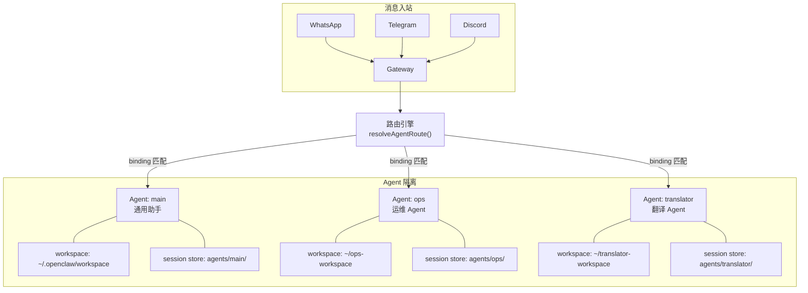
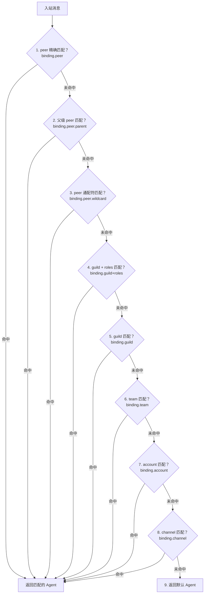

# 第 18 章 — 多 Agent 路由：Bindings、Workspace 隔离与会话分发

读完这章，你会理解 OpenClaw 如何在一个 Gateway 进程中同时运行多个 Agent，每个 Agent 如何拥有独立的工作目录和会话空间，以及入站消息如何通过 Bindings 规则精确路由到目标 Agent。掌握这些机制后，你可以在同一台机器上运行客服 Agent、运维 Agent、翻译 Agent，互不干扰，各司其职。

## 18.1 一个 Gateway，多个 Agent

OpenClaw 的多 Agent 架构可以用一句话概括：**一个 Gateway 守护进程，通过配置驱动的路由规则，将来自不同渠道、不同对话的消息分发到不同的 Agent 实例**。

每个 Agent 有自己的 ID、模型配置、System Prompt、工作目录和会话存储。Gateway 收到消息后，不是直接交给"唯一的 Agent"处理，而是先走一遍路由逻辑，确定这条消息应该由哪个 Agent 来响应。

配置层面，`agents.list` 数组定义了所有 Agent：

```yaml
agents:
  defaults:
    model: "claude-sonnet-4-20250514"
    workspace: "~/.openclaw/workspace"
  list:
    - id: "main"
      default: true
      name: "通用助手"
    - id: "ops"
      name: "运维 Agent"
      workspace: "~/ops-workspace"
      model: "gpt-4o"
      systemPromptOverride: "你是一个运维专家..."
    - id: "translator"
      name: "翻译 Agent"
      workspace: "~/translator-workspace"
      model: "claude-sonnet-4-20250514"
```

对应的类型定义在 `src/config/types.agents.ts:76-133`。`AgentConfig` 包含了 Agent 运行所需的全部配置：ID、名称、工作目录、模型、思维模式、技能过滤器、上下文限制等。



## 18.2 Agent ID 与默认 Agent

每个 Agent 必须有一个唯一的 ID。ID 格式是小写字母、数字、连字符和下划线的组合，最长 64 个字符。`src/routing/session-key.ts:92-110` 中的 `normalizeAgentId()` 负责这个标准化逻辑：

```typescript
// src/routing/session-key.ts:92
export function normalizeAgentId(value: string | undefined | null): string {
  const trimmed = (value ?? "").trim();
  if (!trimmed) {
    return DEFAULT_AGENT_ID;  // "main"
  }
  const normalized = normalizeLowercaseStringOrEmpty(trimmed);
  if (VALID_ID_RE.test(trimmed)) {
    return normalized;
  }
  // 非法字符折叠为连字符
  return (
    normalized
      .replace(INVALID_CHARS_RE, "-")
      .replace(LEADING_DASH_RE, "")
      .replace(TRAILING_DASH_RE, "")
      .slice(0, 64) || DEFAULT_AGENT_ID
  );
}
```

默认 Agent ID 是 `"main"`。如果 `agents.list` 中没有配置任何 Agent，系统自动使用这个默认值。如果配置了多个 Agent，第一个标记 `default: true` 的会成为默认 Agent。当有多个 Agent 都标记了 `default: true`，系统取第一个并打印一条警告日志。这个逻辑在 `src/agents/agent-scope-config.ts:82-94`：

```typescript
// src/agents/agent-scope-config.ts:82
export function resolveDefaultAgentId(cfg: OpenClawConfig): string {
  const agents = listAgentEntries(cfg);
  if (agents.length === 0) {
    return DEFAULT_AGENT_ID;
  }
  const defaults = agents.filter((agent) => agent?.default);
  if (defaults.length > 1 && !defaultAgentWarned) {
    defaultAgentWarned = true;
    warnMultipleDefaultAgents();
  }
  const chosen = (defaults[0] ?? agents[0])?.id?.trim();
  return normalizeAgentId(chosen || DEFAULT_AGENT_ID);
}
```

当路由引擎找不到任何匹配的 Binding 时，消息会落到默认 Agent。这是兜底策略，保证消息不会丢失。

## 18.3 Workspace 隔离

多 Agent 的核心价值之一是隔离。每个 Agent 拥有独立的工作目录（workspace）和独立的 Agent 数据目录（agentDir），二者服务于不同目的：

- **workspace**：Agent 的文件系统工作区，存放 Agent 需要操作的文件（类比一个开发者的项目目录）
- **agentDir**：Agent 的状态存储目录，包含 System Prompt、认证配置、记忆数据等运行时状态

### Workspace 解析

Workspace 目录的解析逻辑在 `src/agents/agent-scope-config.ts:154-177`，分三种情况：

```typescript
// src/agents/agent-scope-config.ts:154
export function resolveAgentWorkspaceDir(
  cfg: OpenClawConfig,
  agentId: string,
  env: NodeJS.ProcessEnv = process.env,
) {
  const id = normalizeAgentId(agentId);
  // 1. Agent 自己配置了 workspace，直接用
  const configured = resolveAgentConfig(cfg, id)?.workspace?.trim();
  if (configured) {
    return stripNullBytes(resolveUserPath(configured, env));
  }
  const defaultAgentId = resolveDefaultAgentId(cfg);
  const fallback = cfg.agents?.defaults?.workspace?.trim();
  // 2. 默认 Agent，用 defaults.workspace 或系统默认目录
  if (id === defaultAgentId) {
    if (fallback) {
      return stripNullBytes(resolveUserPath(fallback, env));
    }
    return stripNullBytes(resolveDefaultAgentWorkspaceDir(env));
  }
  // 3. 非默认 Agent 且没有显式配置，在 defaults.workspace 或 stateDir 下创建子目录
  if (fallback) {
    return stripNullBytes(path.join(resolveUserPath(fallback, env), id));
  }
  const stateDir = resolveStateDir(env);
  return stripNullBytes(path.join(stateDir, `workspace-${id}`));
}
```

这段代码的设计意图很清楚：

1. 显式配置优先——如果 Agent 的配置里写了 `workspace: "~/my-agent-workspace"`，就用这个路径
2. 默认 Agent 走全局默认值——`~/.openclaw/workspace`
3. 其他 Agent 自动获得隔离子目录——`~/.openclaw/workspace-ops`、`~/.openclaw/workspace-translator`

### Agent 数据目录

Agent 数据目录（`agentDir`）的解析在 `src/agents/agent-scope-config.ts:179-191`，结构类似但更简单：

```typescript
// src/agents/agent-scope-config.ts:179
export function resolveAgentDir(
  cfg: OpenClawConfig,
  agentId: string,
  env: NodeJS.ProcessEnv = process.env,
) {
  const id = normalizeAgentId(agentId);
  const configured = resolveAgentConfig(cfg, id)?.agentDir?.trim();
  if (configured) {
    return resolveUserPath(configured, env);
  }
  const root = resolveStateDir(env);
  return path.join(root, "agents", id, "agent");
}
```

默认路径格式是 `<stateDir>/agents/<agentId>/agent`。每个 Agent 的状态数据天然按 ID 隔离在不同子目录里。

### 隔离带来的好处

这种物理隔离意味着：

- 运维 Agent 可以在 `/home/deploy/ops` 目录下执行部署脚本，翻译 Agent 在 `/home/docs/translations` 下工作，互不影响
- 每个 Agent 有独立的 System Prompt 文件（`AGENTS.md`），位于各自的 `agentDir`
- 会话历史、记忆数据、认证信息全部按 Agent ID 分目录存储
- 一个 Agent 崩溃或产生脏数据，不影响其他 Agent 的状态

## 18.4 Bindings 机制：消息路由的核心

Bindings 是 OpenClaw 多 Agent 路由的核心配置。它定义了"哪些消息应该发给哪个 Agent"的规则。

### 数据结构

Binding 的类型定义在 `src/config/types.agents.ts:49-59`：

```typescript
// src/config/types.agents.ts:49
export type AgentRouteBinding = {
  type?: "route";
  agentId: string;
  comment?: string;
  match: AgentBindingMatch;
  session?: {
    dmScope?: DmScope;
  };
};
```

其中 `AgentBindingMatch`（`src/config/types.agents.ts:39-47`）定义了匹配条件：

```typescript
export type AgentBindingMatch = {
  channel: string;         // 渠道：telegram, discord, whatsapp 等
  accountId?: string;      // 账号 ID（同一渠道可能有多个 Bot 账号）
  peer?: { kind: ChatType; id: string };  // 对话对象：direct/group/channel + ID
  guildId?: string;        // Discord 服务器 ID
  teamId?: string;         // Slack 团队 ID
  roles?: string[];        // Discord 角色 ID 列表
};
```

配置文件中的 Bindings 是一个有序数组，写在 `openclaw.yaml` 的顶层 `bindings` 字段：

```yaml
bindings:
  # 特定 Telegram 群组 -> 运维 Agent
  - agentId: "ops"
    match:
      channel: "telegram"
      accountId: "bot_ops_123"
      peer:
        kind: "group"
        id: "-1001234567890"

  # 特定 WhatsApp 私聊 -> 翻译 Agent
  - agentId: "translator"
    match:
      channel: "whatsapp"
      peer:
        kind: "direct"
        id: "8613800138000"

  # Discord 特定服务器的管理员角色 -> 运维 Agent
  - agentId: "ops"
    match:
      channel: "discord"
      guildId: "1234567890"
      roles: ["admin-role-id"]

  # Discord 特定服务器其他人 -> 通用助手
  - agentId: "main"
    match:
      channel: "discord"
      guildId: "1234567890"
```

### 路由引擎：resolveAgentRoute

路由的核心函数是 `resolveAgentRoute()`，位于 `src/routing/resolve-route.ts:610`。它接收一个 `ResolveAgentRouteInput` 对象，返回一个 `ResolvedAgentRoute`，后者包含目标 Agent ID、session key 和匹配方式：

```typescript
// src/routing/resolve-route.ts:46
export type ResolvedAgentRoute = {
  agentId: string;
  channel: string;
  accountId: string;
  sessionKey: string;
  mainSessionKey: string;
  lastRoutePolicy: "main" | "session";
  matchedBy:
    | "binding.peer"
    | "binding.peer.parent"
    | "binding.peer.wildcard"
    | "binding.guild+roles"
    | "binding.guild"
    | "binding.team"
    | "binding.account"
    | "binding.channel"
    | "default";
};
```

`matchedBy` 字段记录了匹配是通过哪种规则命中的，这在调试路由问题时非常有用。

### 分层匹配优先级

路由引擎的匹配是分层的，优先级从高到低：



这个分层设计在 `src/routing/resolve-route.ts:731-796` 中通过一个 `tiers` 数组实现。每个 tier 定义了匹配类型、是否启用、候选 binding 集合和匹配谓词：

```typescript
// src/routing/resolve-route.ts:731（简化）
const tiers = [
  {
    matchedBy: "binding.peer",
    enabled: Boolean(peer),
    candidates: collectPeerIndexedBindings(bindingsIndex, peer),
    predicate: (c) => c.match.peer.state === "valid",
  },
  {
    matchedBy: "binding.peer.parent",
    enabled: Boolean(parentPeer && parentPeer.id),
    candidates: collectPeerIndexedBindings(bindingsIndex, parentPeer),
    predicate: (c) => c.match.peer.state === "valid",
  },
  // ... 后续 tier 依次降级
];

for (const tier of tiers) {
  if (!tier.enabled) continue;
  const matched = tier.candidates.find(
    (c) => tier.predicate(c) && matchesBindingScope(c.match, { ...baseScope, peer: tier.scopePeer })
  );
  if (matched) {
    return choose(matched.binding.agentId, tier.matchedBy);
  }
}
// 全部未命中，返回默认 Agent
return choose(resolveDefaultAgentId(input.cfg), "default");
```

几个关键的设计决策：

**peer 精确匹配优先级最高**。如果你为某个 Telegram 群组 ID 配置了专属 Agent，不管这个群属于哪个 guild 或 team，都会优先匹配 peer 规则。

**线程继承（parent peer）**。当消息来自一个线程（thread），路由引擎先尝试匹配线程本身的 peer，然后尝试匹配线程所属的父级 peer。这保证了"在某个群组里开的线程"可以继承该群组的 Agent 绑定。

**guild + roles 联合匹配**。Discord 场景下，可以按服务器 + 角色组合来路由。管理员发消息走运维 Agent，普通用户走客服 Agent。角色匹配在 `src/routing/binding-scope.ts:90-102` 实现，核心逻辑是检查用户的角色 ID 集合与 binding 声明的角色列表是否有交集。

### 性能优化：多级索引与缓存

路由函数在一个 Gateway 进程的生命周期里可能被调用成千上万次。OpenClaw 在这个热路径上做了两层优化。

第一层是 **Binding 预索引**。`buildEvaluatedBindingsIndex()`（`src/routing/resolve-route.ts:373-421`）把 Binding 数组按 peer、guild、team、account、channel 分类索引到不同的 Map 中。路由时不需要线性扫描全部 Binding，而是根据消息的特征直接查对应的索引桶。

```typescript
// src/routing/resolve-route.ts:373（简化）
function buildEvaluatedBindingsIndex(bindings): EvaluatedBindingsIndex {
  const byPeer = new Map();
  const byPeerWildcard = [];
  const byGuildWithRoles = new Map();
  const byGuild = new Map();
  const byTeam = new Map();
  const byAccount = [];
  const byChannel = [];

  for (const binding of bindings) {
    if (binding.match.peer.state === "valid") {
      pushToIndexMap(byPeer, peerLookupKeys(...), binding);
    } else if (binding.match.peer.state === "wildcard-kind") {
      byPeerWildcard.push(binding);
    } else if (binding.match.guildId && binding.match.roles) {
      pushToIndexMap(byGuildWithRoles, binding.match.guildId, binding);
    }
    // ... 依次分类
  }
  return { byPeer, byPeerWildcard, byGuildWithRoles, byGuild, byTeam, byAccount, byChannel };
}
```

第二层是 **结果缓存**。`resolveRouteCacheForConfig()`（`src/routing/resolve-route.ts:521-539`）用 `WeakMap` 按配置对象缓存路由结果。相同的 channel + accountId + peer + guild + team + roles + dmScope 组合，第二次查询直接返回缓存结果。缓存上限 4000 条，超出后清空重建，避免无限增长。

## 18.5 配置实战：同一 WhatsApp 账号的不同路由

一个典型场景：你的公司有一个 WhatsApp Business 账号，产品经理和你通过 DM 分别聊不同的事。你希望产品经理的消息由"产品助手"处理，其他人的消息由通用助手处理。

```yaml
agents:
  list:
    - id: "main"
      default: true
      name: "通用助手"
    - id: "product"
      name: "产品助手"
      workspace: "~/product-workspace"
      systemPromptOverride: "你是产品经理的 AI 助手..."

bindings:
  # 产品经理的 DM -> 产品助手
  - agentId: "product"
    match:
      channel: "whatsapp"
      peer:
        kind: "direct"
        id: "8613900139000"
    session:
      dmScope: "per-peer"

  # 其他 WhatsApp 消息 -> 通用助手（通配符）
  - agentId: "main"
    match:
      channel: "whatsapp"
```

路由逻辑会这样处理：

1. 产品经理发消息 -> peer 精确匹配命中第一条 binding -> 路由到 `product` Agent
2. 其他人发消息 -> peer 匹配未命中 -> channel 匹配命中第二条 binding -> 路由到 `main` Agent

注意 `session.dmScope` 的配置。默认的 `dmScope` 是 `"main"`，意味着所有 DM 对话共享同一个 session。设置为 `"per-peer"` 后，每个对话对象获得独立的 session，产品经理的聊天上下文不会和其他人的混在一起。

## 18.6 Session Key 的构造

路由不仅决定目标 Agent，还要构造唯一的 session key 来标识这个会话。Session key 是 OpenClaw 会话持久化和并发控制的基础。

构造逻辑在 `src/routing/session-key.ts:130-177` 的 `buildAgentPeerSessionKey()` 中。根据 peer 类型和 dmScope 的不同组合，生成不同粒度的 key：

| dmScope | peer 类型 | Session Key 格式 | 效果 |
|---------|----------|-----------------|------|
| `main` | direct | `agent:<agentId>:main` | 所有 DM 共享一个 session |
| `per-peer` | direct | `agent:<agentId>:direct:<peerId>` | 每个对话对象独立 session |
| `per-channel-peer` | direct | `agent:<agentId>:<channel>:direct:<peerId>` | 按渠道+对象隔离 |
| `per-account-channel-peer` | direct | `agent:<agentId>:<channel>:<accountId>:direct:<peerId>` | 最细粒度隔离 |
| - | group/channel | `agent:<agentId>:<channel>:<peerKind>:<peerId>` | 群组/频道总是按 peer 隔离 |

群组和频道类型的对话始终按 peer 隔离——每个群组天然是一个独立的 session。DM 对话的隔离粒度则由 `dmScope` 控制。

`identityLinks` 配置项可以将不同渠道的同一个人合并到同一个 session。比如同一个用户在 Telegram 和 WhatsApp 上分别和你的 Agent 聊天，通过 `identityLinks` 可以让两边的对话共享上下文。

## 18.7 Agent 列表与 Gateway 集成

Gateway 启动时需要知道当前有哪些 Agent 可用。`src/gateway/agent-list.ts` 中的 `listGatewayAgentsBasic()` 负责汇总这个列表：

```typescript
// src/gateway/agent-list.ts:51
export function listGatewayAgentsBasic(cfg: OpenClawConfig): {
  defaultId: string;
  mainKey: string;
  scope: SessionScope;
  agents: GatewayAgentListRow[];
}
```

这个函数的数据来源有两个：

1. **配置文件中的 `agents.list`**——显式声明的 Agent
2. **磁盘上的 `agents/` 目录**——`listExistingAgentIdsFromDisk()`（`src/gateway/agent-list.ts:15-27`）扫描 `<stateDir>/agents/` 下的子目录，发现已存在但未在配置中声明的 Agent

返回的列表保证默认 Agent 排在第一位。如果配置中声明了 `agents.list`，只有显式声明的 Agent 和默认 Agent 才会出现在结果中；如果没有声明 `agents.list`，磁盘上所有已有的 Agent 目录都会被列出。

## 18.8 Agent 作用域与权限控制

除了路由和隔离，每个 Agent 还有细粒度的配置覆盖能力。`src/agents/agent-scope-config.ts:101-141` 中的 `resolveAgentConfig()` 展示了可以按 Agent 覆盖的配置项：

```typescript
// src/agents/agent-scope-config.ts:15（类型定义，简化）
export type ResolvedAgentConfig = {
  name?: string;
  workspace?: string;
  agentDir?: string;
  systemPromptOverride?: string;
  model?: AgentModelConfig;
  skills?: string[];         // 技能白名单
  memorySearch?: MemorySearchConfig;
  sandbox?: AgentSandboxConfig;
  tools?: AgentToolsConfig;
  subagents?: {
    allowAgents?: string[];  // 允许生成哪些子 Agent
    model?: AgentModelConfig;
    requireAgentId?: boolean;
  };
  // ...
};
```

几个关键的权限控制点：

- **skills 白名单**：可以限制某个 Agent 只能使用特定的 Skills。运维 Agent 可以用部署相关的 Skill，但不能用代码编辑 Skill。这个过滤在 `src/agents/agent-scope.ts:88-93` 通过 `resolveAgentSkillsFilter()` 实现
- **model 控制**：每个 Agent 可以使用不同的模型。处理简单查询的 Agent 用便宜的模型，处理复杂推理的 Agent 用高端模型。模型也支持 fallback 链——主模型不可用时自动切换到备选模型
- **sandbox 配置**：控制 Agent 执行代码的沙箱环境，可以按 Agent 设置不同的安全等级
- **subagents 权限**：控制一个 Agent 是否可以生成子 Agent，以及可以使用哪些 Agent ID。`allowAgents: ["*"]` 允许访问任何 Agent，不设置则限制在同 ID 范围内

## 18.9 工作路径反向查找

有时候需要反向操作：给定一个文件系统路径，找到对应的 Agent。`src/agents/agent-scope.ts:245-271` 中的 `resolveAgentIdsByWorkspacePath()` 实现了这个功能：

```typescript
// src/agents/agent-scope.ts:245
export function resolveAgentIdsByWorkspacePath(
  cfg: OpenClawConfig,
  workspacePath: string,
): string[] {
  const normalizedWorkspacePath = normalizePathForComparison(workspacePath);
  const ids = listAgentIds(cfg);
  const matches = [];

  for (const id of ids) {
    const workspaceDir = normalizePathForComparison(resolveAgentWorkspaceDir(cfg, id));
    if (!isPathWithinRoot(normalizedWorkspacePath, workspaceDir)) {
      continue;
    }
    matches.push({ id, workspaceDir });
  }
  // 最长匹配优先
  matches.sort((left, right) => right.workspaceDir.length - left.workspaceDir.length);
  return matches.map((entry) => entry.id);
}
```

排序用的是最长路径前缀优先（longest prefix match），和网络路由的 IP 前缀匹配策略一样。如果 Agent A 的 workspace 是 `/home/user/projects`，Agent B 的 workspace 是 `/home/user/projects/backend`，那么路径 `/home/user/projects/backend/src/main.ts` 会匹配到 Agent B 而非 Agent A。

## 18.10 Binding 类型：Route 与 ACP

前面讨论的都是 `type: "route"` 类型的 Binding。OpenClaw 还支持 `type: "acp"` 类型，用于持久化的 ACP（Agent Compute Protocol）会话绑定。

```typescript
// src/config/types.agents.ts:61
export type AgentAcpBinding = {
  type: "acp";
  agentId: string;
  match: AgentBindingMatch;
  acp?: {
    mode?: "persistent" | "oneshot";
    label?: string;
    cwd?: string;
    backend?: string;
  };
};
```

`src/config/bindings.ts` 提供了类型守卫函数来区分两种 Binding：

```typescript
// src/config/bindings.ts:10
export function isRouteBinding(binding: AgentBinding): binding is AgentRouteBinding {
  return normalizeBindingType(binding) === "route";
}

export function isAcpBinding(binding: AgentBinding): binding is AgentAcpBinding {
  return normalizeBindingType(binding) === "acp";
}
```

Route Binding 控制消息"路由到哪个 Agent"，ACP Binding 控制"用什么运行时环境处理这个对话"。两种 Binding 共享相同的 `match` 结构，但产生不同的运行时行为。

## 18.11 设计总结

OpenClaw 的多 Agent 路由系统遵循几个清晰的设计原则：

**配置驱动，不是代码驱动**。所有的路由规则都在 `openclaw.yaml` 中声明，不需要写代码。修改路由规则只需要改配置文件并重启 Gateway。

**声明式匹配，有序求值**。Binding 数组的顺序即优先级。在同一个优先级 tier 内，先声明的 binding 先匹配。这种确定性的求值顺序避免了隐式的优先级冲突。

**物理隔离，不是逻辑隔离**。每个 Agent 的 workspace、agentDir、session store 都在文件系统上物理分离。一个 Agent 的状态损坏不会波及其他 Agent。

**渐进式精细化**。从最粗粒度（channel 级别）到最细粒度（peer + account + role 级别），按需增加路由精度。简单场景只需要一两条 binding 规则，复杂场景可以组合所有维度。

## 练习

**思考题**

1. Binding 数组的顺序决定匹配优先级。如果一个团队有 5 个人共同维护 `openclaw.json`，不同的人添加 binding 规则时可能意外改变了顺序，导致消息路由到错误的 Agent。你会怎样设计一个机制来降低这种人为错误的风险？是否应该引入显式的优先级字段而不是依赖数组顺序？

**动手题**

2. 在 `openclaw.json` 中配置两个 Agent（比如一个"代码助手"和一个"日常助手"），分别绑定到不同的 workspace 目录。通过 Binding 规则将同一个渠道的不同群组路由到不同的 Agent。验证两个 Agent 的 Session 是否在文件系统上物理隔离（检查各自的 session 目录）。

3. 在已有的两个 Agent 配置基础上，添加一条 fallback binding（不指定任何过滤条件），确保未匹配到任何规则的消息能路由到默认 Agent。发送一条来自新联系人的消息，确认 fallback 规则生效。
