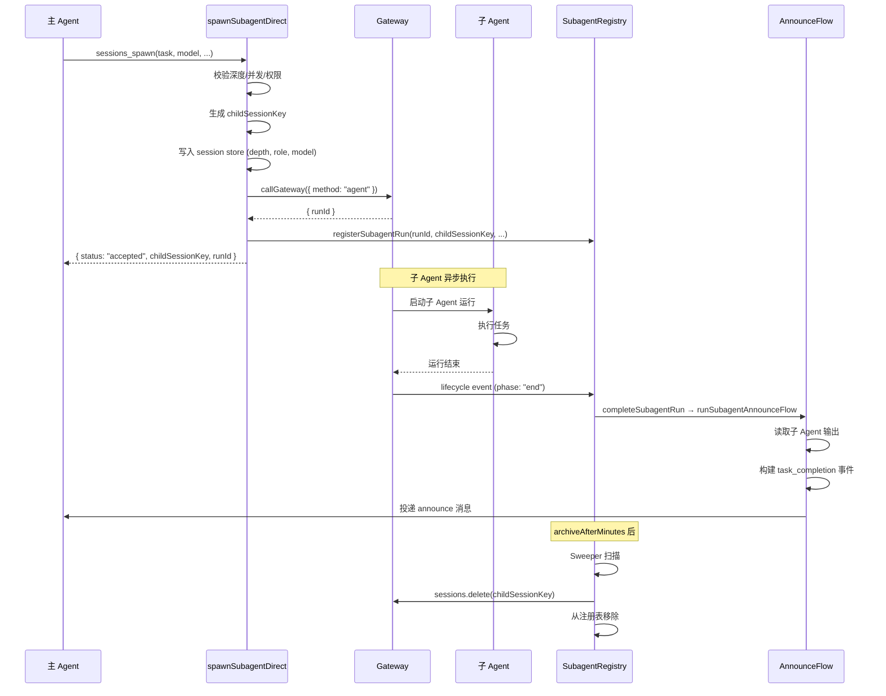

# 第 19 章 — Sub-Agent 系统：异步编排与结构化通信

读完本章，你会理解：

- Sub-Agent 的设计动机：为什么主 Agent 需要非阻塞地拆分任务
- `sessions_spawn` 工具的完整调用链路：从参数校验到 Gateway 投递
- Session 隔离机制：session key 的命名规范与上下文隔离策略
- 深度限制与能力模型：`main` / `orchestrator` / `leaf` 三种角色如何约束 spawn 行为
- Announce 模式：子任务结果如何回传给父 Agent
- 自动归档与生命周期清理
- 廉价模型降级：如何通过配置为 Sub-Agent 指定独立的模型

## 19.1 设计动机

一个 Agent 在处理复杂请求时，经常遇到这样的场景：需要同时执行多个独立的子任务。比如用户说"帮我查一下三个竞品的技术栈，然后做个对比"，如果串行处理，主 Agent 要依次完成三次调研，期间用户只能等待。

OpenClaw 的 Sub-Agent 系统解决的核心问题就是**异步任务拆分**。主 Agent 通过 `sessions_spawn` 工具启动一个或多个子 Agent，每个子 Agent 在独立的 session 中运行，互不干扰。启动是非阻塞的——`sessions_spawn` 立即返回 `accepted` 状态和 `childSessionKey`，主 Agent 可以继续处理其他工作，子 Agent 完成后通过 Announce 机制将结果回传。

这套设计背后有几个关键约束：

1. **非阻塞**：主 Agent 不应该被子任务阻塞，spawn 是一个"发射后不管"的操作
2. **隔离**：子 Agent 拥有独立的 session，上下文、工具权限、模型选择都可以独立配置
3. **可控**：深度限制防止无限递归 spawn，并发限制防止资源耗尽
4. **成本可控**：子 Agent 可以使用廉价模型，避免每个子任务都烧顶级模型的 token

## 19.2 sessions_spawn：非阻塞启动

`spawnSubagentDirect` 是整个 Sub-Agent 系统的入口函数，定义在 `src/agents/subagent-spawn.ts:625`。它接收两组参数：`SpawnSubagentParams` 描述任务本身，`SpawnSubagentContext` 描述调用者的上下文。

### 核心参数

```typescript
// src/agents/subagent-spawn.ts:114
export type SpawnSubagentParams = {
  task: string;             // 子任务描述
  label?: string;           // 可选标签，用于日志和 announce
  agentId?: string;         // 目标 agent，默认继承父 agent
  model?: string;           // 模型覆盖，如 "openai/gpt-4o-mini"
  thinking?: string;        // thinking 级别覆盖
  runTimeoutSeconds?: number; // 运行超时
  mode?: SpawnSubagentMode; // "run"（一次性）或 "session"（持久化）
  cleanup?: "delete" | "keep"; // 完成后是否清理 session
  context?: SpawnSubagentContextMode; // "isolated" 或 "fork"
  attachments?: Array<{...}>; // 附件传递
  // ...
};
```

其中 `mode` 决定了子 Agent 的生命周期模型：

- `"run"`（默认）：一次性执行，完成后可被自动清理
- `"session"`：绑定到渠道线程（如 Discord thread），执行完毕后 session 保留，支持后续交互

`context` 决定了上下文继承策略：

- `"isolated"`（默认）：子 Agent 从零开始，没有父 Agent 的历史对话
- `"fork"`：复制父 Agent 的会话上下文到子 Agent，要求目标 agent 与请求者相同

### 返回值

```typescript
// src/agents/subagent-spawn.ts:152
export type SpawnSubagentResult = {
  status: "accepted" | "forbidden" | "error";
  childSessionKey?: string;   // 子 session 的唯一标识
  runId?: string;              // 本次运行的唯一 ID
  mode?: SpawnSubagentMode;
  note?: string;               // 给主 Agent 的操作提示
  modelApplied?: boolean;      // 模型覆盖是否生效
  error?: string;
};
```

`status: "accepted"` 只表示子 Agent 已经被成功投递给 Gateway，不代表任务已完成。这是"非阻塞"语义的体现。

### 完整调用链路

`spawnSubagentDirect` 的执行流程可以拆成以下几步：

1. **参数校验**：验证 agentId 格式、检查深度限制、检查并发限制
2. **权限校验**：目标策略检查（`resolveSubagentTargetPolicy`）、沙箱策略检查
3. **Session 创建**：生成 `childSessionKey`，写入初始 session 数据（depth、role、model）
4. **上下文准备**：如果 `context="fork"`，复制父会话转录；否则走 isolated 模式
5. **模型配置**：解析模型覆盖，持久化到子 session 的 store
6. **线程绑定**（可选）：如果 `thread=true`，通过 lifecycle hook 创建渠道线程
7. **投递 Gateway**：调用 `callGateway({ method: "agent", ... })` 启动子 Agent 运行
8. **注册运行记录**：在 `subagentRuns` 注册表中记录本次运行
9. **触发生命周期事件**：通知 Gateway 广播 `sessions.changed`

如果第 7 步（Gateway 投递）失败，系统会执行完整的回滚：删除已创建的 session、清理附件目录、触发 `subagent_ended` hook。这种严格的失败清理保证了不会产生"幽灵 session"。

## 19.3 Session 隔离

### Session Key 格式

每个 Sub-Agent 的 session key 遵循固定格式：

```
agent:<agentId>:subagent:<uuid>
```

生成逻辑在 `src/agents/subagent-spawn.ts:763`：

```typescript
const childSessionKey = `agent:${targetAgentId}:subagent:${crypto.randomUUID()}`;
```

这个格式有两层含义：

- `agent:<agentId>` 前缀决定了 session store 的物理存储位置——同一个 agent 的所有 session（包括子 Agent 的）存储在同一个 JSON 文件中
- `subagent:<uuid>` 后缀让系统可以通过 `isSubagentSessionKey()` 快速判断一个 session 是否属于子 Agent

### 上下文隔离策略

`isolated` 模式是默认行为：子 Agent 只看到 spawn 时传入的 `task` 描述，看不到父 Agent 的任何历史对话。这是最安全的选择——子 Agent 不会被父 Agent 的对话历史"污染"，也不会意外泄露上下文。

`fork` 模式则更激进：它把父 Agent 当前的会话转录完整复制一份给子 Agent。这适用于子任务需要了解完整对话背景的场景，但有两个硬性限制：

1. 目标 agent 必须和请求者是同一个 agent（不支持跨 agent fork）
2. 父 Agent 的上下文 token 数不能超过 `forkMaxTokens` 阈值

```typescript
// src/agents/subagent-spawn.ts:349
if (params.targetAgentId !== params.requesterAgentId) {
  throw new Error(
    'context="fork" currently requires the same target agent as the requester'
  );
}
```

## 19.4 深度限制

Sub-Agent 能不能再 spawn Sub-Agent？可以，但有深度限制。

### 深度计算

每次 spawn 时，系统从 session store 中读取调用者的当前深度：

```typescript
// src/agents/subagent-spawn.ts:695
const callerDepth = getSubagentDepthFromSessionStore(requesterInternalKey, { cfg });
const maxSpawnDepth =
  cfg.agents?.defaults?.subagents?.maxSpawnDepth ?? DEFAULT_SUBAGENT_MAX_SPAWN_DEPTH;
if (callerDepth >= maxSpawnDepth) {
  return {
    status: "forbidden",
    error: `sessions_spawn is not allowed at this depth (current depth: ${callerDepth}, max: ${maxSpawnDepth})`,
  };
}
```

`DEFAULT_SUBAGENT_MAX_SPAWN_DEPTH` 的值是 **1**（`src/config/agent-limits.ts:7`），也就是说默认配置下，depth-1 的子 Agent 就是叶子节点，不能再 spawn。

深度信息持久化在 session store 中，通过 `spawnDepth` 字段存储。`getSubagentDepthFromSessionStore`（`src/agents/subagent-depth.ts:117`）的查找逻辑支持链式回溯——如果当前 session 没有显式的 `spawnDepth`，它会沿 `spawnedBy` 链向上查找父 session 的深度再 +1。

### 并发限制

除了深度限制，每个 session 还有并发子 Agent 数量限制：

```typescript
// src/agents/subagent-spawn.ts:705
const maxChildren =
  cfg.agents?.defaults?.subagents?.maxChildrenPerAgent ?? DEFAULT_SUBAGENT_MAX_CHILDREN_PER_AGENT;
const activeChildren = countActiveRunsForSession(requesterInternalKey);
if (activeChildren >= maxChildren) {
  return {
    status: "forbidden",
    error: `sessions_spawn has reached max active children for this session (${activeChildren}/${maxChildren})`,
  };
}
```

`DEFAULT_SUBAGENT_MAX_CHILDREN_PER_AGENT` 默认值是 **5**（`src/config/agent-limits.ts:5`）。

## 19.5 能力模型：main / orchestrator / leaf

深度不仅影响能否 spawn，还决定了子 Agent 的角色和工具权限。`resolveSubagentCapabilities`（`src/agents/subagent-capabilities.ts:144`）根据深度计算能力：

```typescript
export function resolveSubagentRoleForDepth(params: {
  depth: number;
  maxSpawnDepth?: number;
}): SubagentSessionRole {
  if (depth <= 0) return "main";
  return depth < maxSpawnDepth ? "orchestrator" : "leaf";
}

export function resolveSubagentControlScopeForRole(
  role: SubagentSessionRole,
): SubagentControlScope {
  return role === "leaf" ? "none" : "children";
}
```

三种角色的能力对比：

| 角色 | 深度 | 能否 spawn | controlScope | 说明 |
|------|------|-----------|--------------|------|
| `main` | 0 | 是 | `children` | 顶层 Agent，拥有完整工具集 |
| `orchestrator` | 1 ~ maxDepth-1 | 是 | `children` | 中间层，可以编排子任务 |
| `leaf` | maxDepth | 否 | `none` | 叶子节点，只能执行不能编排 |

`controlScope: "none"` 意味着 leaf 节点不仅不能 spawn 新的子 Agent，也不能对已有子 Agent 执行 kill、steer 等控制操作（`src/agents/subagent-control.ts:351`）。

默认配置下 `maxSpawnDepth = 1`，所以 depth=1 的子 Agent 直接就是 `leaf`。如果需要多层编排（比如主 Agent → 协调者 → 执行者），需要将 `agents.defaults.subagents.maxSpawnDepth` 调到 2 或更高。

## 19.6 Announce 模式：结果回传

子 Agent 完成任务后，结果通过 Announce 机制回传给父 Agent。这个过程由 `runSubagentAnnounceFlow`（`src/agents/subagent-announce.ts:222`）驱动。

### 回传流程

1. **等待子 Agent 完成**：通过 `waitForSubagentRunOutcome` 等待子 Agent 的生命周期事件
2. **读取输出**：从子 Agent 的 session 转录中提取最终回复
3. **构建通知消息**：将子 Agent 的输出包装成结构化的 internal event

通知消息的结构如下：

```typescript
const internalEvents: AgentInternalEvent[] = [
  {
    type: "task_completion",
    source: "subagent",
    childSessionKey: params.childSessionKey,
    childSessionId: announceSessionId,
    announceType,
    taskLabel,            // 任务标签
    status: outcome.status,  // "ok" | "timeout" | "error"
    statusLabel,          // 人类可读的状态描述
    result: findings,     // 子 Agent 的实际输出
    statsLine,            // 运行时间、token 用量等统计信息
    replyInstruction,     // 指导父 Agent 如何处理结果
  },
];
```

4. **投递给父 Agent**：通过 `deliverSubagentAnnouncement` 发送给父 Agent 的 session

### 嵌套 Agent 的特殊处理

如果父 Agent 本身也是一个子 Agent（`requesterIsSubagent = true`），announce 消息的措辞会不同：

```typescript
// src/agents/subagent-announce.ts:83
if (params.requesterIsSubagent) {
  return `Convert this completion into a concise internal orchestration update
          for your parent agent in your own words...`;
}
```

嵌套场景下，中间层 Agent 收到子 Agent 的结果后，需要将其转化为精简的内部更新，而不是面向用户的完整回复。如果结果是重复的或无更新，中间层可以回复 `SILENT_REPLY_TOKEN` 来抑制消息传播。

### 子 Agent 后代等待

一个子 Agent 可能自己也 spawn 了子 Agent（在深度允许的情况下）。Announce 流程会检查子 Agent 是否还有未完成的后代：

```typescript
const pendingChildDescendantRuns = Math.max(
  0,
  subagentRegistryRuntime.countPendingDescendantRuns(params.childSessionKey),
);
if (pendingChildDescendantRuns > 0 && announceType !== "cron job") {
  shouldDeleteChildSession = false;
  return false; // 延迟 announce，等后代全部完成
}
```

如果配置了 `wakeOnDescendantSettle`，系统会在所有后代完成后唤醒子 Agent，让它根据后代的结果继续工作。

## 19.7 生命周期管理

### 注册与监听

每个 spawn 成功的子 Agent 都会被 `registerSubagentRun`（`src/agents/subagent-registry.ts:1006`）注册到内存中的 `subagentRuns` Map。注册表记录了运行的全部元数据：runId、childSessionKey、requester、task、model、startedAt 等。

系统通过 `onAgentEvent` 监听生命周期事件（`src/agents/subagent-registry.ts:885`）。当收到 `lifecycle` 流的事件时：

- `phase: "start"`：记录 startedAt
- `phase: "end"`：调用 `completeSubagentRun` 触发 announce 和清理
- `phase: "error"`：不立即处理，而是延迟 15 秒（`LIFECYCLE_ERROR_RETRY_GRACE_MS`），给 provider 重试留出窗口

### 自动归档

子 Agent 运行结束后，系统会设置一个归档时间戳 `archiveAtMs`。归档时间由 `agents.defaults.subagents.archiveAfterMinutes` 配置，默认 **60 分钟**（`src/agents/subagent-registry-helpers.ts:312`）。

```typescript
export function resolveArchiveAfterMs(cfg?: OpenClawConfig) {
  const minutes = config.agents?.defaults?.subagents?.archiveAfterMinutes ?? 60;
  // ...
  return Math.max(1, Math.floor(minutes)) * 60_000;
}
```

Sweeper 每 60 秒扫描一次注册表（`src/agents/subagent-registry.ts:717`），对超过 `archiveAtMs` 的记录执行清理：调用 `sessions.delete` 删除 session 数据和转录文件，然后从注册表中移除。

对于 `mode: "session"` 和 `cleanup: "keep"` 的运行，不会设置 `archiveAtMs`，但在 cleanup 完成后仍有 5 分钟的 TTL（`SESSION_RUN_TTL_MS`），用于注册表条目本身的清理。

### 孤儿检测

Sweeper 还负责检测"孤儿" Sub-Agent——那些在注册表中标记为 running 但实际上已经没有活跃执行上下文的条目。如果一个运行超过 60 秒（`STALE_ACTIVE_SUBAGENT_GRACE_MS`）没有活跃的 run context，系统会尝试从 session store 中读取实际状态来补偿。

### 完整生命周期

下面用 Mermaid 图展示一个 Sub-Agent 从 spawn 到归档的完整生命周期：



## 19.8 控制操作

Sub-Agent 启动后，父 Agent 可以通过 `subagent-control.ts` 中的一组函数对其进行控制。

### Kill

`killControlledSubagentRun`（`src/agents/subagent-control.ts:333`）终止一个正在运行的子 Agent。它会：

1. 中止嵌入式运行（`abortEmbeddedPiRun`）
2. 清空 session 的消息队列
3. 在 session store 中标记 `abortedLastRun: true`
4. 在注册表中标记终止
5. 级联 kill 子 Agent 的所有后代（`cascadeKillChildren`）

### Steer

`steerControlledSubagentRun`（`src/agents/subagent-control.ts:443`）向正在运行的子 Agent 注入新的指令。它先中止当前运行，然后用新消息重新启动一个 run，保持 session 连续性。Steer 有速率限制（`STEER_RATE_LIMIT_MS = 2_000`），防止父 Agent 过于频繁地干预。

### 权限控制

所有控制操作都受 `controlScope` 约束。`leaf` 角色的子 Agent（`controlScope: "none"`）不能执行任何控制操作，`orchestrator` 和 `main` 角色只能控制自己 spawn 的子 Agent：

```typescript
// src/agents/subagent-control.ts:161
function ensureControllerOwnsRun(params) {
  const owner = params.entry.controllerSessionKey?.trim()
    || params.entry.requesterSessionKey;
  if (owner === params.controller.controllerSessionKey) {
    return undefined; // 允许
  }
  return "Subagents can only control runs spawned from their own session.";
}
```

## 19.9 廉价模型降级

Sub-Agent 系统的一个实用特性是支持为子任务指定独立的模型。主 Agent 可能使用 Claude Opus 这样的顶级模型来做规划和编排，而子 Agent 只需要执行具体任务（比如读文件、搜索代码），用 Haiku 或 GPT-4o-mini 就够了。

模型选择的优先级链在 `resolveSubagentSpawnModelSelection`（`src/agents/model-selection.ts:272`）中实现：

```
1. spawn 时显式指定的 model 参数
2. 目标 agent 配置中的 subagents.model
3. 目标 agent 配置中的 model（agent 主模型）
4. 全局配置 agents.defaults.subagents.model
5. agents.defaults.model（全局默认模型）
6. 运行时默认模型 (provider/model)
```

最常用的配置方式是在 `openclaw.yaml` 中设置全局子 Agent 模型：

```yaml
agents:
  defaults:
    subagents:
      model: "openai/gpt-4o-mini"
      maxSpawnDepth: 2
      maxChildrenPerAgent: 8
      archiveAfterMinutes: 30
      runTimeoutSeconds: 120
```

这样所有未显式指定模型的 Sub-Agent 都会使用廉价模型，而主 Agent 继续使用自己的默认模型。

## 19.10 关键配置项速查

| 配置路径 | 默认值 | 说明 |
|----------|--------|------|
| `agents.defaults.subagents.maxSpawnDepth` | 1 | 最大 spawn 深度 |
| `agents.defaults.subagents.maxChildrenPerAgent` | 5 | 每个 session 最大并发子 Agent 数 |
| `agents.defaults.subagents.model` | (继承主模型) | 子 Agent 默认模型 |
| `agents.defaults.subagents.archiveAfterMinutes` | 60 | 子 Agent 完成后多久自动删除 |
| `agents.defaults.subagents.runTimeoutSeconds` | 0 (无限制) | 子 Agent 运行超时 |
| `agents.defaults.subagents.requireAgentId` | false | 是否强制要求指定目标 agentId |

## 19.11 设计决策与 Trade-off

**为什么默认深度只有 1？** 多层编排（Agent spawn Agent spawn Agent）在实践中容易导致成本失控和调试困难。默认深度 1 意味着只有一层子 Agent，这覆盖了最常见的"主 Agent 拆任务给工人"的场景。需要更复杂编排的部署可以显式提高深度。

**为什么 spawn 是非阻塞的？** 如果 spawn 是同步阻塞的，主 Agent 在等待子任务完成期间不能响应用户，也不能 spawn 其他子任务。非阻塞设计让主 Agent 可以同时启动多个子 Agent 并行工作，然后通过 Announce 机制异步收集结果。代价是增加了系统复杂度——需要注册表、sweeper、孤儿检测等基础设施来管理异步生命周期。

**为什么 leaf 节点不能控制其他 session？** 这是最小权限原则的体现。叶子节点的唯一职责是执行具体任务，给它 session 管理工具只会增加 prompt 噪声和误操作风险。只有负责编排的 `orchestrator` 和 `main` 角色才需要控制子 Agent 的能力。

**为什么要有 announce 而不是让父 Agent 轮询？** 轮询意味着父 Agent 需要周期性地检查子 Agent 状态，这会消耗 token 并且增加延迟。Announce 是事件驱动的——子 Agent 完成后主动将结果注入父 Agent 的 session，由 Gateway 的消息路由机制保证投递。对于嵌套场景（子 Agent 的结果需要经过中间层 Agent 转发），Announce 还会自动调整消息措辞，避免内部系统信息泄露给最终用户。

## 练习

**思考题**

1. Sub-Agent 的深度限制（`DEFAULT_SUBAGENT_MAX_SPAWN_DEPTH=1`，即最多 2 层——主 Agent + 1 层子 Agent）是一个硬性约束。考虑一个复杂的代码重构任务：主 Agent 拆分任务给多个 orchestrator，每个 orchestrator 再派发给多个 leaf。如果重构涉及跨模块依赖，leaf 之间需要协调（比如"模块 A 的接口改了，模块 B 也要跟着改"），当前的树形结构能支持这种横向协调吗？如果不能，你会怎么设计？

2. 廉价模型降级策略将 Sub-Agent 默认切换到更便宜的模型。但不同的子任务复杂度差异很大——简单的文件重命名和复杂的架构重构不应该用同一个模型。你认为应该由谁来决定 Sub-Agent 使用的模型——父 Agent、系统配置、还是根据任务描述自动判断？

**动手题**

3. 在 OpenClaw 中触发一个需要 Sub-Agent 的任务（比如要求 Agent "同时在三个不同目录下创建一个 hello.txt 文件"）。观察 Gateway 日志中 `sessions_spawn` 的调用、子 Session 的创建、以及 Announce 消息的回传过程。检查子 Session 的 transcript 文件，确认它们与主 Session 是物理隔离的。
