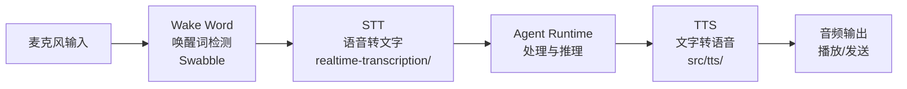
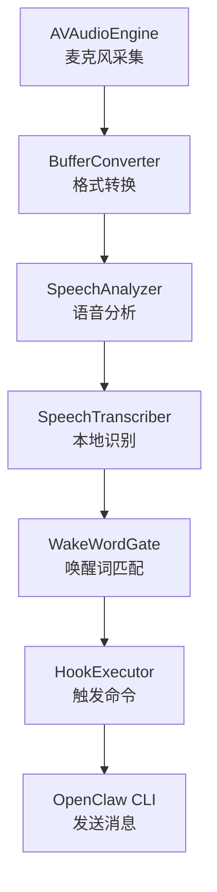

# 第 21 章 — Voice 与 TTS：语音交互全链路

读完本章，你会理解 OpenClaw 语音交互的完整链路——从唤醒词检测、语音转文字、Agent 处理到语音合成输出；掌握 TTS Provider 的插件化抽象如何统一接入 15+ 家语音服务商；搞清楚 Swabble 唤醒词守护进程的本地优先设计；以及实时语音对话（Realtime Voice）的双工桥接架构。

## 21.1 语音交互的完整链路

语音交互不是一个单点功能，而是一条贯穿多个子系统的管线。用户说一句话，到 Agent 用语音回答，中间经过五个阶段：



这条链路有两种运行模式：

**异步模式（消息渠道）**：用户通过 Telegram、Discord 等渠道发送语音消息，系统用 Whisper 等模型转文字后交给 Agent，Agent 回复的文本再走 TTS 合成为语音文件发回。整个过程是请求-响应式的。

**实时模式（Realtime Voice）**：用户通过电话或 WebRTC 与 Agent 保持双工连接。语音输入实时转文字，Agent 的回复实时合成为音频流推送回去。这种模式对延迟极度敏感，走的是 `src/realtime-voice/` 的独立路径。

两种模式共享 TTS Provider 抽象层和部分配置体系，但在运行时管线上完全分开。下面逐一拆解每个环节。

## 21.2 Wake Word：唤醒词守护进程

唤醒词是语音交互的入口——用户说出 "Claude" 或 "clawd"，系统才开始处理后续语音。OpenClaw 的唤醒词能力由独立项目 Swabble 提供，它是一个 Swift 6.2 写的守护进程，运行在 macOS 26+ 上。

### 架构设计

Swabble 的核心设计原则是**本地优先**：使用 Apple Speech.framework 的设备端模型做语音识别，整个过程不经过网络。这意味着即使在离线环境下，唤醒词检测也能正常工作。



语音管线在 `Swabble/Sources/SwabbleCore/Speech/SpeechPipeline.swift` 中实现。它是一个 Swift Actor，负责串联音频采集到语音识别的完整流程：

```swift
// Swabble/Sources/SwabbleCore/Speech/SpeechPipeline.swift:20-30
public actor SpeechPipeline {
    private var engine = AVAudioEngine()
    private var transcriber: SpeechTranscriber?
    private var analyzer: SpeechAnalyzer?
    private var inputContinuation: AsyncStream<AnalyzerInput>.Continuation?
    private var resultTask: Task<Void, Never>?
    private let converter = BufferConverter()

    public init() {}
    // ...
}
```

`AVAudioEngine` 安装一个 tap 持续采集麦克风音频，`BufferConverter` 将采样率和格式转换为 `SpeechAnalyzer` 要求的格式，然后通过 `AsyncStream` 输送给 `SpeechTranscriber` 模块。转录结果包含文本和是否为最终结果（`isFinal`）标记。

### WakeWordGate：基于时间间隔的唤醒匹配

唤醒词匹配不是简单的字符串包含检查。`WakeWordGate`（位于 `Swabble/Sources/SwabbleKit/WakeWordGate.swift`）使用**基于时间间隔的分段匹配**算法：

```swift
// Swabble/Sources/SwabbleKit/WakeWordGate.swift:21-35
public struct WakeWordGateConfig: Sendable, Equatable {
    public var triggers: [String]
    public var minPostTriggerGap: TimeInterval
    public var minCommandLength: Int

    public init(
        triggers: [String],
        minPostTriggerGap: TimeInterval = 0.45,
        minCommandLength: Int = 1)
    {
        // ...
    }
}
```

匹配逻辑的关键参数是 `minPostTriggerGap`——唤醒词和后续命令之间必须有至少 0.45 秒的停顿。这避免了用户在正常对话中提到 "Claude" 时误触发。匹配过程分三步：

1. 将语音识别的分段（带时间戳）标准化为 token 序列
2. 在 token 序列中查找与唤醒词匹配的连续子序列
3. 检查匹配位置之后是否有足够的时间间隔和最少字符数

### Hook 机制：唤醒后的动作

检测到唤醒词后，`HookExecutor`（`Swabble/Sources/SwabbleCore/Hooks/HookExecutor.swift`）执行配置的命令，把去除唤醒词后的文本作为参数传入：

```swift
// Swabble/Sources/SwabbleCore/Hooks/HookExecutor.swift:38-43
let prefix = config.hook.prefix
    .replacingOccurrences(of: "${hostname}", with: hostname)
let payload = prefix + job.text

let process = Process()
process.executableURL = URL(fileURLWithPath: config.hook.command)
process.arguments = config.hook.args + [payload]
```

环境变量 `SWABBLE_TEXT` 携带清理后的文本，`SWABBLE_PREFIX` 携带渲染后的前缀。Hook 命令通常指向 OpenClaw CLI，将语音内容作为消息发送给 Agent。

配置文件位于 `~/.config/swabble/config.json`：

```json
{
  "wake": {"enabled": true, "word": "clawd", "aliases": ["claude"]},
  "hook": {
    "command": "",
    "args": [],
    "prefix": "Voice swabble from ${hostname}: ",
    "cooldownSeconds": 1,
    "minCharacters": 24,
    "timeoutSeconds": 5
  }
}
```

`cooldownSeconds` 防止短时间内重复触发，`minCharacters` 过滤太短的无效输入。

## 21.3 STT：语音转文字

语音转文字在 OpenClaw 中有两条路径：异步转录和实时流式转录。

### 异步转录

异步场景下（用户发送语音消息），语音文件通过 Media Understanding 子系统处理。具体来说，语音文件被发送到 Whisper 等 API 进行转录，结果作为文本消息交给 Agent。这部分逻辑在 `src/media-understanding/` 中，不在本章的核心讨论范围。

### 实时流式转录

实时场景的关键是 `src/realtime-transcription/` 模块。它定义了流式 STT 的 Provider 抽象：

```typescript
// src/realtime-transcription/provider-types.ts:17-22
export type RealtimeTranscriptionSessionCallbacks = {
  onPartial?: (partial: string) => void;
  onTranscript?: (transcript: string) => void;
  onSpeechStart?: () => void;
  onError?: (error: Error) => void;
};

export type RealtimeTranscriptionSession = {
  connect(): Promise<void>;
  sendAudio(audio: Buffer): void;
  close(): void;
  isConnected(): boolean;
};
```

接口很简洁：建立连接后，持续发送音频 Buffer，通过回调接收部分结果（`onPartial`）和最终转录文本（`onTranscript`）。

目前支持的实时转录 Provider 有 5 个：

| Provider | 扩展 | 说明 |
|----------|------|------|
| OpenAI | `extensions/openai/` | Whisper 实时 API |
| ElevenLabs | `extensions/elevenlabs/` | Scribe v2 实时模型 |
| Deepgram | `extensions/deepgram/` | 流式 STT |
| Mistral | `extensions/mistral/` | 实时转录 |
| xAI | `extensions/xai/` | 实时转录 |

### WebSocket 传输层

实时转录统一基于 WebSocket 传输。`src/realtime-transcription/websocket-session.ts` 提供了一个通用的 WebSocket 会话框架，封装了连接管理、重连策略、音频队列和错误处理：

```typescript
// src/realtime-transcription/websocket-session.ts:41-44
const DEFAULT_CONNECT_TIMEOUT_MS = 10_000;
const DEFAULT_CLOSE_TIMEOUT_MS = 5_000;
const DEFAULT_MAX_RECONNECT_ATTEMPTS = 5;
const DEFAULT_RECONNECT_DELAY_MS = 1000;
```

重连策略使用指数退避（`delay * 2^(attempts-1)`），最多重连 5 次。音频队列有 2MB 上限（`DEFAULT_MAX_QUEUED_BYTES`），防止连接中断时内存无限增长——旧的音频帧会被丢弃以保持队列在限制范围内。

以 ElevenLabs 的实时转录为例（`extensions/elevenlabs/realtime-transcription-provider.ts`），它基于这个 WebSocket 框架，只需要实现协议适配：

```typescript
// extensions/elevenlabs/realtime-transcription-provider.ts:172-181
const sendAudioChunk = (
  audio: Buffer,
  transport: RealtimeTranscriptionWebSocketTransport,
): void => {
  transport.sendJson({
    message_type: "input_audio_chunk",
    audio_base_64: audio.toString("base64"),
    sample_rate: config.sampleRate,
    ...(config.commitStrategy === "manual" ? { commit: true } : {}),
  });
};
```

音频以 Base64 编码通过 JSON 消息发送。ElevenLabs 支持两种提交策略：`vad`（Voice Activity Detection，自动检测语音结束）和 `manual`（每帧都提交）。

## 21.4 TTS Provider 抽象：统一 15+ 家语音服务商

TTS 是语音交互的出口——Agent 生成文本回复后，需要合成为音频。OpenClaw 面临的问题和 Model Provider 类似：市面上的 TTS 服务商很多，每家的 API 格式、认证方式、参数体系都不同。

### Provider 插件接口

所有 TTS Provider 都实现同一个 `SpeechProviderPlugin` 接口，通过插件系统注册：

```typescript
// src/plugins/types.ts:1761-1786
export type SpeechProviderPlugin = {
  id: SpeechProviderId;
  label: string;
  aliases?: string[];
  autoSelectOrder?: number;
  models?: readonly string[];
  voices?: readonly string[];
  resolveConfig?: (ctx: SpeechProviderResolveConfigContext) => SpeechProviderConfig;
  parseDirectiveToken?: (ctx: SpeechDirectiveTokenParseContext) => SpeechDirectiveTokenParseResult;
  isConfigured: (ctx: SpeechProviderConfiguredContext) => boolean;
  synthesize: (req: SpeechSynthesisRequest) => Promise<SpeechSynthesisResult>;
  synthesizeTelephony?: (
    req: SpeechTelephonySynthesisRequest,
  ) => Promise<SpeechTelephonySynthesisResult>;
  listVoices?: (req: SpeechListVoicesRequest) => Promise<SpeechVoiceOption[]>;
};
```

几个关键方法：
- `isConfigured` 检查 API Key 等必要配置是否就绪
- `synthesize` 执行文本到音频的合成
- `synthesizeTelephony` 专门用于电话场景，输出低采样率的 PCM 音频
- `parseDirectiveToken` 解析内联指令（后面会详细讲）

目前注册了 TTS Provider 的扩展有 15 个：

| Provider | 扩展 ID | 特点 |
|----------|---------|------|
| OpenAI | `openai` | GPT-4o 语音模型 |
| ElevenLabs | `elevenlabs` | 高质量多语种语音克隆 |
| Azure Speech | `azure-speech` | Azure Cognitive Services |
| Microsoft | `microsoft` | Edge TTS |
| Google | `google` | Google Cloud TTS |
| DeepInfra | `deepinfra` | 开源模型托管 |
| OpenRouter | `openrouter` | 多模型路由 |
| xAI | `xai` | Grok 语音 |
| Volcengine | `volcengine` | 火山引擎 TTS |
| Minimax | `minimax` | Minimax 语音 |
| Xiaomi | `xiaomi` | 小米 TTS |
| Vydra | `vydra` | 独立 TTS 服务 |
| Gradium | `gradium` | 独立 TTS 服务 |
| Inworld | `inworld` | 游戏 NPC 语音 |
| Local CLI | `tts-local-cli` | 本地命令行 TTS |

### OpenAI 兼容层：复用请求格式

很多 TTS 服务商的 API 与 OpenAI 兼容（`POST /audio/speech`，同样的请求格式）。OpenClaw 提取了一个通用的 `createOpenAiCompatibleSpeechProvider` 工厂函数（`src/tts/openai-compatible-speech-provider.ts`），让这些 Provider 只需要声明差异化配置：

```typescript
// src/tts/openai-compatible-speech-provider.ts:40-63
export type OpenAiCompatibleSpeechProviderOptions<
  ExtraConfig extends Record<string, unknown> = Record<string, never>,
> = {
  id: string;
  label: string;
  autoSelectOrder: number;
  models: readonly string[];
  voices: readonly string[];
  defaultModel: string;
  defaultVoice: string;
  defaultBaseUrl: string;
  envKey: string;
  responseFormats: readonly string[];
  defaultResponseFormat: string;
  voiceCompatibleResponseFormats: readonly string[];
  // ...
};
```

一个 OpenAI 兼容的 Provider 只需要提供这些选项即可。工厂函数自动处理 API Key 解析（支持环境变量、配置文件、Model Provider 配置多种来源）、Base URL 规范化、请求构造和响应解析。合成请求最终都统一为：

```typescript
// src/tts/openai-compatible-speech-provider.ts:362-372
const { response, release } = await postJsonRequest({
  url: `${baseUrl}/audio/speech`,
  headers,
  body: {
    model: normalizeModel(overrides.model ?? config.model, options.defaultModel),
    input: req.text,
    voice: overrides.voice ?? config.voice,
    response_format: responseFormat,
    ...(speed == null ? {} : { speed }),
  },
  // ...
});
```

### 非兼容 Provider：ElevenLabs 的独立实现

ElevenLabs 的 API 与 OpenAI 不兼容，它直接实现 `SpeechProviderPlugin` 接口。`extensions/elevenlabs/speech-provider.ts` 中可以看到它的配置项比 OpenAI 兼容层丰富得多：

```typescript
// extensions/elevenlabs/speech-provider.ts:46-61
type ElevenLabsProviderConfig = {
  apiKey?: string;
  baseUrl: string;
  voiceId: string;
  modelId: string;
  seed?: number;
  applyTextNormalization?: "auto" | "on" | "off";
  languageCode?: string;
  voiceSettings: {
    stability: number;
    similarityBoost: number;
    style: number;
    useSpeakerBoost: boolean;
    speed: number;
  };
};
```

ElevenLabs 独有的 `voiceSettings` 控制语音的稳定性、相似度增强、风格强度和说话人增强，这些参数在 OpenAI 兼容层中没有对应物。

### Provider Registry：动态发现

TTS Provider 的注册和发现通过 `src/tts/provider-registry.ts` 完成。它基于 OpenClaw 的通用插件能力发现机制：

```typescript
// src/tts/provider-registry.ts:13-18
function resolveSpeechProviderPluginEntries(cfg?: OpenClawConfig): SpeechProviderPlugin[] {
  return resolvePluginCapabilityProviders({
    key: "speechProviders",
    cfg,
  });
}
```

`resolvePluginCapabilityProviders` 会扫描所有已加载的插件，收集注册了 `speechProviders` 能力的 Provider。运行时可以通过 `listSpeechProviders()` 获取所有可用 Provider，通过 `getSpeechProvider(id)` 按 ID 查找特定 Provider。

Provider ID 支持别名。例如，Microsoft 的 Provider 同时接受 `microsoft` 和 `edge` 两个 ID，这在 `src/tts/status-config.ts:53-54` 中可以看到：

```typescript
// src/tts/status-config.ts:53
return normalized === "edge" ? "microsoft" : normalized;
```

### 自动选择策略

当用户没有指定 Provider 时，系统通过 `autoSelectOrder` 字段选择。数值越小优先级越高。ElevenLabs 的 `autoSelectOrder` 是 20，在有 API Key 的情况下会被优先选中。`isConfigured` 方法用于过滤掉没有配置认证信息的 Provider。

## 21.5 TTS 配置体系

TTS 的配置体系支持多层覆盖，从全局到渠道再到账号级别逐层细化。

### 配置层级

`src/tts/tts-config.ts` 中的 `resolveEffectiveTtsConfig` 展示了配置的合并顺序：

```typescript
// src/tts/tts-config.ts:124-138
export function resolveEffectiveTtsConfig(
  cfg: OpenClawConfig,
  contextOrAgentId?: string | TtsConfigResolutionContext,
): TtsConfig {
  const context = resolveTtsConfigContext(contextOrAgentId);
  const base = cfg.messages?.tts ?? {};
  const agentOverride = resolveAgentTtsOverride(cfg, context.agentId);
  const channelOverride = resolveChannelTtsOverride(cfg, context);
  const accountOverride = resolveAccountTtsOverride(cfg, context);
  let merged: unknown = base;
  for (const override of [agentOverride, channelOverride, accountOverride]) {
    merged = deepMergeDefined(merged, override ?? {});
  }
  return merged as TtsConfig;
}
```

合并优先级从低到高：**全局 TTS 配置** < **Agent 级覆盖** < **渠道级覆盖** < **账号级覆盖**。每一层都可以独立设置 Provider、音色、模型等参数。这种设计允许同一个 Agent 在 Telegram 上用 ElevenLabs，在电话场景用 Azure Speech。

### Auto Mode：四种触发模式

TTS 不是永远开启的。`tts-auto-mode.ts` 定义了四种自动模式：

```typescript
// src/tts/tts-auto-mode.ts:4
export const TTS_AUTO_MODES = new Set<TtsAutoMode>(["off", "always", "inbound", "tagged"]);
```

- `off` —— 关闭 TTS
- `always` —— 所有回复都生成语音
- `inbound` —— 仅当用户发送了语音消息时，回复也用语音
- `tagged` —— 仅当 Agent 回复包含 TTS 指令标签时生成语音

模式的解析同样支持多层覆盖。`shouldAttemptTtsPayload`（`src/tts/tts-config.ts:179`）按优先级检查：Session 级设置 > 用户偏好文件 > 配置文件 > 默认值。

### 用户偏好

用户可以通过本地偏好文件覆盖 TTS 设置，文件路径默认为 `~/.config/openclaw/settings/tts.json`。偏好内容包括 auto mode、Provider、persona、最大文本长度和是否启用摘要。这允许终端用户在不修改系统配置的情况下调整语音体验。

### 文本长度控制与摘要

TTS 有最大文本长度限制，默认 1500 字符（`src/tts/status-config.ts:13`）。当 Agent 回复超过限制时，系统会调用 LLM 进行摘要压缩：

```typescript
// src/tts/tts-core.ts:78-88
export async function summarizeText(
  params: {
    text: string;
    targetLength: number;
    cfg: OpenClawConfig;
    config: ResolvedTtsConfig;
    timeoutMs: number;
  },
  // ...
): Promise<SummarizeResult> {
```

摘要使用当前 Agent 配置的默认模型（或专门指定的 `summaryModel`），temperature 设为 0.3 以保证输出稳定。这意味着一个 3000 字的技术回复可以被压缩为适合朗读的 1500 字摘要，然后再交给 TTS 合成。

## 21.6 TTS 指令系统

Agent 的回复文本中可以嵌入特殊指令来控制 TTS 行为。这套指令系统在 `src/tts/directives.ts` 中实现。

### 指令语法

指令使用 `[[ ]]` 双方括号语法：

```
[[tts:provider=elevenlabs voice=pMsXgVXv3BLzUgSXRplE stability=0.8]]
这段文字会用指定的声音朗读。

[[tts:text]]这是只给 TTS 朗读的隐藏文本[[/tts:text]]

[[tts]]这段文字会被 TTS 朗读，也会显示在聊天中[[/tts]]
```

三种指令形式：
- **内联参数指令**：`[[tts:key=value ...]]`，设置 Provider、音色、模型等参数
- **隐藏文本块**：`[[tts:text]]...[[/tts:text]]`，指定一段替代文本给 TTS 朗读，但不显示在聊天消息中
- **可见文本块**：`[[tts]]...[[/tts]]`，标记一段文本既显示在聊天中也给 TTS 朗读

### Model Override 策略

指令能修改哪些参数由 `SpeechModelOverridePolicy` 控制：

```typescript
// src/tts/provider-types.ts:13-22
export type SpeechModelOverridePolicy = {
  enabled: boolean;
  allowText: boolean;
  allowProvider: boolean;
  allowVoice: boolean;
  allowModelId: boolean;
  allowVoiceSettings: boolean;
  allowNormalization: boolean;
  allowSeed: boolean;
};
```

管理员可以精确控制 Agent 能通过指令修改哪些 TTS 参数。比如可以允许 Agent 切换音色（`allowVoice: true`）但禁止切换 Provider（`allowProvider: false`）。这在多租户场景下很重要——你不想让 Agent 把 TTS 请求重定向到非预期的服务商。

### 流式指令清理

指令标签在发送给用户之前需要清除。`createTtsDirectiveTextStreamCleaner`（`src/tts/directives.ts:145`）提供了一个流式清理器，可以在 Agent 流式输出的过程中实时剥离指令标签：

```typescript
// src/tts/directives.ts:145-199
export function createTtsDirectiveTextStreamCleaner(): TtsDirectiveTextStreamCleaner {
  let pending = "";
  let insideHiddenTextBlock = false;

  return {
    push(text: string): string {
      // 处理 [[ 和 ]] 标签，剥离指令，
      // 保留非指令文本
    },
    flush(): string { /* ... */ },
    hasBufferedDirectiveText(): boolean { /* ... */ },
  };
}
```

清理器维护一个状态机：遇到 `[[` 开始缓冲，直到遇到 `]]` 才决定是输出还是丢弃。如果是 `[[tts:text]]` 块内部的内容，则完全吞掉不输出。这个设计让指令对终端用户完全透明。

### Markdown 代码块保护

指令解析器会识别 Markdown 代码块并跳过其中的内容。`collectMarkdownCodeRanges`（`src/tts/directives.ts:82-99`）收集所有反引号代码块、缩进代码块的文本范围，`replaceOutsideMarkdownCode` 确保只在非代码区域替换指令标签。这避免了代码示例中恰好包含 `[[tts]]` 模式被误识别为指令。

## 21.7 Realtime Voice：双工语音对话

实时语音对话是比简单 TTS 更复杂的场景。用户和 Agent 维持一个持续的双工连接，语音输入和输出同时进行。

### Realtime Voice Provider 接口

`src/realtime-voice/provider-types.ts` 定义了实时语音的核心抽象——`RealtimeVoiceBridge`：

```typescript
// src/realtime-voice/provider-types.ts:149-161
export type RealtimeVoiceBridge = {
  supportsToolResultContinuation?: boolean;
  connect(): Promise<void>;
  sendAudio(audio: Buffer): void;
  setMediaTimestamp(ts: number): void;
  sendUserMessage?(text: string): void;
  triggerGreeting?(instructions?: string): void;
  submitToolResult(callId: string, result: unknown, options?: RealtimeVoiceToolResultOptions): void;
  acknowledgeMark(): void;
  close(): void;
  isConnected(): boolean;
};
```

Bridge 是双向的：向上游发送音频（`sendAudio`），从下游接收音频和事件（通过回调）。它还支持工具调用（`submitToolResult`）——实时语音中，Agent 可以在对话过程中调用工具，然后将结果融入语音回复。

目前支持实时语音的 Provider 有 2 个：

| Provider | 传输协议 |
|----------|----------|
| OpenAI Realtime API | WebRTC SDP / WebSocket |
| Google Gemini Live | WebSocket / Managed Room |

### 音频格式与编解码

实时语音支持两种音频格式：

```typescript
// src/realtime-voice/provider-types.ts:9-19
export type RealtimeVoiceAudioFormat =
  | {
      encoding: "g711_ulaw";
      sampleRateHz: 8000;
      channels: 1;
    }
  | {
      encoding: "pcm16";
      sampleRateHz: 24000;
      channels: 1;
    };
```

**G.711 mu-law 8kHz** 用于电话场景（Twilio、SIP 等），**PCM16 24kHz** 用于高质量 WebRTC 场景。`src/realtime-voice/audio-codec.ts` 提供了两种格式之间的转换函数：

```typescript
// src/realtime-voice/audio-codec.ts:50-78
export function resamplePcm(
  input: Buffer,
  inputSampleRate: number,
  outputSampleRate: number,
): Buffer {
  // 带通滤波的重采样实现
  // 使用 31 阶 sinc 插值 + Hann 窗
}
```

这个重采样器是纯 JavaScript 实现，不依赖原生模块。它使用带限 sinc 插值（31 阶 FIR 滤波器 + Hann 窗函数）来避免降采样时的混叠失真。`pcmToMulaw` 和 `mulawToPcm` 实现了 PCM 线性编码与 mu-law 压缩编码的互相转换。

### Session Runtime：桥接 Provider 与应用

`src/realtime-voice/session-runtime.ts` 中的 `createRealtimeVoiceBridgeSession` 将 Provider 的 Bridge 包装为一个高级会话对象，添加了音频路由、Mark 策略和自动问候等能力：

```typescript
// src/realtime-voice/session-runtime.ts:51-124
export function createRealtimeVoiceBridgeSession(
  params: RealtimeVoiceBridgeSessionParams,
): RealtimeVoiceBridgeSession {
  // ...
  bridge = params.provider.createBridge({
    // ...
    onAudio: (audio) => {
      if (canSendAudio()) {
        params.audioSink.sendAudio(audio);
      }
    },
    onReady: () => {
      if (params.triggerGreetingOnReady) {
        bridge.triggerGreeting?.(params.initialGreetingInstructions);
      }
      params.onReady?.(session);
    },
    // ...
  });
}
```

Mark 策略（`RealtimeVoiceMarkStrategy`）控制音频播放同步：
- `transport` —— 通过传输层（如 Twilio）反馈音频播放进度
- `ack-immediately` —— 立即确认，适用于不支持 Mark 的传输层
- `ignore` —— 忽略 Mark 事件

### Agent Consult：实时语音中的深度推理

实时语音的 LLM 通常使用轻量模型以保证低延迟，但有时用户提出需要深度推理的问题。`src/realtime-voice/agent-consult-tool.ts` 定义了一个工具 `openclaw_agent_consult`，让实时语音 Agent 可以"暂停"并向完整的 OpenClaw Agent 发起咨询：

```typescript
// src/realtime-voice/agent-consult-tool.ts:25-48
export const REALTIME_VOICE_AGENT_CONSULT_TOOL: RealtimeVoiceTool = {
  type: "function",
  name: REALTIME_VOICE_AGENT_CONSULT_TOOL_NAME,
  description:
    "Ask the full OpenClaw agent for deeper reasoning, current information, "
    + "or tool-backed help before speaking.",
  parameters: {
    type: "object",
    properties: {
      question: { type: "string", description: "The concrete question or task." },
      context: { type: "string", description: "Optional relevant context." },
      responseStyle: { type: "string", description: "Optional style hint." },
    },
    required: ["question"],
  },
};
```

咨询请求会附带最近 12 条对话记录作为上下文，咨询的 Agent 使用 `thinkLevel: "high"` 进行深度推理。结果返回后，实时语音 Agent 将其转述给用户。

工具使用策略通过 `RealtimeVoiceAgentConsultToolPolicy` 控制：
- `safe-read-only` —— 被咨询的 Agent 只能使用 `read`、`web_search`、`web_fetch`、`memory_search` 等只读工具
- `owner` —— 完全权限
- `none` —— 不注册咨询工具

### 浏览器会话：多种传输协议

实时语音从浏览器发起时，`RealtimeVoiceBrowserSession` 支持四种传输协议：

```typescript
// src/realtime-voice/provider-types.ts:143-147
export type RealtimeVoiceBrowserSession =
  | RealtimeVoiceBrowserWebRtcSdpSession      // WebRTC SDP 直连
  | RealtimeVoiceBrowserJsonPcmWebSocketSession // JSON+PCM WebSocket
  | RealtimeVoiceBrowserGatewayRelaySession     // 网关中继
  | RealtimeVoiceBrowserManagedRoomSession;     // 托管房间（如 LiveKit）
```

WebRTC SDP 延迟最低，适合浏览器直连 Provider API。Gateway Relay 模式通过 OpenClaw 网关中继，适用于无法直连的网络环境。Managed Room 适用于 LiveKit 等多方音频平台。

## 21.8 本地优先的隐私设计

纵观整个语音交互链路，OpenClaw 在隐私保护上做了明确的设计选择：

**唤醒词检测完全本地化**。Swabble 使用 Apple Speech.framework 的设备端模型，音频不离开本地设备。这是隐私敏感用户选择 OpenClaw 的关键原因——你不需要把全天候的麦克风音频上传到云端。

**本地 TTS 选项**。`tts-local-cli` 扩展允许使用本地命令行工具（如 macOS 的 `say` 命令或 `piper-tts`）进行语音合成，完全不经过网络。

**灵活的 Provider 选择**。通过配置，用户可以在每个环节选择本地或云端方案。例如，唤醒词和 STT 用本地方案，只有 TTS 用云端高质量服务——在隐私和质量之间取得平衡。

**音频数据不持久化**。实时语音的音频流是流过式的，系统不保存原始音频。转录后的文本按普通消息处理，受 Session 和 Memory 系统的存储策略管理。

## 21.9 跨平台语音消息支持

不同消息平台对语音消息的支持差异很大。TTS 系统通过 `SpeechSynthesisTarget` 类型区分输出场景：

```typescript
// src/tts/provider-types.ts:7
export type SpeechSynthesisTarget = "audio-file" | "voice-note" | "telephony";
```

- `audio-file` —— 普通音频文件，用于不原生支持语音消息的平台
- `voice-note` —— 语音消息格式（通常是 Opus 编码），用于 Telegram 等原生支持语音消息的平台
- `telephony` —— 电话场景，输出低采样率 PCM 音频供实时播放

ElevenLabs Provider 的实现展示了这种区分的效果：

```typescript
// extensions/elevenlabs/speech-provider.ts:469-472
const outputFormat =
  trimToUndefined(overrides.outputFormat) ??
  (req.target === "voice-note" ? "opus_48000_64" : "mp3_44100_128");
```

语音消息场景用 48kHz Opus 编码，普通音频文件用 44.1kHz MP3。`voiceCompatible` 字段标记输出是否兼容平台的原生语音消息展示——不兼容时，平台插件会回退为普通音频文件发送。

## 21.10 小结

OpenClaw 的语音系统体现了几个值得学习的架构决策：

**端到端的插件化**。从 STT 到 TTS，每个环节都有独立的 Provider 抽象和插件注册机制。添加一个新的 TTS 服务商只需要实现 `SpeechProviderPlugin` 接口并在扩展的 `register` 函数中注册，核心代码不需要修改。

**兼容层减少重复**。`createOpenAiCompatibleSpeechProvider` 工厂将 OpenAI API 格式的共性提取出来，让 10+ 个兼容 Provider 避免了大量重复代码。非兼容的 Provider（如 ElevenLabs）则直接实现完整接口。

**多层配置覆盖**。全局 → Agent → 渠道 → 账号的四级覆盖策略，加上运行时用户偏好文件，让同一个部署可以服务于差异化需求极大的场景。

**异步与实时分离**。两种模式共享 Provider 抽象和配置体系，但运行时管线完全独立。实时路径（`src/realtime-voice/`）有自己的音频编解码器、Bridge 接口和 Session Runtime，不会因为异步路径的变更而受到影响。

**本地优先但不强制**。唤醒词检测、本地 CLI TTS 提供了完全离线的选项，但系统同时支持 15+ 家云端 TTS 服务。用户可以根据隐私需求和质量要求自由组合。

## 练习

**思考题**

1. 语音交互的完整链路是 STT → LLM → TTS。每个环节都有延迟：STT 转录需要时间，LLM 推理需要时间，TTS 合成需要时间。在实时双工对话模式下，这三段延迟的叠加会显著影响用户体验。OpenClaw 在哪些环节做了流式处理来降低端到端延迟？还有哪些优化空间？

2. TTS Provider 抽象统一了 15+ 家语音服务商的接口。但不同服务商的语音风格差异很大（比如 ElevenLabs 擅长情感表达，Google Cloud TTS 擅长多语言）。如果用户在对话中途切换了 TTS Provider（比如从 ElevenLabs 切换到 Google），语音风格的突变会影响体验。你会怎么处理这种切换的平滑过渡？

**动手题**

3. 配置 OpenClaw 的 TTS 功能，选择一个支持的 TTS Provider（如果没有云端 API Key，可以使用本地 CLI TTS）。发送一条消息并听取语音回复。然后修改 TTS 的 voice 配置（比如切换语音角色或语速），对比前后的语音输出差异。
