# 第 23 章 — 七层安全模型：从认证到沙箱的纵深防御

读完这章，你会理解 OpenClaw 的七层安全架构如何协作运行，每一层的实现代码在哪里，以及各层的设计权衡。这是理解第 24 章真实安全事件分析的前置知识。

## 23.1 安全模型总览

OpenClaw 是一个拥有宿主机完全访问权限的 Agent 运行时。一条来自 Telegram 的消息，经过 Gateway 路由、Agent 处理、模型推理、工具调用，最终可能在你的机器上执行一条 shell 命令。从外部消息到本地执行之间的每一步，都需要安全控制。

OpenClaw 的安全模型可以划分为七个层次，形成纵深防御（Defense in Depth）结构。每层独立运作，互不依赖——即使某一层被突破，后面的层仍然可以拦截攻击。

```mermaid
graph TB
    subgraph "七层安全栈"
        L1["Layer 1: Gateway Auth<br/>token / password / tailscale / trusted-proxy"]
        L2["Layer 2: Device Pairing<br/>设备绑定 + 签名验证"]
        L3["Layer 3: Channel Allowlists<br/>dmPolicy / groupPolicy / allowFrom"]
        L4["Layer 4: Tool Policy<br/>allow / deny / ownerOnly / profiles"]
        L5["Layer 5: Exec Approvals<br/>allowlist / ask-ui / timeout"]
        L6["Layer 6: Sandbox<br/>Docker 容器隔离 / SSH 远程沙箱"]
        L7["Layer 7: Send Policy<br/>出站消息控制"]
    end

    L1 --> L2
    L2 --> L3
    L3 --> L4
    L4 --> L5
    L5 --> L6
    L6 --> L7

    style L1 fill:#e74c3c,color:#fff
    style L2 fill:#e67e22,color:#fff
    style L3 fill:#f39c12,color:#fff
    style L4 fill:#27ae60,color:#fff
    style L5 fill:#2980b9,color:#fff
    style L6 fill:#8e44ad,color:#fff
    style L7 fill:#2c3e50,color:#fff
```



这七层可以分为三个关卡：

- **身份关卡**（Layer 1-3）：你是谁？你能不能和这个 Agent 对话？
- **行为关卡**（Layer 4-5）：Agent 能用哪些工具？执行命令前需要人确认吗？
- **隔离关卡**（Layer 6-7）：命令在哪里执行？Agent 能对外发什么消息？

下面逐层拆解。

## 23.2 Layer 1: Gateway Auth — 入口认证

Gateway 是所有请求的入口，无论是 WebSocket 连接、HTTP API 调用还是 Control UI 访问，都必须先通过 Gateway 认证。

### 23.2.1 认证模式

OpenClaw 支持五种认证模式，在 `src/gateway/auth.ts` 中定义：

```typescript
// src/gateway/auth.ts:37-45
export type GatewayAuthResult = {
  ok: boolean;
  method?:
    | "none"
    | "token"
    | "password"
    | "tailscale"
    | "device-token"
    | "bootstrap-token"
    | "trusted-proxy";
  user?: string;
  reason?: string;
  rateLimited?: boolean;
  retryAfterMs?: number;
};
```

各模式的适用场景：

| 模式 | 认证方式 | 典型场景 |
|------|----------|----------|
| `none` | 无认证 | 仅限 loopback 绑定的本地开发 |
| `token` | Bearer token 比对 | 默认模式，CLI 和 API 客户端 |
| `password` | 密码比对 | Control UI 浏览器登录 |
| `tailscale` | Tailscale Whois 验证 | 私有网络远程访问 |
| `trusted-proxy` | 反向代理注入身份头 | 企业内网统一认证 |

### 23.2.2 时序安全比较

认证的核心操作是比较用户提供的凭证和配置中的凭证。这看起来只需要 `===`，但 OpenClaw 专门写了一个安全比较函数：

```typescript
// src/security/secret-equal.ts:3-12
export function safeEqualSecret(
  provided: string | undefined | null,
  expected: string | undefined | null,
): boolean {
  if (typeof provided !== "string" || typeof expected !== "string") {
    return false;
  }
  const hash = (s: string) => createHash("sha256").update(s).digest();
  return timingSafeEqual(hash(provided), hash(expected));
}
```

为什么不直接 `===`？因为字符串逐字符比较在遇到第一个不匹配时就会返回，攻击者可以通过测量响应时间推断出已经匹配了多少个字符（timing attack）。`timingSafeEqual` 保证无论字符串是否匹配，比较时间恒定。先做 SHA-256 哈希是为了将任意长度的输入标准化为固定长度的 Buffer，避免长度不同时 `timingSafeEqual` 抛错。

### 23.2.3 速率限制

认证失败会触发速率限制。`authorizeGatewayConnect` 函数在每次认证前检查速率限制状态：

```typescript
// src/gateway/auth.ts:496-506
if (limiter) {
  const rlCheck: RateLimitCheckResult = limiter.check(ip, rateLimitScope);
  if (!rlCheck.allowed) {
    return {
      ok: false,
      reason: "rate_limited",
      rateLimited: true,
      retryAfterMs: rlCheck.retryAfterMs,
    };
  }
}
```

注意一个细节：当用户没有提供凭证时（比如浏览器直接打开页面），不会消耗速率限制配额——只有提供了错误凭证才会计数。这避免了合法用户在输入密码前就被锁定。

### 23.2.4 Tailscale 身份验证

Tailscale 模式的安全性依赖双重验证。仅有 HTTP 头中的 `tailscale-user-login` 不够——这个头可以被伪造。代码额外调用 Tailscale 的 Whois API 来验证请求者的真实身份：

```typescript
// src/gateway/auth.ts:187-218
async function resolveVerifiedTailscaleUser(params: {
  req?: IncomingMessage;
  tailscaleWhois: TailscaleWhoisLookup;
}): Promise<{ ok: true; user: TailscaleUser } | { ok: false; reason: string }> {
  // ...
  const whois = await tailscaleWhois(clientIp);
  if (!whois?.login) {
    return { ok: false, reason: "tailscale_whois_failed" };
  }
  if (normalizeLogin(whois.login) !== normalizeLogin(tailscaleUser.login)) {
    return { ok: false, reason: "tailscale_user_mismatch" };
  }
  // ...
}
```

只有当 Tailscale Whois 返回的登录名与请求头中的登录名一致时，才允许访问。这防止了在同一个 Tailscale 网络中的其他设备伪造身份。

### 23.2.5 浏览器 Origin 检查

CVE-2026-25253（下一章详细分析）暴露了一个问题：WebSocket 不受浏览器同源策略保护。修复后，OpenClaw 增加了 Origin 检查：

```typescript
// src/gateway/origin-check.ts:33-69
export function checkBrowserOrigin(params: {
  requestHost?: string;
  origin?: string;
  allowedOrigins?: string[];
  allowHostHeaderOriginFallback?: boolean;
  isLocalClient?: boolean;
}): OriginCheckResult {
  const parsedOrigin = parseOrigin(params.origin);
  if (!parsedOrigin) {
    return { ok: false, reason: "origin missing or invalid" };
  }
  const allowlist = new Set(/* ... */);
  if (allowlist.has("*") || allowlist.has(parsedOrigin.origin)) {
    return { ok: true, matchedBy: "allowlist" };
  }
  // 本地回环地址特殊处理
  if (params.isLocalClient && isLoopbackHost(parsedOrigin.hostname)) {
    return { ok: true, matchedBy: "local-loopback" };
  }
  return { ok: false, reason: "origin not allowed" };
}
```

这层检查确保只有来自允许的 Origin 的浏览器请求才能建立 WebSocket 连接。

## 23.3 Layer 2: Device Pairing — 设备绑定

Gateway Auth 回答的是"你知道密码/token 吗"。Device Pairing 更进一步：你的设备是否已经被明确授权？

### 23.3.1 配对协议

设备认证使用签名验证机制。`src/gateway/device-auth.ts` 定义了签名载荷的构造：

```typescript
// src/gateway/device-auth.ts:20-34
export function buildDeviceAuthPayload(params: DeviceAuthPayloadParams): string {
  const scopes = params.scopes.join(",");
  const token = params.token ?? "";
  return [
    "v2",
    params.deviceId,
    params.clientId,
    params.clientMode,
    params.role,
    scopes,
    String(params.signedAtMs),
    token,
    params.nonce,
  ].join("|");
}
```

载荷包含设备 ID、客户端 ID、角色、权限范围、时间戳和 nonce。这个载荷被用密钥签名后发送给 Gateway，Gateway 验证签名来确认设备身份。

V3 版本增加了 `platform` 和 `deviceFamily` 字段（`buildDeviceAuthPayloadV3`，同文件第 36-54 行），用于区分 macOS、iOS、Android 等不同平台的客户端。

### 23.3.2 权限范围（Scopes）

配对时指定的 `scopes` 控制该设备能做什么：

- `operator.admin` — 完整管理权限
- `operator.read` — 只读
- `operator.write` — 读写
- `operator.approvals` — 审批操作
- `operator.pairing` — 配对其他设备

这套 scope 机制让同一个 Gateway 可以给不同设备分配不同权限。例如手机客户端只给 `operator.read` + `operator.write`，而管理控制台给完整 `operator.admin`。

### 23.3.3 信任模型的边界

SECURITY.md 明确说明了一个重要限制：

> OpenClaw does not model one gateway as a multi-tenant, adversarial user boundary.

这意味着 Device Pairing 不是为互不信任的用户设计的。它解决的是"授权设备"问题，而不是"用户隔离"问题。如果你需要在同一台机器上隔离不同用户，应该部署多个 Gateway 实例。

## 23.4 Layer 3: Channel Allowlists — 消息来源控制

通过了 Gateway 认证并不意味着你可以和任何 Agent 对话。Channel Allowlists 控制谁能触发 Agent。

### 23.4.1 DM 策略（dmPolicy）

DM（Direct Message）策略决定了私聊场景下的访问控制，定义在 `src/security/dm-policy-shared.ts`：

```typescript
// src/security/dm-policy-shared.ts:62-73
export type DmGroupAccessDecision = "allow" | "block" | "pairing";
export const DM_GROUP_ACCESS_REASON = {
  GROUP_POLICY_ALLOWED: "group_policy_allowed",
  GROUP_POLICY_DISABLED: "group_policy_disabled",
  GROUP_POLICY_EMPTY_ALLOWLIST: "group_policy_empty_allowlist",
  GROUP_POLICY_NOT_ALLOWLISTED: "group_policy_not_allowlisted",
  DM_POLICY_OPEN: "dm_policy_open",
  DM_POLICY_DISABLED: "dm_policy_disabled",
  DM_POLICY_ALLOWLISTED: "dm_policy_allowlisted",
  DM_POLICY_PAIRING_REQUIRED: "dm_policy_pairing_required",
  DM_POLICY_NOT_ALLOWLISTED: "dm_policy_not_allowlisted",
} as const;
```

四种 DM 策略：

- `open` — 任何人都能私聊 Agent
- `pairing` — 未列入白名单的用户需要完成配对流程（默认值）
- `allowlist` — 只有白名单中的用户能私聊
- `disabled` — 完全禁止私聊

### 23.4.2 群组策略（groupPolicy）

群组策略控制在 Slack/Discord/Telegram 群聊中谁能触发 Agent：

```typescript
// src/security/dm-policy-shared.ts:117-122
const groupPolicy: GroupPolicy =
  params.groupPolicy === "open" || params.groupPolicy === "disabled"
    ? params.groupPolicy
    : "allowlist";
```

三种模式：`open`（群内所有人可用）、`allowlist`（仅白名单成员）、`disabled`（不响应群消息）。

### 23.4.3 Owner vs Non-owner

Allowlist 还区分 owner 和非 owner 发送者。Owner 是白名单中的用户或通过共享密钥认证的用户，拥有完整的控制权限（执行命令、修改配置）。Non-owner 只能使用不带 `ownerOnly` 标记的工具。

这个区分在多用户共享一个 Agent 的场景中很重要。例如一个公司 Slack 频道里的 Agent，只有管理员是 owner，普通员工只能使用受限功能。

### 23.4.4 上下文可见性与触发授权的区别

SECURITY.md 中有一段容易被忽略但很关键的说明：

> Allowlists primarily gate triggering and owner-style command access. They do not guarantee universal supplemental-context redaction across every channel/surface.

这意味着即使一个用户不在白名单中，他在群聊中的消息仍然可能被 Agent 看到（作为上下文），只是 Agent 不会因为他的消息而被触发。这是安全模型中一个明确的 trade-off：完全的上下文隔离需要更重的实现（每条消息都要判断来源并决定是否加入上下文），当前版本选择了只控制触发权限。

## 23.5 Layer 4: Tool Policy — 工具访问控制

即使一条消息成功到达了 Agent，Agent 能使用的工具仍然受到 Tool Policy 的约束。

### 23.5.1 Allow / Deny 列表

Tool Policy 的核心数据结构很简单：

```typescript
// src/agents/tool-policy.ts:67-70
export type ToolPolicyLike = {
  allow?: string[];
  deny?: string[];
};
```

`deny` 优先级高于 `allow`。如果一个工具同时出现在两个列表中，它会被拒绝。

### 23.5.2 工具组和别名

OpenClaw 预定义了工具组，在 `src/agents/tool-policy-shared.ts` 中：

```typescript
// src/agents/tool-policy-shared.ts:13-17
const TOOL_NAME_ALIASES: Record<string, string> = {
  bash: "exec",
  "apply-patch": "apply_patch",
};

export const TOOL_GROUPS: Record<string, string[]> = { ...CORE_TOOL_GROUPS };
```

工具名先经过别名标准化（`bash` -> `exec`），再通过组展开（`group:plugins` -> 所有插件工具）。这让配置更灵活：你可以在 deny 列表中写 `group:plugins` 来一次性禁止所有插件工具。

### 23.5.3 Owner-Only 工具

某些高权限工具只对 owner 开放：

```typescript
// src/agents/tool-policy.ts:34-38
const OWNER_ONLY_TOOL_APPROVAL_CLASS_FALLBACKS = new Map<string, OwnerOnlyToolApprovalClass>([
  ["cron", "control_plane"],
  ["gateway", "control_plane"],
  ["nodes", "exec_capable"],
]);
```

`cron`（定时任务）、`gateway`（网关管理）、`nodes`（远程节点）这些工具默认只有 owner 能使用。对非 owner 用户，这些工具甚至不会出现在工具列表中：

```typescript
// src/agents/tool-policy.ts:54-65
export function applyOwnerOnlyToolPolicy(tools: AnyAgentTool[], senderIsOwner: boolean) {
  const withGuard = tools.map((tool) => {
    if (!isOwnerOnlyTool(tool)) {
      return tool;
    }
    return wrapOwnerOnlyToolExecution(tool, senderIsOwner);
  });
  if (senderIsOwner) {
    return withGuard;
  }
  return withGuard.filter((tool) => !isOwnerOnlyTool(tool));
}
```

非 owner 的工具列表经过了 `filter`，直接移除了所有 ownerOnly 工具。这比在执行时才报错更安全——模型根本不知道这些工具的存在，也就不会尝试调用。

### 23.5.4 Tool Profiles

Tool Policy 支持预定义的 profile，用 `tools.profile` 配置。比如 `messaging` profile 只允许消息相关的工具，禁止执行命令和文件操作。这为不同信任级别的 Agent 提供了快速配置方案。

## 23.6 Layer 5: Exec Approvals — 执行审批

Tool Policy 控制"能不能用某个工具"，Exec Approvals 控制"能不能执行某条具体命令"。

### 23.6.1 审批结果类型

`src/agents/exec-approval-result.ts` 定义了执行审批的结果解析：

```typescript
// src/agents/exec-approval-result.ts:3-24
export type ExecApprovalResult =
  | {
      kind: "denied";
      raw: string;
      metadata: string;
      body: string;
    }
  | {
      kind: "finished";
      raw: string;
      metadata: string;
      body: string;
    }
  | {
      kind: "completed";
      raw: string;
      body: string;
    }
  | {
      kind: "other";
      raw: string;
    };
```

四种结果：`denied`（被拒绝）、`finished`（执行完成，有元数据）、`completed`（执行完成）、`other`（未知状态）。

### 23.6.2 拒绝原因分类

被拒绝时，元数据中包含具体原因：

```typescript
// src/agents/exec-approval-result.ts:72-95
export function formatExecDeniedUserMessage(resultText: string): string | null {
  const parsed = parseExecApprovalResultText(resultText);
  if (parsed.kind !== "denied") {
    return null;
  }
  const metadata = normalizeLowercaseStringOrEmpty(parsed.metadata);
  if (metadata.includes("approval-timeout")) {
    return "Command did not run: approval timed out.";
  }
  if (metadata.includes("user-denied")) {
    return "Command did not run: approval was denied.";
  }
  if (metadata.includes("allowlist-miss")) {
    return "Command did not run: approval is required.";
  }
  // ...
}
```

- `approval-timeout` — 用户没有在规定时间内确认
- `user-denied` — 用户明确拒绝
- `allowlist-miss` — 命令不在自动批准的白名单中

### 23.6.3 审批边界

SECURITY.md 对 Exec Approvals 的定位做了明确说明：

> Exec approvals (allowlist/ask UI) are operator guardrails to reduce accidental command execution, not a multi-tenant authorization boundary.

Exec Approvals 是操作员防护栏，不是安全边界。它能防止 Agent 误执行危险命令（比如 `rm -rf /`），但不能用来隔离不同用户。如果攻击者已经绕过了前面四层安全控制，Exec Approvals 只是增加了一层"人在回路"的缓冲。

另一个限制是 Exec Approvals 绑定的是请求的字面上下文（命令文本、工作目录、环境变量），而不是命令的语义行为：

> Exec approvals bind exact command/cwd/env context... This is best-effort integrity hardening, not a complete semantic model of every interpreter/runtime loader path.

也就是说，`node malicious.js` 在审批时看到的就是这条命令本身，系统不会去分析 `malicious.js` 的内容会做什么。

## 23.7 Layer 6: Sandbox — 容器隔离

前五层都是在宿主机上运行的控制逻辑。Sandbox 是唯一提供物理隔离的层。

### 23.7.1 Sandbox 模式

Sandbox 有三种模式，在 `src/agents/sandbox/types.ts:71` 中定义：

```typescript
// src/agents/sandbox/types.ts:70-81
export type SandboxConfig = {
  mode: "off" | "non-main" | "all";
  backend: SandboxBackendId;
  scope: SandboxScope;
  workspaceAccess: SandboxWorkspaceAccess;
  // ...
};
```

| 模式 | 行为 | 适用场景 |
|------|------|----------|
| `off` | 所有命令在宿主机执行 | 本地个人使用（**默认值**） |
| `non-main` | 非主 Agent 的命令在沙箱中执行 | 有子 Agent 的场景 |
| `all` | 所有命令都在沙箱中执行 | 对外暴露的 Agent |

默认值是 `off`。这是一个刻意的设计决策——OpenClaw 的信任模型是"个人助手"，默认场景下操作员自己就是唯一用户，不需要沙箱的额外隔离。

```typescript
// src/agents/sandbox/config.ts:246
mode: agentSandbox?.mode ?? agent?.mode ?? "off",
```

### 23.7.2 容器隔离配置

开启沙箱后，Docker 容器的安全配置相当严格：

```typescript
// src/agents/sandbox/config.ts:101-128
return {
  image: agentDocker?.image ?? globalDocker?.image ?? DEFAULT_SANDBOX_IMAGE,
  readOnlyRoot: agentDocker?.readOnlyRoot ?? globalDocker?.readOnlyRoot ?? true,
  tmpfs: agentDocker?.tmpfs ?? globalDocker?.tmpfs ?? ["/tmp", "/var/tmp", "/run"],
  network: agentDocker?.network ?? globalDocker?.network ?? "none",
  capDrop: agentDocker?.capDrop ?? globalDocker?.capDrop ?? ["ALL"],
  // ...
};
```

默认值解读：

- `readOnlyRoot: true` — 根文件系统只读，防止篡改系统文件
- `tmpfs: ["/tmp", "/var/tmp", "/run"]` — 临时目录使用内存文件系统，容器销毁后数据消失
- `network: "none"` — 没有网络访问，防止沙箱中的代码外传数据
- `capDrop: ["ALL"]` — 丢弃所有 Linux capabilities，最小权限原则

Dockerfile 同样精简：

```dockerfile
# Dockerfile.sandbox
FROM debian:bookworm-slim
RUN apt-get install -y --no-install-recommends \
    bash ca-certificates curl git jq python3 ripgrep
RUN useradd --create-home --shell /bin/bash sandbox
USER sandbox
CMD ["sleep", "infinity"]
```

容器以非 root 用户 `sandbox` 运行，只安装了最基本的工具。

### 23.7.3 Scope — 容器生命周期

容器的生命周期由 `scope` 控制：

```typescript
// src/agents/sandbox/types.ts:68
export type SandboxScope = "session" | "agent" | "shared";
```

| Scope | 容器与什么绑定 | 生命周期 |
|-------|---------------|----------|
| `session` | 每个会话一个容器 | 会话结束后可清理 |
| `agent` | 每个 Agent 一个容器 | Agent 重启后可清理 |
| `shared` | 所有 Agent 共享 | 全局持久 |

默认是 `agent` scope：

```typescript
// src/agents/sandbox/config.ts:70-81
export function resolveSandboxScope(params: {
  scope?: SandboxScope;
  perSession?: boolean;
}): SandboxScope {
  if (params.scope) {
    return params.scope;
  }
  if (typeof params.perSession === "boolean") {
    return params.perSession ? "session" : "shared";
  }
  return "agent";
}
```

`session` scope 提供最强的隔离：每次会话的副作用不会影响下一次会话。代价是启动一个新容器需要时间（通常 1-3 秒）。`shared` scope 的容器是持久的，启动快，但会话之间可能互相影响。

### 23.7.4 沙箱内的工具限制

沙箱环境中的工具列表也被限制了。`src/agents/sandbox/constants.ts` 定义了默认的 allow 和 deny 列表：

```typescript
// src/agents/sandbox/constants.ts:13-38
export const DEFAULT_TOOL_ALLOW = [
  "exec", "process", "read", "write", "edit", "apply_patch",
  "image", "sessions_list", "sessions_history", "sessions_send",
  "sessions_spawn", "sessions_yield", "subagents", "session_status",
] as const;

export const DEFAULT_TOOL_DENY = [
  "browser", "canvas", "nodes", "cron", "gateway",
  ...CHANNEL_IDS,
] as const;
```

沙箱中默认允许文件操作和执行命令（在沙箱内部执行是安全的），但禁止访问浏览器、Canvas、远程节点、定时任务和所有消息渠道工具。这防止了沙箱中的代码通过消息渠道向外通信。

### 23.7.5 工作区访问控制

沙箱对宿主机工作区的访问有三种模式：

```typescript
// src/agents/sandbox/types.ts:30
export type SandboxWorkspaceAccess = "none" | "ro" | "rw";
```

- `none` — 沙箱有自己的独立工作目录，不能访问宿主机工作区
- `ro` — 只读访问宿主机工作区
- `rw` — 读写访问宿主机工作区

默认是 `none`（`src/agents/sandbox/config.ts:249`）。如果需要让沙箱内的代码操作宿主机文件（比如编辑项目代码），可以设置为 `rw`，但这会削弱隔离效果。

### 23.7.6 Dangerous 配置项

沙箱有几个以 `dangerously` 开头的配置项：

```typescript
// src/agents/sandbox/config.ts:31-35
export const DANGEROUS_SANDBOX_DOCKER_BOOLEAN_KEYS = [
  "dangerouslyAllowReservedContainerTargets",
  "dangerouslyAllowExternalBindSources",
  "dangerouslyAllowContainerNamespaceJoin",
] as const;
```

命名前缀 `dangerously` 是一个有意的设计信号：这些配置项会显著削弱沙箱的隔离能力。`openclaw security audit` 命令会将启用了这些配置的实例标记为 dangerous finding。

## 23.8 Layer 7: Send Policy — 出站控制

前六层都在控制"输入"——什么消息能进来、能触发什么操作。Send Policy 控制的是"输出"——Agent 能不能对外发送消息。

```typescript
// src/sessions/send-policy.ts:10-21
export type SessionSendPolicyDecision = "allow" | "deny";

export function normalizeSendPolicy(raw?: string | null): SessionSendPolicyDecision | undefined {
  const value = normalizeOptionalLowercaseString(raw);
  if (value === "allow") {
    return "allow";
  }
  if (value === "deny") {
    return "deny";
  }
  return undefined;
}
```

Send Policy 基于规则匹配，可以按渠道、聊天类型和会话 key 前缀来控制：

```typescript
// src/sessions/send-policy.ts:113-151
for (const rule of policy.rules ?? []) {
  const action = normalizeSendPolicy(rule.action) ?? "allow";
  const match = rule.match ?? {};
  const matchChannel = normalizeMatchValue(match.channel);
  const matchChatType = normalizeChatType(match.chatType);
  const matchPrefix = normalizeMatchValue(match.keyPrefix);
  // ...
  if (action === "deny") {
    return "deny";
  }
  allowedMatch = true;
}
```

典型用例：Agent 可以在 Slack 中响应消息，但不能主动向 WhatsApp 发送消息。这防止了 Agent 被 prompt injection 操纵后通过其他渠道泄露信息。

## 23.9 System Prompt 中的安全指令

除了代码层面的安全控制，OpenClaw 还在 System Prompt 中注入安全指令来影响模型行为。

### 23.9.1 Advisory vs Hard Enforcement

这里有一个重要区分：

- **Hard Enforcement**（硬性执行）：代码层面的限制，模型无法绕过。比如 Tool Policy 直接从工具列表中移除了被禁止的工具——即使模型想调用，也找不到这个工具。

- **Advisory**（建议性）：写在 System Prompt 中的指令，比如"不要执行危险命令"。这些指令依赖模型的遵从度，可以被 prompt injection 绕过。

SECURITY.md 对此的定位很清楚：

> The model/agent is not a trusted principal. Assume prompt/content injection can manipulate behavior. Security boundaries come from host/config trust, auth, tool policy, sandboxing, and exec approvals.

模型不是可信的安全主体。安全边界必须由代码实现，不能依赖模型"听话"。System Prompt 中的安全指令是额外的防线，但不是真正的安全边界。

### 23.9.2 弱模型的风险

SECURITY.md 特别提到了模型选择与安全的关系：

> Weak model tiers are generally easier to prompt-inject. For tool-enabled or hook-driven agents, prefer strong modern model tiers and strict tool policy, plus sandboxing where possible.

使用弱模型（参数量小、指令遵从度低）运行带工具的 Agent，被 prompt injection 成功的概率更高。如果你的 Agent 需要处理不受信任的输入（比如公开的 Slack 频道），强烈建议使用 Sonnet 以上级别的模型，并配合严格的 Tool Policy 和 Sandbox。

## 23.10 安全审计工具

OpenClaw 内置了安全审计工具，代码在 `src/security/audit.ts`。通过 `openclaw security audit` 命令可以检查当前配置的安全状态。

审计结果分三个级别：

```typescript
// src/security/audit.ts:177-191
function countBySeverity(findings: SecurityAuditFinding[]): SecurityAuditSummary {
  let critical = 0;
  let warn = 0;
  let info = 0;
  for (const f of findings) {
    if (f.severity === "critical") {
      critical += 1;
    } else if (f.severity === "warn") {
      warn += 1;
    } else {
      info += 1;
    }
  }
  return { critical, warn, info };
}
```

`--deep` 参数会触发更深入的检查，包括实际探测 Gateway 的网络绑定、检查文件系统权限、扫描危险配置标记等。`--fix` 参数可以自动修复部分问题。

审计覆盖的检查项包括：文件系统权限（`fs.state_dir.perms_world_writable`）、Gateway 配置（绑定地址、认证模式）、沙箱配置、已启用的 dangerous 标记等。

## 23.11 信任模型的关键约束

在结束本章之前，总结 OpenClaw 安全模型的几个核心假设，这些假设直接影响了上面七层安全控制的设计：

**单用户信任模型**。OpenClaw 是"个人助手"，不是"多租户平台"。一个 Gateway 实例服务一个信任域中的一个操作员。如果多个互不信任的人需要使用 OpenClaw，应该部署多个独立的 Gateway 实例。

**操作员即信任根**。能修改 `~/.openclaw` 目录的人就是可信的操作员。配置文件、凭证、审批规则——这些都是操作员的信任域。

**插件在信任边界内**。安装一个插件等同于在宿主机上运行本地代码。插件拥有与 Gateway 进程相同的系统权限。

**模型不可信**。Prompt injection 是已知的、无法完全防御的攻击向量。所有安全边界必须在模型外部实现。

**沙箱默认关闭**。这是一个显式的 trade-off：个人使用场景下，沙箱带来的启动延迟和功能限制不值得。需要沙箱时必须主动开启。

这些约束不是缺陷——它们是设计决策。理解了这些约束，才能正确评估 OpenClaw 的安全边界在哪里，以及什么情况下这些边界会失效。下一章将通过真实的安全事件来验证这些边界。

## 练习

**思考题**

1. 七层安全模型中，Layer 5（Exec Approvals）和 Layer 6（Sandbox）都是默认关闭的。这意味着在默认配置下，Agent 可以不经审批地执行任意命令，且没有容器隔离。OpenClaw 给出的理由是"个人使用场景下的便利性"。如果你要将 OpenClaw 部署在一个团队环境中（比如 5 个人共用一个 Gateway），你会启用哪些默认关闭的安全层？启用后对日常使用的影响有多大？

2. Send Policy（Layer 7）控制 Agent 的出站消息。一个 prompt injection 攻击场景是：恶意网页内容让 Agent 通过另一个渠道发送信息。如果攻击者知道目标用户配置了 WhatsApp 和 Telegram 两个渠道，Send Policy 能否完全阻止跨渠道信息泄露？有哪些边界情况需要考虑？

**动手题**

3. 运行 `openclaw security audit --deep`，检查你的 OpenClaw 实例的安全状态。记录所有 critical 和 warn 级别的发现。针对每个发现，判断它在你的使用场景下是否需要修复，以及修复的代价（是否会影响日常使用体验）。
