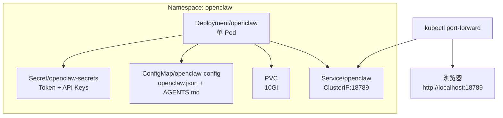
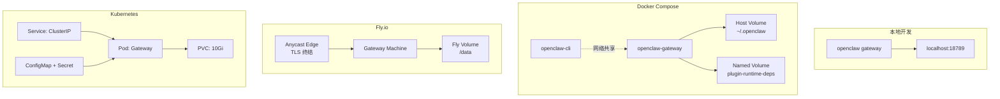

# 第 25 章 — 生产部署：从单机到 Kubernetes 的架构演进

读完这章你能学到：OpenClaw Gateway 从开发机到生产环境的完整部署路径，包括本地安装、Docker 容器化、Fly.io/Hetzner 云平台部署和 Kubernetes 编排，以及各方案的架构差异和工程取舍。

## 25.1 本地安装：最短路径跑起来

OpenClaw 的本地安装没有隐藏的复杂性——它本质上是一个 Node.js 项目，`npm install` 后就能运行。

### 包管理器的选择

OpenClaw 官方使用 pnpm 作为包管理器，但 npm 和 bun 同样可用。源码中的构建脚本对三者都做了兼容处理：

```bash
# pnpm（官方推荐）
pnpm install
pnpm openclaw gateway

# npm
npm install
npx openclaw gateway

# bun（注意：ARM/Synology 架构下部分原生模块可能失败）
bun install
bunx openclaw gateway
```

Dockerfile 中设置了一个关键环境变量（`Dockerfile:112`）：

```dockerfile
ENV OPENCLAW_PREFER_PNPM=1
```

这是因为 Bun 在 ARM 架构和 Synology NAS 等边缘平台上编译原生模块时可能失败，pnpm 是更可靠的默认选择。

### openclaw onboard 引导流程

首次安装后运行 `openclaw onboard`，系统会依次引导：

1. 选择模型 Provider 并配置 API Key
2. 生成 Gateway 认证 Token
3. 启动 Gateway 守护进程

这个流程在 Docker 部署中同样存在，只是由 `scripts/docker/setup.sh` 自动化完成。setup 脚本的核心逻辑是构建镜像后，通过 `openclaw-gateway` 容器执行 onboard 命令（`scripts/docker/setup.sh:28-32`）：

```bash
run_docker_build() {
  docker_build_exec "$@"
}
```

### 状态目录结构

不管哪种安装方式，OpenClaw 的运行时状态都集中在一个目录里：

```
~/.openclaw/
├── openclaw.json          # 主配置文件
├── credentials/           # Channel/Provider 认证凭据
├── workspace/             # Agent 工作区
├── agents/                # 各 Agent 的独立配置
│   └── <agentId>/
│       └── agent/
│           └── auth-profiles.json
└── sessions/              # 会话数据
```

这个目录结构对后续的容器化部署很关键——你需要持久化的就是这整个目录。

## 25.2 Docker 部署：容器化的 Gateway

### docker-compose.yml 逐行解析

OpenClaw 的 Docker Compose 配置定义了两个服务：`openclaw-gateway` 和 `openclaw-cli`。先看 Gateway 服务的核心部分（`docker-compose.yml:1-70`）：

```yaml
services:
  openclaw-gateway:
    image: ${OPENCLAW_IMAGE:-openclaw:local}
    environment:
      HOME: /home/node
      TERM: xterm-256color
      OPENCLAW_GATEWAY_TOKEN: ${OPENCLAW_GATEWAY_TOKEN:-}
      OPENCLAW_PLUGIN_STAGE_DIR: /var/lib/openclaw/plugin-runtime-deps
      TZ: ${OPENCLAW_TZ:-UTC}
    volumes:
      - ${OPENCLAW_CONFIG_DIR}:/home/node/.openclaw
      - ${OPENCLAW_WORKSPACE_DIR}:/home/node/.openclaw/workspace
      - openclaw-plugin-runtime-deps:/var/lib/openclaw/plugin-runtime-deps
    extra_hosts:
      - "host.docker.internal:host-gateway"
    ports:
      - "${OPENCLAW_GATEWAY_PORT:-18789}:18789"
      - "${OPENCLAW_BRIDGE_PORT:-18790}:18790"
    init: true
    restart: unless-stopped
    command:
      ["node", "dist/index.js", "gateway", "--bind",
       "${OPENCLAW_GATEWAY_BIND:-lan}", "--port", "18789"]
```

几个关键设计决策：

**三组挂载，各司其职。** `OPENCLAW_CONFIG_DIR` 挂载主配置目录，`OPENCLAW_WORKSPACE_DIR` 挂载工作区（Agent 的文件操作都在这里），`openclaw-plugin-runtime-deps` 是一个 Docker Named Volume，用于存储插件运行时依赖。前两个必须映射到宿主机路径以便持久化和编辑，第三个用 Named Volume 足矣——它是自动管理的缓存。

**`extra_hosts` 映射。** `host.docker.internal:host-gateway` 解决了一个实际问题：当你在宿主机上运行 Ollama 或 LM Studio 等本地模型服务时，容器内的 Gateway 需要通过 `http://host.docker.internal:11434` 访问宿主机端口。Docker Desktop 自带这个别名，Linux Docker Engine 需要显式配置。

**`init: true`。** 使用 tini 作为 PID 1，防止僵尸进程——Node.js 应用在容器中运行时的标准做法。

**默认绑定 `lan`（0.0.0.0）。** 注意 Compose 文件中 `--bind` 默认值是 `lan`，而 Dockerfile 中的默认 CMD 绑定的是 loopback。这是因为 Docker bridge 网络模式下，绑定 127.0.0.1 会导致宿主机无法访问容器内的 Gateway。Compose 文件通过 `OPENCLAW_GATEWAY_BIND` 环境变量覆盖了这个默认值。

### CLI 容器的网络共享

第二个服务 `openclaw-cli` 的网络配置值得关注（`docker-compose.yml:72-101`）：

```yaml
openclaw-cli:
  network_mode: "service:openclaw-gateway"
  cap_drop:
    - NET_RAW
    - NET_ADMIN
  security_opt:
    - no-new-privileges:true
  entrypoint: ["node", "dist/index.js"]
  depends_on:
    - openclaw-gateway
```

`network_mode: "service:openclaw-gateway"` 让 CLI 容器共享 Gateway 容器的网络命名空间，这样 CLI 可以直接通过 localhost 与 Gateway 通信，无需额外的网络配置。同时 `cap_drop` 和 `security_opt` 收紧了 CLI 容器的权限——CLI 不需要网络管理能力。

### 健康检查

Gateway 内置了健康检查端点，docker-compose.yml 中配置了基于 HTTP 的探活（`docker-compose.yml:60-69`）：

```yaml
healthcheck:
  test: ["CMD", "node", "-e",
    "fetch('http://127.0.0.1:18789/healthz').then((r)=>process.exit(r.ok?0:1)).catch(()=>process.exit(1))"]
  interval: 30s
  timeout: 5s
  retries: 5
  start_period: 20s
```

Gateway 提供四个探测端点：`/healthz`（存活探针）、`/readyz`（就绪探针），以及它们的别名 `/health` 和 `/ready`。用 `node -e fetch(...)` 而不是 curl 做探测是因为 Node.js 一定存在于容器中，而 curl 需要额外安装。

### 多阶段构建的镜像优化

Dockerfile 采用四阶段构建（`Dockerfile:1-290`），值得逐个理解：


**Stage 1: ext-deps。** 只复制启用的插件的 `package.json`，避免不相关的插件源码变更触发构建层缓存失效。这是一个巧妙的层缓存优化——插件源码改动频繁，但 `package.json` 相对稳定。

**Stage 2: build。** 在完整的 `node:24-bookworm` 上安装 Bun（构建脚本需要）、pnpm、所有依赖，执行构建。`NODE_OPTIONS=--max-old-space-size=2048` 防止低内存 VPS 上 OOM（`Dockerfile:72`）。

**Stage 3: runtime-assets。** 在构建产物上运行 `pnpm prune --prod`，删除开发依赖和类型声明文件。

**Stage 4: runtime。** 基于 `bookworm-slim`，只复制运行时必需的文件。以 `node` 用户（UID 1000）运行，是安全加固的标准做法（`Dockerfile:273`）：

```dockerfile
USER node
```

最终镜像还支持三个可选构建参数：

| 构建参数 | 作用 | 体积影响 |
|---------|------|---------|
| `OPENCLAW_INSTALL_BROWSER=1` | 预装 Chromium + Xvfb | +300MB |
| `OPENCLAW_INSTALL_DOCKER_CLI=1` | 安装 Docker CLI（sandbox 需要） | +50MB |
| `OPENCLAW_DOCKER_APT_PACKAGES` | 自定义系统包 | 取决于包 |

## 25.3 云平台部署

### Fly.io：Persistent Volume + 自动 HTTPS

Fly.io 是 OpenClaw 官方推荐的云部署目标之一。`fly.toml` 配置精炼（`fly.toml:1-35`）：

```toml
app = "openclaw"
primary_region = "iad"

[build]
dockerfile = "Dockerfile"

[env]
NODE_ENV = "production"
OPENCLAW_STATE_DIR = "/data"
NODE_OPTIONS = "--max-old-space-size=1536"

[processes]
app = "node dist/index.js gateway --allow-unconfigured --port 3000 --bind lan"

[http_service]
internal_port = 3000
force_https = true
auto_stop_machines = false
auto_start_machines = true
min_machines_running = 1

[[vm]]
size = "shared-cpu-2x"
memory = "2048mb"

[mounts]
source = "openclaw_data"
destination = "/data"
```

几个要点：

**`auto_stop_machines = false`。** Gateway 维护着 WebSocket 长连接（和各 Channel 的持久连接），不能被自动停机。如果设为 true，空闲时机器停止会断开所有 Channel 连接，导致消息丢失。

**`min_machines_running = 1`。** 保证至少一个实例始终运行，配合 `auto_stop_machines = false` 确保 Gateway 的持续可用性。

**Persistent Volume。** Fly Volume 挂载到 `/data`，环境变量 `OPENCLAW_STATE_DIR` 指向同一路径。所有配置、会话、Agent 状态都持久化在这里。Fly Volume 是单 AZ 的——如果你选了 `iad` 区域，Volume 只在该区域可用。

**`force_https = true`。** Fly 的 Anycast 边缘自动提供 TLS 终结。Gateway 内部监听 HTTP（端口 3000），外部全走 HTTPS。

### Hetzner VPS：全控制的自托管方案

Hetzner 部署代表了另一种思路——在一台 VPS 上获得完全控制权。核心思想是 Docker + SSH 隧道（`docs/install/hetzner.md`）：

```
+--[ 你的笔记本 ]--+     SSH 隧道     +--[ Hetzner VPS ]--+
|                  | ──────────────── |                    |
| 浏览器           |                  | Docker Engine      |
| localhost:18789  |                  |   └─ Gateway       |
+------------------+                  |      ├─ ~/.openclaw|
                                      |      └─ /workspace |
                                      +--------------------+
```

安全模型的关键约束：Gateway 不直接暴露端口到公网，通过 SSH 端口转发访问 Control UI。如果需要公网访问（比如 Telegram Webhook 回调），使用 Gateway Token 认证 + TLS。

### Render：一键部署

`render.yaml` 展示了最简化的部署描述（`render.yaml:1-19`）：

```yaml
services:
  - type: web
    name: openclaw
    runtime: docker
    plan: starter
    healthCheckPath: /health
    envVars:
      - key: OPENCLAW_GATEWAY_TOKEN
        generateValue: true
    disk:
      name: openclaw-data
      mountPath: /data
      sizeGB: 1
```

Render 自动生成 Gateway Token——`generateValue: true` 在首次部署时创建一个随机值并存入环境变量。Disk 挂载和 Fly Volume 的作用相同：持久化状态。

## 25.4 Kubernetes 部署考量

Kubernetes 部署是所有方案中最复杂的，也是工程取舍最密集的。OpenClaw 官方提供了 Kustomize manifests（不是 Helm Chart），理由很朴实：OpenClaw 是单容器应用，有趣的定制在 Agent 内容（Markdown、Skills、配置覆盖）而不在基础设施模板。

### 部署的资源拓扑



### Stateful Gateway 的单副本限制

这是 Kubernetes 部署中最关键的架构约束。Gateway 是一个有状态的单进程服务：

1. **WebSocket 连接状态。** 每个连接的 Channel（WhatsApp、Telegram、Discord 等）都维护着持久连接或轮询状态，这些状态在进程内存中。
2. **Session 状态。** Agent 的会话上下文、对话历史在运行时缓存于内存，虽然最终持久化到磁盘，但活跃会话依赖内存状态。
3. **Plugin 注册表。** 所有已加载插件的运行时注册信息（hooks、tools、providers）是全局单例。

这意味着你不能简单地将 Deployment replicas 设为 2——两个 Gateway 实例会各自维护独立的 Channel 连接，导致消息重复或丢失。

**解决方案是保持单副本，使用 Recreate 更新策略：**

```yaml
spec:
  replicas: 1
  strategy:
    type: Recreate    # 不是 RollingUpdate
```

Recreate 策略在更新时先终止旧 Pod 再创建新 Pod，确保任何时刻只有一个 Gateway 实例。代价是更新期间会有短暂的服务中断，但对于个人助手或小团队的 Gateway，这通常可以接受。

### 存储的选择

PVC 需要 ReadWriteOnce (RWO) 访问模式就够了——反正只有一个 Pod。默认配置申请 10Gi：

```yaml
apiVersion: v1
kind: PersistentVolumeClaim
metadata:
  name: openclaw-data
spec:
  accessModes:
    - ReadWriteOnce
  resources:
    requests:
      storage: 10Gi
```

如果未来需要水平扩展（比如多实例负载均衡），需要 RWX（ReadWriteMany）存储——但那需要先解决上面的状态共享问题，目前不在 OpenClaw 的架构设计中。

### 安全加固

K8s 部署的安全配置比 Docker Compose 更细致（`docs/install/kubernetes.md:175`）：

- `readOnlyRootFilesystem`：只读根文件系统
- `drop: ALL`：丢弃所有 Linux capabilities
- 非 root 用户（UID 1000）
- 默认绑定 loopback，只通过 `kubectl port-forward` 访问

如果要暴露到 Ingress 或 Load Balancer，需要将 Gateway 的 bind 从 `loopback` 改为非 loopback 地址，并确保 TLS 终结在 Ingress 层完成。

## 25.5 部署架构对比



| 维度 | 本地安装 | Docker Compose | Fly.io | Hetzner VPS | Kubernetes |
|------|---------|---------------|--------|-------------|------------|
| 适用场景 | 开发/测试 | 个人服务器 | 轻量生产 | 全控制生产 | 企业/团队 |
| 持久化 | 本地文件系统 | Host Volume | Fly Volume | Host 目录 | PVC |
| TLS | 手动/不需要 | 需要反向代理 | 自动 | SSH 隧道/手动 | Ingress |
| 更新方式 | 手动重启 | `docker compose up -d` | `fly deploy` | 手动 | `kubectl apply` |
| 运维复杂度 | 低 | 低 | 中 | 中 | 高 |
| 单实例限制 | 天然单实例 | 天然单实例 | 需配置 | 天然单实例 | 需 Recreate |

## 25.6 守护进程管理

在非容器化部署中，需要确保 Gateway 进程在系统重启后自动恢复。

### systemd（Linux）

```ini
[Unit]
Description=OpenClaw Gateway
After=network-online.target
Wants=network-online.target

[Service]
Type=simple
User=openclaw
WorkingDirectory=/opt/openclaw
ExecStart=/usr/bin/node dist/index.js gateway --bind lan --port 18789
Restart=always
RestartSec=5
Environment=NODE_ENV=production
Environment=HOME=/home/openclaw

[Install]
WantedBy=multi-user.target
```

### launchd（macOS）

```xml
<?xml version="1.0" encoding="UTF-8"?>
<!DOCTYPE plist PUBLIC "-//Apple//DTD PLIST 1.0//EN"
  "http://www.apple.com/DTDs/PropertyList-1.0.dtd">
<plist version="1.0">
<dict>
    <key>Label</key>
    <string>ai.openclaw.gateway</string>
    <key>ProgramArguments</key>
    <array>
        <string>/usr/local/bin/node</string>
        <string>/opt/openclaw/dist/index.js</string>
        <string>gateway</string>
    </array>
    <key>RunAtLoad</key>
    <true/>
    <key>KeepAlive</key>
    <true/>
    <key>WorkingDirectory</key>
    <string>/opt/openclaw</string>
</dict>
</plist>
```

OpenClaw 的 macOS 原生应用内置了 Gateway 管理，可以用 `openclaw gateway restart/status --deep` 代替手动配置 launchd。

## 25.7 监控和可观测性

### OpenTelemetry 集成

docker-compose.yml 中暴露了完整的 OTLP 配置（`docker-compose.yml:13-21`）：

```yaml
OTEL_EXPORTER_OTLP_ENDPOINT: ${OTEL_EXPORTER_OTLP_ENDPOINT:-}
OTEL_EXPORTER_OTLP_TRACES_ENDPOINT: ${OTEL_EXPORTER_OTLP_TRACES_ENDPOINT:-}
OTEL_EXPORTER_OTLP_METRICS_ENDPOINT: ${OTEL_EXPORTER_OTLP_METRICS_ENDPOINT:-}
OTEL_EXPORTER_OTLP_LOGS_ENDPOINT: ${OTEL_EXPORTER_OTLP_LOGS_ENDPOINT:-}
OTEL_EXPORTER_OTLP_PROTOCOL: ${OTEL_EXPORTER_OTLP_PROTOCOL:-http/protobuf}
OTEL_SERVICE_NAME: ${OTEL_SERVICE_NAME:-}
```

Gateway 支持通过 OTLP/HTTP 导出 traces、metrics 和 logs。Prometheus 指标通过 Gateway 自身的认证路由暴露，不需要额外端口。

### 健康检查端点

Gateway 提供的四个端点（`Dockerfile:285-288`）：

| 端点 | 用途 |
|-----|------|
| `GET /healthz` | 存活探针（liveness） |
| `GET /readyz` | 就绪探针（readiness） |
| `GET /health` | `/healthz` 别名 |
| `GET /ready` | `/readyz` 别名 |

在 Kubernetes 中，将 `/healthz` 配置为 livenessProbe，`/readyz` 配置为 readinessProbe。在 Render 中，`healthCheckPath: /health` 同时承担两个职责。

## 25.8 本章小结

OpenClaw 的部署架构围绕一个核心事实设计：Gateway 是一个有状态的单进程服务。这个约束贯穿了所有部署方案——Docker 的 Volume 挂载、Fly.io 的 `auto_stop_machines = false`、Kubernetes 的 Recreate 策略，都是对这个约束的工程回应。

理解了这一点，选择部署方案就是在运维复杂度和控制粒度之间做取舍：Docker Compose 适合个人使用，Fly.io 适合想要托管但不想管服务器的场景，Hetzner VPS 适合需要全控制权的生产部署，Kubernetes 适合已有 K8s 基础设施的团队。

## 练习

**思考题**

1. Gateway 是有状态的单进程服务，Session 数据存储在本地文件系统上。如果你要实现高可用部署（Gateway 进程挂了能自动恢复，不丢失 Session 数据），在 Docker、VPS、Kubernetes 三种部署方案下，分别应该怎么做？每种方案的 RTO（Recovery Time Objective）大约是多少？

**动手题**

2. 用 Docker Compose 部署 OpenClaw，配置 Volume 挂载使 Session 数据持久化。然后模拟一次故障恢复：停止容器，检查 Volume 中的 Session 文件是否完整，重新启动容器，确认之前的对话历史是否可以恢复。

3. 运行 `openclaw security audit` 检查你的部署配置。如果 Gateway 绑定了 `0.0.0.0`（而不是 `127.0.0.1`），审计工具会给出什么级别的警告？根据你的实际网络环境，判断这个警告是否需要处理。
