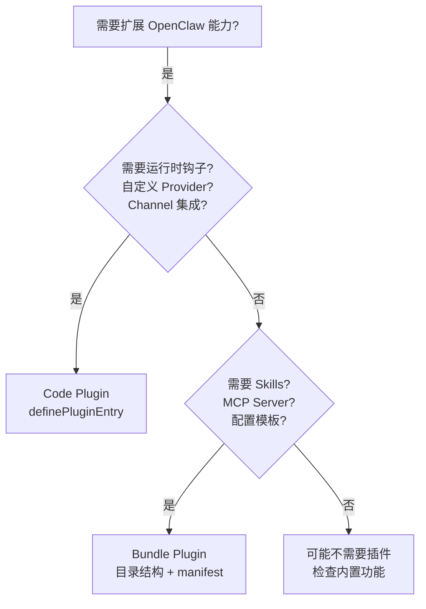
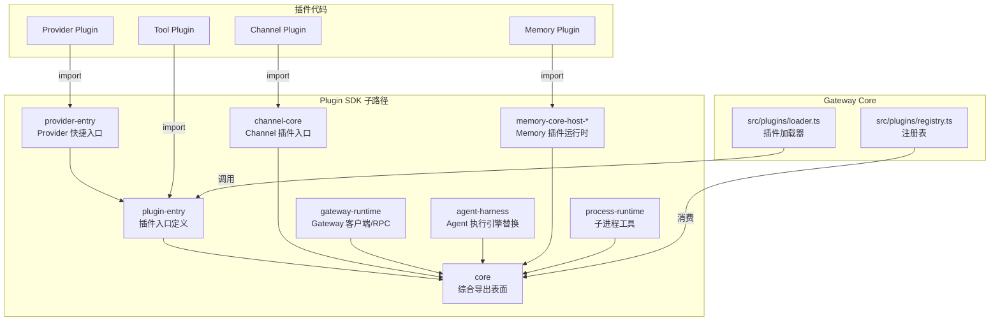
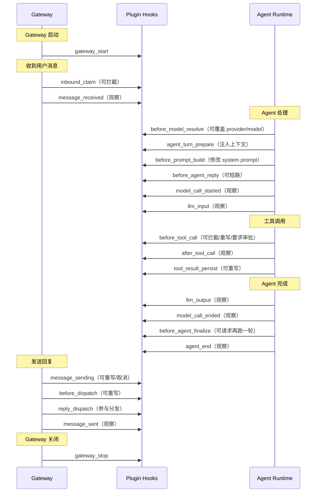
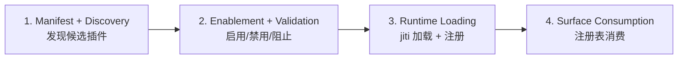
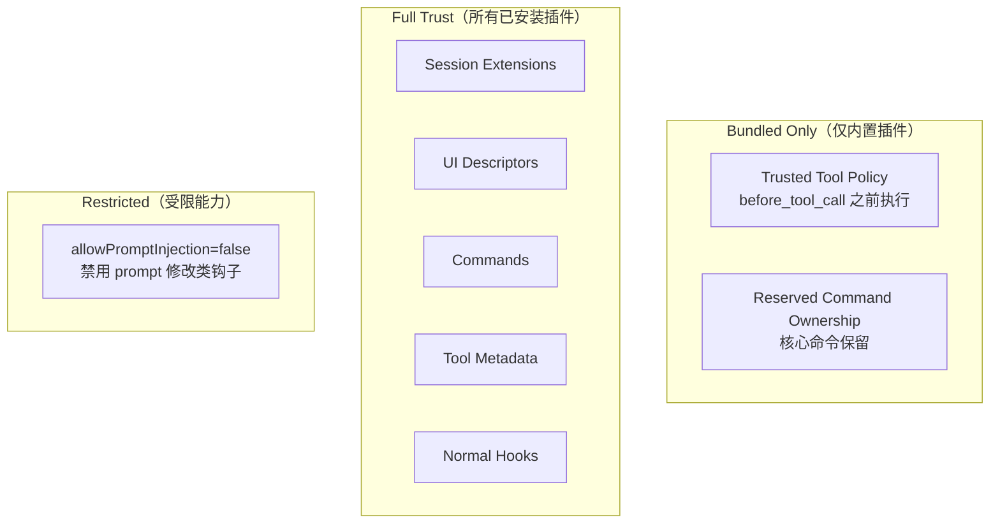

# 第 26 章 — Plugin 与 Extension 开发：扩展 Gateway 能力

读完这章你能学到：OpenClaw 插件系统的完整架构，包括两种插件风格的设计哲学、Plugin SDK 的模块划分、生命周期钩子的执行时序，以及 jiti 运行时加载机制的实现细节。

## 26.1 两种插件风格

OpenClaw 的 VISION.md 明确定义了两种插件风格：

> There are two broad plugin styles:
> - Code plugins run OpenClaw plugin code and are appropriate for deeper runtime extension.
> - Bundle-style plugins package stable external surfaces such as skills, MCP servers, and related configuration.

这不是随意的分类，而是沿着"运行时权限"这条轴线做出的设计切分。

### Code Plugins：进程内扩展

Code plugins 在 Gateway 进程内执行，可以注册 providers、channels、hooks、tools、services 等能力。它们通过 `register(api)` 回调获得一个 `OpenClawPluginApi` 对象，进而操作 Gateway 的运行时注册表。

一个最小的 Code plugin 长这样（引自 `docs/plugins/building-plugins.md`）：

```typescript
import { definePluginEntry } from "openclaw/plugin-sdk/plugin-entry";

export default definePluginEntry({
  id: "my-plugin",
  name: "My Plugin",
  description: "Adds a custom tool to OpenClaw",
  register(api) {
    api.registerTool({
      name: "my_tool",
      description: "Does something useful",
      parameters: { type: "object", properties: {} },
      execute: async (params) => {
        return { result: "done" };
      },
    });
  },
});
```

Code plugin 的权限边界是进程级的——它和 Gateway 共享内存空间，可以注册 HTTP 路由、Gateway RPC 方法、后台服务，甚至替换 Agent 的执行引擎。

### Bundle-style Plugins：声明式扩展

Bundle plugins 不执行代码，而是打包稳定的外部资源：Skills 文件、MCP Server 配置、Agent 指令等。它们兼容 Codex/Claude/Cursor 的插件目录布局（`.codex-plugin/`、`.claude-plugin/`、`.cursor-plugin/`），通过 manifest 映射到 OpenClaw 的功能。

Bundle plugins 的安全边界更好——它们只提供数据，不注入运行时行为。VISION.md 中的指导原则是：

> Prefer bundle-style plugins when they can express the capability. They have a smaller, more stable interface and better security boundaries.

### 风格选择的决策树



## 26.2 Plugin SDK 的模块划分

Plugin SDK 位于 `src/plugin-sdk/`，是插件与核心之间的类型化契约。SDK 按职责分为多个子路径，每个子路径是一个独立的 ESM 模块。

### SDK 架构总览



### 各模块详解

**plugin-entry（`src/plugin-sdk/plugin-entry.ts`）**

插件入口的规范定义。`definePluginEntry` 函数接受 `id`、`name`、`description`、`register` 等字段，返回一个标准化的插件定义对象。核心实现只有 20 行（`src/plugin-sdk/plugin-entry.ts:254-279`）：

```typescript
export function definePluginEntry({
  id, name, description, kind,
  configSchema = emptyPluginConfigSchema,
  reload, nodeHostCommands, securityAuditCollectors, register,
}: DefinePluginEntryOptions): DefinedPluginEntry {
  const getConfigSchema = createCachedLazyValueGetter(configSchema);
  return {
    id, name, description,
    ...(kind ? { kind } : {}),
    ...(reload ? { reload } : {}),
    ...(nodeHostCommands ? { nodeHostCommands } : {}),
    ...(securityAuditCollectors ? { securityAuditCollectors } : {}),
    get configSchema() {
      return getConfigSchema();
    },
    register,
  };
}
```

`configSchema` 支持传入一个工厂函数，通过 `createCachedLazyValueGetter` 实现延迟求值并缓存——这对包含大量校验规则的 Provider 插件来说，避免了不必要的 schema 解析开销。

**channel-core（`src/plugin-sdk/channel-core.ts`）**

Channel 插件的入口。`defineChannelPluginEntry` 是对 `definePluginEntry` 的封装，自动调用 `api.registerChannel({ plugin })` 并支持分阶段注册（`src/plugin-sdk/channel-core.ts:11-29`）：

```typescript
export const createChannelPluginBase = (params) =>
  createChannelPluginBaseFromCore(params);

export {
  buildChannelConfigSchema,
  buildChannelOutboundSessionRoute,
  buildThreadAwareOutboundSessionRoute,
  defineChannelPluginEntry,
  defineSetupPluginEntry,
  // ...
} from "./core.js";
```

Channel 插件有两个注册阶段：`registerCliMetadata`（CLI 元数据，非激活式）和 `registerFull`（完整运行时，仅在 `registrationMode === "full"` 时执行）。这个分阶段设计确保了 CLI help 和 discovery 快照可以在不加载完整插件运行时的情况下工作。

**provider-entry（`src/plugin-sdk/provider-entry.ts`）**

Provider 插件的快捷入口。封装了 `definePluginEntry` + `api.registerProvider(...)` + API Key 认证方法 + 模型目录的标准化流程（`src/plugin-sdk/provider-entry.ts:1-64`）：

```typescript
export type SingleProviderPluginOptions = {
  id: string;
  name: string;
  description: string;
  provider?: {
    id?: string;
    label: string;
    docsPath: string;
    auth?: SingleProviderPluginApiKeyAuthOptions[];
    catalog: SingleProviderPluginCatalogOptions;
  };
  register?: (api: OpenClawPluginApi) => void;
};
```

大多数 Provider 插件只需填写这个结构体，不用手动处理认证流程和模型发现逻辑。

**gateway-runtime（`src/plugin-sdk/gateway-runtime.ts`）**

暴露 Gateway 客户端和 RPC 工具给需要与 Gateway 交互的插件。主要导出 `GatewayClient`、协议相关的 `ErrorCodes`、`errorShape`，以及 `resolveGatewayAuth` 等鉴权工具（`src/plugin-sdk/gateway-runtime.ts:1-27`）：

```typescript
export { GatewayClient } from "../gateway/client.js";
export { ErrorCodes, errorShape } from "../gateway/protocol/index.js";
export { ensureGatewayStartupAuth } from "../gateway/startup-auth.js";
export { resolveGatewayAuth } from "../gateway/auth.js";
```

**agent-harness（`src/plugin-sdk/agent-harness.ts`）**

实验性接口，允许插件替换 OpenClaw 默认的 Agent 执行引擎。整个模块只有两行导出（`src/plugin-sdk/agent-harness.ts:3-5`）：

```typescript
export * from "./agent-harness-runtime.js";
export { createOpenClawCodingTools } from "../agents/pi-tools.js";
```

Agent harness 插件可以接管整个 Agent 循环——从接收用户消息到产生回复的完整过程。这是插件系统中权限最大的扩展点。

**memory-core-host-runtime-core**

Memory 插件的运行时核心，导出内存引擎的注册、查询、嵌入等接口。Memory 是一个独占插槽——同一时刻只能有一个 memory 插件处于活跃状态（`VISION.md:75-76`）：

> Memory is a special plugin slot where only one memory plugin can be active at a time.

**process-runtime（`src/plugin-sdk/process-runtime.ts`）**

给需要启动子进程的插件用的工具集，导出 `exec` 等进程管理工具和 Linux OOM score 调整能力。

### SDK 子路径的设计原则

SDK 的边界规范记录在 `src/plugin-sdk/CLAUDE.md` 中，核心原则有三条：

1. **宿主加载插件，插件不穿透 SDK 到宿主内部。** 插件通过 SDK 子路径获得能力，不能直接 import `src/agents/**`、`src/channels/**` 等核心模块。
2. **窄子路径优于宽桶导出。** 每个子路径只解决一个能力需求，避免 `import * from "openclaw/plugin-sdk"` 这种拉进整个 SDK 的做法。
3. **SDK 入口在模块加载时必须轻量。** 如果某个 helper 只在异步路径（发送、监控、探测）上需要，放到专门的 `*.runtime` 子路径，不要通过热路径的 barrel 导出。

## 26.3 Plugin 生命周期钩子

插件通过 `api.on(hookName, handler, opts?)` 注册生命周期钩子。钩子按优先级降序执行，同优先级保持注册顺序。

### 钩子执行时序

一次完整的 Gateway 启动到响应消息的钩子触发顺序：



### 钩子分类

钩子分为两类：**决策型**和**观察型**。

**决策型钩子**可以改变执行流程——拦截、重写、要求审批或取消操作。源码中定义了完整的决策型钩子列表（`src/plugins/hook-types.ts:70-105`）：

```typescript
export type PluginHookName =
  | "before_model_resolve"      // 覆盖 provider/model
  | "before_agent_reply"        // 短路回复
  | "before_agent_finalize"     // 请求额外的模型调用
  | "before_tool_call"          // 拦截/重写/审批
  | "tool_result_persist"       // 重写工具结果
  | "before_message_write"      // 拦截消息写入
  | "inbound_claim"             // 拦截入站消息
  | "message_sending"           // 重写/取消出站消息
  | "before_dispatch"           // 重写分发
  | "reply_dispatch"            // 参与分发管道
  | "before_install"            // 拦截安装
  // ...观察型钩子省略
```

**观察型钩子**只接收事件通知，不能改变执行流程：`message_received`、`message_sent`、`model_call_started`/`ended`、`llm_input`/`output`、`agent_end`、`session_start`/`end` 等。

### before_tool_call 的审批机制

`before_tool_call` 是插件系统中最有实战价值的钩子之一。它的返回类型展示了精细的控制粒度（`docs/plugins/hooks.md:129-144`）：

```typescript
type BeforeToolCallResult = {
  params?: Record<string, unknown>;   // 重写工具参数
  block?: boolean;                     // 直接拦截
  blockReason?: string;                // 拦截原因
  requireApproval?: {                  // 要求人工审批
    title: string;
    description: string;
    severity?: "info" | "warning" | "critical";
    timeoutMs?: number;
    timeoutBehavior?: "allow" | "deny";
  };
};
```

`block: true` 是终结性的——跳过所有低优先级的 handler。`requireApproval` 会暂停工具执行，等待操作者通过 Control UI 或其他审批通道做出决定。

### before_agent_start 的兼容性定位

`before_agent_start` 是最早的插件钩子，也是目前标记为 legacy 的钩子。它把模型选择和 prompt 修改混在一起。新的架构将它拆分为两个独立关注点（`docs/plugins/architecture.md:91-99`）：

- `before_model_resolve`：处理 model/provider 覆盖
- `before_prompt_build`：处理 prompt 修改

`before_agent_start` 仍然完全支持——真实世界的外部插件依赖它。但新插件应该使用拆分后的钩子。

## 26.4 Extension 的加载机制

### jiti 运行时加载

OpenClaw 使用 [jiti](https://github.com/unjs/jiti) 在运行时加载 TypeScript 插件源码。jiti 是一个运行时 TypeScript/ESM 转换器，让 `.ts` 文件可以直接被 Node.js import，无需预编译。

加载器的核心在 `src/plugins/jiti-loader-cache.ts`（`src/plugins/jiti-loader-cache.ts:1-60`）：

```typescript
import { createJiti } from "jiti";

export function getCachedPluginJitiLoader(params: {
  cache: PluginJitiLoaderCache;
  modulePath: string;
  importerUrl: string;
  preferBuiltDist?: boolean;
  pluginSdkResolution?: PluginSdkResolutionPreference;
  cacheScopeKey?: string;
}): PluginJitiLoader {
  // 按 jitiFilename + cacheScopeKey 缓存 loader 实例
  const jitiFilename = toSafeImportPath(params.jitiFilename ?? params.modulePath);
  // ...缓存逻辑
}
```

关键设计：每个插件的加载路径对应一个缓存的 jiti 实例，避免重复创建。jiti 实例的配置包括 SDK 别名映射（让 `openclaw/plugin-sdk/*` 解析到正确路径）和原生模块加载策略。

当插件提供了编译后的 `.js` 文件时（通过 `package.json` 中的 `runtimeExtensions` 字段），加载器优先使用编译产物，跳过运行时转译。这是 npm 发布的插件推荐的做法——源码入口供开发时用，编译入口供生产用。

### 四阶段加载流水线

插件加载不是一次性完成的，而是分四个阶段（`docs/plugins/architecture.md:118-131`）：



**阶段 1：发现。** 从配置路径、workspace 根目录、全局插件目录、bundled 插件中搜索候选插件。读取 `openclaw.plugin.json` manifest。这个阶段不执行任何插件代码。

**阶段 2：验证。** 根据配置决定每个候选插件的状态：enabled（启用）、disabled（禁用）、blocked（被 `plugins.deny` 阻止）、或被选入独占插槽（如 memory）。验证基于 manifest 元数据完成，不需要执行插件代码。

**阶段 3：运行时加载。** 通过 jiti 加载插件的 entry 模块，调用 `register(api)` 回调，将能力注册到中央注册表。Bundle 插件在这个阶段被归一化为注册表记录，不导入运行时代码。

**阶段 4：消费。** Gateway 的其他模块从注册表读取已注册的 tools、channels、providers、hooks、HTTP routes、CLI commands 和 services。

这个分阶段设计的核心意图是：让配置验证、UI 提示、schema 生成等"冷路径"操作可以在完整运行时启动之前完成。用 CLAUDE.md 的话说（`src/plugins/CLAUDE.md`）：

> manifest/config validation should work from manifest/schema metadata without executing plugin code

### registrationMode 的三种模式

`register(api)` 回调中的 `api.registrationMode` 有三种值：

| 模式 | 触发场景 | 允许的操作 |
|------|---------|-----------|
| `"full"` | Gateway 正常启动 | 所有注册操作 |
| `"cli-metadata"` | CLI help / 命令发现 | 仅 `registerCli` |
| `"discovery"` | 非激活式快照构建 | 静态元数据注册 |

Channel 插件利用这个机制实现懒加载：在 `"cli-metadata"` 和 `"discovery"` 模式下只注册 CLI 描述符，在 `"full"` 模式下才建立网络连接和注册完整运行时。

## 26.5 核心与扩展的边界原则

OpenClaw 的架构指南用一句话概括了边界原则（`AGENTS.md`）：

> Core stays extension-agnostic. No bundled ids in core when manifest/registry/capability contracts work.

这条规则在代码中的体现无处不在。

### 边界的实施方式

**扩展只能通过 SDK 跨入核心。** 插件不能直接 import `src/agents/**`、`src/channels/**`、`src/plugins/**` 等核心模块，只能通过 `openclaw/plugin-sdk/*` 子路径获取能力。在运行时，加载器通过 jiti 的别名映射强制执行这个约束。

**核心不知道具体扩展的存在。** 核心代码中不会出现 `if (pluginId === "telegram")` 这样的硬编码。Provider 认证、Channel 路由、工具注册都通过通用契约完成——manifest metadata、capability registration、injected runtime helpers。

**独占插槽用声明式元数据，不用运行时检测。** Memory 插件是独占插槽的典型例子：通过 `kind: "memory"` 声明，由配置系统（不是运行时代码）决定哪个 memory 插件生效。

### extensionAPI.ts 的兼容桥

`src/extensionAPI.ts` 是一个有趣的历史遗留（`src/extensionAPI.ts:1-33`）：

```typescript
if (shouldWarnExtensionApiImport) {
  process.emitWarning(
    "openclaw/extension-api is deprecated. Migrate to api.runtime.agent.* " +
    "or focused openclaw/plugin-sdk/<subpath> imports.",
    {
      code: "OPENCLAW_EXTENSION_API_DEPRECATED",
      detail: "This compatibility bridge is temporary.",
    },
  );
}
```

这个文件是旧插件 API 到新 Plugin SDK 的兼容桥。它只重新导出了少量基础工具（`resolveAgentDir`、`DEFAULT_MODEL`、`resolveAgentIdentity` 等），并在非测试环境下打印弃用警告。新插件应该直接使用 `openclaw/plugin-sdk/<subpath>` 的窄导入。

### 插件配置的信任边界

插件系统在配置层也有明确的信任分级。从源码中的 `PluginHookName` 类型和文档可以提炼出三级信任模型：



Trusted Tool Policy 在普通的 `before_tool_call` 钩子之前执行，参与宿主安全策略——这个能力只开放给 bundled（内置）插件，第三方插件无法注册。

## 26.6 插件的发现与分发

### ClawHub：官方插件市场

插件的发现、官方发布者认证、来源追溯和安全审查由 [ClawHub](https://clawhub.ai/) 负责。安装时 OpenClaw 优先查询 ClawHub，找不到再回退到 npm：

```bash
# ClawHub 优先，自动回退 npm
openclaw plugins install @openclaw/voice-call

# 显式指定来源
openclaw plugins install clawhub:@openclaw/voice-call
openclaw plugins install npm:my-custom-plugin
```

### 插件的形态分类

Gateway 在运行时将每个已加载的插件分类为一种"shape"（`docs/plugins/architecture.md:69-85`）：

| Shape | 含义 | 判定依据 |
|-------|------|---------|
| `plain-capability` | 注册了单一能力类型 | 如只注册 Provider 的 `mistral` |
| `hybrid-capability` | 注册了多种能力类型 | 如同时注册 text inference + speech + image 的 `openai` |
| `hook-only` | 只注册了钩子 | 无 capability、tool、command、service |
| `non-capability` | 注册了 tool/command/service 但无 capability | 辅助工具类插件 |

用 `openclaw plugins inspect <id>` 可以查看任何插件的 shape 和能力明细。

## 26.7 本章小结

OpenClaw 的插件系统沿着三条设计轴线展开：

**权限轴线**——Code plugins 拥有进程内的完整能力，Bundle plugins 只提供声明式数据。选择哪种风格取决于你需要多深的运行时控制。

**生命周期轴线**——从 `gateway_start` 到 `gateway_stop`，覆盖 Agent turn、工具调用、消息分发、会话管理的完整链路。30 个钩子点分为决策型和观察型，开发者根据需要选择粒度。

**边界轴线**——核心与扩展通过 Plugin SDK 的窄子路径交互，核心不知道具体扩展的存在，扩展不穿透 SDK 到核心内部。这条规则由 jiti 加载器的别名映射在运行时强制执行。

理解了这三条轴线，就掌握了开发 OpenClaw 插件的设计框架。下一章将进入 OpenClaw 的生态体系，看看围绕这个插件系统已经生长出了什么。

## 练习

**思考题**

1. Plugin SDK 有 30 个生命周期钩子，分为决策型（能修改行为）和观察型（只读）。如果一个插件在 `before_tool_call` 钩子中执行了一个耗时的网络请求（比如向外部审批系统发送请求），这会阻塞整个工具调用链。你认为应该给钩子设置超时限制吗？超时后应该默认放行还是默认拒绝？两种选择各自的风险是什么？

2. 核心与扩展的边界由 jiti 加载器的别名映射在运行时强制执行——扩展不能直接 import 核心的内部模块。如果一个扩展开发者确实需要核心的某个内部功能，正确的做法是什么？这种严格隔离会不会成为生态发展的瓶颈？

**动手题**

3. 参考 `extensions/` 目录下任意一个现有的 Channel Extension 的代码结构，创建一个最简单的"echo" Plugin：它在 `after_agent_turn` 钩子中将 Agent 的回复打印到 Gateway 的控制台日志。验证该 Plugin 能被 Gateway 正确加载和执行。
