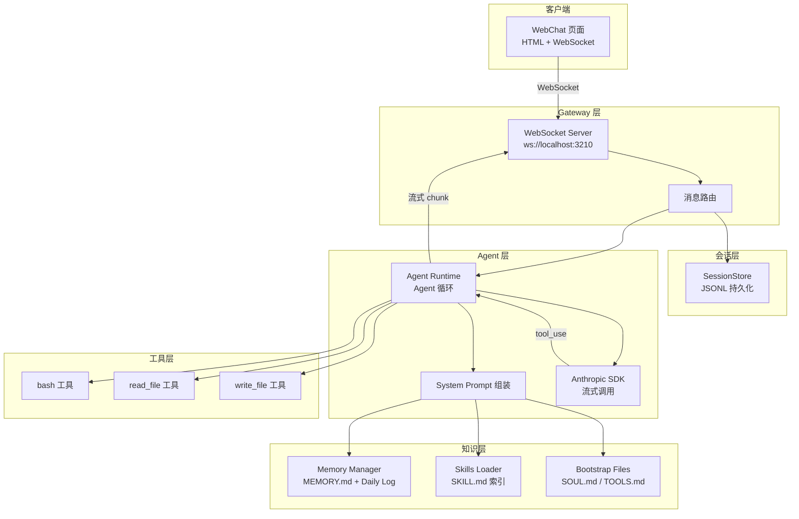

# 第 29 章 — Mini OpenClaw 架构设计

> 读完这章，你会清楚 Mini OpenClaw 要实现哪些核心能力、哪些可以简化、整体架构长什么样，以及技术选型的依据。这一章不写代码，只做设计。

前面 28 章，我们从 Gateway 到 Memory，从工具系统到 Skills，把 OpenClaw 的核心模块逐个拆解过了。现在到了动手的时候——从零实现一个精简版的 OpenClaw。

不是玩具 demo。是一个能跑通完整流程的最小系统：用户发消息、Gateway 接收、Agent 调用模型、模型调用工具、工具执行后回复用户。这条链路走通了，你就真正理解了一个 Agent 系统的骨架。

## 29.1 要实现什么

先列出 Mini OpenClaw 的能力清单，和 OpenClaw 原版做个对比：

| 能力 | OpenClaw | Mini OpenClaw |
|------|---------|---------------|
| Gateway | HTTP + WebSocket，支持认证、TLS、模型目录 | 纯 WebSocket，无认证 |
| Session | JSONL 持久化，支持归档、分叉、子 Agent 会话 | JSONL 持久化，单会话 |
| Agent Runtime | pi-coding-agent 驱动，嵌入式沙箱运行 | 直接调用 Anthropic SDK |
| System Prompt | 800+ 行，支持 prompt cache boundary | 100 行，核心结构保留 |
| 工具 | 数十个内置工具，分组管理 | 3 个：bash、read_file、write_file |
| Memory | 向量检索 + 嵌入模型 + 混合搜索 | 文件驱动：MEMORY.md + daily log |
| Skills | 多层级加载，frontmatter 元数据，按需加载 | 单目录扫描，frontmatter 解析 |
| 消息渠道 | 31 个 extension（Telegram、Discord、Slack...） | 1 个 WebChat |
| 插件系统 | plugin-sdk + extension API | 不实现 |
| 子 Agent | 完整的 spawn/supervision 体系 | 不实现 |
| 安全 | 沙箱、审计、安全审查 | 不实现 |

核心原则：保留架构骨架，砍掉工程复杂度。

## 29.2 哪些可以简化

OpenClaw 是一个生产级系统，它的大部分代码在处理边界情况。以 Gateway 为例：

OpenClaw 的 `src/gateway/server.impl.ts` 在启动时要做这些事：加载 TLS 配置、初始化认证（多种模式）、启动模型目录缓存、注册插件钩子、创建 cron 服务、初始化 WebSocket 运行时、设置健康检查、准备事件订阅…… 光 import 就有 100 行。

Mini OpenClaw 只需要：创建 WebSocketServer，处理连接，路由消息。三步。

同样的简化思路适用于每个模块：

**Session 管理**：OpenClaw 的会话系统（`src/gateway/session-transcript-files.fs.ts`）支持会话归档、分叉、子 Agent 关联、元数据维护等。Mini OpenClaw 只需要一个 `Map<sessionId, SessionMeta>` 加一个 JSONL 文件。

**System Prompt**：OpenClaw 的 system prompt 构建（`src/agents/system-prompt.ts`）是 800+ 行的大函数，要处理 prompt cache boundary（保证 KV 缓存命中）、provider 差异化适配、context file 排序、嵌入式沙箱信息等。Mini OpenClaw 只拼接身份、SOUL.md、工具说明和运行时信息。

**工具系统**：OpenClaw 的工具目录（`src/agents/tool-catalog.ts`）按 section 组织了几十个工具，每个工具都有 profile 配置、权限控制。Mini OpenClaw 只注册 3 个工具，用一个简单的 `Map<name, ToolDefinition>` 管理。

**Skills**：OpenClaw 的 Skills 加载器（`src/agents/skills/local-loader.ts`）要处理路径安全（symlink 检测）、多层级加载（用户级 + 项目级）、安装规格等。Mini OpenClaw 只扫描一个目录，读 frontmatter 提取 name 和 description。

## 29.3 整体架构



数据流：

1. 用户在 WebChat 输入消息，通过 WebSocket 发送到 Gateway
2. Gateway 将消息存入 Session（JSONL），然后交给 Agent Runtime
3. Agent Runtime 组装 System Prompt（加载 SOUL.md、Memory、Skills 索引），带上会话历史调用 Anthropic API
4. 如果模型返回 tool_use，Runtime 执行对应工具，将结果送回模型，循环直到模型返回纯文本
5. 最终回复通过 WebSocket 流式推送回客户端，同时存入 Session

## 29.4 技术选型

| 组件 | 选型 | 理由 |
|------|------|------|
| 运行时 | Node.js + TypeScript | 与 OpenClaw 保持一致，ESM 模块 |
| WebSocket | `ws` 库 | 最成熟的 Node.js WebSocket 实现 |
| LLM 调用 | `@anthropic-ai/sdk` | 官方 SDK，原生支持流式和 tool_use |
| 会话存储 | JSONL 文件 | 与 OpenClaw 一致，简单可靠 |
| 唯一 ID | `uuid` | 会话 ID 和连接 ID 生成 |
| 开发工具 | `tsx` | 开发阶段直接运行 TypeScript |

为什么不用 Express 或 Fastify？因为 Mini OpenClaw 没有 HTTP API 需求。Gateway 只需要 WebSocket，`ws` 库可以独立使用，不需要挂在 HTTP 框架上。OpenClaw 需要 HTTP 是因为它有控制面板 UI、MCP HTTP 端点、健康检查接口等——Mini OpenClaw 都不需要。

为什么用 JSONL 而不是 SQLite？OpenClaw 的会话存储就是 JSONL（参见第 6 章 Session 管理），每条消息一行，追加写入。这个格式有两个好处：一是写入快（append-only），二是人类可读。对于 Mini OpenClaw 的规模，JSONL 完全够用。

## 29.5 目录结构设计

```
mini-openclaw/
├── package.json
├── tsconfig.json
├── src/
│   ├── index.ts              # 入口：组装所有模块并启动
│   ├── config.ts             # 配置加载（环境变量 + 默认值）
│   ├── types.ts              # 核心类型定义
│   ├── gateway/
│   │   ├── server.ts         # WebSocket Gateway 服务
│   │   └── session-store.ts  # 会话存储（JSONL）
│   ├── agent/
│   │   ├── runtime.ts        # Agent 运行循环
│   │   └── system-prompt.ts  # System Prompt 组装
│   ├── tools/
│   │   ├── index.ts          # 工具注册中心
│   │   ├── bash.ts           # bash 工具
│   │   ├── read-file.ts      # 文件读取工具
│   │   └── write-file.ts     # 文件写入工具
│   ├── memory/
│   │   ├── manager.ts        # Memory 管理器
│   │   └── skills.ts         # Skills 加载器
│   └── channel/
│       └── webchat.html      # WebChat 客户端
```

对照 OpenClaw 的结构：

| Mini OpenClaw | OpenClaw 对应 |
|---------------|--------------|
| `src/gateway/server.ts` | `src/gateway/server.impl.ts` + 200+ 相关文件 |
| `src/gateway/session-store.ts` | `src/gateway/session-transcript-files.fs.ts` + `src/sessions/` |
| `src/agent/runtime.ts` | `src/agents/pi-embedded-runner/run/attempt.ts` |
| `src/agent/system-prompt.ts` | `src/agents/system-prompt.ts`（800+ 行） |
| `src/tools/` | `src/agents/tools/`（数十个工具） |
| `src/memory/manager.ts` | `src/memory/root-memory-files.ts` + 整个 memory 模块 |
| `src/memory/skills.ts` | `src/agents/skills/local-loader.ts` + skills 模块 |
| `src/channel/webchat.html` | `extensions/` 下的 31 个渠道插件 |

整个项目大约 800 行 TypeScript + 200 行 HTML/CSS/JS。比 OpenClaw 的几十万行精简了两个数量级，但核心架构完整保留。

## 29.6 五章路线图

| 章节 | 实现内容 | 对应 OpenClaw 模块 |
|------|---------|-------------------|
| 第 30 章 | Gateway + Session | `src/gateway/` |
| 第 31 章 | Agent Runtime + 工具 | `src/agents/` + `src/agents/tools/` |
| 第 32 章 | Memory + Skills | `src/memory/` + `src/agents/skills/` |
| 第 33 章 | WebChat 渠道 + 联调 | `extensions/` |

30 章搭骨架，31 章填大脑，32 章加记忆，33 章通前端。每章的代码都能独立编译运行，后一章在前一章的基础上增量添加。

下一章开始写代码。

## 练习

**思考题**

1. Mini OpenClaw 简化了很多 OpenClaw 的设计：去掉了 Lane-aware 队列、文件锁、多渠道支持、Plugin 系统等。如果你要从 Mini OpenClaw 开始，只添加一个特性使其更接近生产级别，你会优先加哪个？为什么？添加这个特性会对现有代码的哪些模块产生影响？

**动手题**

2. 阅读 Mini OpenClaw 的 `examples/mini-openclaw/` 目录结构，对照本章的架构图，确认每个源文件对应架构图中的哪个模块。画出你自己理解的模块依赖关系图（哪些模块 import 了哪些模块）。

3. 在 Mini OpenClaw 的目录结构设计基础上，规划一个新模块的位置：如果要添加一个简单的 Cron 定时任务功能（每隔 N 分钟让 Agent 执行一个预设指令），这个模块的代码应该放在哪个目录下？它需要与哪些现有模块交互？
