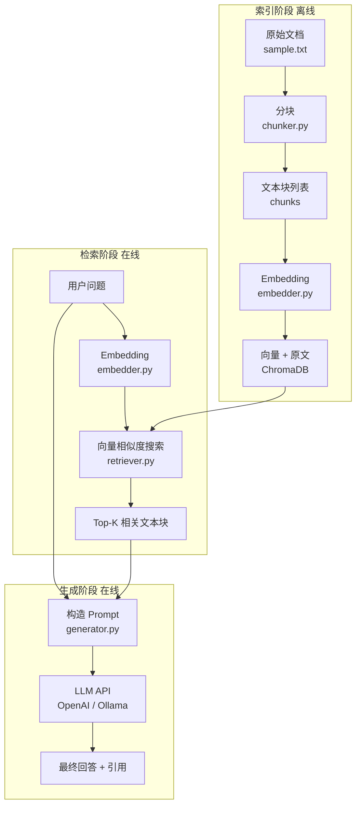

## 为什么需要 RAG

LLM 有两个根本性的缺陷，没有 RAG 很难在生产环境中放心使用。

**知识截止（Knowledge Cutoff）**：LLM 的训练数据有截止日期。GPT-4 的知识截止在 2023 年初，对于之后发生的事情它一无所知。如果要回答"最新版本的某框架怎么用"，模型要么给出过时答案，要么直接说不知道。

**幻觉（Hallucination）**：LLM 在训练时学习了"什么样的文字序列听起来合理"，而不是"什么是真的"。遇到不确定的问题时，模型会生成听起来正确但实际错误的内容，且语气依然自信。这在知识性问答场景中是致命的。

RAG 的解法：不要让 LLM 凭记忆回答，而是先从外部知识库检索相关内容，再把这些内容作为上下文提供给 LLM，让它"看着资料"回答问题。

这样：知识截止问题消失了（知识库可以随时更新）；幻觉大幅降低（模型有原文可以参考，且可以要求它"只根据提供的内容回答"）；回答可溯源（可以展示引用的原文片段，让用户自行核实）。

## RAG 架构

RAG 系统分三个阶段：



索引阶段只需执行一次。检索和生成是每次问答的在线流程，端到端延迟通常在 1~3 秒（向量检索 <100ms，LLM 生成约 1~2 秒）。

## 分块策略

LLM 的 context window 有限（通常 4K~128K token），不可能把整篇文档塞进 prompt。分块（Chunking）将长文档切成小段，每段是可以独立传递给 LLM 的信息单元。

分块有两个基本参数：

- **chunk_size**：每块的最大字符数（或 token 数）。太小则单块包含的上下文不足，太大则占用 prompt 空间多，可召回的块数少。常用值：256~1024 字符。
- **overlap**：相邻块之间的重叠字符数。防止关键信息落在块的边界处被切断。常用值：chunk_size 的 10%~20%。

```
文档原文：
|---------- chunk 1 (512 chars) ----------|
                          |--- overlap ---|---------- chunk 2 (512 chars) ---|
```

固定字符数分块简单高效，适合格式均匀的文本。按段落或句子分块语义更完整，但实现复杂，且段落长度差异大导致 embedding 质量不稳定。本章用固定字符数 + overlap 的方案，足够覆盖大多数场景。

## 检索排序

向量召回（dense retrieval）用余弦相似度找出语义最接近的块。召回 top-K 通常取 3~8 块，取决于 prompt 允许塞入多少上下文。

向量召回对语义理解强，但对精确关键词匹配弱（这和第 10 章语义搜索的特点一致）。

**重排序（Reranking）**是提升 RAG 精度的有效手段：用向量搜索召回 top-20 候选，再用 Cross-Encoder 模型（如 `cross-encoder/ms-marco-MiniLM-L-6-v2`）对每个（query, chunk）对打分，取分数最高的 top-4 送入 LLM。Cross-Encoder 的精度显著高于双塔 Embedding，但不能用于大规模检索（每次需对所有候选重新编码），因此只做第二阶段的精排。

本章不实现重排序，保持代码精简；`retriever.py` 的接口设计为后续插入重排序留有余地。

## Prompt 构造

RAG 的 prompt 构造有两个关键原则：

**明确限制来源**：在 system prompt 中强调"只根据提供的上下文回答，不要使用训练数据中的知识，如果上下文不包含答案，直接说不知道"。这是控制幻觉的核心指令，不能省略。

**控制 token 用量**：每个 chunk 约 512 字符。中文汉字的 token 效率因 tokenizer 而异：GPT 系列（cl100k_base）通常 1~2 token/字，LLaMA 系列（SentencePiece）对中文覆盖较弱，有时需要 2~3 token/字。英文单词通常对应 1~3 个 token，约 4 个字符≈1 个 token。取 4 块上下文，再加 system prompt 和问题，总输入约 2000~3000 token，留出足够空间给模型输出。精确计算建议用 `tiktoken`（GPT 系列）或模型对应的 tokenizer 实际测试，避免超出 context window。

prompt 模板结构：

```
[System]
你是一个问答助手。只根据下面提供的上下文内容回答问题。
如果上下文中没有相关信息，回答"根据提供的文档，无法回答该问题"。
不要编造信息。

[User]
上下文：
---
[chunk 1 原文]
---
[chunk 2 原文]
---
...
---
问题：[用户问题]
```

## 实现步骤

代码结构：

```
examples/
  chunker.py      # 文本分块
  embedder.py     # Embedding 封装
  retriever.py    # 向量存储与检索
  generator.py    # LLM 调用与回答生成
  main.py         # 命令行入口
  sample.txt      # 示例文档
  requirements.txt
```

### 文本分块（chunker.py）

`chunk_text(text, chunk_size=512, overlap=64)` 用滑动窗口切分：

- 从位置 0 开始，取 `chunk_size` 个字符作为第一块
- 下一块从位置 `chunk_size - overlap` 开始，保留 `overlap` 个字符的重叠
- 循环直到末尾

去掉空白块，返回字符串列表。

### Embedding 封装（embedder.py）

封装 `SentenceTransformer`，对外暴露两个函数：

- `embed_texts(texts)` — 批量编码，返回 shape=(n, 384) 的 numpy array，用于建索引
- `embed_query(query)` — 单条编码，返回 shape=(384,) 的 numpy array，用于查询

两个函数共用同一个模型实例（模块级单例），避免重复加载。

### 向量存储与检索（retriever.py）

`index_chunks(chunks, source_file)` 建立索引：

- 调用 `embedder.embed_texts()` 批量编码
- 用 `collection.upsert()` 写入 ChromaDB
- metadata 里记录 `source_file` 和块的序号，方便回答时显示来源

`retrieve(query, top_k=4)` 检索：

- 调用 `embedder.embed_query()` 编码查询
- 调用 `collection.query()` 获取 top-K 结果
- 返回 `{"text": ..., "score": ..., "source": ..., "chunk_id": ...}` 字典列表

### LLM 调用（generator.py）

`generate_answer(question, contexts)` 构造 prompt 并调用 API：

- `contexts` 是 `retrieve()` 返回的字典列表
- 将各 chunk 的 `text` 拼接成上下文段落
- 构造包含 system prompt 和 user prompt 的消息列表
- 调用 OpenAI SDK 的 `chat.completions.create()`

API 配置从环境变量读取：

```python
# 默认接 OpenAI，可替换为 Ollama 等兼容服务
OPENAI_BASE_URL = os.getenv("OPENAI_BASE_URL", "https://api.openai.com/v1")
OPENAI_API_KEY  = os.getenv("OPENAI_API_KEY", "")
OPENAI_MODEL    = os.getenv("OPENAI_MODEL", "gpt-3.5-turbo")
```

接入本地 Ollama 时，只需设置：

```bash
export OPENAI_BASE_URL=http://localhost:11434/v1
export OPENAI_API_KEY=ollama
export OPENAI_MODEL=llama3
```

`generate_answer_stream()` 是流式版本，返回一个 generator，逐块 yield 文本片段。生产环境中推荐使用流式调用——用户看到逐字输出比等待几秒后一次性显示体验好很多：

```python
for chunk in generate_answer_stream(question, contexts):
    print(chunk, end="", flush=True)
print()  # 换行
```

### 命令行入口（main.py）

```bash
python main.py --doc ./sample.txt
```

启动流程：

1. 读取 `--doc` 指定的文本文件
2. 调用 `chunk_text()` 分块
3. 调用 `index_chunks()` 建索引（已有索引则跳过）
4. 进入交互循环：读取问题 → `retrieve()` → `generate_answer()` → 打印回答和引用片段

输出格式（rich 美化）：

- 回答部分用白色面板显示
- 引用来源用暗色面板展示，每条显示相似度分数和原文片段（截断到 200 字符）

## 运行方式

```bash
cd examples
pip install -r requirements.txt

# 设置 OpenAI API Key（或本地 LLM 地址）
export OPENAI_API_KEY=sk-...
# 若使用 Ollama：
# export OPENAI_BASE_URL=http://localhost:11434/v1
# export OPENAI_API_KEY=ollama
# export OPENAI_MODEL=llama3

# 运行，指定文档
python main.py --doc ./sample.txt
```

交互示例：

```
文档已加载：sample.txt（共 6 个文本块）
索引构建完成

输入问题（输入 q 退出）: Transformer 是哪一年提出的？

╭─ 回答 ─────────────────────────────────────────────╮
│ Transformer 架构由 Google 团队在 2017 年提出，发表  │
│ 于论文《Attention Is All You Need》。               │
╰────────────────────────────────────────────────────╯

╭─ 引用来源 ─────────────────────────────────────────╮
│ [1] 相似度: 0.8921  来源: sample.txt               │
│ Transformer 模型由 Vaswani 等人于 2017 年在论文     │
│ 《Attention Is All You Need》中首次提出...          │
╰────────────────────────────────────────────────────╯
```

## 评估方式

RAG 系统的回答质量难以用单一指标衡量，常用三个维度：

**Faithfulness（忠实度）**：回答是否与检索到的上下文一致，没有引入上下文之外的信息。评估方式：将问题、上下文和回答一起发给 LLM，让它判断回答中每个陈述是否有上下文支撑。这也称为"幻觉检测"。

**Relevance（相关性）**：检索到的上下文是否真正与问题相关。评估方式：让 LLM 对每个 (question, chunk) 对打 0/1 分，计算 top-K 结果中相关 chunk 的比例（类似信息检索的 Precision@K）。

**Completeness（完整性）**：回答是否覆盖了问题要求的所有要点。评估方式：预先列出标准答案的关键点，检查回答是否逐一覆盖。

这三个指标对应 RAG 管线的不同环节：Faithfulness 主要取决于 LLM 和 prompt 设计；Relevance 取决于分块和检索质量；Completeness 取决于知识库覆盖度和 top-K 的取值。

初期不需要自动化评估框架，手动抽查 20-30 条回答——检查检索到的 chunk 是否相关、回答是否引入了不存在于原文的内容——往往就能发现主要问题。如果要自动化，RAGAS 是一个开源的 RAG 评估框架，实现了上述指标的自动化评估，可以直接集成到 CI 流程中对 RAG 系统做回归测试。

GitHub: https://github.com/explodinggradients/ragas
安装：pip install ragas
