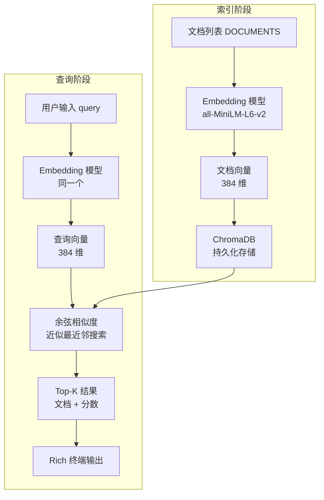

## 关键词搜索 vs 语义搜索

搜索"苹果手机"，传统关键词搜索不会返回包含"iPhone"的文档，因为两个字符串没有重叠。这就是关键词搜索的根本局限：它做的是字面匹配，而不是语义匹配。

具体来说，关键词搜索（BM25、TF-IDF 等）的工作原理是统计词频。一篇文档如果包含查询词越多、词越罕见，分数越高。这在很多场景下够用，但遇到同义词、上下位词、或者跨语言查询时就会失效。

语义搜索的思路是：把文本转成向量，在向量空间里计算相似度。"苹果手机"和"iPhone"经过同一个 Embedding 模型编码后，得到的向量在高维空间中距离很近，因为它们在大量语料中出现在相似的上下文里。

用一个例子对比两者的差异：

| 查询 | 文档 | 关键词匹配 | 语义匹配 |
|------|------|-----------|---------|
| 苹果手机 | "iPhone 16 发布了新功能" | ✗ | ✓ |
| 如何学习编程 | "零基础入门写代码的方法" | ✗ | ✓ |
| machine learning | "深度学习模型训练技巧" | ✗ | ✓ |
| Python 列表 | "Python list 操作详解" | ✗（若查询是中文） | ✓ |

语义搜索并不是关键词搜索的完全替代。精确的术语查询（如产品型号、代码片段）关键词搜索反而更可靠。生产环境通常用混合检索（hybrid search）：两路召回后融合排序。本章先实现纯语义搜索，混合检索留到扩展方向。

## 系统设计

语义搜索系统分两个阶段：

**索引阶段**（离线，运行一次）：把文档库转成向量，存入向量数据库。

**查询阶段**（在线，每次搜索）：把查询转成向量，在向量库中找最近邻。



向量库选用 ChromaDB，原因是：本地运行无需服务端进程（embedded 模式），API 简洁，支持持久化。Embedding 模型用 `all-MiniLM-L6-v2`，384 维输出，在速度和质量之间取得了较好的平衡，模型大小约 80MB，首次运行自动下载。

相似度计算用余弦相似度。ChromaDB 默认的距离度量是 L2（欧氏距离），本项目显式指定为余弦相似度，让分数更直观（0~1，越高越相似）。

## 实现步骤

代码分四个文件，职责清晰：

```
examples/
  data.py       # 文档数据
  indexer.py    # 构建和加载索引
  searcher.py   # 执行搜索
  main.py       # 命令行入口
  requirements.txt
```

### 文档数据（data.py）

`DOCUMENTS` 是一个字符串列表，每条是一段 100~200 字的技术短文。实际项目里这里换成从数据库或文件读取的内容。文档 ID 用列表下标，ChromaDB 要求 ID 是字符串，所以索引时做 `str(i)` 转换。

### 构建索引（indexer.py）

`build_index(documents)` 的核心逻辑：

1. 初始化 ChromaDB 客户端，指定持久化路径 `./chroma_db`
2. 创建（或获取已有的）collection，指定 `cosine` 距离度量
3. 用 `SentenceTransformer` 批量编码所有文档，得到 numpy array
4. 调用 `collection.add()` 写入向量、文档原文和 ID

关键细节：`collection.upsert()` 比 `collection.add()` 更安全，重复运行不会报错。`SentenceTransformer.encode()` 返回 numpy array，ChromaDB 接受 list of list，需要 `.tolist()` 转换。

`load_index()` 只做一件事：打开已有的 ChromaDB client，返回 collection 对象。调用前要确认 `./chroma_db` 目录存在，否则 `main.py` 应先调用 `build_index()`。

### 执行搜索（searcher.py）

`search(query, collection, model, top_k=5)` 的流程：

1. 用同一个 `SentenceTransformer` 模型对 query 编码
2. 调用 `collection.query(query_embeddings=..., n_results=top_k)`
3. ChromaDB 返回的结果是嵌套列表格式（支持批量查询），取 `[0]` 获取单次查询的结果
4. 把距离（distance）转成相似度：`similarity = 1 - distance`（余弦距离 = 1 - 余弦相似度）

返回格式是字典列表，每个字典包含 `document`（原文）和 `score`（相似度）。

### 命令行入口（main.py）

启动逻辑：

```
检查 ./chroma_db 是否存在
  → 存在：load_index() 加载已有索引
  → 不存在：build_index() 构建索引并保存
加载 SentenceTransformer 模型
进入交互循环
  → 读取用户输入
  → 调用 search()
  → 用 rich 打印结果表格
  → 输入 q 退出
```

`rich` 库用 `Table` 组件渲染结果，每行显示排名、相似度分数（保留 4 位小数）和文档内容。分数用颜色区分高低：≥0.6 显示绿色，0.4~0.6 显示黄色，<0.4 显示红色。

## 运行方式

```bash
cd examples
pip install -r requirements.txt

# 首次运行会下载模型（约 80MB）并构建索引
python main.py
```

首次运行输出示例：

```
构建索引中...
索引构建完成，共 20 条文档
模型加载完成: all-MiniLM-L6-v2

输入查询（输入 q 退出）: 如何提升模型推理速度
```

查询结果示例：

```
┌──────┬────────┬─────────────────────────────────────────────────────┐
│ 排名 │  分数  │ 文档内容                                             │
├──────┼────────┼─────────────────────────────────────────────────────┤
│  1   │ 0.8234 │ 模型量化（Quantization）是将浮点权重压缩为低精度...  │
│  2   │ 0.7891 │ TensorRT 是 NVIDIA 推出的推理加速库，支持 FP16 和... │
│  3   │ 0.7543 │ KV Cache 缓存注意力层的键值对，避免自回归推理时...   │
│  4   │ 0.6102 │ 批处理（batching）将多个请求合并处理，提升 GPU...    │
│  5   │ 0.5876 │ Transformer 的时间复杂度是 O(n²)，长序列推理开销...  │
└──────┴────────┴─────────────────────────────────────────────────────┘
```

第二次运行直接加载已有索引，跳过构建步骤，启动更快。

## 扩展方向

- **混合检索**：BM25 + 向量检索双路召回，用 RRF（Reciprocal Rank Fusion）融合排序，对精确词汇查询更友好
- **重排序（Reranking）**：召回候选后用 Cross-Encoder 模型（如 `cross-encoder/ms-marco-MiniLM-L-6-v2`）重新打分，精度显著提升，代价是延迟增加
- **多语言支持**：换用 `paraphrase-multilingual-MiniLM-L12-v2` 模型，支持跨语言检索
- **增量索引**：ChromaDB 的 `upsert` 接口支持按 ID 更新文档，无需重建全量索引
